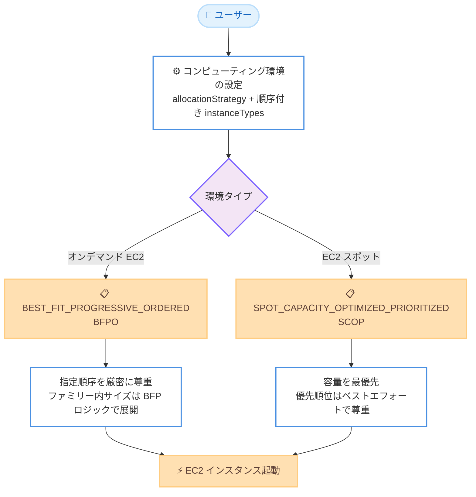

# AWS Batch - 顧客指定順序によるインスタンス割り当て戦略

**リリース日**: 2026 年 6 月 22 日
**サービス**: AWS Batch
**機能**: Best Fit Progressive Ordered (BFPO) および Spot Capacity Optimized Prioritized (SCOP) 割り当て戦略

📊 [このアップデートのインフォグラフィックを見る](https://takech9203.github.io/aws-news-summary/20260622-batch-ordered-allocation-strategies.html)
<!-- INFOGRAPHIC_BASE_URL は環境変数から取得 -->

## 概要

AWS Batch は、コンピューティング環境におけるインスタンスタイプの優先順位をより細かく制御できる 2 つの新しい割り当て戦略を発表しました。Best Fit Progressive Ordered (BFPO) と Spot Capacity Optimized Prioritized (SCOP) です。

これらの戦略を使用すると、ワークロード固有のパフォーマンス特性に基づいて、インスタンスタイプの選択順序をユーザー自身が手動で定義できます。オンデマンドコンピューティング環境では `BEST_FIT_PROGRESSIVE_ORDERED` を、Amazon EC2 スポットコンピューティング環境では `SPOT_CAPACITY_OPTIMIZED_PRIORITIZED` を指定し、優先順位を付けたインスタンスタイプまたはインスタンスファミリーのリストを渡します。

この機能は、特定のインスタンスタイプを優先したい高度なユースケースを持つユーザーを対象としています。AWS Batch API (CreateComputeEnvironment または UpdateComputeEnvironment) および AWS Batch マネジメントコンソールの両方から利用でき、AWS Batch が利用可能なすべての AWS リージョンでサポートされます。

**アップデート前の課題**

これまでの AWS Batch の割り当て戦略では、インスタンスタイプの選択順序をユーザーが細かく制御できませんでした。

- オンデマンド環境では `BEST_FIT_PROGRESSIVE` を使用しても、vCPU あたりのコストが低いインスタンスタイプが優先され、ユーザーが優先したい特定のインスタンスタイプを先頭に置くことができなかった
- スポット環境では `SPOT_CAPACITY_OPTIMIZED` や `SPOT_PRICE_CAPACITY_OPTIMIZED` を使用しても、容量や価格に基づく自動選択のみで、ユーザー定義の優先順位を反映できなかった
- ワークロード固有のパフォーマンス特性 (例: 特定の CPU アーキテクチャやネットワーク性能) に最適化されたインスタンスタイプを優先的に使用する手段がなかった

**アップデート後の改善**

今回のアップデートにより、インスタンスタイプの選択順序を明示的に指定できるようになりました。

- 今回のアップデートにより、`instanceTypes` リストに記載した順序でインスタンスタイプが選択されるようになった
- 今回のアップデートにより、ワークロードに最適なインスタンスタイプを優先しつつ、フォールバックの順序も制御できるようになった
- 今回のアップデートにより、スポット環境では容量を最優先しつつ、ベストエフォートでユーザー定義の優先順位を尊重できるようになった

## アーキテクチャ図



オンデマンド環境とスポット環境のそれぞれで、ユーザーが指定した順序付きインスタンスタイプリストがどのように扱われるかを示しています。BFPO は順序を厳密に尊重し、SCOP は容量を優先しつつベストエフォートで順序を尊重します。

## サービスアップデートの詳細

### 主要機能

1. **Best Fit Progressive Ordered (BFPO)**
   - API 値: `BEST_FIT_PROGRESSIVE_ORDERED`
   - オンデマンドインスタンス (`EC2`) コンピューティングリソース専用の割り当て戦略
   - `instanceTypes` リストに記載された順序でインスタンスタイプを選択する
   - インスタンスファミリーを指定した場合、そのファミリー内のサイズは `BEST_FIT_PROGRESSIVE` ロジックで展開される (ジョブに最適なサイズを優先し、より大きなサイズをフォールバックとして使用)
   - ジョブのリソース要件を満たせないインスタンスタイプはスキップされる

2. **Spot Capacity Optimized Prioritized (SCOP)**
   - API 値: `SPOT_CAPACITY_OPTIMIZED_PRIORITIZED`
   - スポットインスタンスコンピューティングリソース専用の割り当て戦略
   - 容量を最優先に最適化しつつ、ユーザー定義の優先順位をベストエフォートで尊重する
   - スポットインスタンスの容量プールが同程度に利用可能な場合は、優先順位が尊重される
   - 容量が制約されている場合は、スポットインスタンスの中断可能性を最小化するため、優先順位に関わらず最も利用可能なプールから選択される

3. **インスタンスファミリーと明示的インスタンスタイプの混在**
   - `instanceTypes` リストには、インスタンスファミリー (例: `m7a`) と明示的なインスタンスタイプ (例: `m7a.4xlarge`) を混在できる
   - 同じファミリーのファミリー名と明示的タイプの両方がリストにある場合、明示的タイプはリストの位置に配置され、ファミリー展開からは除外される
   - 例: `["m7a.4xlarge", "m7a", "m6a"]` の場合、`m7a.4xlarge` は常に最初に配置され、`m7a` ファミリーの展開からは除外される

## 技術仕様

### 割り当て戦略の比較

| 割り当て戦略 | 対象環境 | 順序の扱い |
|------|------|------|
| `BEST_FIT` (デフォルト) | オンデマンド/スポット | 最低コストを優先 (順序指定なし) |
| `BEST_FIT_PROGRESSIVE` | オンデマンド | vCPU あたりコストが低いものを優先 |
| `BEST_FIT_PROGRESSIVE_ORDERED` (新規) | オンデマンド | 指定順序を厳密に尊重 |
| `SPOT_CAPACITY_OPTIMIZED` | スポット | 中断されにくいものを優先 |
| `SPOT_PRICE_CAPACITY_OPTIMIZED` | スポット | 価格と容量を最適化 |
| `SPOT_CAPACITY_OPTIMIZED_PRIORITIZED` (新規) | スポット | 容量を優先しつつベストエフォートで順序を尊重 |

### API変更履歴

| 日付 | サービス | 変更内容 |
|------|----------|----------|
| 2026/06/18 | [batch](https://awsapichanges.com/archive/changes/1ac576-batch.html) | 3 updated api methods - 順序付き割り当て戦略 (BEST_FIT_PROGRESSIVE_ORDERED / SPOT_CAPACITY_OPTIMIZED_PRIORITIZED) のサポートを追加 |

対象となった API メソッドは `CreateComputeEnvironment`、`UpdateComputeEnvironment`、`DescribeComputeEnvironments` の 3 つで、いずれも `computeResources.allocationStrategy` パラメータに新しい列挙値が追加されました。

### コンピューティング環境設定の例

```json
{
  "computeEnvironmentName": "ordered-ondemand-env",
  "type": "MANAGED",
  "state": "ENABLED",
  "computeResources": {
    "type": "EC2",
    "allocationStrategy": "BEST_FIT_PROGRESSIVE_ORDERED",
    "minvCpus": 0,
    "maxvCpus": 256,
    "instanceTypes": ["m7a.4xlarge", "m7a", "m6a"],
    "subnets": ["subnet-xxxxxxxx"],
    "instanceRole": "ecsInstanceRole"
  }
}
```

## 設定方法

### 前提条件

1. AWS Batch を利用可能なリージョンであること
2. マネージドコンピューティング環境を使用すること (Fargate リソースには適用不可)
3. BFPO はオンデマンド (`EC2`) リソース、SCOP はスポットリソースで使用すること

### 手順

#### ステップ1: 割り当て戦略の選択

ワークロードのコンピューティング環境タイプに応じて戦略を選択します。オンデマンド環境では `BEST_FIT_PROGRESSIVE_ORDERED`、スポット環境では `SPOT_CAPACITY_OPTIMIZED_PRIORITIZED` を選択します。

#### ステップ2: コンピューティング環境の作成

```bash
aws batch create-compute-environment \
  --compute-environment-name ordered-ondemand-env \
  --type MANAGED \
  --state ENABLED \
  --compute-resources '{
    "type": "EC2",
    "allocationStrategy": "BEST_FIT_PROGRESSIVE_ORDERED",
    "minvCpus": 0,
    "maxvCpus": 256,
    "instanceTypes": ["m7a.4xlarge", "m7a", "m6a"],
    "subnets": ["subnet-xxxxxxxx"],
    "instanceRole": "ecsInstanceRole"
  }'
```

このコマンドは、`BEST_FIT_PROGRESSIVE_ORDERED` 戦略を使用するオンデマンドコンピューティング環境を作成します。`instanceTypes` に指定した順序で、AWS Batch がインスタンスタイプを選択します。

#### ステップ3: 既存環境の更新

```bash
aws batch update-compute-environment \
  --compute-environment ordered-ondemand-env \
  --compute-resources '{
    "allocationStrategy": "BEST_FIT_PROGRESSIVE_ORDERED",
    "instanceTypes": ["c7a", "c6a"]
  }'
```

このコマンドは、既存のコンピューティング環境の割り当て戦略とインスタンスタイプリストを更新します。`UpdateComputeEnvironment` API でも新しい割り当て戦略を指定できます。

## メリット

### ビジネス面

- **パフォーマンス最適化**: ワークロードに最適なインスタンスタイプを優先的に使用することで、ジョブの処理性能を向上できる
- **コスト管理の柔軟性**: 優先するインスタンスタイプを制御することで、コストとパフォーマンスのバランスを調整できる
- **既存ワークフローとの統合**: API とコンソールの両方から設定でき、既存の運用に組み込みやすい

### 技術面

- **明示的な順序制御**: `instanceTypes` リストの順序がそのまま選択優先順位として反映される (BFPO)
- **スポット容量との両立**: SCOP では容量を最優先しつつ、ベストエフォートで優先順位を尊重することで中断リスクを抑えられる
- **柔軟な指定方法**: インスタンスファミリーと明示的なインスタンスタイプを混在して指定できる

## デメリット・制約事項

### 制限事項

- BFPO はオンデマンド (`EC2`) リソース専用、SCOP はスポットリソース専用であり、相互に使用できない
- Fargate リソースには適用できない
- これらは高度な割り当て戦略であり、インスタンスタイプの順序設定を誤ると非効率な結果を招く可能性がある

### 考慮すべき点

- 大きなインスタンスタイプをリストの先頭に配置すると、小さなジョブに対して過剰プロビジョニングになる可能性がある
- 小さなインスタンスタイプを先頭に配置すると、`maxvCpus` に達する前に Amazon EC2 のインスタンス数上限に達する可能性がある
- SCOP の優先順位はベストエフォートであり、容量制約時には優先順位に関わらず最も利用可能なプールが選択される
- `BEST_FIT` 以外の戦略でオンデマンドリソースを使用する場合、AWS Batch が容量要件を満たすために `maxvCpus` を超えることがある (超過は最大 1 インスタンス分まで)

## ユースケース

### ユースケース1: 特定の CPU アーキテクチャを優先する HPC ワークロード

**シナリオ**: 特定の世代の CPU で最適化された HPC アプリケーションを実行しており、その世代のインスタンスタイプを優先的に使用したい。

**実装例**:
```json
{
  "allocationStrategy": "BEST_FIT_PROGRESSIVE_ORDERED",
  "instanceTypes": ["c7a", "c6a", "c5"]
}
```

**効果**: 最新世代の `c7a` を優先しつつ、容量が不足した場合は `c6a`、`c5` へとフォールバックすることで、性能を維持しながら安定したスケーリングを実現できます。

### ユースケース2: コスト効率の高いスポットインスタンスの優先利用

**シナリオ**: バッチ処理をスポットインスタンスで実行しており、特定のインスタンスタイプを優先しつつ、スポット中断のリスクを最小化したい。

**実装例**:
```json
{
  "allocationStrategy": "SPOT_CAPACITY_OPTIMIZED_PRIORITIZED",
  "instanceTypes": ["m7a", "m6a", "m5"]
}
```

**効果**: 容量を最優先に確保しながら、容量が同程度に利用可能な場合は優先順位の高い `m7a` を選択し、コストとパフォーマンスのバランスを取りつつスポット中断リスクを抑えられます。

### ユースケース3: 特定インスタンスタイプの固定とファミリーのフォールバック併用

**シナリオ**: 特定のインスタンスサイズを最優先で使用しつつ、不足時には同じファミリーや別ファミリーへフォールバックさせたい。

**実装例**:
```json
{
  "allocationStrategy": "BEST_FIT_PROGRESSIVE_ORDERED",
  "instanceTypes": ["m7a.4xlarge", "m7a", "m6a"]
}
```

**効果**: `m7a.4xlarge` を常に最優先で配置し、不足時には `m7a` ファミリーの他サイズ、さらに `m6a` ファミリーへとフォールバックする柔軟な構成を実現できます。

## 料金

この機能自体に追加料金はありません。AWS Batch の利用には料金がかからず、ジョブの実行に使用した AWS リソース (Amazon EC2 インスタンスなど) に対してのみ料金が発生します。料金は使用するインスタンスタイプ (オンデマンドまたはスポット) に応じて変動します。

## 利用可能リージョン

AWS Batch が利用可能なすべての AWS リージョンで利用できます。

## 関連サービス・機能

- **Amazon EC2**: AWS Batch のコンピューティングリソースとして利用され、本機能でインスタンスタイプの選択順序を制御する対象となる
- **Amazon EC2 スポットインスタンス**: SCOP 戦略の対象となるコンピューティングリソース
- **Amazon ECS / Amazon EKS**: AWS Batch のジョブ実行基盤となるコンテナオーケストレーション

## 参考リンク

- 📊 [インフォグラフィック](https://takech9203.github.io/aws-news-summary/20260622-batch-ordered-allocation-strategies.html)
- [公式発表 (What's New)](https://aws.amazon.com/about-aws/whats-new/2026/06/batch-ordered-allocation-strategies/)
- [ドキュメント (Instance type allocation strategies for AWS Batch)](https://docs.aws.amazon.com/batch/latest/userguide/allocation-strategies.html)
- [AWS Batch 料金ページ](https://aws.amazon.com/batch/pricing/)

## まとめ

今回のアップデートにより、AWS Batch でインスタンスタイプの選択順序を明示的に制御できるようになりました。ワークロード固有のパフォーマンス特性に基づいてインスタンスタイプを優先したいユーザーにとって、BFPO (オンデマンド) と SCOP (スポット) は強力な選択肢となります。既存のコンピューティング環境でも `UpdateComputeEnvironment` で適用できるため、現在の割り当て戦略を見直し、ワークロードに最適なインスタンスタイプ順序の設定を検討することをお勧めします。
