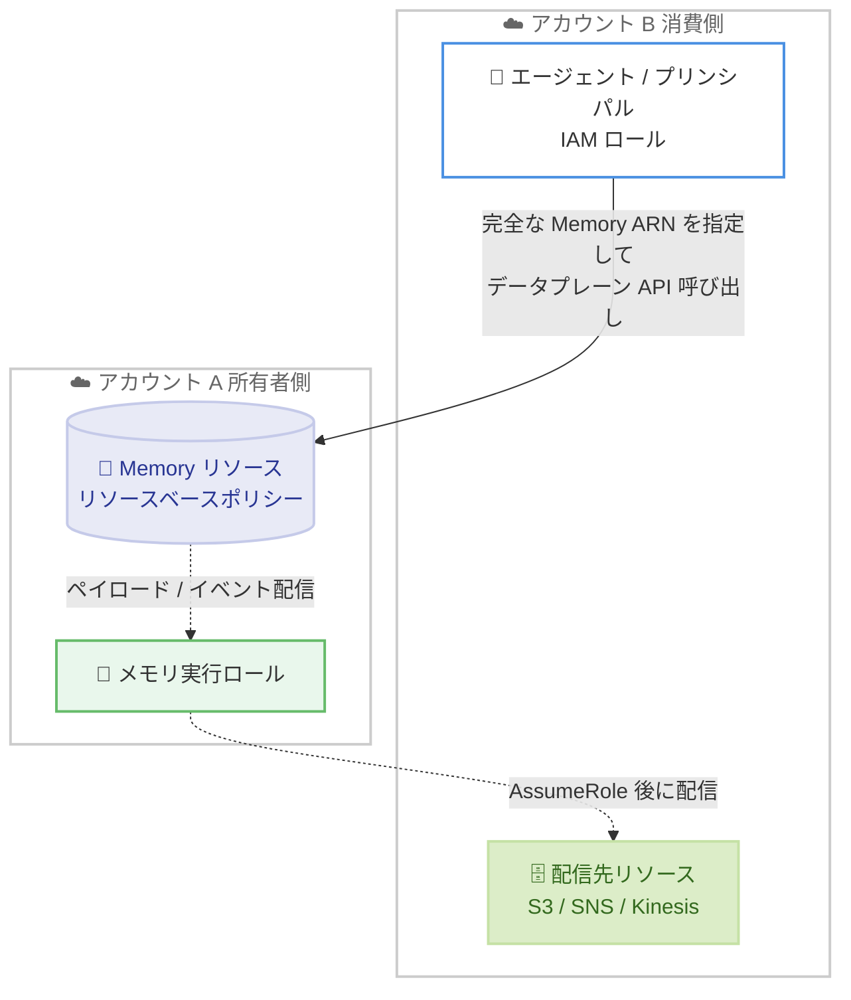

# Amazon Bedrock AgentCore Memory - クロスアカウントアクセス

**リリース日**: 2026年6月23日
**サービス**: Amazon Bedrock AgentCore Memory
**機能**: クロスアカウントアクセス (Cross-Account Access)

📊 [このアップデートのインフォグラフィックを見る](https://takech9203.github.io/aws-news-summary/20260623-agentcore-memory-cross-account-access.html)
<!-- INFOGRAPHIC_BASE_URL は環境変数から取得 -->

## 概要

Amazon Bedrock AgentCore Memory がクロスアカウントアクセスに対応しました。これにより、メモリリソースとそれを利用するエージェントが複数の AWS アカウントにまたがるマルチアカウントアーキテクチャを構築できるようになりました。リソースベースのポリシーを使用することで、あるアカウントのプリンシパルに対して、別のアカウントにあるメモリリソースのデータプレーン API を呼び出す権限を付与できます。

このアップデートには 2 つの主要なシナリオがあります。1 つ目は「別アカウントからのデータプレーン操作」で、消費側アカウント (アカウント B) のプリンシパルが、所有者アカウント (アカウント A) のメモリリソースに対してイベント作成、メモリレコードの書き込み、レコードの取得、セマンティック検索を実行できます。2 つ目は「別アカウントへの配信先 (デリバリー先)」で、アカウント A のメモリリソースが、アカウント B に存在する Amazon S3 バケット、Amazon SNS トピック、Amazon Kinesis Data Streams にペイロードやストリームイベントを配信できます。

これらの機能は、メモリリソースにリソースベースのポリシーをアタッチすること、および配信先側のリソースにポリシーを設定することで構成します。消費側アカウントのプリンシパルは、完全なメモリ ARN を参照することで対象のメモリリソースにアクセスします。本機能は Amazon Bedrock AgentCore Memory がサポートされるすべての AWS リージョンで利用できます。

**アップデート前の課題**

- メモリリソースとエージェントは同一の AWS アカウント内に配置する必要があり、組織横断的なマルチアカウント構成が困難でした
- 中央集約型のメモリ基盤を複数のチームやアプリケーションアカウントで共有できませんでした
- メモリの配信先 (S3、SNS、Kinesis) を別アカウントに分離してデータガバナンスを実現する手段が限られていました

**アップデート後の改善**

- リソースベースのポリシーにより、別アカウントのプリンシパルにメモリデータプレーン API の呼び出し権限を付与できるようになりました
- 1 つのメモリリソースを複数のアカウントにまたがるエージェントから共有利用できるようになりました
- メモリの配信先 (S3、SNS、Kinesis Data Streams) を別アカウントに配置し、アカウント分離によるデータ管理を実現できるようになりました

## アーキテクチャ図



アカウント B のプリンシパルが完全なメモリ ARN を指定してアカウント A のメモリにアクセスする「データプレーンアクセス」と、アカウント A のメモリ実行ロールがアカウント B の配信先にデータを送る「クロスアカウント配信先」の 2 つのフローを示しています。

## サービスアップデートの詳細

### 主要機能

1. **別アカウントからのデータプレーンアクセス**
   - アカウント A はメモリリソースに `PutResourcePolicy` API でリソースベースのポリシーをアタッチし、アカウント B のプリンシパルに特定のアクションを許可します
   - アカウント B のプリンシパルは、アカウント A のメモリの完全な ARN を `memory-id` に指定してデータプレーン API を呼び出します
   - AWS はメモリのリソースベースポリシーと、アカウント B 側のアイデンティティベースポリシーの両方を評価し、双方が許可している場合にリクエストが成功します

2. **クロスアカウント配信先**
   - カスタム (セルフマネージド) ストラテジーまたはストリーム配信を構成したメモリは、メモリ実行ロールを通じて別アカウントの S3、SNS、Kinesis Data Streams にペイロードを配信できます
   - アカウント A 側に AgentCore を信頼するメモリ実行ロールを作成し、アカウント B 側の各リソースにリソースベースポリシーを付与して相互に許可します
   - メモリ作成時に実行ロール ARN とクロスアカウントリソース ARN を参照することで構成します

3. **きめ細かなアクセス制御**
   - 任意のメモリデータプレーンアクションを個別に許可可能で、読み取り専用と読み書きのポリシーを分離できます
   - アカウントルートではなく特定の IAM ロールに対して権限を付与し、最小権限の原則を適用できます
   - `DeleteResourcePolicy` でポリシーを削除すると、以降のクロスアカウントリクエストは `AccessDeniedException` を返します

## 技術仕様

### サポートされるデータプレーンアクション

クロスアカウントアクセスは、任意のメモリデータプレーンアクションに対して付与できます。

| アクション | 説明 |
|------|------|
| `bedrock-agentcore:CreateEvent` | 短期メモリイベントの作成 |
| `bedrock-agentcore:GetEvent` | 特定イベントの取得 |
| `bedrock-agentcore:DeleteEvent` | 特定イベントの削除 |
| `bedrock-agentcore:ListEvents` | セッション内のイベント一覧取得 |
| `bedrock-agentcore:ListActors` | メモリ内のアクター一覧取得 |
| `bedrock-agentcore:ListSessions` | アクターのセッション一覧取得 |
| `bedrock-agentcore:GetMemoryRecord` | 特定メモリレコードの取得 |
| `bedrock-agentcore:ListMemoryRecords` | ネームスペース内のメモリレコード一覧取得 |
| `bedrock-agentcore:RetrieveMemoryRecords` | メモリレコードのセマンティック検索 |
| `bedrock-agentcore:DeleteMemoryRecord` | 特定メモリレコードの削除 |
| `bedrock-agentcore:BatchCreateMemoryRecords` | 複数メモリレコードの作成 |
| `bedrock-agentcore:BatchUpdateMemoryRecords` | 複数メモリレコードの更新 |
| `bedrock-agentcore:BatchDeleteMemoryRecords` | 複数メモリレコードの削除 |
| `bedrock-agentcore:ListMemoryExtractionJobs` | メモリの抽出ジョブ一覧取得 |
| `bedrock-agentcore:StartMemoryExtractionJobs` | 失敗した抽出ジョブの再開 |

### クロスアカウント配信先

| 配信先 | 用途 | メモリ実行ロールに必要なアクション |
|------|------|------|
| Amazon S3 | ペイロードの配信先バケット | `s3:PutObject`, `s3:GetObject` |
| Amazon SNS | 通知トピック | `sns:Publish` |
| Amazon Kinesis Data Streams | イベントのストリーミング | `kinesis:PutRecords`, `kinesis:DescribeStream` |

### リソースベースポリシーの例

特定の IAM ロールに読み取り専用アクセスを付与する例です (最小権限の原則)。

```json
{
    "Version": "2012-10-17",
    "Statement": [
        {
            "Sid": "AllowSpecificRoleReadAccess",
            "Effect": "Allow",
            "Principal": {
                "AWS": "arn:aws:iam::<account-B-id>:role/AgentMemoryReaderRole"
            },
            "Action": [
                "bedrock-agentcore:RetrieveMemoryRecords",
                "bedrock-agentcore:ListMemoryRecords",
                "bedrock-agentcore:GetMemoryRecord"
            ],
            "Resource": "arn:aws:bedrock-agentcore:us-east-1:<account-A-id>:memory/<memory-id>"
        }
    ]
}
```

## 設定方法

### 前提条件

1. リソース所有者アカウント (アカウント A) で作成済みのメモリリソース
2. メモリリソースの完全な ARN (例: `arn:aws:bedrock-agentcore:us-east-1:<account-id>:memory/<memory-id>`)
3. データプレーンアクセスの場合: アカウント B 側に、対象の `bedrock-agentcore` アクションを許可するアイデンティティベースポリシーを持つ IAM ロールまたはユーザー
4. 配信先の場合: アカウント B 側に作成済みの S3 バケット、SNS トピック、または Kinesis Data Stream

### 手順

#### ステップ1: メモリにリソースベースポリシーをアタッチ (データプレーンアクセス)

```bash
aws bedrock-agentcore-control put-resource-policy \
    --region us-east-1 \
    --resource-arn "arn:aws:bedrock-agentcore:us-east-1:<account-A-id>:memory/<memory-id>" \
    --policy '{
        "Version": "2012-10-17",
        "Statement": [
            {
                "Sid": "AllowCrossAccountMemoryReadWrite",
                "Effect": "Allow",
                "Principal": {
                    "AWS": "arn:aws:iam::<account-B-id>:root"
                },
                "Action": [
                    "bedrock-agentcore:CreateEvent",
                    "bedrock-agentcore:BatchCreateMemoryRecords",
                    "bedrock-agentcore:RetrieveMemoryRecords",
                    "bedrock-agentcore:GetMemoryRecord"
                ],
                "Resource": "arn:aws:bedrock-agentcore:us-east-1:<account-A-id>:memory/<memory-id>"
            }
        ]
    }'
```

アカウント A のメモリリソースにリソースベースポリシーをアタッチし、アカウント B に対して指定したデータプレーンアクションを許可します。本番環境では `root` ではなく特定の IAM ロールを指定して最小権限を適用することを推奨します。

#### ステップ2: アカウント B からデータプレーン API を呼び出し

```bash
aws bedrock-agentcore retrieve-memory-records \
    --region us-east-1 \
    --memory-id "arn:aws:bedrock-agentcore:us-east-1:<account-A-id>:memory/<memory-id>" \
    --namespace "preferences/user-123" \
    --search-criteria '{"searchQuery": "meeting preferences"}' \
    --max-results 10
```

アカウント B のプリンシパルが、アカウント A のメモリの完全な ARN を `memory-id` に指定してセマンティック検索を実行します。AWS はリソースベースポリシーとアイデンティティベースポリシーの両方を評価します。

#### ステップ3: クロスアカウント配信先の構成

配信先を使用する場合は、まずアカウント A に AgentCore を信頼するメモリ実行ロールを作成します。信頼ポリシーでは `bedrock-agentcore.amazonaws.com` からの `sts:AssumeRole` を許可し、`aws:SourceArn` 条件でメモリ ARN に限定します。次に、アカウント B 側の S3 バケット、SNS トピック、Kinesis Data Stream に、当該実行ロールを許可するリソースベースポリシーを付与します。最後に、メモリ作成時に実行ロール ARN とクロスアカウントリソース ARN を参照します。

```bash
aws bedrock-agentcore-control create-memory \
    --region us-east-1 \
    --name "cross-account-memory" \
    --event-expiry-duration 30 \
    --memory-execution-role-arn "arn:aws:iam::<account-A-id>:role/MemoryCrossAccountRole" \
    --memory-strategies '[
      {
        "customMemoryStrategy": {
          "name": "cross_account_strategy",
          "configuration": {
            "selfManagedConfiguration": {
              "triggerConditions": [
                {"messageBasedTrigger": {"messageCount": 5}}
              ],
              "invocationConfiguration": {
                "topicArn": "arn:aws:sns:us-east-1:<account-B-id>:memory-notifications",
                "payloadDeliveryBucketName": "<bucket-name>"
              },
              "historicalContextWindowSize": 10
            }
          }
        }
      }
    ]'
```

アカウント A でメモリを作成し、アカウント B にある SNS トピックと S3 バケットを配信先として参照します。AgentCore は実行ロールを引き受けてアカウント B のリソースにペイロードを配信します。

## メリット

### ビジネス面

- **マルチアカウント戦略との整合**: 組織のアカウント分離方針に沿って、メモリ基盤と利用エージェントを別アカウントに配置できます
- **メモリ基盤の集約と共有**: 中央のメモリリソースを複数のチームやアプリケーションアカウントで共有し、運用を統合できます
- **データガバナンスの強化**: 配信先を専用アカウントに分離することで、監査やコンプライアンス要件に対応しやすくなります

### 技術面

- **きめ細かなアクセス制御**: アクション単位での許可と、読み取り専用 / 読み書きのポリシー分離が可能です
- **最小権限の適用**: アカウントルートではなく特定の IAM ロールに権限を付与し、影響範囲を限定できます
- **監査性**: AWS CloudTrail でクロスアカウント API 呼び出しを監視できます

## デメリット・制約事項

### 制限事項

- データプレーンアクセスでは、リソースベースポリシーとアイデンティティベースポリシーの両方が許可している必要があります (どちらかが明示的に拒否するとリクエストは失敗します)
- 配信先のクロスアカウント構成は、メモリ作成時に実行ロールとリソース ARN を参照して設定する必要があります
- データプレーン API 呼び出しでは、メモリ ID として短縮形ではなく完全な ARN を指定する必要があります

### 考慮すべき点

- ポリシーを削除する前に、他アカウントのアクティブなワークロードが当該アクセスに依存していないかを確認する必要があります
- クロスアカウントのリソースベースポリシーは影響範囲が広いため、アカウントルートではなく特定の IAM ロールへの付与を推奨します
- 読み取り専用の消費側と読み書きの生成側で、ポリシーステートメントを分離して管理することが推奨されます

## ユースケース

### ユースケース1: 中央集約型メモリ基盤の共有

**シナリオ**: プラットフォームチームが専用アカウント (アカウント A) でメモリ基盤を一元管理し、複数の事業部門アカウント (アカウント B、C) のエージェントがそのメモリを利用します。

**実装例**:
```
アカウント A: メモリにリソースベースポリシーをアタッチし、各事業部門のロールを許可
アカウント B/C: AgentMemoryReaderRole などで完全な ARN を指定してアクセス
```

**効果**: メモリのスキーマや運用を中央で統制しつつ、各部門が同一のユーザーコンテキストを共有できます。

### ユースケース2: データガバナンスのためのアカウント分離

**シナリオ**: メモリ実行アカウント (アカウント A) とデータ保管アカウント (アカウント B) を分離し、出力されるペイロードを監査専用アカウントの S3 に集約します。

**実装例**:
```
アカウント A: メモリ実行ロールに S3 PutObject 権限を付与
アカウント B: S3 バケットに実行ロールを許可するバケットポリシーを設定
```

**効果**: メモリの処理とデータ保管を職務分離し、コンプライアンス要件を満たすデータ管理を実現できます。

### ユースケース3: リアルタイムイベントのクロスアカウントストリーミング

**シナリオ**: メモリレコードの更新を別アカウントの分析基盤に流し込み、Kinesis Data Streams 経由でリアルタイム処理します。

**実装例**:
```
アカウント A: stream-delivery-resources で アカウント B の Kinesis ストリーム ARN を参照
アカウント B: Kinesis ストリームに実行ロールの PutRecords を許可
```

**効果**: メモリ更新を別アカウントの分析・可視化パイプラインへリアルタイムに連携できます。

## 料金

クロスアカウントアクセス自体の追加料金についての記載はありません。Amazon Bedrock AgentCore Memory の利用料金、および配信先となる Amazon S3、Amazon SNS、Amazon Kinesis Data Streams の利用料金が通常どおり発生します。詳細は各サービスの料金ページを参照してください。

## 利用可能リージョン

Amazon Bedrock AgentCore Memory がサポートされるすべての AWS リージョンで利用可能です。

## 関連サービス・機能

- **AWS IAM**: リソースベースポリシーとアイデンティティベースポリシーによるクロスアカウントのアクセス制御を実現します
- **Amazon S3 / Amazon SNS / Amazon Kinesis Data Streams**: メモリの配信先 (デリバリー先) としてクロスアカウントで利用できます
- **AWS CloudTrail**: クロスアカウントのメモリ API 呼び出しの監査に活用できます

## 参考リンク

- 📊 [インフォグラフィック](https://takech9203.github.io/aws-news-summary/20260623-agentcore-memory-cross-account-access.html)
- [公式発表 (What's New)](https://aws.amazon.com/about-aws/whats-new/2026/06/agentcore-memory-cross-account-access)
- [ドキュメント (Cross-account memory access)](https://docs.aws.amazon.com/bedrock-agentcore/latest/devguide/memory-cross-account-access.html)

## まとめ

Amazon Bedrock AgentCore Memory のクロスアカウントアクセス対応により、メモリリソースと利用エージェント、配信先を複数の AWS アカウントにまたがって構成できるようになりました。中央集約型のメモリ基盤の共有やデータガバナンスのためのアカウント分離が容易になります。マルチアカウント環境でエージェントを運用しているお客様は、最小権限の原則に基づいてリソースベースポリシーを設計し、CloudTrail による監査と組み合わせて導入を検討することを推奨します。
