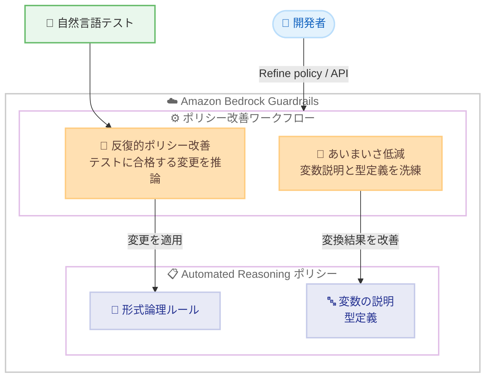

# Amazon Bedrock Guardrails - Automated Reasoning checks の新しいポリシー改善ワークフロー

**リリース日**: 2026 年 6 月 23 日
**サービス**: Amazon Bedrock Guardrails
**機能**: Automated Reasoning checks のポリシー改善ワークフロー (Policy Refinement Workflows)

📊 [このアップデートのインフォグラフィックを見る](https://takech9203.github.io/aws-news-summary/20260623-amazon-bedrock-guardrails.html)
<!-- INFOGRAPHIC_BASE_URL は環境変数から取得 -->

## 概要

AWS は、Amazon Bedrock Guardrails の Automated Reasoning checks (自動推論チェック) に、新しい自動ポリシー改善ワークフローを追加しました。Automated Reasoning checks は、形式論理 (formal logic) を用いて、生成 AI の応答が利用者の定義したポリシーに対して正確であることを数学的に検証する機能です。これにより、ハルシネーション (事実に基づかない誤った生成) を検出し、なぜその応答が正しい、あるいは正しくないのかを検証可能な形で説明できます。

Automated Reasoning checks の検証品質は、利用者が定義したポリシーの品質に大きく依存します。今回のアップデートでは、ポリシーの品質を手作業を減らしながら向上させ、より信頼性の高い検証結果を得るための 2 つの改善ワークフローが導入されました。1 つ目は、自然言語テストに合格するために必要なポリシーの変更をシステムが推論する「反復的ポリシー改善ワークフロー」です。2 つ目は、あいまいな変換結果を減らすために変数の説明と型定義を自動的に洗練する「あいまいさ低減ワークフロー」です。

両ワークフローは、Amazon Bedrock API および AWS マネジメントコンソール (ポリシーページで [Refine policy] を選択) から利用できます。Automated Reasoning checks が利用可能なすべての AWS リージョンで提供されます。本機能は、規制業界やコンプライアンスを重視するアプリケーションで生成 AI の正確性を担保したい開発者やソリューションアーキテクトを主な対象としています。

**アップデート前の課題**

- ポリシーが自然言語テストに合格しない場合、テスト結果を解釈し、ルールや変数をどのように修正すべきか手作業で試行錯誤する必要がありました
- 自然言語から形式論理への変換結果があいまいになる (TRANSLATION_AMBIGUOUS) 場合、変数の説明や型定義をどのように改善すべきか判断が難しく、専門的な知識が求められました
- ポリシー品質の向上が属人的な作業になりやすく、反復的な改善に時間がかかっていました

**アップデート後の改善**

- 反復的ポリシー改善ワークフローにより、作成済みの自然言語テストに合格するために必要なポリシー変更をシステムが自動的に推論するようになりました
- あいまいさ低減ワークフローにより、変数の説明と型定義が自動的に洗練され、あいまいな変換結果の発生頻度を低減できるようになりました
- API とコンソールの両方から改善ワークフローを起動できるため、手作業を減らしてポリシーの信頼性を高められるようになりました

## アーキテクチャ図



開発者がコンソールの [Refine policy] または Amazon Bedrock API から改善ワークフローを起動すると、反復的ポリシー改善は自然言語テストに合格するためのルール変更を推論し、あいまいさ低減は変数の説明と型定義を自動的に洗練します。

## サービスアップデートの詳細

### 主要機能

1. **反復的ポリシー改善ワークフロー (Iterative Policy Improvement Workflow)**
   - ポリシーに対して自然言語テストを作成済みの利用者が、反復的な改善実行 (iterative refinement run) を開始できます
   - システムが、それらのテストにポリシーが合格するために必要な変更を推論します
   - テスト結果を手作業で解釈してルールを修正する負担を軽減します

2. **あいまいさ低減ワークフロー (Ambiguity Reduction Workflow)**
   - あいまいな変換結果に頻繁に遭遇する利用者が、「resolve policy ambiguities (ポリシーのあいまいさ解消)」ワークフローを実行できます
   - 変数の説明 (variable descriptions) と型定義 (type definitions) を自動的に洗練します
   - 自然言語から形式論理への変換があいまいになる頻度を低減します

3. **API とコンソールの両対応**
   - 両ワークフローは Amazon Bedrock API から利用できます
   - AWS マネジメントコンソールでは、ポリシーページで [Refine policy] を選択して起動します

### 補足: Automated Reasoning checks の基本

Automated Reasoning checks は、パターンマッチングでコンテンツをブロックまたはフィルタリングする従来のガードレールコンポーネントとは異なり、形式論理を用いて応答が正しい、または正しくない理由について構造化されたフィードバックを提供します。具体的には次の動作を行います。

- ポリシールールと矛盾する内容を数学的に証明し、事実に反する記述を検出する
- ポリシーには整合するが、すべての関連ルールに対応していない応答の前提条件を指摘する
- 正確な記述について、根拠となるポリシールールと変数の割り当てを引用し、検証可能な説明を提供する

Automated Reasoning checks は検出モード (detect mode) でのみ動作し、コンテンツをブロックするのではなく findings (検出結果) とフィードバックを返します。

## 技術仕様

### ポリシー改善ワークフローの比較

| 項目 | 反復的ポリシー改善 | あいまいさ低減 |
|------|--------------------|----------------|
| 主な対象 | 自然言語テストを作成済みの利用者 | あいまいな変換結果に頻繁に遭遇する利用者 |
| 改善対象 | ポリシーのルール (テストに合格させる) | 変数の説明と型定義 |
| 目的 | テスト合格に必要な変更の自動推論 | あいまいな変換結果の発生頻度の低減 |
| 起動方法 | API / コンソール ([Refine policy]) | API / コンソール ([Refine policy]) |

### Automated Reasoning ポリシーの主な技術要素

| 項目 | 詳細 |
|------|------|
| 検証方式 | 形式論理による数学的検証 |
| 動作モード | 検出モード (detect mode) のみ。ブロックではなくフィードバックを返却 |
| 言語サポート | 英語 (US) のみ |
| 入力ドキュメント上限 | 5 MB かつ 50,000 文字 |
| 検証結果の例 | VALID、INVALID、TRANSLATION_AMBIGUOUS、TOO_COMPLEX など |
| ストリーミング | 非対応 (完全な応答に対して検証を実施) |

### API 変更履歴

ポリシー改善ワークフローは Amazon Bedrock API から利用できます。本レポート作成時点で awsapichanges.com に本アップデートに直接対応する変更エントリは確認できなかったため、API メソッドの詳細は公式ドキュメントを参照してください。

## 設定方法

### 前提条件

1. Automated Reasoning checks が利用可能な AWS リージョンを使用していること
2. Automated Reasoning ポリシーが作成済みであること (ソースドキュメントからルールと変数のスキーマを抽出済み)
3. 反復的ポリシー改善を利用する場合は、対象ポリシーに対する自然言語テストを作成済みであること

### 手順

#### ステップ 1: ポリシーページで改善ワークフローを起動する

AWS マネジメントコンソールで対象の Automated Reasoning ポリシーのページを開き、[Refine policy] を選択します。コンソール上で反復的ポリシー改善またはあいまいさ低減のワークフローを選択して実行します。

#### ステップ 2: 反復的ポリシー改善を実行する

自然言語テストを作成済みのポリシーに対して、反復的な改善実行を開始します。システムが、テストに合格するために必要なポリシーの変更を推論します。提案された変更を確認し、ポリシーに反映します。

#### ステップ 3: あいまいさ低減を実行する

あいまいな変換結果が頻繁に発生する場合は、ポリシーのあいまいさ解消ワークフローを実行します。変数の説明と型定義が自動的に洗練され、あいまいな変換結果の発生頻度を低減します。改善後にテストを再実行し、結果を確認します。

## メリット

### ビジネス面

- **品質向上の効率化**: 手作業を減らしてポリシー品質を高められるため、生成 AI の検証信頼性を低コストで向上できます
- **コンプライアンス対応の強化**: より正確なポリシーにより、規制業界での監査可能な検証結果を得やすくなります
- **属人化の低減**: ポリシー改善をシステムが支援することで、専門知識への依存を軽減できます

### 技術面

- **テスト駆動の改善**: 自然言語テストに合格するための変更をシステムが推論するため、テスト駆動でポリシーを洗練できます
- **変換精度の向上**: 変数の説明と型定義を自動的に洗練することで、TRANSLATION_AMBIGUOUS の発生を抑えられます
- **API 統合**: Amazon Bedrock API から起動できるため、CI/CD やポリシー管理の自動化に組み込めます

## デメリット・制約事項

### 制限事項

- Automated Reasoning checks は英語 (US) のみをサポートします
- 反復的ポリシー改善は、自然言語テストを作成済みであることが前提です
- ストリーミング API には対応しておらず、完全な応答に対して検証を実施する必要があります
- 入力ドキュメントは 5 MB かつ 50,000 文字に制限されます

### 考慮すべき点

- 改善ワークフローはあいまいさの発生頻度を低減するものであり、すべてのあいまいさを完全に排除するわけではありません
- システムが提案する変更内容は、適用前に必ず確認し、意図したポリシーになっているか検証することが推奨されます
- 変数の数が多いポリシーは検証レイテンシーの増加や TOO_COMPLEX の要因となるため、ドメインごとにポリシーを分割する設計が推奨されます

## ユースケース

### ユースケース 1: 自然言語テストに基づくポリシー改善

**シナリオ**: 人事ポリシーの問い合わせに回答するチャットボットで、想定する質問と応答を模した自然言語テストを多数作成したが、一部のテストにポリシーが合格しない。

**実装例**:
```
1. 人事ポリシーの Automated Reasoning ポリシーに自然言語テストを作成
2. ポリシーページで [Refine policy] を選択し反復的ポリシー改善を実行
3. システムがテストに合格するためのルール変更を推論
4. 提案された変更を確認して適用し、テストを再実行
```

**効果**: テスト結果を手作業で解釈する負担を減らし、テストに合格する正確なポリシーへ効率的に近づけられます。

### ユースケース 2: あいまいな変換結果の低減

**シナリオ**: 住宅ローンの承認可否を判断する複雑なルールセットを扱うアプリケーションで、自然言語から形式論理への変換結果があいまい (TRANSLATION_AMBIGUOUS) になることが頻繁にある。

**実装例**:
```
1. ポリシーページで [Refine policy] を選択
2. ポリシーのあいまいさ解消ワークフローを実行
3. 変数の説明と型定義が自動的に洗練される
4. 検証を再実行し、あいまいな変換結果が減少したことを確認
```

**効果**: 変数の説明や型定義の改善が自動化され、変換精度が向上して検証結果の信頼性が高まります。

### ユースケース 3: CI/CD パイプラインへの組み込み

**シナリオ**: 金融サービスのポリシーを CI/CD で管理しており、ポリシー更新時に改善ワークフローを自動的に実行したい。

**実装例**:
```
1. Amazon Bedrock API から改善ワークフローを呼び出す処理をパイプラインに組み込む
2. ポリシー更新時に反復的ポリシー改善とテストを自動実行
3. テスト結果を確認し、合格したポリシーのバージョンをデプロイ
```

**効果**: ポリシー品質の向上をデプロイプロセスに統合し、継続的に信頼性の高い検証を維持できます。

## 料金

Amazon Bedrock Guardrails の Automated Reasoning checks は、処理された検証リクエスト数に基づいて課金されます。VALID、INVALID、TRANSLATION_AMBIGUOUS などの結果にかかわらず、各検証リクエストに対して課金されます。最新の料金情報は Amazon Bedrock の料金ページを参照してください。

なお、ポリシー作成やテストの操作はクロスリージョン推論を使用して処理されます。詳細な料金体系は公式の料金ページで確認することが推奨されます。

## 利用可能リージョン

本機能は、Automated Reasoning checks in Amazon Bedrock Guardrails が利用可能なすべての AWS リージョンで提供されます。ドキュメント記載時点で、Automated Reasoning checks は以下のリージョンで一般提供されています。

- 米国東部 (バージニア北部)
- 米国西部 (オレゴン)
- 米国東部 (オハイオ)
- 欧州 (フランクフルト)
- 欧州 (パリ)
- 欧州 (アイルランド)

## 関連サービス・機能

- **Amazon Bedrock Guardrails**: Automated Reasoning checks を含む生成 AI 向けのセーフガード機能群。コンテンツフィルターやトピックポリシーと組み合わせて使用することで、より高い保護を実現できます
- **コンテンツフィルター (Content filters)**: プロンプトインジェクションの検出やブロックに使用。Automated Reasoning checks と併用が推奨されます
- **トピックポリシー (Topic policies)**: トピック外の応答の検出に使用。Automated Reasoning checks では扱えない範囲を補完します
- **Kiro CLI**: Automated Reasoning ポリシーと組み合わせて利用できる開発支援ツール

## 参考リンク

- 📊 [インフォグラフィック](https://takech9203.github.io/aws-news-summary/20260623-amazon-bedrock-guardrails.html)
- [公式発表 (What's New)](https://aws.amazon.com/about-aws/whats-new/2026/06/amazon-bedrock-guardrails/)
- [ドキュメント (Automated Reasoning checks)](https://docs.aws.amazon.com/bedrock/latest/userguide/guardrails-automated-reasoning-checks.html)
- [料金ページ (Amazon Bedrock)](https://aws.amazon.com/bedrock/pricing/)

## まとめ

今回のアップデートは、Automated Reasoning checks のポリシー品質向上を自動化する 2 つの改善ワークフローを追加し、検証の信頼性を高めながら手作業を削減できる重要な機能強化です。規制業界やコンプライアンスを重視するアプリケーションで Automated Reasoning checks を利用している場合は、自然言語テストを整備したうえで反復的ポリシー改善を試し、あいまいな変換結果が多い場合はあいまいさ低減ワークフローを実行することが推奨されます。
