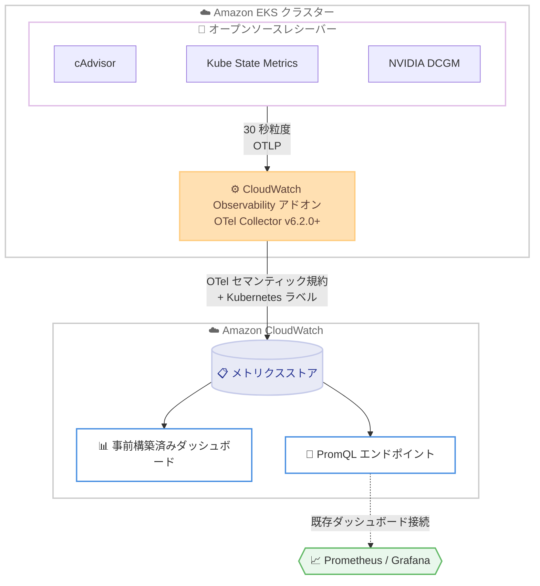

# Amazon CloudWatch - OTel Container Insights for Amazon EKS

**リリース日**: 2026 年 6 月 23 日
**サービス**: Amazon CloudWatch
**機能**: OTel Container Insights for Amazon EKS

📊 [このアップデートのインフォグラフィックを見る](https://takech9203.github.io/aws-news-summary/20260623-amazon-cloudwatch-otel-amazon-eks.html)
<!-- INFOGRAPHIC_BASE_URL は環境変数から取得 -->

## 概要

Amazon CloudWatch は、Amazon EKS 向けの OTel Container Insights を発表しました。これは OpenTelemetry をベースに構築された、EKS クラスターの推奨される可観測性ソリューションです。cAdvisor、Kube State Metrics、NVIDIA DCGM などのオープンソースレシーバーを使用して、30 秒粒度でインフラストラクチャメトリクスを収集します。

この機能の大きな特徴は、各メトリクスが OpenTelemetry セマンティック規約と Kubernetes ラベルを保持している点です。これにより、ノード、Pod、ワークロードをまたいだ相関分析を単一の PromQL クエリで容易に実行できます。従来の Enhanced Container Insights (Classic) が独自のメトリクス名を使用していたのに対し、OTel Container Insights は各ソースの元のメトリクス名 (例: cAdvisor の `container_cpu_usage_seconds_total`) をそのまま保持するため、既存の PromQL ダッシュボードやコミュニティのドキュメントとの互換性が高くなっています。

さらに、事前構築済みダッシュボードによってクラスターの健全性、ノードのパフォーマンス、Pod レベルのリソース使用状況を即座に可視化できます。CloudWatch PromQL エンドポイントを利用すれば、既存の Prometheus および Grafana のダッシュボードを CloudWatch に直接接続できます。EKS コンソール、CloudWatch Observability アドオン (v6.2.0 以降)、Helm、または CloudFormation から有効化できます。

**アップデート前の課題**

- 従来の Enhanced Container Insights (Classic) は独自のメトリクス名を使用していたため、既存の PromQL ダッシュボードやコミュニティドキュメントとの互換性が低かった
- ノード、Pod、ワークロードをまたいだメトリクスの相関分析を統一的なクエリで行うことが難しかった
- 既存の Prometheus / Grafana ダッシュボード資産を CloudWatch のメトリクスに対してそのまま再利用しにくかった

**アップデート後の改善**

- メトリクスが元のソース名を保持するため、既存の PromQL ダッシュボードやコミュニティドキュメントをそのまま活用できるようになった
- OpenTelemetry セマンティック規約と Kubernetes ラベルにより、単一の PromQL クエリでノード、Pod、ワークロードをまたいだ相関分析が可能になった
- CloudWatch PromQL エンドポイントにより、既存の Prometheus / Grafana ダッシュボードを CloudWatch に直接接続できるようになった

## アーキテクチャ図



オープンソースレシーバーが収集したメトリクスを CloudWatch Observability アドオン (OTel Collector) が OTLP で受け取り、OpenTelemetry セマンティック規約と Kubernetes ラベルで強化したうえで CloudWatch に送信する流れを示しています。

## サービスアップデートの詳細

### 主要機能

1. **オープンソースレシーバーによるメトリクス収集**
   - cAdvisor、Prometheus Node Exporter、Kube State Metrics、Kubernetes API Server、NVIDIA DCGM、AWS Neuron Monitor、AWS Elastic Fabric Adapter、NVMe といった複数のレシーバーに対応
   - OpenTelemetry Protocol (OTLP) を使用して 30 秒粒度でメトリクスを収集
   - メトリクスは CloudWatch 形式の名前ではなく、各ソースの元の名前 (例: cAdvisor の `container_cpu_usage_seconds_total`) を保持

2. **OpenTelemetry セマンティック規約と Kubernetes ラベルによる強化**
   - 各メトリクスは最大 150 個のラベルで強化される
   - ラベルは 3 つのソースから付与される。テレメトリソースのネイティブラベル (例: `pod`、`namespace`、`container`)、OpenTelemetry リソース属性 (Kubernetes、Host、Cloud のセマンティック規約に準拠)、Kubernetes の Pod / Node ラベル (`k8s.pod.label.*`、`k8s.node.label.*` のプレフィックス付き)
   - 単一の PromQL クエリでノード、Pod、ワークロードをまたいだ相関分析が可能

3. **事前構築済みダッシュボードと PromQL エンドポイント**
   - クラスターの健全性、ノードのパフォーマンス、Pod レベルのリソース使用状況を即座に可視化する事前構築済みダッシュボードを提供
   - CloudWatch PromQL エンドポイントにより、既存の Prometheus / Grafana ダッシュボードを CloudWatch に直接接続可能

4. **デュアルパブリッシングによる移行サポート**
   - アドオン v6.2.0 以降では、Enhanced Container Insights (Classic) と OTel Container Insights の両方へ同時にメトリクスを発行可能
   - 完全に移行する前に新しいメトリクスパイプラインを検証できる

## 技術仕様

### 利用可能なレシーバーと前提条件

| レシーバー | 収集対象 | 前提条件 |
|------|------|------|
| cAdvisor | コンテナの CPU、メモリ、ネットワーク、ディスク / ファイルシステムメトリクス | kubelet に組み込み済み。追加設定不要 |
| Prometheus Node Exporter | ノードレベルの CPU、メモリ、ディスク、ファイルシステム、ネットワーク、システムメトリクス | アドオンに含まれる |
| Kube State Metrics | Pod、Node、Deployment、DaemonSet、StatefulSet、ReplicaSet、Job、CronJob、Service、Namespace、PV、PVC メトリクス | アドオンに含まれる |
| Kubernetes API Server | API サーバーと etcd メトリクス | コントロールプレーンで利用可能 |
| NVIDIA DCGM | GPU 使用率、メモリ、電力 / 温度、スロットリング、エラー / 信頼性、NVLink メトリクス | NVIDIA デバイスプラグインとコンテナツールキットが必要 |
| AWS Neuron Monitor | NeuronCore、NeuronDevice、Neuron システムメトリクス | Neuron ドライバーとデバイスプラグインが必要 |
| AWS Elastic Fabric Adapter | EFA ネットワーキングメトリクス | EFA デバイスプラグインが必要 |
| NVMe | NVMe SMART ヘルスメトリクス | 追加設定不要 |

### Enhanced Container Insights (Classic) との比較

| 項目 | OTel Container Insights | Enhanced Container Insights (Classic) |
|------|------|------|
| シグナル | メトリクス、ログ | メトリクス、ログ |
| 拡張可観測性 | 対応 | 対応 |
| メンテナンス状況 | 活発に開発中 | メンテナンスモード |
| デプロイの複雑さ | 低 | 低 |
| メトリクス名 | ソースの元の名前を保持 | 独自のメトリクス名 |

両者は同じ `amazon-cloudwatch-observability` EKS アドオンを使用します。違いは別の製品ではなく、アドオンのバージョンと設定にあります。OTel Container Insights は、このアドオンのより新しく活発に開発されている構成です。

### デュアルパブリッシングの設定例

```bash
# Enhanced Container Insights (Classic) と OTel Container Insights を併用して有効化
aws eks update-addon \
  --cluster-name {{cluster-name}} \
  --addon-name amazon-cloudwatch-observability \
  --configuration-values '{"containerInsights":{"enabled":true},"otelContainerInsights":{"enabled":true}}'
```

OTel Container Insights はデフォルトでは無効です。有効化するには、アドオン設定で `otelContainerInsights.enabled` を `true` に設定します。

## 設定方法

### 前提条件

1. Amazon EKS クラスターが稼働していること
2. CloudWatch Observability アドオン (`amazon-cloudwatch-observability`) のバージョン v6.2.0 以降を使用できること
3. NVIDIA DCGM や AWS Neuron など特定のレシーバーを使用する場合は、対応するデバイスプラグインを導入していること

### 手順

#### ステップ1: EKS コンソールから有効化

EKS コンソールのクラスター設定画面から、OTel Container Insights を有効化します。最も簡単に始められる方法で、数分で完全な可観測性を有効にできます。

#### ステップ2: CloudWatch Observability アドオンから有効化

```bash
# OTel Container Insights のみを有効化し、Classic を無効化する
aws eks update-addon \
  --cluster-name {{cluster-name}} \
  --addon-name amazon-cloudwatch-observability \
  --configuration-values '{"containerInsights":{"enabled":false},"otelContainerInsights":{"enabled":true}}'
```

このコマンドは、Enhanced Container Insights (Classic) を無効化し、OTel Container Insights のみを有効化します。新規クラスターや、すでに移行を完了したクラスターに適した構成です。

#### ステップ3: Helm または CloudFormation でのデプロイ

GitOps フレンドリーな柔軟な管理を行いたい場合は Helm チャートを、インフラストラクチャをコードとして管理したい場合は CloudFormation テンプレートを使用してデプロイできます。

## メリット

### ビジネス面

- **既存資産の活用**: メトリクスが元のソース名を保持するため、既存の PromQL ダッシュボードやコミュニティドキュメントをそのまま再利用でき、移行コストを抑えられます
- **運用の統合**: メトリクスとログを単一のエージェントデプロイで収集でき、テレメトリパイプラインをモダンな単一基盤に集約できます
- **継続的な機能拡充**: 活発に開発されている構成のため、新機能やパフォーマンス改善、シグナルカバレッジの拡大を継続的に受けられます

### 技術面

- **OpenTelemetry ネイティブ**: 業界標準の OpenTelemetry Collector 上に構築されており、標準的な可観測性フレームワークと整合します
- **高い相関性**: 最大 150 個のラベルにより、ノード、Pod、ワークロードをまたいだ相関分析を単一の PromQL クエリで実行できます
- **段階的な移行**: デュアルパブリッシングにより、Classic と OTel を併用しながら新しいパイプラインを検証してから完全移行できます

## デメリット・制約事項

### 制限事項

- 中東 (UAE)、中東 (バーレーン)、イスラエル (テルアビブ) の各リージョンでは利用できません
- アドオンのデュアルパブリッシング機能を利用するには、バージョン v6.2.0 以降が必要です
- OTel Container Insights はデフォルトで無効のため、明示的に有効化する必要があります

### 考慮すべき点

- NVIDIA DCGM、AWS Neuron Monitor、AWS Elastic Fabric Adapter などのレシーバーは、対応するデバイスプラグインの導入が前提となります
- Classic と OTel を併用するデュアルパブリッシング構成では、メトリクスが二重に発行されるため料金への影響を確認する必要があります

## ユースケース

### ユースケース1: 既存 Grafana ダッシュボードの CloudWatch への接続

**シナリオ**: 既に Prometheus / Grafana で EKS を監視している組織が、メトリクスストアを CloudWatch に集約したい。

**実装例**:
```
CloudWatch PromQL エンドポイントを Grafana のデータソースとして登録し、
既存の PromQL クエリベースのダッシュボードをそのまま接続する
```

**効果**: ダッシュボードを書き直すことなく、CloudWatch のマネージドなメトリクスストアへ移行でき、運用負荷を軽減できます。

### ユースケース2: GPU ワークロードの監視

**シナリオ**: 機械学習トレーニングを EKS 上で実行しており、GPU 使用率やスロットリング、温度を詳細に監視したい。

**実装例**:
```
NVIDIA デバイスプラグインとコンテナツールキットを導入し、
NVIDIA DCGM レシーバーを有効化して GPU メトリクスを 30 秒粒度で収集する
```

**効果**: GPU 使用率、メモリ、電力 / 温度、NVLink メトリクスを Pod レベルのラベルと相関させて分析でき、トレーニングジョブのボトルネックを特定しやすくなります。

### ユースケース3: Classic からの段階的移行

**シナリオ**: Enhanced Container Insights (Classic) を本番運用しており、ダウンタイムなく OTel ベースへ移行したい。

**実装例**:
```
デュアルパブリッシングを有効化して Classic と OTel を併用し、
OTel のメトリクスとダッシュボードを検証後、Classic を無効化する
```

**効果**: 新しいパイプラインを本番データで検証してから切り替えられるため、移行リスクを最小化できます。

## 料金

OTel Container Insights の料金は、収集されるメトリクスとログに対して Amazon CloudWatch の標準料金が適用されます。詳細は CloudWatch の料金ページを参照してください。デュアルパブリッシング構成では、Classic と OTel の両方でメトリクスが発行されるため、料金への影響を事前に確認することを推奨します。

## 利用可能リージョン

中東 (UAE)、中東 (バーレーン)、イスラエル (テルアビブ) を除く、すべての商用 AWS リージョンで利用可能です。

## 関連サービス・機能

- **Amazon EKS**: 監視対象となる Kubernetes クラスターを提供します
- **CloudWatch Observability アドオン**: OTel Collector を含む EKS アドオンで、メトリクスとログの収集を担います
- **Amazon Managed Service for Prometheus / Grafana**: PromQL ベースの可観測性において補完的に利用できるマネージドサービスです

## 参考リンク

- 📊 [インフォグラフィック](https://takech9203.github.io/aws-news-summary/20260623-amazon-cloudwatch-otel-amazon-eks.html)
- [公式発表 (What's New)](https://aws.amazon.com/about-aws/whats-new/2026/06/amazon-cloudwatch-otel-amazon-eks/)
- [ドキュメント](https://docs.aws.amazon.com/AmazonCloudWatch/latest/monitoring/container-insights-eks-otel.html)
- [料金ページ](https://aws.amazon.com/cloudwatch/pricing/)

## まとめ

OTel Container Insights は、OpenTelemetry をベースとした EKS の推奨可観測性ソリューションであり、元のメトリクス名と標準的なセマンティック規約を保持することで既存の PromQL / Grafana 資産をそのまま活用できる点が大きな価値です。EKS を運用している組織は、デュアルパブリッシングを活用して Classic から段階的に移行し、モダンで統一されたテレメトリパイプラインへの集約を検討することを推奨します。
