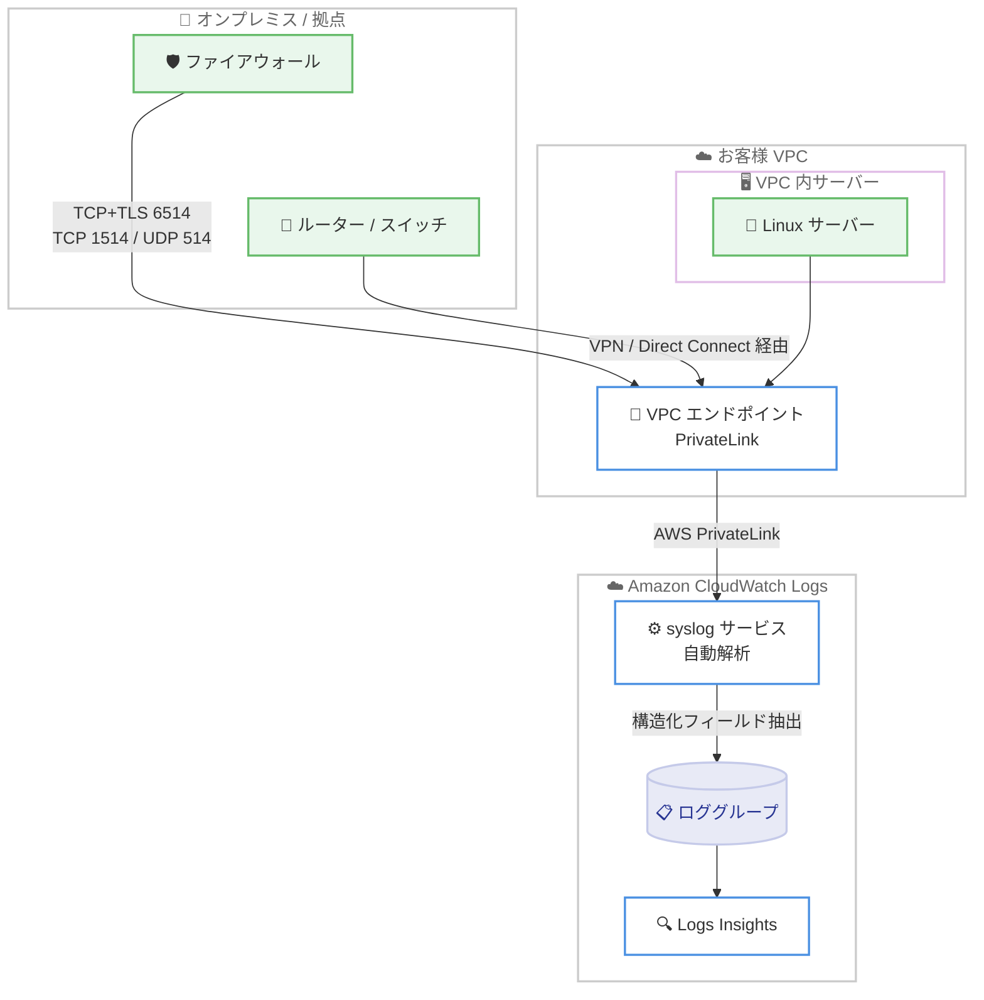

# Amazon CloudWatch Logs - マネージド syslog 取り込み

**リリース日**: 2026 年 6 月 23 日
**サービス**: Amazon CloudWatch Logs
**機能**: マネージド syslog 取り込み (Managed syslog ingestion)

📊 [このアップデートのインフォグラフィックを見る](https://takech9203.github.io/aws-news-summary/20260623-amazon-cloudwatch-syslog-ingestion.html)
<!-- INFOGRAPHIC_BASE_URL は環境変数から取得 -->

## 概要

Amazon CloudWatch Logs がマネージド syslog 取り込みに対応しました。これにより、ファイアウォール、ルーター、スイッチ、Linux サーバーなどから送信される syslog メッセージを、エージェントのインストールや管理なしで直接 CloudWatch Logs に取り込めるようになります。

ネットワーク機器やサーバーは、お客様のアカウント内の VPC エンドポイントに対して TCP、TCP+TLS、または UDP で syslog メッセージを送信します。トラフィックは AWS PrivateLink を経由して CloudWatch Logs の syslog サービスにトンネリングされ、サービスがメッセージを自動的に解析してロググループに書き込みます。RFC 5424、RFC 3164、Cisco FTD/ASA の各 syslog フォーマットに対応し、facility (機能)、severity (重要度)、hostname (ホスト名)、application name (アプリケーション名) といった構造化フィールドを自動的に抽出します。

この機能により、分散環境に多数のログ収集エージェントを展開・運用する負担を軽減しつつ、インフラのログを一元的に可視化できます。セキュリティチームや運用チームは、取り込んだファイアウォールの syslog を CloudWatch Logs Insights で重要度やホスト名により検索し、セキュリティ調査や接続性のトラブルシューティングに活用できます。

**アップデート前の課題**

- 以前はネットワーク機器やサーバーの syslog を CloudWatch Logs に取り込むために、収集用エージェント (CloudWatch エージェントなど) や中継サーバー、独自のログ転送基盤を構築・運用する必要があった
- ファイアウォールやスイッチなど、エージェントをインストールできない機器のログ取り込みには追加の仕組みが必要だった
- syslog メッセージから facility や severity などの構造化フィールドを取り出すために、カスタムの解析パイプラインを用意する必要があった

**アップデート後の改善**

- 今回のアップデートにより、エージェントを一切インストールせずに syslog メッセージを直接 CloudWatch Logs に送信できるようになった
- 今回のアップデートにより、VPC エンドポイント宛てに syslog を送るだけで取り込みが完結し、中継基盤の構築が不要になった
- 今回のアップデートにより、RFC 5424、RFC 3164、Cisco FTD/ASA フォーマットを自動検出し、構造化フィールドを自動抽出するため、カスタム解析パイプラインが不要になった

## アーキテクチャ図



オンプレミスや VPC 内の syslog ソースから VPC エンドポイントへ送信されたメッセージが、AWS PrivateLink 経由で CloudWatch Logs の syslog サービスに渡り、解析後にロググループへ書き込まれる流れを示しています。

## サービスアップデートの詳細

### 主要機能

1. **エージェントレスでの syslog 取り込み**
   - ファイアウォール、ルーター、スイッチ、Linux サーバー、ネットワークアプライアンスなどから直接 syslog を取り込める
   - 収集エージェントのインストールや管理が不要
   - VPC 内のソースは VPC エンドポイントへ直接送信し、AWS 外 (オンプレミス、支店、コロケーション) のソースは VPN または AWS Direct Connect 経由で到達可能

2. **複数プロトコルとプライベート接続への対応**
   - TCP+TLS、TCP プレーンテキスト、UDP に対応
   - トラフィックは AWS PrivateLink を経由してネットワーク的に分離された経路で転送される
   - TLS はネットワークロードバランサーで終端され、Amazon Trust Services 発行の AWS マネージド証明書を使用するため、クライアント側で特別な証明書設定は不要

3. **複数フォーマットの自動検出と構造化フィールドの自動抽出**
   - RFC 5424、RFC 3164、Cisco FTD/ASA の各フォーマットを自動検出して解析
   - facility、severity、hostname、appName などの構造化フィールドを自動抽出
   - メッセージは元の生フォーマットのままロググループに保存され、抽出フィールドは CloudWatch Logs Insights でクエリ可能

4. **新しい API による設定管理**
   - `PutSyslogConfiguration`、`ListSyslogConfigurations`、`DeleteSyslogConfiguration` の 3 つの新 API を追加
   - ロググループと VPC エンドポイントの組み合わせで取り込み設定を管理

## 技術仕様

### 対応プロトコルとポート

| プロトコル | ポート | 備考 |
|------|------|------|
| TCP + TLS | 6514 | 転送中に暗号化。コンプライアンス要件がある場合に推奨 |
| TCP プレーンテキスト | 1514 | AWS PrivateLink 上のプレーンテキスト (ネットワーク分離) |
| UDP | 514 | ベストエフォート配信 |

TLS (ポート 6514) はネットワークロードバランサーで終端され、Amazon Trust Services 発行の AWS マネージド証明書が使用されます。syslog クライアントは追加設定なしにこの証明書を信頼します。なお、UDP はベストエフォートのため、ネットワーク状況によりメッセージが失われる可能性があります。信頼性が必要な場合は TCP の使用が推奨されます。

### 対応 syslog フォーマット

| フォーマット | 概要 |
|------|------|
| RFC 5424 | 新しいフォーマット。構造化データ、ISO 8601 タイムスタンプ、明示的なアプリケーション名とプロセス ID を含む |
| RFC 3164 | BSD syslog (レガシーフォーマット)。BSD スタイルのタイムスタンプと TAG フィールドを含む。ファイアウォールやルーターなどで広く使用 |
| Cisco FTD/ASA | Cisco Firepower Threat Defense (FTD) および Adaptive Security Appliance (ASA) で使用されるフォーマット。`%FTD-` または `%ASA-` タグで識別 |

### 抽出される主なフィールド (RFC 5424)

| フィールド | 説明 |
|------|------|
| facility / facilityCode | ログカテゴリ名と数値コード (0-23) |
| severity / severityCode | 重要度レベル名と数値コード (0-7) |
| timestamp | ISO 8601 形式のメッセージタイムスタンプ |
| hostname | 送信元デバイスのホスト名 |
| appName | アプリケーション名 |
| procId / msgId | プロセス ID とメッセージ識別子 |
| structuredData | RFC 5424 構造化データ要素 (キーバリューメタデータ) |
| message | メッセージ本文 |

RFC 3164 では BSD 形式のタイムスタンプを ISO 8601 へ変換し、TAG フィールドから appName や procId を抽出します。Cisco FTD/ASA では device、deviceId、severityLevel、messageId、subsystem などのフィールドが抽出されます。

### クォータと制限

| 項目 | 値 | 備考 |
|------|------|------|
| 最大メッセージサイズ (TCP) | 64 KB | 標準的な syslog メッセージはこの上限を大きく下回る。超過が必要な場合は AWS Support に問い合わせ |
| 最大メッセージサイズ (UDP) | 8 KB | 同上 |
| 取り込みスループット | PutLogEvents と共有 | アカウントの `PutLogEvents` クォータ (デフォルトでリージョンあたり 5,000 リクエスト/秒) に計上される |

`PutLogEvents` のクォータは調整可能です。より高いスループットが必要な場合は Service Quotas からクォータ引き上げをリクエストできます。

### API 変更履歴

| 日付 | サービス | 変更内容 |
|------|----------|----------|
| 2026/06/22 | [logs](https://awsapichanges.com/archive/changes/d33e4c-logs.html) | 3 new api methods - syslog 取り込みをサポートする新 API (`PutSyslogConfiguration`、`ListSyslogConfigurations`、`DeleteSyslogConfiguration`) を追加 |

各 API は、ロググループ名または ARN を指定する `logGroupIdentifier` と、取り込み元となる `vpcEndpointId` を使用して syslog 取り込み設定を管理します。

### メッセージ配信に関する注意

syslog プロトコルにはサーバーから送信元へのアプリケーション層の確認応答 (ACK) がありません。CloudWatch Logs syslog サービスがメッセージを受信した後、ロググループへの配信はベストエフォートで行われます。ロググループが削除されている、リソースポリシーの設定に誤りがある、アカウントの `PutLogEvents` クォータを超過しているといった理由で配信できない場合、メッセージは破棄され、再送はできません。配信失敗を検知するには CloudWatch の `SyslogMessagesDropped` メトリクスを監視します。`Reason` ディメンションにより破棄理由を確認できます。

## 設定方法

### 前提条件

1. syslog メッセージの宛先となる CloudWatch Logs のロググループを用意する
2. お客様アカウントの VPC に syslog 取り込み用の VPC エンドポイントを作成する
3. AWS 外のソースを使用する場合は、VPC への VPN または AWS Direct Connect 接続を用意する

### 手順

#### ステップ 1: syslog 取り込み設定を作成する

```bash
aws logs put-syslog-configuration \
  --log-group-identifier "my-syslog-log-group" \
  --vpc-endpoint-id "vpce-0123456789abcdef0"
```

`PutSyslogConfiguration` API により、指定したロググループと VPC エンドポイントを関連付けて syslog 取り込みを有効化します (パラメータは実際の環境に合わせて指定してください)。

#### ステップ 2: syslog ソースを VPC エンドポイントへ向ける

```bash
# Linux サーバーでの rsyslog 設定例 (TCP+TLS、ポート 6514)
*.* @@<vpc-endpoint-dns>:6514
```

ファイアウォールやルーターなどのネットワーク機器、または Linux サーバーの syslog 送信先を、作成した VPC エンドポイントの DNS 名とプロトコルに対応するポート (TCP+TLS は 6514、TCP は 1514、UDP は 514) に設定します。

#### ステップ 3: 取り込みとモニタリングを確認する

```bash
aws logs list-syslog-configurations \
  --log-group-identifier "my-syslog-log-group"
```

`ListSyslogConfigurations` で設定を確認し、ロググループにメッセージが到達しているか、`SyslogMessagesDropped` メトリクスに破棄が記録されていないかを CloudWatch で確認します。

## メリット

### ビジネス面

- **運用コストの削減**: 分散環境のログ収集エージェントや中継基盤の構築・運用が不要になり、運用負荷とコストを削減できる
- **セキュリティ可視性の向上**: ファイアウォールやネットワーク機器の syslog を一元的に集約し、セキュリティ調査やコンプライアンス監査に活用できる
- **導入の迅速化**: エージェント展開を伴わないため、ネットワーク機器を含む多様なソースから短期間でログ収集を開始できる

### 技術面

- **エージェントレス**: エージェントのインストール・更新・管理が不要
- **プライベートな転送経路**: AWS PrivateLink によりネットワーク的に分離された経路で転送し、TCP+TLS による暗号化にも対応
- **自動解析**: 複数フォーマットを自動検出し構造化フィールドを抽出するため、カスタム解析処理を実装せずに CloudWatch Logs Insights でクエリできる

## デメリット・制約事項

### 制限事項

- 中東 (UAE)、中東 (バーレーン)、イスラエル (テルアビブ) の各リージョンでは利用できない
- メッセージサイズは TCP で最大 64 KB、UDP で最大 8 KB に制限される
- 取り込みスループットはアカウントの `PutLogEvents` クォータ (デフォルトでリージョンあたり 5,000 リクエスト/秒) を共有する

### 考慮すべき点

- syslog は配信確認の仕組みを持たず、ベストエフォート配信となる。ロググループ削除やクォータ超過などで配信できない場合、メッセージは破棄され再送できないため、`SyslogMessagesDropped` メトリクスの監視が重要
- UDP はメッセージ損失の可能性があるため、信頼性が必要な場合は TCP を使用する
- コンプライアンス要件がある場合は、暗号化される TCP+TLS (ポート 6514) の利用を推奨

## ユースケース

### ユースケース 1: ファイアウォールログの一元集約とセキュリティ調査

**シナリオ**: 複数拠点に配置された Cisco FTD/ASA ファイアウォールのログを一元的に集約し、セキュリティインシデント発生時に横断的に調査したい。

**実装例**:
```
ファイアウォール (Cisco FTD/ASA)
  --> VPN / Direct Connect --> VPC エンドポイント (TCP+TLS 6514)
  --> CloudWatch Logs (severity / messageId を自動抽出)
  --> Logs Insights で severity = critical を横断検索
```

**効果**: エージェントを導入できないファイアウォールのログをエージェントレスで集約し、重要度やメッセージ ID で迅速に絞り込んでセキュリティ調査を行える。

### ユースケース 2: ネットワーク機器の接続性トラブルシューティング

**シナリオ**: ルーターやスイッチの syslog をリアルタイムに集約し、接続障害の原因をホスト名単位で切り分けたい。

**実装例**:
```
ルーター / スイッチ (RFC 3164)
  --> VPC エンドポイント (TCP 1514)
  --> CloudWatch Logs (hostname / facility を自動抽出)
  --> Logs Insights で hostname 単位に集計
```

**効果**: 機器ごとのログをホスト名や facility で構造化して検索でき、障害発生機器の特定が容易になる。

### ユースケース 3: Linux サーバー群のログ集約

**シナリオ**: VPC 内の多数の Linux サーバーの syslog を、CloudWatch エージェントを各サーバーに導入せずに集約したい。

**実装例**:
```
Linux サーバー (rsyslog, RFC 5424)
  --> VPC エンドポイント (TCP+TLS 6514)
  --> CloudWatch Logs (appName / procId / structuredData を自動抽出)
```

**効果**: 既存の rsyslog 設定を VPC エンドポイント宛てに変更するだけで集約でき、エージェント管理の手間を削減できる。

## 料金

syslog 取り込みは CloudWatch Logs の取り込みとして扱われ、取り込んだデータ量に応じた CloudWatch Logs の標準料金が適用されます。スループットはアカウントの `PutLogEvents` クォータを共有します。正確な料金は、利用するリージョンと取り込みデータ量に基づき、Amazon CloudWatch の料金ページで確認してください。

## 利用可能リージョン

中東 (UAE)、中東 (バーレーン)、イスラエル (テルアビブ) を除く、すべての商用 AWS リージョンで利用可能です。

## 関連サービス・機能

- **AWS PrivateLink**: VPC エンドポイントから CloudWatch Logs の syslog サービスへ、ネットワーク的に分離された経路でトラフィックを転送する
- **Amazon CloudWatch Logs Insights**: 自動抽出された構造化フィールド (severity、hostname など) に対してクエリを実行する
- **AWS Direct Connect / Site-to-Site VPN**: AWS 外の syslog ソースが VPC エンドポイントに到達するための接続経路として利用する
- **Amazon CloudWatch メトリクス**: `SyslogMessagesDropped` メトリクスで配信失敗を監視する

## 参考リンク

- 📊 [インフォグラフィック](https://takech9203.github.io/aws-news-summary/20260623-amazon-cloudwatch-syslog-ingestion.html)
- [公式発表 (What's New)](https://aws.amazon.com/about-aws/whats-new/2026/06/amazon-cloudwatch-syslog-ingestion/)
- [ドキュメント (Syslog ingestion)](https://docs.aws.amazon.com/AmazonCloudWatch/latest/logs/CWL_Syslog.html)
- [API 変更履歴 (awsapichanges.com)](https://awsapichanges.com/archive/changes/d33e4c-logs.html)
- [Amazon CloudWatch 料金ページ](https://aws.amazon.com/cloudwatch/pricing/)

## まとめ

Amazon CloudWatch Logs のマネージド syslog 取り込みは、ファイアウォールやネットワーク機器、Linux サーバーの syslog をエージェントレスかつプライベートな経路で集約し、構造化フィールドを自動抽出できる機能です。エージェント管理やカスタム解析パイプラインの運用負担を大きく削減できるため、まずは対象機器の syslog 送信先を VPC エンドポイントへ向け、`PutSyslogConfiguration` で設定して取り込みを検証することを推奨します。あわせて `SyslogMessagesDropped` メトリクスの監視を設定し、配信失敗を早期に検知できる体制を整えてください。
