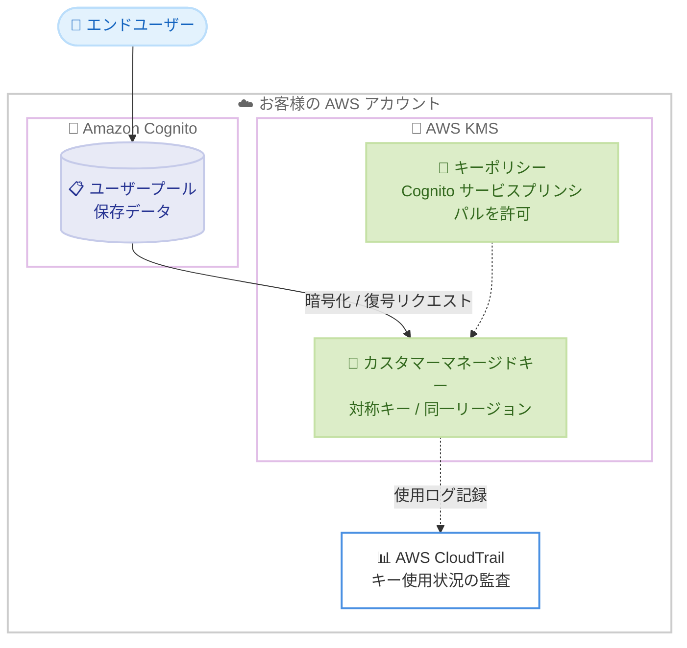

# Amazon Cognito - 保存データ暗号化におけるカスタマーマネージドキーのサポート

**リリース日**: 2026 年 6 月 23 日
**サービス**: Amazon Cognito
**機能**: ユーザープールの保存データ暗号化におけるカスタマーマネージドキー (Customer Managed Key)

📊 [このアップデートのインフォグラフィックを見る](https://takech9203.github.io/aws-news-summary/20260623-amazon-cognito-customer-managed-key.html)
<!-- INFOGRAPHIC_BASE_URL は環境変数から取得 -->

## 概要

Amazon Cognito は、ユーザープールの保存データ (data at rest) を暗号化する際に、AWS Key Management Service (KMS) のカスタマーマネージドキーを利用できるようになりました。これまで Cognito ユーザープールのデータはデフォルトで AWS 所有キー (AWS owned key) によって暗号化されていましたが、今回のアップデートにより、お客様が KMS で作成・管理する暗号化キーを使用してユーザープールのデータを暗号化できます。

カスタマーマネージドキーを使用することで、暗号化キーに対する完全な制御が可能になります。お客様は組織のポリシーを定義し、キーを無効化または削除することで暗号化されたデータへのアクセスを取り消すことができます。キーのライフサイクルや使用権限の管理は AWS KMS で行い、すべての使用状況は AWS CloudTrail で監視・監査できます。

この機能は、金融、医療、公共部門など、データガバナンスやコンプライアンス要件が厳しい業界において、認証基盤の保存データに対するキー管理の責任分界点を明確にしたいお客様にとって特に有用です。

**アップデート前の課題**

- ユーザープールの保存データは AWS 所有キーでのみ暗号化され、お客様自身が暗号化キーを制御できなかった
- 組織独自のキー管理ポリシー (ローテーション、無効化、削除など) を認証基盤の保存データに適用できなかった
- キーの無効化や削除によって暗号化されたデータへのアクセスを取り消すという、組織主導のアクセス制御手段がなかった

**アップデート後の改善**

- 今回のアップデートにより、お客様が KMS で管理するカスタマーマネージドキーでユーザープールのデータを暗号化できるようになった
- キーの無効化・削除により、暗号化されたデータへのアクセスを組織の判断で取り消せるようになった
- CloudTrail を通じてキーの全使用状況を監視・監査でき、コンプライアンス要件への対応が容易になった

## アーキテクチャ図



エンドユーザーのデータはユーザープールに保存される際にカスタマーマネージドキーで暗号化され、キーポリシーによって Cognito サービスプリンシパルにのみ暗号化・復号操作が許可されます。キーの使用状況は CloudTrail に記録されます。

## サービスアップデートの詳細

### 主要機能

1. **カスタマーマネージドキーによる保存データ暗号化**
   - ユーザープールのデータを、お客様が AWS KMS で管理するキーで暗号化できる
   - デフォルトでは引き続き AWS 所有キーが使用される
   - すべてのユーザープールデータは、暗号化設定を行わなくても保存時に暗号化される

2. **キーライフサイクルとアクセス制御の完全な掌握**
   - キーの作成、ローテーション、スケジュール削除をお客様が AWS KMS で管理する
   - キーを無効化または削除することで、暗号化されたデータへのアクセスを取り消せる
   - キーポリシーを通じて Cognito からのアクセスを細かく制御できる

3. **新規・既存ユーザープールへの設定**
   - 新規ユーザープール作成時にカスタマーマネージドキーを設定できる
   - 既存のユーザープールを更新してカスタマーマネージドキーを使用するように変更できる
   - AWS マネジメントコンソール、AWS CLI、AWS SDK のいずれからも設定可能

4. **CloudTrail による監査**
   - カスタマーマネージドキーのすべての使用状況を CloudTrail で監視・監査できる
   - 認証基盤の保存データへのアクセスに対する可視性を確保できる

5. **検索可能な暗号化 (PII の保護)**
   - ユーザー属性検索における個人を特定できる情報 (PII) の機密性・完全性・可用性を、検索可能な暗号化 (searchable encryption) で保護する
   - HMAC 値はユーザープールを暗号化する KMS キーを使用して計算される
   - 対象属性: `sub`, `email`, `phone_number`, `given_name`, `family_name`, `name`, `username`, `preferred_username`, `cognito:user_status`

## 技術仕様

### サポートされるキーの要件

| 項目 | 詳細 |
|------|------|
| キーの種類 | 対称 (symmetric) KMS キーのみサポート。非対称キーは使用不可 |
| リージョン | ユーザープールと同一リージョンのキーである必要がある |
| キーのリージョン構成 | シングルリージョンキーおよびマルチリージョンキー (同一リージョン内) をサポート |
| キーの指定方法 | KMS キーの ARN で指定する。エイリアスは使用不可 |
| デフォルトのキータイプ | AWS 所有キー (AWS owned key) |
| 対象データ | ユーザープールのデータ (アイデンティティプールは AWS 所有キーのみで変更不可) |

### API 変更履歴

| 日付 | サービス | 変更内容 |
|------|----------|----------|
| 2026/06/18 | [cognito-idp](https://awsapichanges.com/archive/changes/1ac576-cognito-idp.html) | 3 updated api methods - TLS セルフサービス機能向けの `SecurityPolicyType` 追加 (本アップデートとは別機能) |

保存データ暗号化の設定は `CreateUserPool` および `UpdateUserPool` API の `KeyConfiguration` パラメータで行います。

```json
"KeyConfiguration": {
   "KeyType": "CUSTOMER_MANAGED_KEY",
   "KmsKeyArn": "arn:aws:kms:us-east-1:111122223333:key/a1b2c3d4-5678-90ab-cdef-EXAMPLE22222"
}
```

AWS 所有キーに戻す場合は以下のように指定します。

```json
"KeyConfiguration": {
   "KeyType": "AWS_OWNED_KEY"
}
```

`DescribeUserPool` のレスポンスに `KeyConfiguration` パラメータが含まれない場合、そのユーザープールは AWS 所有キーで保存データを暗号化しています。

### キーポリシーの設定

カスタマーマネージドキーを使用するには、Cognito のサービスプリンシパルがキーで暗号化・復号操作を実行できるように信頼する必要があります。以下はキーポリシーの抜粋例です。

```json
{
    "Sid": "Allow Amazon Cognito service access",
    "Effect": "Allow",
    "Principal": {
        "Service": [
            "cognito-idp.amazonaws.com",
            "identitystore.amazonaws.com"
        ]
    },
    "Action": [
        "kms:Encrypt",
        "kms:Decrypt",
        "kms:ReEncrypt*",
        "kms:GenerateDataKeyWithoutPlainText"
    ],
    "Resource": "*",
    "Condition": {
        "ArnEquals": {
            "aws:SourceArn": [
                "arn:aws:cognito-idp:us-east-1:111122223333:userpool/us-east-1_EXAMPLE"
            ]
        },
        "StringEquals": {
            "aws:SourceAccount": [
                "111122223333"
            ]
        },
        "StringLike": {
            "kms:EncryptionContext:aws:cognito-idp:userpool-arn": "arn:aws:cognito-idp:us-east-1:111122223333:userpool/us-east-1_EXAMPLE"
        }
    }
}
```

このポリシーを記述する IAM プリンシパルには、`kms:PutKeyPolicy` 権限を含む KMS キーへの書き込みアクセスが必要です。ログのエクスポートを構成している場合は、`kms:GenerateDataKey` と `kms:Encrypt` を含むログ配信用のステートメントを追加で設定します。

## 設定方法

### 前提条件

1. Essentials または Plus ティアのユーザープールであること
2. ユーザープールと同一リージョンに、対称 KMS キーが作成されていること
3. KMS キーのキーポリシーに Cognito サービスプリンシパルへのアクセス許可が設定されていること
4. キーポリシーを編集するための `kms:PutKeyPolicy` 権限を持つ IAM プリンシパルがあること

### 手順

#### ステップ1: KMS キーの作成とキーポリシーの設定

```bash
# 対称 KMS キーを作成する
aws kms create-key \
  --description "Amazon Cognito user pool encryption key" \
  --key-usage ENCRYPT_DECRYPT \
  --key-spec SYMMETRIC_DEFAULT \
  --region us-east-1
```

ユーザープールと同一リージョンに対称キーを作成します。作成後、上記「キーポリシーの設定」のとおり Cognito サービスプリンシパルへのアクセスを許可するキーポリシーを適用します。

#### ステップ2: コンソールでの暗号化設定

1. [Amazon Cognito コンソール](https://console.aws.amazon.com/cognito/home) で [ユーザープール] を選択
2. 対象のユーザープールを選択し、[設定] メニューから [ユーザープールのセキュリティ] タブへ移動
3. [保存時の暗号化] を見つけて [編集] を選択
4. [キータイプ] で [カスタマーマネージドキー] を選択
5. [カスタマーマネージドキーの ARN] に KMS キーの ARN を入力
6. [変更を保存] を選択

コンソールから [AWS KMS キーを作成] を選択して、新しいウィンドウで KMS キーを作成することもできます。

#### ステップ3: CLI または SDK での設定

```bash
# 既存ユーザープールをカスタマーマネージドキーで暗号化するよう更新する
aws cognito-idp update-user-pool \
  --user-pool-id us-east-1_EXAMPLE \
  --key-configuration KeyType=CUSTOMER_MANAGED_KEY,KmsKeyArn=arn:aws:kms:us-east-1:111122223333:key/a1b2c3d4-5678-90ab-cdef-EXAMPLE22222 \
  --region us-east-1
```

`update-user-pool` の `--key-configuration` で `KeyType` に `CUSTOMER_MANAGED_KEY` を指定し、`KmsKeyArn` に作成したキーの ARN を渡します。新規作成時は `create-user-pool` で同様に設定します。

## メリット

### ビジネス面

- **データガバナンスの強化**: 組織独自の暗号化キー管理ポリシーを認証基盤の保存データに適用でき、データ統制目標の達成を支援する
- **コンプライアンス対応**: 金融・医療・公共部門などの規制要件において、お客様が暗号化キーを掌握している証跡を CloudTrail で提示できる
- **追加費用なし**: 機能自体に追加料金は発生せず、標準の AWS KMS 料金のみで利用できる

### 技術面

- **アクセス取り消しの即時性**: キーを無効化・削除することで暗号化データへのアクセスを組織主導で取り消せる
- **既存環境への適用**: 既存ユーザープールを更新するだけでカスタマーマネージドキーへ移行できる
- **マルチリージョンキー対応**: 同一リージョン内であればマルチリージョンキーも利用でき、災害復旧やリージョン戦略と組み合わせやすい

## デメリット・制約事項

### 制限事項

- 対称 KMS キーのみサポートし、非対称キーは使用できない
- キーはユーザープールと同一リージョンに存在する必要がある
- キーの指定は ARN のみで、エイリアスは使用できない
- アイデンティティプールのデータは引き続き AWS 所有キーのみで暗号化され、変更できない
- Essentials および Plus ティアのユーザープールでのみ利用可能 (一部のユーザープールでは利用できない場合がある。新規作成のユーザープールでは常に利用可能)

### 考慮すべき点

- キーを誤って削除・無効化すると、ユーザープールのデータにアクセスできなくなるため、キーのライフサイクル管理を慎重に運用する必要がある
- KMS の API 呼び出しに応じた標準の AWS KMS 料金が発生する
- キーポリシーの設定には `kms:PutKeyPolicy` 権限が必要であり、適切な IAM 権限設計が前提となる

## ユースケース

### ユースケース1: 規制業界における認証基盤のキー管理

**シナリオ**: 金融機関が顧客向け Web アプリケーションの認証に Cognito ユーザープールを使用しており、暗号化キーを自社で掌握することを規制要件として求められている。

**実装例**:
```
1. 専用の対称 KMS キーを作成し、ローテーションポリシーを設定
2. ユーザープールにカスタマーマネージドキーを設定
3. CloudTrail でキー使用状況を継続的に監査
```

**効果**: 認証基盤の保存データに対する暗号化キーを自社で管理し、監査証跡を提示できるため、規制要件への準拠を実証できる。

### ユースケース2: インシデント発生時のデータアクセス遮断

**シナリオ**: セキュリティインシデントが疑われる状況で、認証基盤の保存データへのアクセスを即座に遮断したい。

**実装例**:
```
aws kms disable-key --key-id a1b2c3d4-5678-90ab-cdef-EXAMPLE22222
```

**効果**: キーを無効化することで、ユーザープールデータの暗号化・復号を停止し、データアクセスを組織主導で取り消せる。

### ユースケース3: 既存ユーザープールへのキー管理ポリシーの後付け適用

**シナリオ**: すでに本番稼働中のユーザープールに対し、新たに策定した社内のキー管理ポリシーを適用したい。

**実装例**:
```
aws cognito-idp update-user-pool \
  --user-pool-id us-east-1_EXAMPLE \
  --key-configuration KeyType=CUSTOMER_MANAGED_KEY,KmsKeyArn=arn:aws:kms:...
```

**効果**: 既存環境を再構築することなく、ユーザープールを更新するだけでカスタマーマネージドキーへ移行できる。

## 料金

カスタマーマネージドキーによる暗号化機能自体に追加料金は発生しません。Essentials および Plus ティアのユーザープールで追加コストなく利用できます。ただし、AWS KMS の利用に対しては標準の AWS KMS 料金が適用されます。

### 料金例

| 項目 | 料金 (概算) |
|------|------------|
| Cognito 暗号化機能の追加料金 | なし |
| KMS カスタマーマネージドキー (1 キーあたり) | 標準の AWS KMS 料金が適用 |
| KMS API リクエスト | 標準の AWS KMS 料金が適用 |

正確な料金は [AWS KMS の料金ページ](https://aws.amazon.com/kms/pricing/) を参照してください。

## 利用可能リージョン

公式発表では具体的な対応リージョンは明記されていません。利用可否は最新の [Amazon Cognito ドキュメント](https://docs.aws.amazon.com/cognito/latest/developerguide/data-protection.html) およびコンソールで確認してください。なお、新規作成のユーザープールでは常にカスタマーマネージドキーによる暗号化が利用可能です。

## 関連サービス・機能

- **AWS Key Management Service (KMS)**: カスタマーマネージドキーの作成・管理・ライフサイクル制御を担うサービス
- **AWS CloudTrail**: カスタマーマネージドキーの使用状況を監視・監査するためのログ記録サービス
- **AWS IAM**: キーポリシーの設定や Cognito へのアクセス制御に使用する権限管理サービス
- **検索可能な暗号化 (Searchable Encryption)**: ユーザー属性検索における PII を HMAC で保護する機能

## 参考リンク

- 📊 [インフォグラフィック](https://takech9203.github.io/aws-news-summary/20260623-amazon-cognito-customer-managed-key.html)
- [公式発表 (What's New)](https://aws.amazon.com/about-aws/whats-new/2026/06/amazon-cognito-customer-managed-key)
- [ドキュメント (Data protection in Amazon Cognito)](https://docs.aws.amazon.com/cognito/latest/developerguide/data-protection.html)
- [CreateUserPool API リファレンス](https://docs.aws.amazon.com/cognito-user-identity-pools/latest/APIReference/API_CreateUserPool.html)
- [AWS KMS 料金ページ](https://aws.amazon.com/kms/pricing/)

## まとめ

Amazon Cognito のカスタマーマネージドキーサポートにより、認証基盤の保存データに対する暗号化キーをお客様自身が完全に掌握できるようになりました。データガバナンスやコンプライアンス要件が厳しい組織にとって、キーの無効化によるアクセス取り消しや CloudTrail による監査が大きな価値をもたらします。機能自体は追加料金なしで利用できるため、Essentials または Plus ティアを利用中の組織は、同一リージョンに対称 KMS キーを作成し、既存または新規のユーザープールへの適用を検討することを推奨します。
