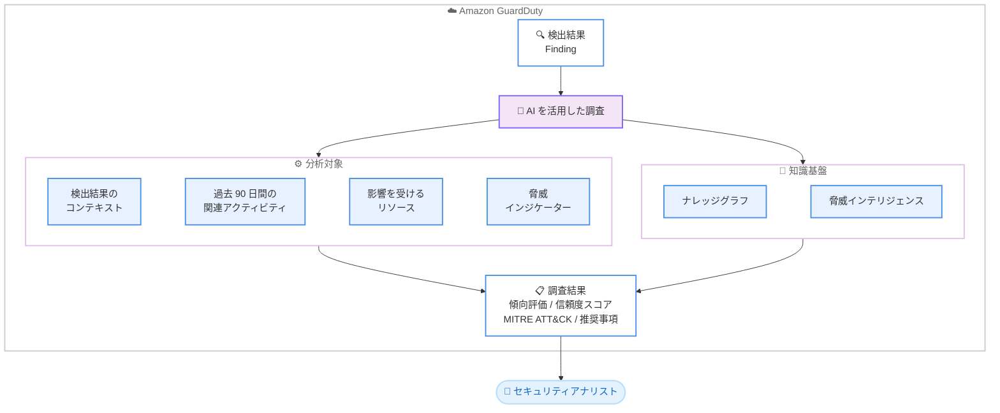

# Amazon GuardDuty - AI を活用した調査機能

**リリース日**: 2026年6月23日
**サービス**: Amazon GuardDuty
**機能**: AI-powered investigations (プレビュー)

📊 [このアップデートのインフォグラフィックを見る](https://takech9203.github.io/aws-news-summary/20260623-amazon-guardduty.html)
<!-- INFOGRAPHIC_BASE_URL は環境変数から取得 -->

## 概要

AWS は、Amazon GuardDuty において AI を活用した調査機能 (AI-powered investigations) のプレビューを発表しました。この新機能は、GuardDuty の検出結果 (Findings) とアカウントを自動的に分析し、真の脅威と無害な検出結果を迅速に区別できるよう支援します。

セキュリティオペレーションセンター (SOC) やクラウドセキュリティアナリストは、検出結果ごとに手動で調査を行う必要があり、この作業には多くの時間がかかっていました。手動調査はアラート疲れ (alert fatigue) の一因となり、インシデント対応を遅らせる要因となっていました。AI を活用した調査機能は、ナレッジグラフと脅威インテリジェンスを使用して、検出結果のコンテキスト、過去 90 日間の関連アクティビティ、影響を受けるリソース、脅威インジケーターを数分以内に分析します。

各調査では、信頼度スコア付きの傾向評価 (disposition assessment)、MITRE ATT&CK 手法の分類、裏付けとなる証拠、そして抑制 (suppression)、封じ込め (containment)、修復 (remediation) に向けた実行可能な推奨事項を提供します。この自動化により、セキュリティチームは個々の AWS アカウントや AWS Organizations 全体にわたって真の脅威に集中でき、平均解決時間 (MTTR) を短縮できます。

**アップデート前の課題**

このアップデート以前は、検出結果の調査に多くの手作業と時間が必要でした。

- 検出結果ごとに、アナリストが手動でコンテキストや関連アクティビティを調査する必要があった
- 手動調査に時間がかかり、アラート疲れを引き起こしてインシデント対応を遅らせていた
- 真の脅威と無害な検出結果を区別するための一貫した評価基準を確立しにくかった

**アップデート後の改善**

今回のアップデートにより、検出結果の調査が自動化され、迅速化されました。

- AI が検出結果とアカウントを自動分析し、数分以内に調査結果を提供できるようになった
- 信頼度スコア付きの傾向評価と MITRE ATT&CK 分類により、優先順位付けが容易になった
- 抑制、封じ込め、修復に関する実行可能な推奨事項が提示され、対応の意思決定が改善された

## アーキテクチャ図



GuardDuty の検出結果を AI が受け取り、複数のデータポイントとナレッジグラフ・脅威インテリジェンスを組み合わせて分析し、評価結果と推奨事項をセキュリティアナリストに提供する流れを示しています。

## サービスアップデートの詳細

### 主要機能

1. **自動的な検出結果の分析**
   - GuardDuty の検出結果とアカウントを自動的に分析し、真の脅威と無害な検出結果を区別する
   - 検出結果のコンテキスト、過去 90 日間の関連アクティビティ、影響を受けるリソース、脅威インジケーターを分析する
   - ナレッジグラフと脅威インテリジェンスを活用し、数分以内に分析を完了する

2. **傾向評価と信頼度スコア**
   - 各調査で、検出結果に対する傾向評価 (disposition assessment) を提供する
   - 評価には信頼度スコア (confidence scoring) が付与され、優先順位付けを支援する
   - MITRE ATT&CK 手法による分類と、裏付けとなる証拠を提示する

3. **実行可能な推奨事項**
   - 抑制 (suppression)、封じ込め (containment)、修復 (remediation) に向けた具体的な推奨事項を提供する
   - 個々の AWS アカウントから AWS Organizations 全体まで対応する
   - 平均解決時間 (MTTR) の短縮を支援する

## 技術仕様

### 分析対象と出力

| 項目 | 詳細 |
|------|------|
| 分析対象データ | 検出結果のコンテキスト、過去 90 日間の関連アクティビティ、影響を受けるリソース、脅威インジケーター |
| 分析基盤 | ナレッジグラフ、脅威インテリジェンス |
| 分析時間 | 数分以内 |
| 出力 | 傾向評価、信頼度スコア、MITRE ATT&CK 分類、裏付け証拠、推奨事項 |
| 推奨アクション | 抑制 (suppression)、封じ込め (containment)、修復 (remediation) |
| 対象範囲 | 個々の AWS アカウント、AWS Organizations 全体 |
| アクセス方法 | GuardDuty コンソール、CLI、API、AWS MCP Server |

### アクセス方法

AI を活用した調査機能には、以下の方法でアクセスできます。

- Amazon GuardDuty コンソール
- AWS CLI
- API
- AWS MCP Server

## 設定方法

### 前提条件

1. 対象の AWS アカウントおよびリージョンで Amazon GuardDuty を有効化していること
2. プレビュー提供対象の 10 リージョンのいずれかを利用していること
3. AWS Organizations 全体を対象とする場合は、GuardDuty の委任管理者アカウントが設定されていること

### 手順

#### ステップ1: GuardDuty コンソールにアクセス

```text
https://console.aws.amazon.com/guardduty/
```

GuardDuty コンソールを開き、対象リージョンが選択されていることを確認します。

#### ステップ2: 調査の実行と結果の確認

検出結果に対して AI を活用した調査を実行し、傾向評価、信頼度スコア、MITRE ATT&CK 分類、推奨事項を確認します。CLI、API、AWS MCP Server からも同様にアクセスできます。

#### ステップ3: 推奨事項に基づく対応

調査結果として提示された抑制、封じ込め、修復の推奨事項を確認し、真の脅威に対して優先的に対応します。

## メリット

### ビジネス面

- **対応時間の短縮**: 手動調査を自動化し、平均解決時間 (MTTR) を短縮できます
- **アラート疲れの軽減**: 真の脅威と無害な検出結果を自動で区別し、アナリストの負荷を軽減します
- **大規模環境への対応**: 個々のアカウントから AWS Organizations 全体まで一貫した調査を実現できます

### 技術面

- **コンテキストに基づく分析**: 過去 90 日間の関連アクティビティや影響リソースを踏まえた多角的な分析を行います
- **標準化された分類**: MITRE ATT&CK 手法による分類で、脅威の性質を体系的に把握できます
- **既存ツールとの統合**: コンソール、CLI、API、AWS MCP Server から利用でき、既存のワークフローに組み込めます

## デメリット・制約事項

### 制限事項

- プレビュー段階の機能であり、一般提供 (GA) 時には仕様や対応リージョンが変更される可能性があります
- 利用可能リージョンは 10 リージョンに限定されています
- 公式発表時点で料金体系は明示されていません

### 考慮すべき点

- AI による評価結果はあくまで支援情報であり、最終的な対応判断はセキュリティチームが行う必要があります
- プレビュー機能のため、本番環境での全面的な依存は慎重に検討してください

## ユースケース

### ユースケース1: SOC のアラートトリアージ効率化

**シナリオ**: セキュリティオペレーションセンターで大量の GuardDuty 検出結果が発生し、各アラートの手動調査が追いついていない状況です。

**実装例**:
```text
GuardDuty コンソールで AI を活用した調査を実行
→ 傾向評価と信頼度スコアでトリアージ
```

**効果**: 無害な検出結果を自動で識別し、真の脅威に人的リソースを集中できます。

### ユースケース2: AWS Organizations 全体の脅威調査

**シナリオ**: 多数のアカウントを AWS Organizations で管理しており、組織横断的に脅威を調査したい状況です。

**実装例**:
```text
委任管理者アカウントから組織全体の検出結果を AI 調査
→ アカウント横断で関連アクティビティを分析
```

**効果**: 組織全体で一貫した調査基準を適用し、複数アカウントにまたがる脅威を効率的に把握できます。

### ユースケース3: インシデント対応の意思決定支援

**シナリオ**: 検出結果に対して、抑制すべきか封じ込めるべきか修復すべきか判断に迷う状況です。

**実装例**:
```text
AI 調査の推奨事項 (suppression / containment / remediation) を確認
→ MITRE ATT&CK 分類と裏付け証拠を参照して対応
```

**効果**: 実行可能な推奨事項に基づき、迅速かつ的確な対応判断を行えます。

## 料金

公式発表時点で、AI を活用した調査機能の料金体系は明示されていません。最新の料金情報は GuardDuty の料金ページを参照してください。

## 利用可能リージョン

プレビューは以下の 10 リージョンで利用可能です。

- 米国東部 (バージニア北部)
- 米国東部 (オハイオ)
- 米国西部 (オレゴン)
- カナダ (中部)
- 欧州 (アイルランド)
- 欧州 (ロンドン)
- 欧州 (フランクフルト)
- 欧州 (パリ)
- 欧州 (ストックホルム)
- アジアパシフィック (東京)

## 関連サービス・機能

- **GuardDuty Extended Threat Detection**: 複数のデータソースやリソース、時間にまたがる多段階攻撃を検出する機能で、AI を活用した調査と組み合わせることで脅威の全体像をより深く把握できます
- **MITRE ATT&CK**: 攻撃手法を体系化したフレームワークで、調査結果の分類に使用されます
- **AWS Organizations**: 複数アカウントを一元管理する仕組みで、組織全体にわたる調査の対象範囲となります
- **AWS MCP Server**: 生成 AI ツールから AWS の機能にアクセスするためのインターフェースで、AI を活用した調査のアクセス方法の 1 つです

## 参考リンク

- 📊 [インフォグラフィック](https://takech9203.github.io/aws-news-summary/20260623-amazon-guardduty.html)
- [公式発表 (What's New)](https://aws.amazon.com/about-aws/whats-new/2026/06/amazon-guardduty/)
- [Amazon GuardDuty ドキュメント](https://docs.aws.amazon.com/guardduty/)
- [Amazon GuardDuty 料金ページ](https://aws.amazon.com/guardduty/pricing/)

## まとめ

Amazon GuardDuty の AI を活用した調査機能は、手動調査によるアラート疲れと対応遅延という長年の課題に対し、自動分析と実行可能な推奨事項で応える重要なアップデートです。東京リージョンを含む 10 リージョンでプレビュー提供されているため、SOC やセキュリティチームは、自身の環境で調査効率と平均解決時間の改善効果を検証することをおすすめします。
