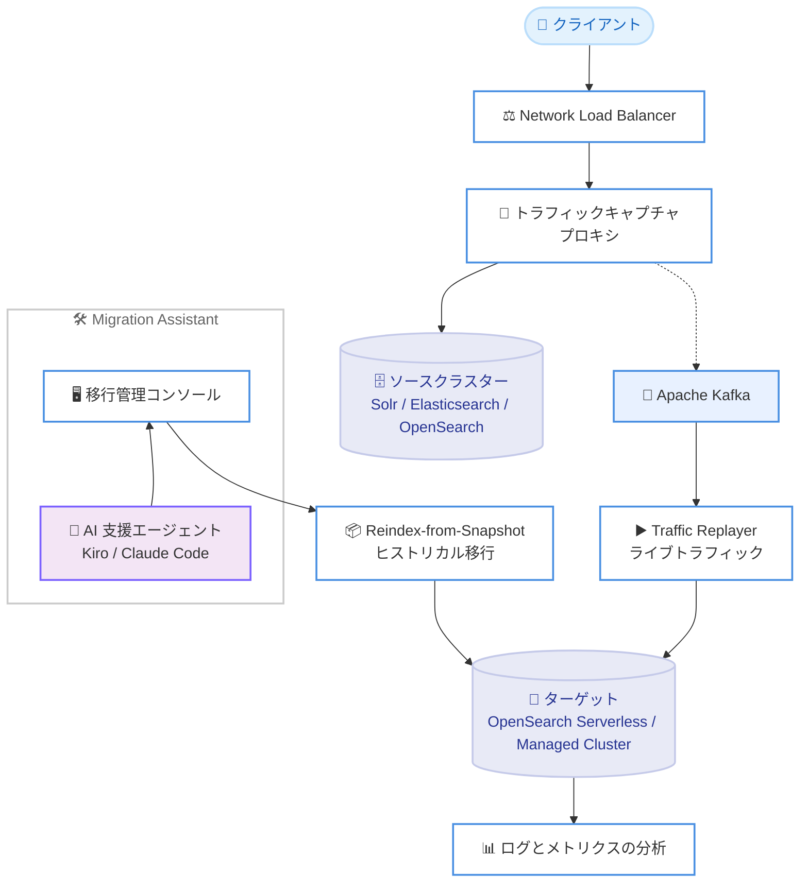

# Amazon OpenSearch Service - AI 支援による移行

**リリース日**: 2026 年 6 月 23 日
**サービス**: Amazon OpenSearch Service
**機能**: Migration Assistant の AI 支援移行エクスペリエンス

📊 [このアップデートのインフォグラフィックを見る](https://takech9203.github.io/aws-news-summary/20260623-amazon-opensearch-service-ai-migrations.html)
<!-- INFOGRAPHIC_BASE_URL は環境変数から取得 -->

## 概要

Amazon OpenSearch Service の Migration Assistant に、AI 支援による新しい移行エクスペリエンスが追加されました。この機能により、セルフマネージドの Apache Solr、Elasticsearch、OpenSearch デプロイメントを OpenSearch Serverless またはマネージドクラスターへ移行する作業が大幅に簡素化されます。

新しいアシスタントでは、Kiro や Claude Code などお客様が好む AI ツールを使用して、移行計画の立案、必要なインフラストラクチャのデプロイ、ヒストリカルデータおよびライブトラフィックの移行の実行を行うことができます。AI エージェントは対話型のコマンドラインセッションを通じて動作し、お客様が移行の目的を記述すると、エージェントが手順を提案して実行します。重要な段階では承認ゲートで一時停止し、お客様のレビューを待ちます。

Migration Assistant は、セルフマネージドクラスターから既存データおよびライブデータを移行する作業を簡素化するため、2023 年 12 月に提供が開始されました。今回の AI 支援エクスペリエンスは、エージェント主導のワークフローを提供し、データ移行の構造化、実行、検証をより迅速かつ確実に支援します。あわせて、Solr に対するライブトラフィックのキャプチャとリプレイもサポートされました。

**アップデート前の課題**

- 検索基盤の移行には、データ移動を開始する前に数週間の計画が必要であり、手作業による負担が大きかった
- 移行手順の構造化や検証を手動で行う必要があり、ミスや手戻りが発生しやすかった
- Solr についてはライブトラフィックのキャプチャとリプレイがサポートされておらず、本番相当の負荷で移行後の挙動を検証しにくかった

**アップデート後の改善**

- Kiro や Claude Code などの AI ツールを使い、エージェント主導のワークフローで移行計画からインフラデプロイ、移行実行までを一貫して進められるようになった
- 移行の構造化、実行、検証がより迅速かつ確実になり、承認ゲートによってリスクを抑えながら進行できるようになった
- Solr でもライブトラフィックのキャプチャとリプレイが利用可能になり、ソースとターゲットの挙動比較が可能になった

## アーキテクチャ図



クライアントトラフィックを Network Load Balancer 経由でキャプチャプロキシに通し、ソースクラスターへ中継しながら Apache Kafka へ複製します。スナップショットからのヒストリカル移行 (RFS) とライブトラフィックのリプレイの両方を AI 支援エージェントが主導し、ターゲットクラスターへ移行する流れを示しています。

## サービスアップデートの詳細

### 主要機能

1. **AI 支援移行エクスペリエンス**
   - Kiro、Claude Code などお客様が好む AI ツールを利用できる
   - エージェント主導のワークフローで、移行の評価、デプロイ、実行を案内する
   - 対話型のコマンドラインセッションで移行の目的を記述すると、エージェントが手順を提案して実行する
   - 承認ゲートで一時停止し、お客様のレビューを待ってから次の手順に進む

2. **ヒストリカル移行とライブトラフィック移行**
   - Reindex-from-Snapshot (RFS) によりスナップショットから既存データを移行する
   - Traffic Replayer によりライブトラフィックをソースとターゲットの間で同期する
   - キャプチャとリプレイにより、本番相当のワークロードで移行後の挙動を比較できる

3. **Solr のライブトラフィックキャプチャとリプレイのサポート**
   - これまで Elasticsearch / OpenSearch が対象だったライブトラフィックのキャプチャとリプレイが Solr でも利用可能になった
   - ソースとターゲットの応答比較により、移行前に潜在的な問題を早期に特定できる

4. **2 つの実行モードの選択**
   - 一度のインストールで、手動の Workflow CLI と AI 支援移行モードの両方を利用できる
   - Workflow CLI は、ワークフロー構成、パイロット実行、承認ゲート、検証、カットオーバーを直接制御する
   - AI 支援モードは、同じインストール済みツールを使って構成生成、ワークフロー実行、進捗監視、トラブルシューティングを行う

## 技術仕様

### 移行ワークフローの構成要素

| 項目 | 詳細 |
|------|------|
| 対応ソース | セルフマネージドの Apache Solr、Elasticsearch、OpenSearch |
| 移行先 | OpenSearch Serverless、Amazon OpenSearch Service マネージドクラスター |
| ヒストリカル移行 | Reindex-from-Snapshot (RFS) によるスナップショットからのバックフィル |
| ライブトラフィック | トラフィックキャプチャプロキシ、Apache Kafka、Traffic Replayer |
| 実行モード | Workflow CLI (手動)、AI 支援移行モード |
| 想定デプロイ時間 | 15 - 60 分 |
| デプロイ手段 | AWS CloudFormation テンプレート |

### API 変更履歴

今回のアップデートは AWS Solution (CloudFormation ベース) として提供される Migration Assistant の機能拡張であり、Amazon OpenSearch Service の公開 API に対する直接的な変更は確認されていません。

### インストール

```bash
curl -fsSL https://solutions-reference.s3.amazonaws.com/migration-assistant-for-amazon-opensearch-service/latest/install.sh | bash
```

ローカルのターミナルまたは AWS CloudShell からこのコマンドを実行すると、Migration Assistant がインストールされ、セットアップフローが開始されます。同じインストーラーで Workflow CLI と AI 支援移行モードの両方が利用可能になります。

## 設定方法

### 前提条件

1. 移行元のセルフマネージド Solr / Elasticsearch / OpenSearch クラスターにアクセスできること
2. 移行先となる Amazon OpenSearch Service マネージドクラスターまたは OpenSearch Serverless が利用できること
3. AWS CLI が構成済みの環境 (ローカルターミナルまたは AWS CloudShell)
4. AI 支援モードを利用する場合は、Kiro や Claude Code などの対応 AI ツール

### 手順

#### ステップ 1: Migration Assistant のインストール

```bash
curl -fsSL https://solutions-reference.s3.amazonaws.com/migration-assistant-for-amazon-opensearch-service/latest/install.sh | bash
```

インストールスクリプトを実行し、Migration Assistant をデプロイします。セットアップフローに従って移行に必要なインフラストラクチャを準備します。

#### ステップ 2: 移行モードの選択

直接制御を行う場合は Workflow CLI を、エージェント主導で進める場合は AI 支援移行モードを選択します。AI 支援モードでは、対話型セッションで移行の目的を記述すると、エージェントが構成生成とワークフロー実行を提案します。

#### ステップ 3: ヒストリカル移行とライブトラフィック移行の実行

トラフィックキャプチャを有効にした状態で Reindex-from-Snapshot を実行して既存データをバックフィルします。バックフィル完了後、Traffic Replayer でキャプチャしたトラフィックをリプレイし、ソースとターゲットのログとメトリクスを比較して挙動を検証します。

#### ステップ 4: カットオーバー

ターゲットクラスターの動作が期待どおりであることを確認した後、クライアントを新しいターゲットへ切り替えます。その後、不要になった旧クラスターのインフラストラクチャを廃棄できます。移行はリスクなく一時停止または中止できます。

## メリット

### ビジネス面

- **移行期間の短縮**: 従来は数週間の計画を要した移行を、エージェント主導のワークフローで迅速に進められる
- **リスクの低減**: 承認ゲート、中止機能、ソースクラスター保護、比較ツールにより、本番トラフィックに影響を与えずに移行できる
- **専門知識への依存軽減**: AI ツールが手順を提案・実行するため、移行に関する専門知識の負担を軽減できる

### 技術面

- **既存データとライブデータの両対応**: RFS によるヒストリカル移行と Traffic Replayer によるライブトラフィック移行を組み合わせられる
- **挙動比較による品質確保**: ソースとターゲットの応答を記録して比較し、移行前に潜在的な問題を特定できる
- **マルチホップ移行**: 複数バージョンをまたぐ移行に対応し、移行回数を削減できる

## デメリット・制約事項

### 制限事項

- 対応するソースバージョンには制限があり、詳細は公式ドキュメントを参照する必要がある
- AI 支援モードの利用には、Kiro や Claude Code などの対応 AI ツールが別途必要となる
- AWS Solution (CloudFormation ベース) としてデプロイされるため、関連リソースの運用コストが発生する

### 考慮すべき点

- ライブトラフィックのキャプチャとリプレイには、Network Load Balancer、キャプチャプロキシ、Apache Kafka などの追加コンポーネントが必要となる
- 本番カットオーバー前に、ログとメトリクスを用いた性能・挙動の比較検証を十分に行うことが推奨される

## ユースケース

### ユースケース 1: セルフマネージド Elasticsearch からのマネージド移行

**シナリオ**: 自社で運用しているセルフマネージドの Elasticsearch クラスターを、運用負荷を削減するため Amazon OpenSearch Service のマネージドクラスターへ移行したい。

**実装例**:
```
1. Migration Assistant をインストール
2. AI 支援モードで移行目的を記述
3. RFS でヒストリカルデータをバックフィル
4. Traffic Replayer でライブトラフィックを検証してカットオーバー
```

**効果**: 計画から実行までの期間を短縮し、運用負荷の高いセルフマネージド基盤からマネージドサービスへ安全に移行できる。

### ユースケース 2: Apache Solr からの移行と挙動検証

**シナリオ**: レガシーな Apache Solr の検索基盤を OpenSearch Serverless へ移行し、移行後の検索挙動が変わらないことを事前に確認したい。

**実装例**:
```
1. トラフィックキャプチャプロキシを配置
2. ライブトラフィックを Apache Kafka へ複製
3. Traffic Replayer でソースとターゲットの応答を比較
4. 問題がないことを確認後に切り替え
```

**効果**: Solr で新たにサポートされたキャプチャとリプレイにより、本番相当のトラフィックで挙動を検証してから安全に移行できる。

### ユースケース 3: AI ツールを活用した移行作業の効率化

**シナリオ**: 検索基盤の移行経験が少ないチームが、Claude Code を使って移行作業を進めたい。

**実装例**:
```
1. AI 支援モードを起動
2. 対話型セッションで移行ゴールを記述
3. エージェントが構成生成・ワークフロー実行を提案
4. 承認ゲートでレビューしながら段階的に承認
```

**効果**: エージェントが手順を案内・実行することで、専門知識の不足を補いながら確実に移行を進められる。

## 料金

Migration Assistant for Amazon OpenSearch Service は AWS Solution として無償で提供されますが、デプロイされる AWS リソース (Network Load Balancer、Apache Kafka、コンピューティングリソースなど) および移行先の Amazon OpenSearch Service / OpenSearch Serverless の利用料金が発生します。詳細は公式の料金ページおよびソリューションのコスト情報を参照してください。

## 利用可能リージョン

Amazon OpenSearch Service が利用可能なすべての商用 AWS リージョンおよび AWS GovCloud (US) リージョンで利用できます。

## 関連サービス・機能

- **Amazon OpenSearch Service**: 移行先となるマネージド検索・分析サービス
- **Amazon OpenSearch Serverless**: キャパシティ管理が不要なサーバーレスの移行先オプション
- **Kiro / Claude Code**: AI 支援移行モードで利用できる AI ツール
- **AWS CloudFormation**: Migration Assistant のデプロイに使用されるテンプレート基盤

## 参考リンク

- 📊 [インフォグラフィック](https://takech9203.github.io/aws-news-summary/20260623-amazon-opensearch-service-ai-migrations.html)
- [公式発表 (What's New)](https://aws.amazon.com/about-aws/whats-new/2026/06/amazon-opensearch-service-ai-migrations)
- [ドキュメント (Migration Assistant for Amazon OpenSearch Service)](https://docs.aws.amazon.com/solutions/migration-assistant-for-amazon-opensearch-service/)
- [AI 支援移行ガイド](https://docs.aws.amazon.com/solutions/latest/migration-assistant-for-amazon-opensearch-service/agent-assisted-migration.html)

## まとめ

今回のアップデートにより、検索基盤の移行は AI ツールを活用したエージェント主導のワークフローで、より迅速かつ確実に実行できるようになりました。特に Solr のライブトラフィックキャプチャとリプレイのサポートは、移行前の挙動検証を強化します。セルフマネージドの Solr / Elasticsearch / OpenSearch から OpenSearch Service への移行を検討している場合は、Workflow CLI と AI 支援モードの両方を活用して、リスクを抑えた移行計画を立てることが推奨されます。
