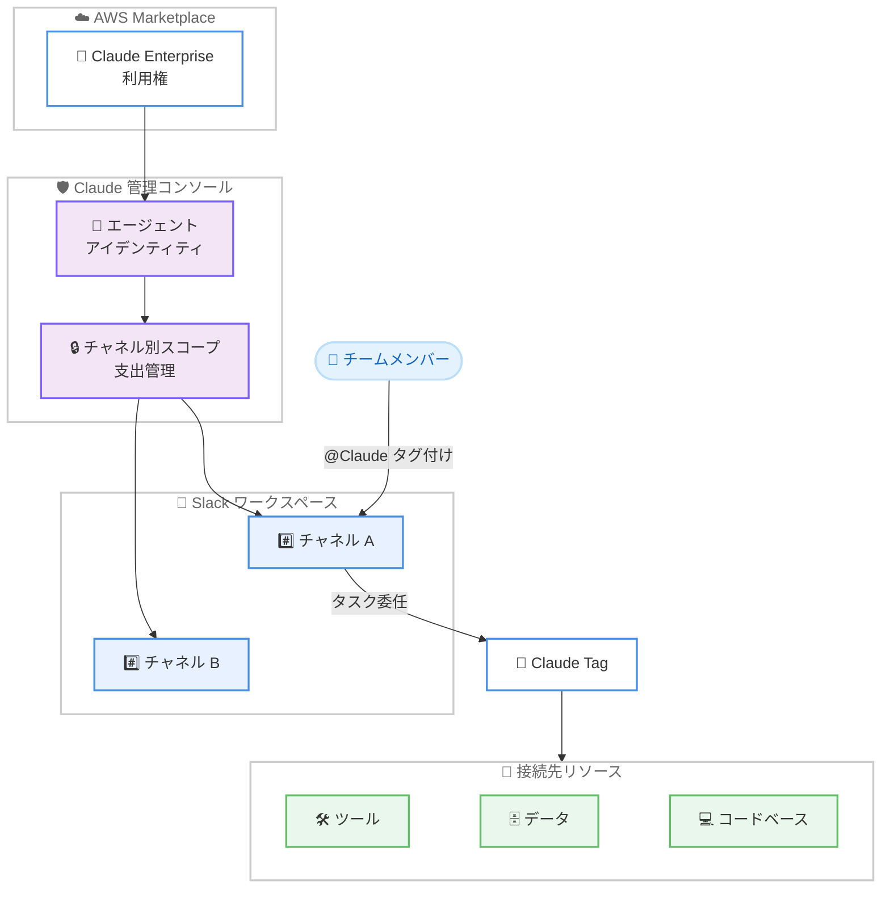

# Claude Enterprise - Claude Tag (ベータ版)

**リリース日**: 2026年6月23日
**サービス**: AWS Marketplace (Anthropic Claude Enterprise)
**機能**: Claude Tag (ベータ版)

📊 [このアップデートのインフォグラフィックを見る](https://takech9203.github.io/aws-news-summary/20260623-claude-tag-aws-marketplace.html)
<!-- INFOGRAPHIC_BASE_URL は環境変数から取得 -->

## 概要

Anthropic は、チームが普段利用しているコミュニケーションチャネルに Claude を直接組み込む新機能「Claude Tag」をベータ版として発表しました。第一弾として Slack に対応しており、AWS Marketplace を通じて Claude Enterprise を利用している AWS のお客様は、本日からベータ版を利用できます。

Claude Tag は、チームが Claude と協働するための新しい方法を提供します。選択したチャネルへのアクセスを Claude に付与し、任意のツール、データ、コードベースに接続できます。マルチプレイヤー対応であるため、チャネル内の誰もが @Claude をタグ付けしてタスクを委任でき、その間ユーザーは別の作業に集中できます。Claude は所属するチャネルから関連情報を記憶してコンテキストを構築し、将来実行するタスクを計画することも可能です。

セキュリティおよびガバナンスの観点では、Claude Tag は独自のアイデンティティで動作し、チャネルごとにスコープが設定されます。支出管理機能を備え、アンビエントモードはデフォルトでオフになっています。AWS Marketplace 経由の Claude Enterprise のお客様の利用体験は、ファーストパーティの Claude Enterprise と同一です。セットアップ、機能、コントロールがすべて同じであり、既存の Claude Enterprise on AWS の利用権を使用します。

**アップデート前の課題**

- 以前はチームメンバーが Claude を利用する際、専用のインターフェースやアプリケーションに移動する必要があり、普段の作業チャネルから離れる必要があった
- 以前は Claude にタスクを委任しても、チャネルのコンテキストや過去のやり取りを自動的に引き継ぐことが難しかった
- 以前はセキュリティチームにとって、AI エージェントの権限範囲や支出をチャネル単位で細かく制御する仕組みが整っていなかった

**アップデート後の改善**

- 今回のアップデートにより、Slack 上で @Claude をタグ付けするだけでチームのワークフロー内から直接 Claude にタスクを委任できるようになった
- 今回のアップデートにより、Claude がチャネルから関連情報を記憶してコンテキストを構築し、将来のタスクを計画できるようになった
- 今回のアップデートにより、チャネルごとにスコープされた独自アイデンティティ、支出管理、組織全体の予算可視化が可能になった

## アーキテクチャ図



AWS Marketplace の Claude Enterprise 利用権をもとに、管理者が Claude 管理コンソールでエージェントアイデンティティをプロビジョニングし、チャネルごとにスコープを設定します。チームメンバーは Slack 上で @Claude をタグ付けしてタスクを委任します。

## サービスアップデートの詳細

### 主要機能

1. **Slack へのネイティブ統合**
   - チームが普段利用している Slack チャネルに Claude を直接組み込む
   - 選択したチャネルへのアクセスを Claude に付与できる
   - 第一弾として Slack に対応 (今後他のチャネルへの拡大が想定される)

2. **マルチプレイヤーによるタスク委任**
   - チャネル内の誰もが @Claude をタグ付けできる
   - Claude にタスクを委任し、ユーザーは別の作業に集中できる
   - 複数のメンバーが同じ Claude エージェントと協働できる

3. **コンテキスト構築とタスク計画**
   - 所属するチャネルから関連情報を記憶してコンテキストを構築する
   - 将来実行するタスクを計画できる
   - 任意のツール、データ、コードベースに接続できる

4. **セキュリティとガバナンス**
   - Claude は独自のアイデンティティで動作する
   - チャネルごとにスコープが設定される
   - 支出管理機能を備え、アンビエントモードはデフォルトでオフ

5. **AWS Marketplace との完全な機能パリティ**
   - ファーストパーティの Claude Enterprise と同一のセットアップ、機能、コントロール
   - 既存の Claude Enterprise on AWS の利用権を使用する

## 技術仕様

### Claude Tag の主要特性

| 項目 | 詳細 |
|------|------|
| 提供形態 | ベータ版 |
| 対応チャネル | Slack (第一弾) |
| 動作モデル | マルチプレイヤー (@Claude タグ付け) |
| アイデンティティ | エージェント独自のアイデンティティ、チャネル別スコープ |
| アンビエントモード | デフォルトでオフ |
| 接続先 | ツール、データ、コードベース |
| 利用権 | 既存の Claude Enterprise on AWS の利用権 |
| プロビジョニング所要時間 | 約 1 時間 |

### セキュリティとガバナンスの設定

| 項目 | 詳細 |
|------|------|
| アイデンティティ管理 | Claude Tag は独自のアイデンティティで動作 |
| スコープ単位 | チャネルごと |
| 支出管理 | 支出管理機能を提供、チャネル別の上限設定 |
| 予算可視化 | 組織全体の予算可視化が可能 |
| デフォルト設定 | アンビエントモードはデフォルトでオフ |

## 設定方法

### 前提条件

1. AWS Marketplace を通じた Claude Enterprise の利用権を保有していること
2. Claude 管理コンソールへの管理者アクセス権を持っていること
3. 統合対象となる Slack ワークスペースおよびチャネルが存在すること

### 手順

#### ステップ1: 既存の利用権の確認

AWS Marketplace で取得済みの Claude Enterprise on AWS の利用権を使用します。Claude Tag のために新たな購入は不要です。AWS Marketplace 経由のお客様の利用体験はファーストパーティの Claude Enterprise と同一です。

#### ステップ2: エージェントアイデンティティのプロビジョニング

管理者が Claude 管理コンソールでエージェントアイデンティティをプロビジョニングします。この作業には約 1 時間を要します。

#### ステップ3: チャネルごとのスコープ設定

管理者がチャネルごとにスコープを設定します。Claude は独自のアイデンティティで動作し、チャネル単位で権限と支出が制御されます。アンビエントモードはデフォルトでオフのため、必要に応じて有効化します。設定完了後、チャネルメンバーは @Claude をタグ付けしてタスクを委任できます。

## メリット

### ビジネス面

- **既存の作業環境での利用**: チームが普段利用している Slack 内で Claude を利用できるため、ツールの切り替えによる生産性低下を抑えられる
- **ヘッドカウントに依存しない料金**: 消費ベースの料金体系により、人数ではなく実際の使用量に基づいて課金される
- **予算の可視化と統制**: 組織全体の予算可視化とチャネル別の上限設定により、コストを統制できる

### 技術面

- **完全な機能パリティ**: AWS Marketplace 経由でもファーストパーティと同一のセットアップ、機能、コントロールを利用できる
- **コンテキストの自動構築**: Claude がチャネルの関連情報を記憶し、タスク計画に活用できる
- **きめ細かいガバナンス**: 独自アイデンティティとチャネル別スコープにより、セキュリティチームが権限範囲を制御できる

## デメリット・制約事項

### 制限事項

- 現時点ではベータ版での提供である
- 対応チャネルは Slack のみ (第一弾)
- 利用には AWS Marketplace を通じた既存の Claude Enterprise 利用権が必要

### 考慮すべき点

- エージェントアイデンティティのプロビジョニングに約 1 時間を要する
- アンビエントモードはデフォルトでオフのため、利用シーンに応じた設定の検討が必要
- 消費ベースの料金のため、チャネル別の上限設定や予算可視化を活用した使用量管理が望ましい

## ユースケース

### ユースケース1: 開発チームのタスク委任

**シナリオ**: 開発チームの Slack チャネルで、コードレビューや調査タスクを Claude に委任したい。

**実装例**:
```
#dev-team チャネルで
@Claude このプルリクエストの変更点をレビューして、潜在的な問題点をまとめてください
```

**効果**: チャネル内の誰もが Claude にタスクを委任でき、メンバーは他の作業に集中しながら結果を受け取れる。

### ユースケース2: 部門横断のナレッジ共有

**シナリオ**: サポートチームのチャネルで、過去のやり取りを踏まえた問い合わせ対応の下書きを作成したい。

**実装例**:
```
#support チャネルで
@Claude このお客様の過去のやり取りを踏まえて、返信の下書きを作成してください
```

**効果**: Claude がチャネルから関連情報を記憶してコンテキストを構築するため、文脈に沿った対応が可能になる。

### ユースケース3: ガバナンスを重視した AI 導入

**シナリオ**: セキュリティチームが、チャネルごとに権限と支出を厳格に制御しながら AI エージェントを導入したい。

**実装例**:
```
Claude 管理コンソールで
- エージェントアイデンティティをプロビジョニング
- チャネルごとにスコープを設定
- チャネル別の支出上限を設定し、アンビエントモードはオフのまま運用
```

**効果**: 独自アイデンティティとチャネル別スコープにより、組織全体の予算を可視化しつつ統制された形で AI を展開できる。

## 料金

Claude Tag は消費ベースの料金体系を採用しており、ヘッドカウント (人数) ではなく実際の使用量に基づいて課金されます。組織全体の予算可視化と、チャネル別の上限設定が可能です。お客様は既存の Claude Enterprise on AWS の利用権を使用します。

具体的な料金については、AWS Marketplace の Claude Enterprise の出品ページおよび Anthropic の公式情報を確認してください。

## 利用可能リージョン

AWS Marketplace を通じて Claude Enterprise を利用している AWS のお客様が対象です。詳細な提供範囲については、AWS Marketplace の出品ページを確認してください。

## 関連サービス・機能

- **AWS Marketplace**: Claude Enterprise の利用権を取得・管理する基盤。Claude Tag は既存の利用権を使用する
- **Claude Enterprise**: Claude Tag の基盤となるエンタープライズ向け製品。AWS Marketplace 経由でもファーストパーティと同一の機能を提供する
- **Slack**: Claude Tag が第一弾として統合するコミュニケーションチャネル

## 参考リンク

- 📊 [インフォグラフィック](https://takech9203.github.io/aws-news-summary/20260623-claude-tag-aws-marketplace.html)
- [公式発表 (What's New)](https://aws.amazon.com/about-aws/whats-new/2026/06/claude-tag-aws-marketplace/)
- [AWS Marketplace](https://aws.amazon.com/marketplace/)

## まとめ

Claude Tag は、チームが普段利用している Slack 内に Claude を直接組み込み、マルチプレイヤーでのタスク委任とコンテキスト構築を可能にする新機能です。AWS Marketplace 経由の Claude Enterprise のお客様は、既存の利用権を使ってファーストパーティと同一の体験を得られます。独自アイデンティティ、チャネル別スコープ、消費ベースの料金により、ガバナンスとコスト統制を両立できる点が大きな価値です。まずはベータ版を対象チャネルで試し、エージェントアイデンティティのプロビジョニングと支出管理の設定を検討することをお勧めします。
