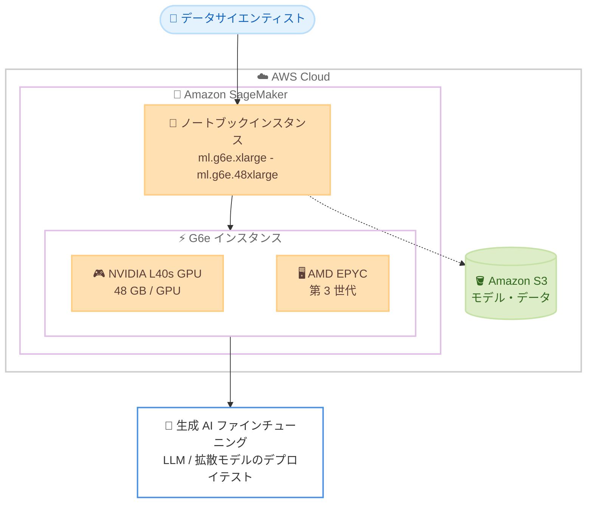

# Amazon SageMaker - ノートブックインスタンスでの G6e インスタンスタイプサポート

**リリース日**: 2026 年 6 月 23 日
**サービス**: Amazon SageMaker
**機能**: SageMaker ノートブックインスタンスでの Amazon EC2 G6e インスタンスのサポート

📊 [このアップデートのインフォグラフィックを見る](https://takech9203.github.io/aws-news-summary/20260623-g6e-new-launch-sagemaker-notebook-instances.html)
<!-- INFOGRAPHIC_BASE_URL は環境変数から取得 -->

## 概要

Amazon SageMaker は、ノートブックインスタンスで Amazon EC2 G6e インスタンスの一般提供 (GA) を開始しました。G6e インスタンスは最大 8 基の NVIDIA L40s Tensor Core GPU を搭載し、各 GPU は 48 GB のメモリを備えています。プロセッサには第 3 世代 AMD EPYC を採用しています。

G6e インスタンスは、EC2 G5 インスタンスと比較して最大 2.5 倍のパフォーマンスを提供します。これにより、SageMaker ノートブックインスタンス上で、モデルデプロイのインタラクティブなテストや、生成 AI のファインチューニングといったインタラクティブなモデルトレーニングを、より高速かつ効率的に実行できます。最大 13B パラメータの大規模言語モデル (LLM) や、画像、動画、音声を生成する拡散モデルのデプロイにも対応します。

このアップデートは、データサイエンティストや機械学習エンジニアが、生成 AI モデルの開発、検証、ファインチューニングを単一のノートブック環境で完結させたい場合に特に有用です。

**アップデート前の課題**

このアップデート以前、SageMaker ノートブックインスタンスで利用できる GPU インスタンスには以下のような制約がありました。

- 大規模な LLM や拡散モデルのインタラクティブなテストに十分な GPU メモリを確保しにくかった
- G5 世代の GPU では、生成 AI のファインチューニングなど負荷の高いワークロードでパフォーマンスが不足する場合があった
- 検証目的でより高性能な GPU を使う場合、ノートブック以外の環境を別途用意する必要があった

**アップデート後の改善**

今回のアップデートにより、以下が可能になりました。

- 各 GPU あたり 48 GB のメモリを備えた NVIDIA L40s GPU を、SageMaker ノートブックインスタンス上で直接利用できるようになった
- G5 インスタンス比で最大 2.5 倍のパフォーマンスにより、生成 AI のファインチューニングや拡散モデルの検証が高速化された
- 最大 13B パラメータの LLM や拡散モデルを、ノートブック環境でインタラクティブにデプロイ・テストできるようになった

## アーキテクチャ図



SageMaker ノートブックインスタンス上で G6e インスタンスを選択し、NVIDIA L40s GPU を用いて生成 AI のファインチューニングやモデルデプロイのインタラクティブなテストを実行する構成を示しています。

## サービスアップデートの詳細

### 主要機能

1. **NVIDIA L40s Tensor Core GPU の搭載**
   - 最大 8 基の NVIDIA L40s Tensor Core GPU を利用可能
   - 各 GPU は 48 GB のメモリを搭載
   - 大規模なモデルや高解像度の拡散モデルワークロードに対応

2. **第 3 世代 AMD EPYC プロセッサ**
   - GPU と組み合わせて高いスループットを実現
   - データ前処理や推論パイプラインの CPU 処理にも対応

3. **G5 比で最大 2.5 倍のパフォーマンス**
   - EC2 G5 インスタンスと比較して最大 2.5 倍のパフォーマンスを提供
   - 生成 AI のファインチューニングや拡散モデルの実行を高速化

4. **生成 AI ワークロードへの最適化**
   - 最大 13B パラメータの LLM のデプロイに対応
   - 画像、動画、音声を生成する拡散モデルの実行に対応
   - インタラクティブなモデルトレーニングおよびデプロイテストに利用可能

## 技術仕様

### G6e インスタンスの主な仕様

| 項目 | 詳細 |
|------|------|
| GPU | NVIDIA L40s Tensor Core GPU (最大 8 基) |
| GPU メモリ | 48 GB / GPU |
| プロセッサ | 第 3 世代 AMD EPYC |
| パフォーマンス | EC2 G5 比で最大 2.5 倍 |
| 対応インスタンスサイズ | ml.g6e.xlarge から ml.g6e.48xlarge |
| 主な用途 | 生成 AI ファインチューニング、LLM / 拡散モデルのデプロイテスト |

### API変更履歴

| 日付 | サービス | 変更内容 |
|------|----------|----------|
| 2026/06/10 | [api.sagemaker](https://awsapichanges.com/archive/changes/0ffcb2-api.sagemaker.html) | 4 updated methods - SageMaker ノートブックインスタンスでの G6e インスタンス (ml.g6e.xlarge から ml.g6e.48xlarge) のサポートを追加 |

## 設定方法

### 前提条件

1. SageMaker を利用可能な AWS アカウントと適切な IAM 権限
2. G6e インスタンスがサポートされているリージョンの利用
3. 必要に応じた GPU インスタンスのサービスクォータの引き上げ申請

### 手順

#### ステップ1: ノートブックインスタンスの作成

SageMaker コンソールまたは AWS CLI からノートブックインスタンスを作成し、インスタンスタイプとして G6e (例: `ml.g6e.xlarge`) を選択します。

```bash
aws sagemaker create-notebook-instance \
  --notebook-instance-name my-g6e-notebook \
  --instance-type ml.g6e.xlarge \
  --role-arn arn:aws:iam::123456789012:role/SageMakerExecutionRole
```

このコマンドは、G6e インスタンスタイプを指定して SageMaker ノートブックインスタンスを新規作成します。`--role-arn` には SageMaker が利用する実行ロールを指定します。

#### ステップ2: ノートブックインスタンスの起動と接続

```bash
aws sagemaker describe-notebook-instance \
  --notebook-instance-name my-g6e-notebook
```

このコマンドは、作成したノートブックインスタンスのステータスを確認します。ステータスが `InService` になったら、JupyterLab または Code Editor を開いて作業を開始できます。

#### ステップ3: 生成 AI ワークロードの実行

JupyterLab 上で LLM のファインチューニングや拡散モデルの推論を実行します。NVIDIA L40s GPU のメモリ (48 GB / GPU) を活用し、最大 13B パラメータのモデルをインタラクティブにテストできます。

## メリット

### ビジネス面

- **開発の高速化**: G5 比で最大 2.5 倍のパフォーマンスにより、生成 AI モデルの検証サイクルを短縮できます
- **環境の統合**: ノートブック環境で高性能 GPU を直接利用でき、別環境を用意する手間とコストを削減できます
- **生成 AI への対応**: LLM や拡散モデルのプロトタイピングを単一環境で完結させ、市場投入までの時間を短縮できます

### 技術面

- **大容量 GPU メモリ**: 各 GPU あたり 48 GB のメモリにより、大規模モデルや高解像度ワークロードに対応できます
- **柔軟なスケーリング**: ml.g6e.xlarge から ml.g6e.48xlarge まで、ワークロードに応じてインスタンスサイズを選択できます
- **最新 GPU の活用**: NVIDIA L40s Tensor Core GPU により、トレーニングと推論の両方を効率化できます

## デメリット・制約事項

### 制限事項

- 利用可能なリージョンが限定されています (利用可能リージョンセクションを参照)
- GPU インスタンスはサービスクォータの引き上げ申請が必要になる場合があります
- 最大 13B パラメータの LLM が推奨対象であり、より大規模なモデルには別の構成が必要になる場合があります

### 考慮すべき点

- GPU インスタンスは高コストになりやすいため、不要時はノートブックインスタンスを停止することが推奨されます
- 大規模な本番トレーニングや推論には、SageMaker トレーニングジョブや推論エンドポイントなど、用途に応じた構成の検討が推奨されます

## ユースケース

### ユースケース1: 生成 AI モデルのファインチューニング

**シナリオ**: 自社データを用いて LLM をファインチューニングし、ドメイン固有のタスクに対応させたい。

**実装例**:
```
ml.g6e.12xlarge ノートブックインスタンスで
13B パラメータ規模の LLM を読み込み、
PEFT / LoRA などの手法でインタラクティブにファインチューニングを検証
```

**効果**: 高性能 GPU を活用し、ファインチューニングのパラメータ調整を短いサイクルで反復できます。

### ユースケース2: 拡散モデルによるコンテンツ生成の検証

**シナリオ**: 画像や動画を生成する拡散モデルの出力品質を、対話的に確認しながら調整したい。

**実装例**:
```
ml.g6e.xlarge ノートブックインスタンスで拡散モデルをロードし、
プロンプトやパラメータを変えながら画像生成結果を即座に確認
```

**効果**: 48 GB の GPU メモリを活用して高解像度の生成を行い、検証作業を効率化できます。

### ユースケース3: モデルデプロイのインタラクティブなテスト

**シナリオ**: 本番環境にデプロイする前に、モデルの推論挙動とレイテンシーを確認したい。

**実装例**:
```
ノートブックインスタンス上でモデルをロードし、
サンプル入力に対する推論結果とパフォーマンスを確認
```

**効果**: 本番デプロイ前にモデルの動作を検証し、想定外の問題を早期に発見できます。

## 料金

G6e インスタンスの利用には、SageMaker ノートブックインスタンスの料金が適用されます。料金はインスタンスサイズ (ml.g6e.xlarge から ml.g6e.48xlarge) およびリージョンによって異なります。最新かつ正確な料金は、公式の Amazon SageMaker 料金ページを参照してください。

## 利用可能リージョン

このアップデートは、以下のリージョンの SageMaker ノートブックインスタンスで利用可能です。

- 米国東部 (バージニア北部、オハイオ)
- 米国西部 (オレゴン)
- アジアパシフィック (東京)
- 中東 (ドバイ)
- 欧州 (フランクフルト、スウェーデン、スペイン)

## 関連サービス・機能

- **Amazon EC2 G6e インスタンス**: 本アップデートで利用可能になった GPU インスタンスファミリーの基盤
- **Amazon SageMaker Studio / JupyterLab / Code Editor**: G6e インスタンス上で開発環境を提供
- **Amazon S3**: モデルアーティファクトやトレーニングデータの保存先として利用

## 参考リンク

- 📊 [インフォグラフィック](https://takech9203.github.io/aws-news-summary/20260623-g6e-new-launch-sagemaker-notebook-instances.html)
- [公式発表 (What's New)](https://aws.amazon.com/about-aws/whats-new/2026/03/g6e-new-launch-sagemaker-notebook-instances/)
- [API 変更履歴 (awsapichanges.com)](https://awsapichanges.com/archive/changes/0ffcb2-api.sagemaker.html)
- [Amazon SageMaker ドキュメント](https://docs.aws.amazon.com/sagemaker/)
- [Amazon SageMaker 料金ページ](https://aws.amazon.com/sagemaker/pricing/)

## まとめ

SageMaker ノートブックインスタンスでの G6e インスタンスのサポートにより、データサイエンティストは NVIDIA L40s GPU を活用して、生成 AI のファインチューニングや LLM・拡散モデルのインタラクティブなテストを高速に実行できるようになりました。生成 AI のプロトタイピングを進めているチームは、対応リージョンでインスタンスサイズとサービスクォータを確認し、既存のノートブックワークフローへの導入を検討することが推奨されます。
