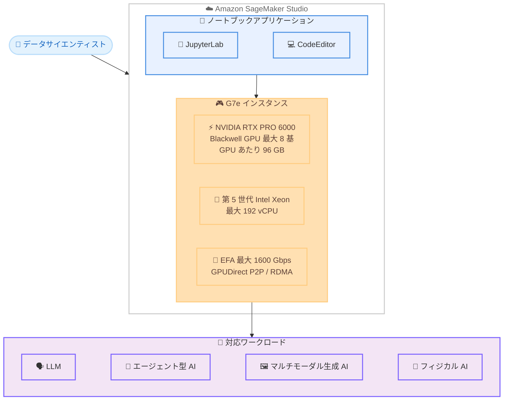

# Amazon SageMaker Studio ノートブック - G7e インスタンスタイプのサポート

**リリース日**: 2026 年 6 月 23 日
**サービス**: Amazon SageMaker Studio
**機能**: SageMaker Studio ノートブックでの G7e インスタンスタイプのサポート

📊 [このアップデートのインフォグラフィックを見る](https://takech9203.github.io/aws-news-summary/20260623-g7e-new-launch-sagemaker-studio-notebooks.html)

## 概要

Amazon SageMaker Studio のノートブックが、Amazon G7e インスタンスタイプをサポートするようになりました。これにより、SageMaker Studio 上で生成 AI やグラフィックスワークロードを開発・実験する際に、最新世代の NVIDIA GPU を直接利用できるようになります。

G7e インスタンスは、最大 8 基の NVIDIA RTX PRO 6000 Blackwell Server Edition GPU を搭載し、GPU あたり 96 GB のメモリを備えています。さらに第 5 世代 Intel Xeon プロセッサにより最大 192 個の仮想 CPU (vCPU) と、最大 1600 Gbps の Elastic Fabric Adapter (EFA) ネットワーク帯域幅を提供します。これらのスペックにより、大規模言語モデル (LLM)、エージェント型 AI モデル、マルチモーダル生成 AI モデル、フィジカル AI モデルといった要求の高いワークロードを、ノートブック環境内で直接デプロイおよび実験できます。

これまで開発者は、こうした GPU 集約型のワークロードを SageMaker Studio で扱う際にインスタンスの選択肢が限られていましたが、今回のアップデートにより、最新の Blackwell アーキテクチャ GPU をインタラクティブな開発環境でそのまま活用できるようになりました。本機能は米国東部 (バージニア北部、オハイオ) および米国西部 (オレゴン) の各リージョンで利用可能です。

**アップデート前の課題**

- SageMaker Studio ノートブックで最新世代の Blackwell アーキテクチャ GPU を備えた G7e を選択できなかった
- 大規模言語モデルやマルチモーダルモデルをノートブック上で直接実験する際に、GPU メモリの制約があった
- マルチ GPU ワークロードにおいて、GPU 間の高速通信を活用したインタラクティブな開発が難しかった
- フィジカル AI や空間コンピューティングのような高負荷ワークロードを扱うための GPU 選択肢が不足していた

**アップデート後の改善**

- SageMaker Studio ノートブックで最大 8 基の NVIDIA RTX PRO 6000 Blackwell Server Edition GPU を利用できるようになった
- GPU あたり 96 GB、最大 768 GB の合計 GPU メモリにより、大規模モデルをノートブック上で直接ロード・実験できるようになった
- NVIDIA GPUDirect Peer to Peer (P2P) により、マルチ GPU ワークロードのパフォーマンスが向上した
- マルチ GPU の G7e インスタンスは EC2 UltraClusters で EFAv4 を用いた NVIDIA GPUDirect RDMA をサポートし、小規模なマルチノードワークロードのレイテンシを低減できるようになった

## アーキテクチャ図



この図は、SageMaker Studio のノートブックアプリケーション (JupyterLab、CodeEditor) が G7e インスタンス上で実行され、LLM やマルチモーダル生成 AI などの GPU 集約型ワークロードを処理する構成を示しています。

## サービスアップデートの詳細

### 主要機能

1. **NVIDIA RTX PRO 6000 Blackwell GPU のサポート**
   - 最大 8 基の NVIDIA RTX PRO 6000 Blackwell Server Edition GPU を搭載
   - GPU あたり 96 GB のメモリ (最大 768 GB の合計 GPU メモリ)
   - 最新の Blackwell アーキテクチャによる高い推論・トレーニング性能

2. **高性能な CPU とネットワーク**
   - 第 5 世代 Intel Xeon プロセッサによる最大 192 vCPU
   - 最大 1600 Gbps の Elastic Fabric Adapter (EFA) ネットワーク帯域幅
   - 高スループットなデータ処理とノード間通信に対応

3. **マルチ GPU 向けの高速通信機能**
   - NVIDIA GPUDirect Peer to Peer (P2P) によるマルチ GPU ワークロードのパフォーマンス向上
   - マルチ GPU インスタンスは EC2 UltraClusters で EFAv4 を用いた NVIDIA GPUDirect RDMA をサポート
   - 小規模なマルチノードワークロードにおけるレイテンシの低減

4. **幅広い AI ワークロードへの対応**
   - 大規模言語モデル (LLM) のデプロイと実験
   - エージェント型 AI モデルおよびマルチモーダル生成 AI モデルの開発
   - フィジカル AI モデルや空間コンピューティングワークロードの実行

## 技術仕様

### G7e インスタンスの主要スペック

| 項目 | 詳細 |
|------|------|
| GPU | NVIDIA RTX PRO 6000 Blackwell Server Edition (最大 8 基) |
| GPU メモリ | GPU あたり 96 GB (最大合計 768 GB) |
| CPU | 第 5 世代 Intel Xeon プロセッサ |
| vCPU | 最大 192 |
| ネットワーク帯域幅 | 最大 1600 Gbps (Elastic Fabric Adapter) |
| GPU 間通信 | NVIDIA GPUDirect P2P、GPUDirect RDMA (EFAv4) |
| UltraClusters | マルチ GPU インスタンスで対応 |

### GPU 通信技術

| 技術 | 説明 |
|------|------|
| NVIDIA GPUDirect P2P | 同一インスタンス内の GPU 同士が CPU を介さずに直接データを交換し、マルチ GPU ワークロードのパフォーマンスを向上 |
| NVIDIA GPUDirect RDMA (EFAv4) | EC2 UltraClusters において、ノードをまたいだ GPU 間で低レイテンシな直接通信を実現し、小規模マルチノードワークロードのレイテンシを低減 |

### 対応ノートブックアプリケーション

SageMaker Studio では、JupyterLab および CodeEditor の各アプリケーションで G7e インスタンスを選択できます。詳細はそれぞれの開発者ガイドを参照してください。

## 設定方法

### 前提条件

1. AWS アカウントが作成されている
2. SageMaker Studio のドメインおよびユーザープロファイルが構成済みである
3. 適切な IAM 権限 (SageMaker Studio の利用権限) が付与されている
4. 対象リージョン (バージニア北部、オハイオ、オレゴン) で G7e インスタンスのサービスクォータが確保されている

### 手順

#### ステップ 1: サービスクォータの確認

```bash
aws service-quotas list-service-quotas \
  --service-code sagemaker \
  --query "Quotas[?contains(QuotaName, 'g7e')]"
```

このコマンドは、SageMaker で利用可能な G7e 関連のサービスクォータを一覧表示します。クォータが不足している場合は、Service Quotas コンソールから引き上げをリクエストしてください。

#### ステップ 2: SageMaker Studio でノートブックアプリケーションを起動

SageMaker Studio コンソールにアクセスし、JupyterLab または CodeEditor のスペースを作成します。スペースの設定画面でインスタンスタイプとして G7e (例: `ml.g7e.xlarge`) を選択して起動します。

#### ステップ 3: GPU の利用を確認

```bash
nvidia-smi
```

起動したノートブック内のターミナルで上記コマンドを実行し、割り当てられた NVIDIA RTX PRO 6000 Blackwell GPU が認識されていること、および GPU メモリ (GPU あたり 96 GB) を確認します。

## メリット

### ビジネス面

- **開発サイクルの短縮**: 最新の Blackwell GPU をノートブック環境で直接利用できるため、モデルの実験から検証までを高速に反復できる
- **インフラ管理の簡素化**: SageMaker Studio のマネージド環境で GPU を利用できるため、GPU クラスターの構築・運用の手間を削減できる
- **幅広い AI ユースケースへの対応**: LLM からフィジカル AI まで、多様な生成 AI ワークロードを単一の開発環境でカバーできる

### 技術面

- **大規模モデルのインタラクティブ開発**: 最大 768 GB の GPU メモリにより、大規模モデルをノートブック上で直接ロードして実験できる
- **マルチ GPU パフォーマンスの向上**: NVIDIA GPUDirect P2P により、複数 GPU を用いた処理を効率化できる
- **低レイテンシな分散処理**: EC2 UltraClusters における GPUDirect RDMA (EFAv4) により、小規模マルチノードワークロードのレイテンシを低減できる
- **高いデータスループット**: 最大 1600 Gbps の EFA 帯域幅により、大量データを扱うワークロードでもボトルネックを抑えられる

## デメリット・制約事項

### 制限事項

- 本機能は米国東部 (バージニア北部、オハイオ) および米国西部 (オレゴン) のリージョンでのみ利用可能 (東京リージョンは対象外)
- G7e インスタンスのサービスクォータがデフォルトでは低い可能性があり、事前に引き上げリクエストが必要な場合がある
- NVIDIA RTX PRO 6000 は、A100 や H100 などのデータセンター向け GPU とはアーキテクチャが異なり、ワークロードによって性能特性が異なる

### 考慮すべき点

- G7e インスタンスは高性能な分、オンデマンド料金が高額になるため、利用後はノートブックスペースをシャットダウンしてコストを抑える運用が重要
- ノートブックは主にインタラクティブな開発・実験向けであり、大規模な本番トレーニングには SageMaker HyperPod やトレーニングジョブの利用を検討する
- マルチノードの GPUDirect RDMA を活用するには EC2 UltraClusters 構成が前提となる

## ユースケース

### ユースケース 1: 大規模言語モデルのインタラクティブな実験

**シナリオ**: データサイエンティストが、数百億パラメータ規模の LLM を SageMaker Studio のノートブック上で直接ロードし、プロンプトや推論パラメータを試行錯誤しながら検証したい。

**実装例**:
```python
import torch
from transformers import AutoModelForCausalLM, AutoTokenizer

# G7e の大容量 GPU メモリを活用して大規模モデルをロード
model_name = "meta-llama/Llama-3-70B"
tokenizer = AutoTokenizer.from_pretrained(model_name)
model = AutoModelForCausalLM.from_pretrained(
    model_name,
    torch_dtype=torch.float16,
    device_map="auto"  # 複数 GPU に自動分散
)

inputs = tokenizer("生成 AI の活用方法について", return_tensors="pt").to("cuda")
outputs = model.generate(**inputs, max_new_tokens=256)
print(tokenizer.decode(outputs[0], skip_special_tokens=True))
```

**効果**: 最大 768 GB の GPU メモリにより、大規模モデルを単一ノートブックでロードでき、追加のインフラ構築なしでインタラクティブな実験を実現できる。

### ユースケース 2: マルチモーダル生成 AI モデルの開発

**シナリオ**: 画像とテキストを組み合わせたマルチモーダルモデルを開発し、複数の GPU を活用して高速にプロトタイピングしたい。

**実装例**:
```python
import torch

# 複数 GPU を活用したマルチモーダルモデルの並列処理
device_count = torch.cuda.device_count()
print(f"利用可能な GPU 数: {device_count}")

# GPUDirect P2P により GPU 間データ転送を効率化
model = MultimodalModel().to("cuda")
model = torch.nn.DataParallel(model)
```

**効果**: NVIDIA GPUDirect P2P によるマルチ GPU 間の高速通信を活用し、マルチモーダルモデルのプロトタイピングを効率化できる。

### ユースケース 3: フィジカル AI・空間コンピューティングワークロード

**シナリオ**: ロボティクスやシミュレーション向けのフィジカル AI モデルを、グラフィックス処理と AI 処理の両方を必要とするワークロードとして開発したい。

**実装例**:
```python
# Blackwell GPU のグラフィックス・AI 処理能力を活用
# シミュレーション環境とモデル推論を同一ノートブックで実行
import isaac_sim  # 物理シミュレーション (例)

simulation = isaac_sim.create_environment(gpu_enabled=True)
policy = load_policy_model().to("cuda")
```

**効果**: グラフィックス処理と AI 処理を高性能 GPU 上で統合的に実行でき、フィジカル AI や空間コンピューティングの開発に対応できる。

## 料金

SageMaker Studio ノートブックでの G7e インスタンスの利用は、使用したインスタンスタイプと稼働時間に基づいて課金されます。インスタンスを使用しない場合はスペースをシャットダウンすることで課金を停止できます。

### 料金例

| インスタンスタイプ | 用途 | 課金単位 |
|------------------|------|---------|
| ml.g7e.xlarge | GPU 開発・推論 | 時間単位 |
| ml.g7e.2xlarge | GPU 開発・推論 | 時間単位 |
| ml.g7e.4xlarge | GPU 開発・推論 | 時間単位 |
| ml.g7e.8xlarge | GPU 開発・推論 | 時間単位 |
| ml.g7e.16xlarge | GPU 開発・推論 | 時間単位 |
| ml.g7e.48xlarge | GPU 開発・推論 | 時間単位 |

料金の詳細は [Amazon SageMaker 料金ページ](https://aws.amazon.com/sagemaker/pricing/) を参照してください。

## 利用可能リージョン

本機能は以下のリージョンで利用可能です。

- **US East (N. Virginia)**: us-east-1
- **US East (Ohio)**: us-east-2
- **US West (Oregon)**: us-west-2

## 関連サービス・機能

- **Amazon EC2 G7e インスタンス**: SageMaker Studio で利用される G7e の基盤となる EC2 インスタンスタイプ。NVIDIA RTX PRO 6000 Blackwell Server Edition GPU を搭載
- **Amazon SageMaker HyperPod**: 基盤モデルのトレーニング・デプロイ向けの専用インフラストラクチャ。同じく G7e インスタンスをサポートしており、大規模な本番ワークロードに適している
- **Amazon SageMaker AI**: モデルの開発・トレーニング・デプロイを統合的に管理するプラットフォーム。Studio はそのインタラクティブな開発環境として機能
- **Amazon EC2 UltraClusters**: マルチ GPU の G7e インスタンスで GPUDirect RDMA を活用するためのインフラ構成

## 参考リンク

- 📊 [インフォグラフィック](https://takech9203.github.io/aws-news-summary/20260623-g7e-new-launch-sagemaker-studio-notebooks.html)
- [公式発表 (What's New)](https://aws.amazon.com/about-aws/whats-new/2026/02/g7e-new-launch-sagemaker-studio-notebooks/)
- [Amazon SageMaker Studio ドキュメント](https://docs.aws.amazon.com/sagemaker/latest/dg/studio-updated.html)
- [Amazon EC2 G7e インスタンス](https://aws.amazon.com/ec2/instance-types/g7e/)
- [Amazon SageMaker 料金ページ](https://aws.amazon.com/sagemaker/pricing/)

## まとめ

Amazon SageMaker Studio ノートブックが G7e インスタンスをサポートしたことで、データサイエンティストは最新の NVIDIA RTX PRO 6000 Blackwell GPU をインタラクティブな開発環境で直接利用できるようになりました。最大 768 GB の GPU メモリ、最大 1600 Gbps の EFA 帯域幅、GPUDirect P2P / RDMA といった高性能な機能により、LLM やマルチモーダル生成 AI、フィジカル AI などの要求の高いワークロードをノートブック上で効率的に開発・実験できます。現時点では米国の 3 リージョンに限定されているため、利用を検討するお客様は対象リージョンとサービスクォータを確認したうえで、コスト管理のためにスペースの適切なシャットダウン運用を行うことを推奨します。
