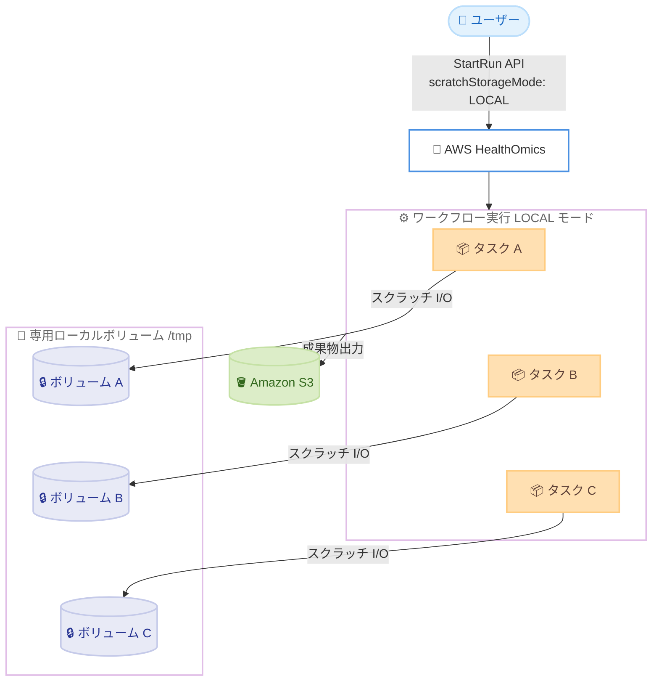

# AWS HealthOmics - プライベートワークフロー向けエフェメラルストレージ

**リリース日**: 2026 年 6 月 23 日
**サービス**: AWS HealthOmics
**機能**: プライベートワークフロー向けエフェメラルストレージ (Ephemeral Storage)

📊 [このアップデートのインフォグラフィックを見る](https://takech9203.github.io/aws-news-summary/20260623-healthomics-scratch-storage.html)
<!-- INFOGRAPHIC_BASE_URL は環境変数から取得 -->

## 概要

AWS HealthOmics は、プライベートワークフロー向けにエフェメラルストレージ (一時的なスクラッチ領域) のサポートを追加しました。これにより、バイオインフォマティクスのワークロードに対して専用のスクラッチ領域が提供され、より安定した実行パフォーマンスとコスト削減を実現します。AWS HealthOmics は HIPAA 適格なフルマネージドのバイオインフォマティクスワークフローサービスです。

各ワークフロータスクには `/tmp` にマウントされる専用のローカルボリュームが割り当てられます。これにより、ゲノム配列のアラインメント、BAM のソート、バリアントコール (variant calling) など、大量のスクラッチデータを生成するワークフローで実行時間を短縮できます。専用ボリュームを使用することで、共有ファイルシステムの I/O から分離され、他の同時実行タスクと I/O 帯域を奪い合うことがなくなります。

デフォルトでは各タスクに 16 GiB のエフェメラルストレージが追加料金なしで提供されます。WDL、Nextflow、CWL のワークフロー定義で適切なディレクティブを使用することで、1 タスクあたり最大 3,072 GiB まで増やすことができます。エフェメラルストレージは StartRun API の `scratchStorageMode` を `LOCAL` に設定することで実行時に有効化します。すべてのエフェメラルストレージボリュームは暗号化され、タスク終了時に削除されます。

**アップデート前の課題**

- スクラッチ I/O が共有ファイルシステム (run storage) に書き込まれるため、同時実行タスク間で I/O 帯域を奪い合い、実行パフォーマンスが不安定になっていた
- I/O バウンドなタスクで共有ファイルシステムのスロットリングが発生し、ゲノム配列アラインメントや BAM ソートなどの処理時間が長くなっていた
- スクラッチデータ用に多くの run storage をプロビジョニングする必要があり、コストが増加していた

**アップデート後の改善**

- 各タスクに専用のローカルボリュームが `/tmp` にマウントされ、スクラッチ I/O が共有ファイルシステムから分離された
- 専用 IOPS とスループットにより、I/O のばらつきとスロットリングが軽減され、実行パフォーマンスが安定した
- I/O バウンドなタスクの実行時間が短縮され、コンピューティング時間とコストが削減された。Static run storage を使用する場合、プロビジョニングする run storage の量も削減できる

## アーキテクチャ図



各タスクが個別の暗号化されたローカルボリュームを `/tmp` に持ち、スクラッチ I/O を共有ファイルシステムから分離する構成を示しています。各ボリュームはタスク終了時に削除されます。

## サービスアップデートの詳細

### 主要機能

1. **タスクごとの専用ローカルボリューム**
   - エフェメラルストレージを有効化すると、各ワークフロータスクインスタンスに専用のローカルストレージボリュームが `/tmp` にマウントされる
   - スクラッチ I/O に専用の IOPS とスループットが割り当てられ、他のタスクと帯域を奪い合わない
   - バイオインフォマティクスのワークフロー言語は一時ファイルに `/tmp` (および `$TMP`、`$TMPDIR` 環境変数) を使用するため、多くの場合ワークフローの変更は不要

2. **柔軟なストレージサイズ設定**
   - デフォルトで各タスクに 16 GiB を追加料金なしで提供 (Standard、Compute 最適化、Memory 最適化の全インスタンスタイプ)
   - ワークフロー定義の `disk` ディレクティブ (相当の指定) で 1 タスクあたり最大 3,072 GiB まで増設可能
   - サイズは 16 GiB 単位で切り上げられる (16、32、48、64、... 最大 3,072 GiB)

3. **実行時の有効化と無効化**
   - StartRun API の `scratchStorageMode` を `LOCAL` に設定して有効化する
   - 設定はその実行内のすべてのタスクに適用され、CPU インスタンスのみが対象
   - 障害を切り分けたい場合などは `SHARED` を指定してエフェメラルストレージを無効化できる

4. **暗号化とライフサイクル管理**
   - すべてのエフェメラルストレージはサービス管理の AWS KMS キーを使用して保存時に暗号化される
   - 高速コンピューティング (GPU) インスタンスはボリュームごとに固有のキーでハードウェア暗号化され、インスタンス終了時にキーが破棄される
   - ボリュームのアタッチとライフサイクルは HealthOmics が管理し、タスク実行ロールへの追加 IAM 権限は不要

5. **CloudWatch によるモニタリング**
   - タスクごとのエフェメラルストレージメトリクスが CloudWatch マニフェストログに書き込まれる
   - プロビジョニングされたボリュームサイズ (`scratchStorageReservedGiB`) と使用量 (`scratchStorageUtilizedGiB`) を確認できる
   - 過剰または過少プロビジョニングの判断に活用できる

## 技術仕様

### ストレージ仕様

| 項目 | 詳細 |
|------|------|
| マウントポイント | `/tmp` |
| デフォルトサイズ | 16 GiB (追加料金なし) |
| 最大サイズ (CPU) | 3,072 GiB / タスク |
| サイズ単位 | 16 GiB 単位で切り上げ |
| 暗号化 | サービス管理の AWS KMS キーによる保存時暗号化 |
| ライフサイクル | タスク終了時に常に削除 |
| 有効化方法 | StartRun API の `scratchStorageMode: LOCAL` |
| 対象インスタンス | CPU インスタンス (GPU タスクは常に LOCAL) |

### ワークフロー言語別のディレクティブ

| エンジン | ディレクティブ | 記述例 |
|----------|----------------|--------|
| WDL 1.1 | `disks` | `disks: "/tmp 700 GiB"` |
| Nextflow | `disk` | `disk '700 GB'` |
| CWL | `tmpdirMin` | `tmpdirMin: 716800` (MiB 単位) |

700 GiB を要求した場合、HealthOmics は次のティアである 704 GiB に切り上げてプロビジョニングします。

### GPU インスタンスのエフェメラルストレージ

GPU タスクは常にローカル NVMe のエフェメラルストレージを使用します。容量はインスタンスタイプごとに固定で、追加料金なしで提供されます。`scratchStorageMode` の設定は GPU タスクには適用されず、`disk` ディレクティブによるカスタマイズもできません。

| サイズ | GPU 数 | vCPU | メモリ (GiB) | G5 NVMe (A10G) | G6e NVMe (L40S) |
|--------|--------|------|--------------|----------------|------------------|
| xlarge | 1 | 4 | 16 | 250 GiB | 250 GiB |
| 2xlarge | 1 | 8 | 32 | 450 GiB | 450 GiB |
| 8xlarge | 1 | 32 | 128 | 900 GiB | 900 GiB |
| 12xlarge | 4 | 48 | 192 | 3,800 GiB | 3,800 GiB |

## 設定方法

### 前提条件

1. AWS HealthOmics のプライベートワークフローが作成済みであること
2. HealthOmics サービスロール (実行ロール) が設定済みであること
3. WDL、Nextflow、CWL のいずれかで記述されたワークフロー定義があること

### 手順

#### ステップ1: ワークフロー定義でスクラッチ I/O を `/tmp` に向ける

WDL の例 (`samtools sort` の一時ファイルを `/tmp` に書き込む)。

```bash
task sort_bam {
    runtime {
        cpu:  16
        disks: "700 GiB"
    }
    command <<<
        samtools sort -T /tmp/sort_buffer ~{input_bam} -o ~{output_bam}
    >>>
}
```

`disks` ディレクティブで 700 GiB を要求しています。HealthOmics はこれをヒントとして扱い、次の 16 GiB ティア (704 GiB) に切り上げてプロビジョニングします。`-T /tmp/sort_buffer` でツールの一時ファイルを `/tmp` に向けることが重要です。

#### ステップ2: `scratchStorageMode` を LOCAL にして実行を開始する

```bash
aws omics start-run \
    --workflow-id <workflow-id> \
    --role-arn arn:aws:iam::123456789012:role/OmicsServiceRole \
    --output-uri s3://amzn-s3-demo-bucket/output-folder/ \
    --parameters file:///path/to/parameters.json \
    --scratch-storage-mode LOCAL
```

`--scratch-storage-mode LOCAL` を指定することで、エフェメラルストレージが有効になります。この設定は実行内のすべての CPU タスクに適用されます。省略した場合は `SHARED` (デフォルト) となり、エフェメラルストレージは有効化されません。

#### ステップ3: 有効なモードを確認する

```bash
aws omics get-run --id <run-id>
```

`GetRun` の応答で `scratchStorageMode` フィールドを確認します。`scratchStorageMode` は StartRun リクエストで明示的に渡した場合のみ応答に含まれます。値が `SHARED` の場合、その実行ではエフェメラルストレージが有効化されていません。

## メリット

### ビジネス面

- **コスト削減**: I/O バウンドなタスクの実行時間が短縮され、コンピューティング時間とコストが削減される。Static run storage を使用する場合はプロビジョニング量も削減できる
- **デフォルト無料枠**: 各タスクに 16 GiB が追加料金なしで提供されるため、多くのワークロードで追加コストなしに恩恵を受けられる
- **HIPAA 適格**: フルマネージドかつ HIPAA 適格なサービス上で、機密性の高いゲノムデータを扱うワークロードを高速化できる

### 技術面

- **安定したパフォーマンス**: 専用 IOPS とスループットにより、共有ファイルシステムのスロットリングや I/O のばらつきが軽減される
- **変更不要なケースが多い**: `/tmp` に書き込むタスクは自動的にエフェメラルストレージを使用するため、多くの場合ワークフローの変更が不要
- **可観測性**: CloudWatch マニフェストログでプロビジョニング量と使用量を確認でき、適切なサイジングが可能

## デメリット・制約事項

### 制限事項

- エフェメラルストレージは永続化されない。タスク終了時に常に削除され、`/tmp` のデータをタスク出力やワークフロー出力にすることはできない (実行時に失敗する)
- タスク間で共有されない。各タスクは隔離されたボリュームを持ち、他タスクの `/tmp` にはアクセスできない
- タスク実行中にストレージサイズを変更できない。サイズはタスク開始時に固定される
- CPU タスクの最大サイズは 3,072 GiB。これを超える要求は 3,072 GiB でプロビジョニングされ、run ログに警告が記録される (タスクは失敗しない)
- `SHARED` モードでは CPU タスクのすべての `disk`、`tmpdirMin` 等のディレクティブが無視される

### 考慮すべき点

- 作業ディレクトリ (`input/`、`./`、`out/` など) にスクラッチを書き込むワークフローは自動的に恩恵を受けない。`/tmp` または `$TMPDIR` にリダイレクトするようワークフローを更新する必要がある
- 式ベースの `disk` ディレクティブ (Nextflow のクロージャや WDL の `ceil(size(...) * 2.5)` など) は実行時に評価される。評価結果が 3,072 GiB を超えるとタスクは実行時に失敗し、それまでに発生したコンピューティングコストが課金される
- `$TMPDIR` が別の場所にマッピングされていないことを確認する必要がある

## ユースケース

### ユースケース1: BAM のソートとバリアントコール

**シナリオ**: アラインメントとソートの工程で大きな BAM / CRAM ファイルを繰り返し読み書きするバリアントコールワークフロー。数百 GiB 規模のスクラッチ領域が必要。

**実装例**:
```
# WDL
runtime { cpu: 16, disks: "400 GiB" }
command <<<
    samtools sort -T /tmp/sort_buffer ~{input_bam} -o ~{sorted_bam}
    bcftools sort -T /tmp ~{vcf} -o ~{output_vcf}
>>>
```

**効果**: スクラッチ I/O が専用ローカルボリュームに向けられ、ソート処理が高速化。実行時間とコストが削減される。

### ユースケース2: RNA-Seq 融合遺伝子検出

**シナリオ**: 大きな中間 BAM を生成し、生 FASTQ とアラインメント出力を同時に保持する必要がある RNA-seq ワークフロー。大きなスクラッチディスク (例: 512 GiB / タスク) が必要。

**実装例**:
```
# Nextflow
process fusion_detect {
    disk '512 GB'
    script:
    """
    STAR --runThreadN 16 --readFilesIn reads.fastq --outTmpDir /tmp/star_tmp --outFileNamePrefix out_
    """
}
```

**効果**: 大容量の一時ファイルを高速なローカルボリュームに保持でき、共有ファイルシステムへの負荷を回避できる。

### ユースケース3: デノボゲノムアセンブリ

**シナリオ**: ロングリードアセンブリで生リードと一時的なアセンブリ成果物を繰り返し書き換える、メモリおよびディスク集約的なワークフロー。数 TiB のエフェメラルストレージが必要な場合がある。

**実装例**:
```
# CWL
requirements:
  ResourceRequirement:
    coresMin: 16
    tmpdirMin: 2097152   # 2,048 GiB を MiB で指定
```

**効果**: 大容量のスクラッチ領域を専用ボリュームで確保し、アセンブリ工程のパフォーマンスを安定させる。

## 料金

デフォルトの 16 GiB / タスクのエフェメラルストレージは追加料金なしで提供されます。デフォルトを超えてプロビジョニングしたストレージ分のみ課金されます。`disk` ディレクティブによるデフォルト超過分の要求は、サポートされる最も近いティアに切り上げられます。

GPU インスタンスのエフェメラルストレージはインスタンス料金に含まれており、追加料金は発生しません。詳細な料金は AWS HealthOmics の料金ページを参照してください。

### 料金例

| 使用量 | 課金対象 |
|--------|----------|
| 16 GiB (デフォルト) / タスク | 課金なし |
| 400 GiB / タスク | デフォルト超過分 (384 GiB) が課金対象 |
| GPU インスタンスの NVMe | 課金なし (インスタンス料金に含まれる) |

## 利用可能リージョン

本機能は以下のリージョンで利用可能です。

- 米国東部 (バージニア北部)
- 米国西部 (オレゴン)
- 欧州 (フランクフルト、アイルランド、ロンドン)
- イスラエル (テルアビブ)
- アジアパシフィック (シンガポール、ソウル)

## 関連サービス・機能

- **AWS HealthOmics プライベートワークフロー**: 本機能の対象となるワークフロー実行環境。WDL、Nextflow、CWL をサポート
- **Amazon CloudWatch Logs**: エフェメラルストレージのプロビジョニング量と使用量をマニフェストログで確認
- **AWS KMS**: エフェメラルストレージの保存時暗号化にサービス管理キーを使用
- **Amazon S3**: ワークフローの入力データと成果物の保存先

## 参考リンク

- 📊 [インフォグラフィック](https://takech9203.github.io/aws-news-summary/20260623-healthomics-scratch-storage.html)
- [公式発表 (What's New)](https://aws.amazon.com/about-aws/whats-new/2026/06/healthomics-scratch-storage/)
- [ドキュメント (Ephemeral storage for HealthOmics workflow tasks)](https://docs.aws.amazon.com/omics/latest/dev/workflows-ephemeral-storage.html)
- [AWS HealthOmics 料金ページ](https://aws.amazon.com/healthomics/pricing/)

## まとめ

AWS HealthOmics のエフェメラルストレージは、ゲノム配列アラインメントや BAM ソート、バリアントコールなど I/O 集約的なバイオインフォマティクスワークフローのパフォーマンスを安定させ、コストを削減する重要なアップデートです。デフォルトの 16 GiB は無料で、多くの場合ワークフローの変更なしに恩恵を受けられます。まずは `scratchStorageMode: LOCAL` で実行を開始し、CloudWatch マニフェストログの使用量メトリクスを確認しながら `disk` ディレクティブで適切なサイズに調整することを推奨します。
