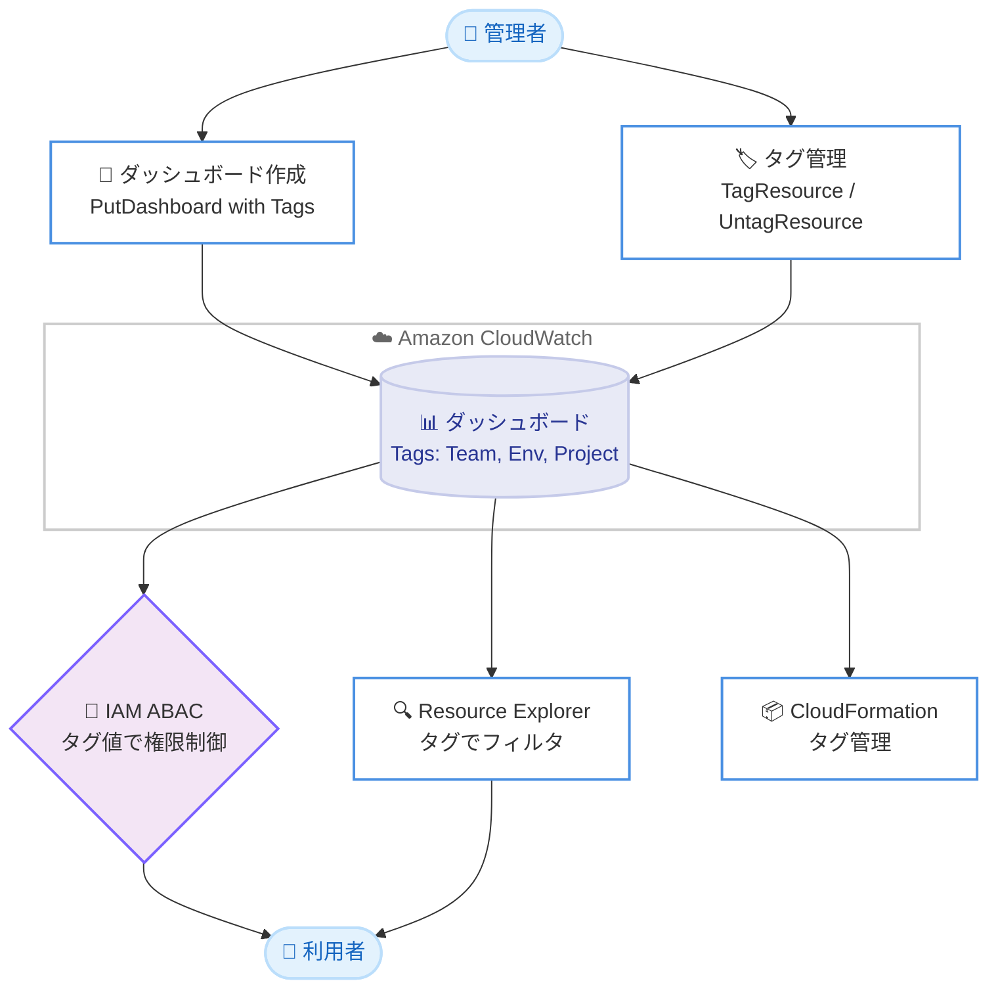

# Amazon CloudWatch - ダッシュボードのタグ付け対応

**リリース日**: 2026 年 6 月 24 日
**サービス**: Amazon CloudWatch
**機能**: CloudWatch ダッシュボードのタグ付けサポート

📊 [このアップデートのインフォグラフィックを見る](https://takech9203.github.io/aws-news-summary/20260624-amazon-cloudwatch-tags-on-dashboards.html)
<!-- INFOGRAPHIC_BASE_URL は環境変数から取得 -->

## 概要

Amazon CloudWatch が、CloudWatch ダッシュボードへのタグ付けに対応しました。これにより、タグを使用してダッシュボードを整理、分類し、アクセスを制御できるようになります。タグはキーと値のペアで構成され、ダッシュボードをチーム、プロジェクト、環境ごとにグループ化する用途に活用できます。

具体的には、`PutDashboard` API がオプションの `Tags` パラメータを受け付けるようになり、新規ダッシュボードの作成時に最大 50 個のタグを割り当てられます。また、`TagResource`、`UntagResource`、`ListTagsForResource` の各 API がダッシュボードの ARN をサポートするようになり、既存ダッシュボードへのタグの追加、削除、一覧表示が可能になりました。これらのタグは AWS CloudFormation でも管理できます。

この機能により、タグの値に基づいて IAM 権限のスコープを限定する属性ベースのアクセス制御 (ABAC) を実装したり、AWS Resource Explorer でタグによるダッシュボードのフィルタリングを実行したりできます。すべての CloudWatch 利用可能リージョンで、追加費用なしで利用できます。

**アップデート前の課題**

このアップデート以前は、CloudWatch ダッシュボードにタグを付与する手段がありませんでした。

- 以前はダッシュボードにタグを付けられず、チームやプロジェクト、環境ごとに体系的に分類できなかった
- 以前は特定のダッシュボードに対してタグベースで IAM 権限を絞り込む属性ベースのアクセス制御 (ABAC) を実装できなかった
- 以前は AWS Resource Explorer でタグによるダッシュボードの検索やフィルタリングができなかった

**アップデート後の改善**

今回のアップデートにより、ダッシュボードのタグ管理が可能になりました。

- 今回のアップデートにより、最大 50 個のタグを使用してダッシュボードをチーム、プロジェクト、環境別にグループ化できるようになった
- 今回のアップデートにより、タグの値をスコープとした IAM 権限による属性ベースのアクセス制御 (ABAC) が可能になった
- 今回のアップデートにより、AWS Resource Explorer でタグによるダッシュボードのフィルタリングができるようになった

## アーキテクチャ図



ダッシュボードにタグを付与し、そのタグを起点として IAM による ABAC、Resource Explorer での検索、CloudFormation での管理を実現する流れを示しています。

## サービスアップデートの詳細

### 主要機能

1. **作成時のタグ付け (PutDashboard)**
   - `PutDashboard` API がオプションの `Tags` パラメータを受け付けるようになった
   - 新規ダッシュボードの作成時に最大 50 個のタグを割り当て可能
   - タグはキーと値のペアで指定する
   - 既存ダッシュボードの更新時に `Tags` を指定しても、そのタグ更新は無視される (タグ付けは新規作成時のみ)

2. **既存ダッシュボードのタグ管理 (TagResource / UntagResource / ListTagsForResource)**
   - `TagResource` でダッシュボードへのタグの追加や更新が可能
   - `UntagResource` でダッシュボードからタグを削除可能
   - `ListTagsForResource` でダッシュボードに付与されたタグの一覧を取得可能
   - これらの API がダッシュボードの ARN をサポート

3. **AWS CloudFormation によるタグ管理**
   - ダッシュボードのタグを CloudFormation テンプレートで宣言的に管理可能
   - Infrastructure as Code (IaC) によるタグ運用の一貫性を確保

4. **属性ベースのアクセス制御 (ABAC) と検索**
   - タグの値をスコープとして IAM 権限を限定し、特定のタグを持つダッシュボードのみにアクセスを許可
   - AWS Resource Explorer でタグによるダッシュボードのフィルタリングが可能

## 技術仕様

### タグ付けの仕様

| 項目 | 詳細 |
|------|------|
| 最大タグ数 | 1 ダッシュボードあたり 50 個 |
| 作成時のタグ付け API | `PutDashboard` (オプションの `Tags` パラメータ) |
| タグ追加・更新 API | `TagResource` |
| タグ削除 API | `UntagResource` |
| タグ一覧取得 API | `ListTagsForResource` |
| IaC サポート | AWS CloudFormation |
| 追加費用 | なし |

### ダッシュボードの特性に関する注意

| 項目 | 詳細 |
|------|------|
| ダッシュボードのスコープ | アカウント内でグローバル (リージョン固有ではない) |
| 既存ダッシュボードへのタグ付け | `PutDashboard` の更新では不可。`TagResource` を使用 |

### API変更履歴

| 日付 | サービス | 変更内容 |
|------|----------|----------|
| 2026/06/24 | Amazon CloudWatch (monitoring) | `PutDashboard` に `Tags` パラメータ追加、`TagResource` / `UntagResource` / `ListTagsForResource` がダッシュボード ARN をサポート |

### ABAC 用 IAM ポリシー例

```json
{
  "Version": "2012-10-17",
  "Statement": [
    {
      "Effect": "Allow",
      "Action": [
        "cloudwatch:GetDashboard",
        "cloudwatch:PutDashboard"
      ],
      "Resource": "*",
      "Condition": {
        "StringEquals": {
          "aws:ResourceTag/Team": "platform"
        }
      }
    }
  ]
}
```

`Team` タグの値が `platform` であるダッシュボードのみに操作を許可する ABAC ポリシーの例です。

## 設定方法

### 前提条件

1. Amazon CloudWatch を利用している AWS アカウント
2. ダッシュボードのタグ操作 (`cloudwatch:TagResource` など) を許可する IAM 権限
3. AWS CLI または AWS SDK の利用環境 (CLI で操作する場合)

### 手順

#### ステップ1: タグ付きでダッシュボードを作成する

```bash
aws cloudwatch put-dashboard \
  --dashboard-name "ProdServiceDashboard" \
  --dashboard-body file://dashboard-body.json \
  --tags Key=Team,Value=platform Key=Environment,Value=production
```

新規ダッシュボードを作成し、`Team` と `Environment` のタグを同時に付与します。`Tags` パラメータは新規作成時のみ有効です。

#### ステップ2: 既存ダッシュボードにタグを追加する

```bash
aws cloudwatch tag-resource \
  --resource-arn "arn:aws:cloudwatch::123456789012:dashboard/ProdServiceDashboard" \
  --tags Key=Project,Value=checkout
```

既存ダッシュボードの ARN を指定し、`TagResource` で `Project` タグを追加します。タグの更新も同じコマンドで行えます。

#### ステップ3: タグを確認・削除する

```bash
# タグ一覧を取得
aws cloudwatch list-tags-for-resource \
  --resource-arn "arn:aws:cloudwatch::123456789012:dashboard/ProdServiceDashboard"

# タグを削除
aws cloudwatch untag-resource \
  --resource-arn "arn:aws:cloudwatch::123456789012:dashboard/ProdServiceDashboard" \
  --tag-keys Project
```

`ListTagsForResource` で付与済みのタグを確認し、不要になったタグを `UntagResource` で削除します。

## メリット

### ビジネス面

- **ガバナンスの向上**: チーム、プロジェクト、環境ごとにダッシュボードを分類でき、組織内のリソース管理が容易になる
- **コスト不要**: すべての対応リージョンで追加費用なしに利用できる
- **アクセス制御の明確化**: タグに基づき担当チームのみにダッシュボードを公開でき、運用責任の所在が明確になる

### 技術面

- **ABAC の実現**: タグの値をスコープとした IAM 権限により、ダッシュボード単位の細やかなアクセス制御が可能
- **検索性の向上**: AWS Resource Explorer でタグによるダッシュボードのフィルタリングが可能
- **IaC との統合**: AWS CloudFormation でタグを宣言的に管理し、環境間での一貫性を維持できる

## デメリット・制約事項

### 制限事項

- 1 ダッシュボードあたり付与できるタグは最大 50 個
- `PutDashboard` の `Tags` パラメータは新規作成時のみ有効で、既存ダッシュボードの更新時に指定したタグ更新は無視される
- 既存ダッシュボードのタグの追加・更新・削除には `TagResource` / `UntagResource` を使用する必要がある

### 考慮すべき点

- CloudWatch ダッシュボードはアカウント内でグローバルなリソースであり、リージョン固有ではない点に留意する
- ABAC を運用する場合、タグキーと値の命名規則を組織全体で統一しておく必要がある
- タグベースのアクセス制御を導入する際は、既存の IAM ポリシーへの影響を事前に検証する

## ユースケース

### ユースケース1: チーム別のアクセス制御

**シナリオ**: 複数チームが同一アカウントを共有しており、各チームが自チームのダッシュボードのみを編集できるようにしたい。

**実装例**:
```
Team=platform / Team=payments などのタグを各ダッシュボードに付与し、
aws:ResourceTag/Team 条件キーで IAM 権限をスコープする
```

**効果**: 担当外のダッシュボードへの誤操作を防ぎ、最小権限の原則を実現できる。

### ユースケース2: 環境別のダッシュボード整理

**シナリオ**: 本番、ステージング、開発の各環境のダッシュボードが混在しており、環境ごとに素早く絞り込みたい。

**実装例**:
```
Environment=production / staging / development タグを付与し、
AWS Resource Explorer でタグによりフィルタリングする
```

**効果**: 大量のダッシュボードの中から目的の環境のものを迅速に特定できる。

### ユースケース3: CloudFormation による標準化

**シナリオ**: 新しいマイクロサービスを追加するたびに、標準タグ付きのダッシュボードを自動的に作成したい。

**実装例**:
```yaml
Resources:
  ServiceDashboard:
    Type: AWS::CloudWatch::Dashboard
    Properties:
      DashboardName: checkout-service
      DashboardBody: !Sub '${DashboardJson}'
      Tags:
        - Key: Team
          Value: payments
        - Key: Environment
          Value: production
```

**効果**: IaC によりタグ運用を標準化し、人手によるタグ付け漏れを防止できる。

## 料金

この機能は追加費用なしで利用できます。CloudWatch ダッシュボードの既存の料金体系が適用されます。

### 料金例

| 使用量 | 月額料金（概算） |
|--------|------------------|
| ダッシュボードへのタグ付け | 追加費用なし |
| CloudWatch ダッシュボード本体 | 既存のダッシュボード料金が適用 |

## 利用可能リージョン

Amazon CloudWatch が利用可能なすべての AWS リージョンで利用できます。

## 関連サービス・機能

- **AWS Identity and Access Management (IAM)**: タグの値をスコープとした属性ベースのアクセス制御 (ABAC) を実現
- **AWS Resource Explorer**: タグによるダッシュボードの検索とフィルタリングに利用
- **AWS CloudFormation**: ダッシュボードのタグを宣言的に管理する IaC の手段
- **AWS Resource Groups / Tag Editor**: タグを横断的に管理し、リソースをグループ化する機能

## 参考リンク

- 📊 [インフォグラフィック](https://takech9203.github.io/aws-news-summary/20260624-amazon-cloudwatch-tags-on-dashboards.html)
- [公式発表 (What's New)](https://aws.amazon.com/about-aws/whats-new/2026/06/amazon-cloudwatch-tags-on-dashboards)
- [ドキュメント (PutDashboard API)](https://docs.aws.amazon.com/AmazonCloudWatch/latest/APIReference/API_PutDashboard.html)
- [ドキュメント (TagResource API)](https://docs.aws.amazon.com/AmazonCloudWatch/latest/APIReference/API_TagResource.html)
- [Amazon CloudWatch 料金ページ](https://aws.amazon.com/cloudwatch/pricing/)

## まとめ

CloudWatch ダッシュボードのタグ付け対応により、ダッシュボードをチームやプロジェクト、環境別に整理し、ABAC によるアクセス制御や Resource Explorer での検索が可能になりました。追加費用なしで利用できるため、複数チームでアカウントを共有している組織は、タグの命名規則を整備した上で、IAM ポリシーや CloudFormation テンプレートへの組み込みを検討することを推奨します。
