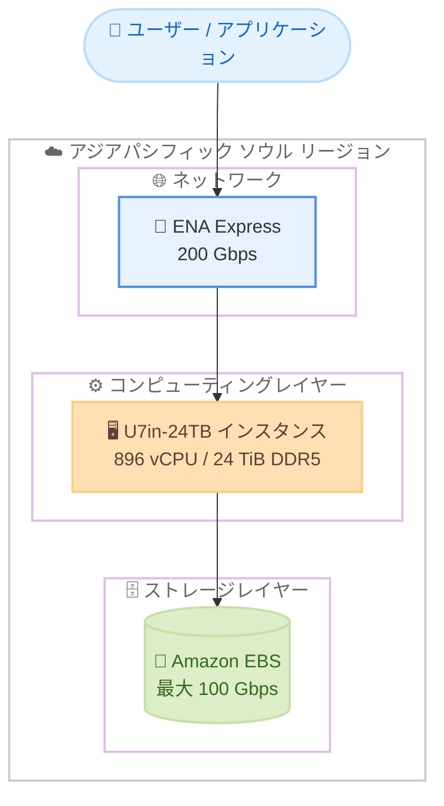

# Amazon EC2 - High Memory U7in-24TB インスタンス

**リリース日**: 2026 年 6 月 24 日
**サービス**: Amazon EC2
**機能**: High Memory U7in-24TB インスタンス (u7in-24tb.224xlarge) のアジアパシフィック (ソウル) リージョン対応

📊 [このアップデートのインフォグラフィックを見る](https://takech9203.github.io/aws-news-summary/20260624-amazon-ec2-u7in-24tb-aws-seoul.html)
<!-- INFOGRAPHIC_BASE_URL は環境変数から取得 -->

## 概要

Amazon EC2 High Memory U7in-24TB インスタンス (u7in-24tb.224xlarge) が、AWS アジアパシフィック (ソウル) リージョンで利用可能になりました。U7i インスタンスは AWS 第 7 世代インスタンスの一部であり、カスタム第 4 世代 Intel Xeon Scalable プロセッサ (Sapphire Rapids) を搭載しています。

U7in-24TB インスタンスは 24 TiB の DDR5 メモリを提供し、急速に拡大するデータ環境においてトランザクション処理スループットをスケールさせることを可能にします。このインスタンスは 896 個の vCPU を備え、最大 100 Gbps の Amazon EBS 帯域幅、200 Gbps のネットワーク帯域幅、および ENA Express をサポートします。

U7i インスタンスは、既存の U-1 インスタンスと比較して最大 45% 優れた価格性能比を実現します。SAP HANA、Oracle、SQL Server などのミッションクリティカルなインメモリデータベースを実行するお客様に最適です。

**アップデート前の課題**

- これまでアジアパシフィック (ソウル) リージョンでは U7in-24TB インスタンスを利用できず、24 TiB クラスの大規模インメモリデータベースを国内リージョンで稼働させることが困難でした
- 既存の U-1 インスタンスでは、第 7 世代インスタンスほどの価格性能比を得られませんでした
- 韓国国内でのデータ所在地要件があるワークロードでは、超大規模メモリインスタンスの選択肢が限られていました

**アップデート後の改善**

- アジアパシフィック (ソウル) リージョンで 24 TiB の DDR5 メモリを備えた U7in-24TB インスタンスが利用可能になりました
- U-1 インスタンスと比較して最大 45% 優れた価格性能比を実現できるようになりました
- 韓国国内のリージョンで、SAP HANA などの大規模インメモリデータベースを低レイテンシで運用できるようになりました

## アーキテクチャ図

ソウルリージョン内で U7in-24TB インスタンスが、ENA Express による高速ネットワークと最大 100 Gbps の EBS 帯域幅を通じてアプリケーションおよびストレージと接続される構成を示しています。

## サービスアップデートの詳細

### 主要機能

1. **超大規模メモリ構成**
   - 24 TiB の DDR5 メモリを提供
   - 急速に拡大するデータ環境でトランザクション処理スループットをスケール
   - メモリ常駐型の大規模データセットを単一インスタンスで処理可能

2. **第 7 世代インスタンスの性能**
   - カスタム第 4 世代 Intel Xeon Scalable プロセッサ (Sapphire Rapids) を搭載
   - 896 個の vCPU を提供
   - 既存の U-1 インスタンスと比較して最大 45% 優れた価格性能比

3. **高スループットなネットワークとストレージ**
   - 最大 100 Gbps の Amazon EBS 帯域幅
   - 200 Gbps のネットワーク帯域幅
   - ENA Express のサポートによる低レイテンシかつ高スループットな通信

## 技術仕様

### U7in-24TB インスタンスの仕様

| 項目 | 詳細 |
|------|------|
| インスタンスタイプ | u7in-24tb.224xlarge |
| 世代 | AWS 第 7 世代 (U7i ファミリー) |
| プロセッサ | カスタム第 4 世代 Intel Xeon Scalable (Sapphire Rapids) |
| メモリ | 24 TiB DDR5 |
| vCPU 数 | 896 |
| EBS 帯域幅 | 最大 100 Gbps |
| ネットワーク帯域幅 | 200 Gbps |
| ENA Express | サポート |
| 価格性能比 | U-1 インスタンス比で最大 45% 向上 |

## メリット

### ビジネス面

- **国内リージョンでの大規模 DB 運用**: アジアパシフィック (ソウル) リージョンでミッションクリティカルなインメモリデータベースを運用でき、データ所在地要件への対応が容易になります
- **コスト効率の向上**: U-1 インスタンス比で最大 45% 優れた価格性能比により、同等のワークロードをより低コストで実行できます
- **事業成長への対応**: 急速に拡大するデータ環境においてトランザクション処理をスケールさせることができます

### 技術面

- **単一インスタンスでのスケールアップ**: 24 TiB の DDR5 メモリと 896 vCPU により、大規模なインメモリデータベースを単一インスタンスで処理できます
- **高スループット I/O**: 最大 100 Gbps の EBS 帯域幅と 200 Gbps のネットワーク帯域幅により、データ集約型ワークロードの I/O ボトルネックを軽減します
- **低レイテンシ通信**: ENA Express により、ノード間通信やクライアント接続の低レイテンシ化を実現します

## デメリット・制約事項

### 制限事項

- 提供されるインスタンスタイプは u7in-24tb.224xlarge の単一構成です
- High Memory インスタンスは大規模ワークロード向けであり、小規模ワークロードにはオーバースペックとなる可能性があります

### 考慮すべき点

- 超大規模インスタンスのため、利用前に vCPU クォータ (サービスクォータ) の確認と引き上げ申請が必要になる場合があります
- 大規模インメモリデータベース (SAP HANA など) を稼働させる場合は、対象ソフトウェアの認定構成やサポート要件を事前に確認することを推奨します

## ユースケース

### ユースケース1: SAP HANA の大規模インメモリデータベース

**シナリオ**: 韓国国内でデータを保持する必要がある企業が、SAP HANA を用いた大規模なインメモリデータベースをソウルリージョンで運用したい。

**効果**: 24 TiB のメモリを備えた単一インスタンス上で SAP HANA を稼働させることで、データ所在地要件を満たしつつ、スケールアップ構成のシンプルな運用を実現できます。

### ユースケース2: トランザクション処理基盤のスケール

**シナリオ**: 急成長中のサービスにおいて、Oracle や SQL Server を用いたトランザクション処理のスループットを拡張したい。

**効果**: 896 vCPU と高速な EBS / ネットワーク帯域幅により、トランザクション処理のスループットをスケールさせ、増加するデータ量に対応できます。

### ユースケース3: U-1 インスタンスからの移行によるコスト最適化

**シナリオ**: 既存の U-1 インスタンスで大規模インメモリデータベースを運用しているが、価格性能比を改善したい。

**効果**: U7in-24TB インスタンスへ移行することで、U-1 インスタンス比で最大 45% 優れた価格性能比を実現し、コスト最適化につなげられます。

## 料金

U7in-24TB インスタンスの料金は、Amazon EC2 の料金体系に従います。具体的な料金は Amazon EC2 の料金ページで確認してください。なお、High Memory インスタンスではオンデマンド、Savings Plans、リザーブドインスタンスなどの購入オプションが利用可能な場合があります。詳細は公式の料金ページを参照してください。

## 利用可能リージョン

アジアパシフィック (ソウル) リージョンで利用可能です。U7i インスタンスは、その他のリージョンでも順次提供されています。最新の提供状況は公式ドキュメントを確認してください。

## 関連サービス・機能

- **Amazon EBS**: U7in-24TB インスタンスは最大 100 Gbps の EBS 帯域幅をサポートし、永続ストレージとして利用します
- **Elastic Network Adapter (ENA) Express**: 200 Gbps のネットワーク帯域幅と低レイテンシ通信を実現します
- **SAP on AWS**: SAP HANA などのミッションクリティカルなインメモリデータベースの運用基盤として利用できます

## 参考リンク

- 📊 [インフォグラフィック](https://takech9203.github.io/aws-news-summary/20260624-amazon-ec2-u7in-24tb-aws-seoul.html)
- [公式発表 (What's New)](https://aws.amazon.com/about-aws/whats-new/2026/06/amazon-ec2-u7in-24tb-aws-seoul/)
- [Amazon EC2 High Memory インスタンス](https://aws.amazon.com/ec2/instance-types/high-memory/)
- [Amazon EC2 料金](https://aws.amazon.com/ec2/pricing/)

## まとめ

Amazon EC2 High Memory U7in-24TB インスタンスがアジアパシフィック (ソウル) リージョンで利用可能になり、24 TiB の DDR5 メモリと 896 vCPU を備えた超大規模インスタンスを韓国国内で運用できるようになりました。SAP HANA や Oracle、SQL Server などのミッションクリティカルなインメモリデータベースを運用しているお客様は、U-1 インスタンスからの移行による価格性能比の改善を検討する価値があります。導入にあたっては、サービスクォータや対象データベースの認定構成を事前に確認することを推奨します。
