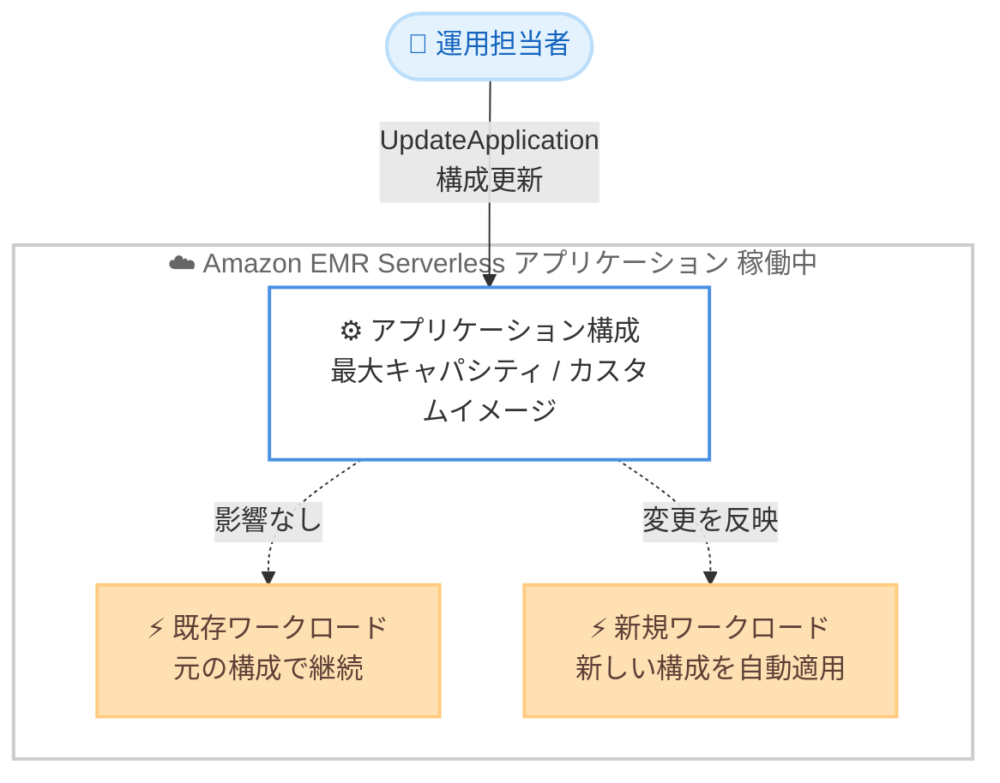

# Amazon EMR Serverless - アプリケーション再起動なしのライブ構成更新

**リリース日**: 2026年6月24日
**サービス**: Amazon EMR Serverless
**機能**: アプリケーション再起動を伴わないライブ構成更新 (Live Configuration Updates)

📊 [このアップデートのインフォグラフィックを見る](https://takech9203.github.io/aws-news-summary/20260624-amazon-emr-serverless.html)
<!-- INFOGRAPHIC_BASE_URL は環境変数から取得 -->

## 概要

Amazon EMR Serverless は、アプリケーションを停止して再起動することなく、最大キャパシティやカスタムイメージ設定などの主要なアプリケーション構成を更新できるようになりました。これにより、実行中のジョブを中断することなく、スケーリングの上限調整や更新済みカスタムイメージのデプロイをいつでも実施できます。

このアップデートのポイントは、構成変更が新旧のワークロードに対して異なる挙動をすることです。更新後に投入された新しいワークロードは自動的に新しい設定を使用し、既存のワークロードは元の構成のまま中断されることなく継続します。これにより、構成変更の影響を予測しやすくなり、運用上の安全性が向上します。

本機能は、データエンジニアや分析プラットフォームの運用担当者を主な対象としています。すべての Amazon EMR リリースで利用可能であり、Amazon EMR Serverless が提供されているすべての AWS リージョンで使用できます。

**アップデート前の課題**

このアップデート以前は、最大キャパシティやカスタムイメージなどのアプリケーション構成を変更するには、アプリケーションの停止と再起動が必要でした。

- 以前は構成変更のために EMR Serverless アプリケーションを停止する必要があった
- 以前はメンテナンスウィンドウの調整が必要で、ジョブの投入を一時的にブロックする必要があった
- 以前はスケーリング上限の調整やカスタムイメージの更新を実行中のジョブを中断せずに行うことができなかった

**アップデート後の改善**

今回のアップデートにより、アプリケーションを稼働させたまま構成を更新できるようになりました。

- 今回のアップデートにより最大キャパシティやカスタムイメージ設定をアプリケーション停止なしで更新できるようになった
- 今回のアップデートによりメンテナンスウィンドウの調整やジョブ投入の一時停止が不要になった
- 今回のアップデートにより新しいワークロードは新設定を自動適用し、既存ワークロードは元の構成で継続するという予測可能な挙動が実現された

## アーキテクチャ図



構成更新後、新規に投入されたワークロードは新しい設定を自動的に使用し、すでに実行中の既存ワークロードは元の構成のまま中断なく継続します。

## サービスアップデートの詳細

### 主要機能

1. **アプリケーション稼働中の構成更新**
   - アプリケーションを停止・再起動せずに主要な構成を更新できる
   - 最大キャパシティ (maximum capacity) の調整に対応
   - カスタムイメージ設定 (custom image settings) の更新に対応

2. **新旧ワークロードの分離された挙動**
   - 更新後に投入された新規ワークロードは新しい設定を自動的に使用する
   - すでに実行中の既存ワークロードは元の構成のまま中断されずに継続する
   - これにより構成変更が実行中のジョブに予期しない影響を与えることを防ぐ

3. **運用調整の不要化**
   - メンテナンスウィンドウの事前調整が不要
   - 構成変更時にジョブ投入を一時的にブロックする必要がない
   - スケーリング上限の調整や更新済みカスタムイメージのデプロイをいつでも実施可能

## 技術仕様

### 更新可能な主要構成

| 項目 | 詳細 |
|------|------|
| 最大キャパシティ | アプリケーションが使用できる vCPU、メモリ、ディスクの上限値。スケーリング境界の調整に使用 |
| カスタムイメージ設定 | ジョブ実行に使用するカスタムコンテナイメージの設定。更新済みイメージのデプロイに使用 |
| 新規ワークロードへの反映 | 更新後に投入されたジョブが自動的に新しい設定を使用 |
| 既存ワークロードへの影響 | 実行中のジョブは元の構成のまま継続し、中断されない |

### API変更履歴

今回のアップデートに関連する awsapichanges.com への該当エントリは、レポート作成時点では確認できませんでした。EMR Serverless アプリケーションの構成更新には、`emr-serverless` の `UpdateApplication` API を使用します。

## 設定方法

### 前提条件

1. 既存の Amazon EMR Serverless アプリケーションが作成済みであること
2. `emr-serverless:UpdateApplication` を実行する権限を持つ IAM ロールまたはユーザーであること
3. AWS CLI または SDK が利用可能な環境であること

### 手順

#### ステップ1: 現在のアプリケーション構成を確認する

```bash
aws emr-serverless get-application \
  --application-id <application-id>
```

指定したアプリケーションの現在の構成 (最大キャパシティやイメージ設定など) を取得します。更新前の状態を確認するために実行します。

#### ステップ2: 最大キャパシティを更新する

```bash
aws emr-serverless update-application \
  --application-id <application-id> \
  --maximum-capacity '{"cpu": "400 vCPU", "memory": "3000 GB", "disk": "20000 GB"}'
```

アプリケーションを停止せずに最大キャパシティ (スケーリング境界) を更新します。更新後に投入される新規ジョブから新しい上限値が適用されます。

#### ステップ3: カスタムイメージ設定を更新する

```bash
aws emr-serverless update-application \
  --application-id <application-id> \
  --image-configuration '{"imageUri": "<account-id>.dkr.ecr.<region>.amazonaws.com/<repository>:<new-tag>"}'
```

更新済みのカスタムコンテナイメージをデプロイします。実行中の既存ジョブは元のイメージのまま継続し、更新後の新規ジョブが新しいイメージを使用します。

## メリット

### ビジネス面

- **ダウンタイムの排除**: アプリケーションを停止せずに構成を変更できるため、分析ワークロードの中断によるビジネス影響を回避できる
- **運用負荷の軽減**: メンテナンスウィンドウの調整やジョブ投入の一時停止が不要になり、運用調整の手間とコストが削減される
- **俊敏性の向上**: スケーリング境界の調整やイメージ更新をいつでも実施できるため、需要変化やセキュリティ更新に迅速に対応できる

### 技術面

- **無停止運用**: 実行中のジョブを中断せずに構成を変更できるため、長時間実行ジョブの完遂を妨げない
- **予測可能な挙動**: 新規ワークロードのみに新設定が適用される明確な分離により、変更の影響範囲を把握しやすい
- **広範な対応**: すべての Amazon EMR リリースおよび EMR Serverless が利用可能なすべてのリージョンで使用できる

## デメリット・制約事項

### 制限事項

- 更新可能な構成は最大キャパシティやカスタムイメージ設定などの主要なアプリケーション構成に限定される
- 既存の実行中ワークロードには新しい構成が反映されないため、新設定を適用するには新規ジョブの投入が必要となる
- 一部の構成項目については引き続き従来の制約が適用される可能性があるため、最新の公式ドキュメントで確認が必要

### 考慮すべき点

- 構成更新後、新旧のワークロードが異なる構成で並行実行される期間が発生するため、運用監視において双方の挙動を考慮する必要がある
- カスタムイメージを更新する場合、新しいイメージが既存ジョブと互換性を持つかを事前に検証することが望ましい

## ユースケース

### ユースケース1: ピーク時間帯のスケーリング上限引き上げ

**シナリオ**: 月次バッチ処理のピーク時間帯に向けて、一時的に最大キャパシティを引き上げたい。従来はアプリケーションの停止が必要だったが、稼働中のジョブを止めたくない。

**実装例**:
```
aws emr-serverless update-application \
  --application-id <application-id> \
  --maximum-capacity '{"cpu": "800 vCPU", "memory": "6000 GB"}'
```

**効果**: 実行中のジョブを中断せずにスケーリング上限を引き上げ、ピーク時間帯の処理を高速化できる。

### ユースケース2: セキュリティパッチを含むカスタムイメージの即時デプロイ

**シナリオ**: カスタムイメージにセキュリティパッチを適用する必要があるが、長時間実行中の分析ジョブを完了させたい。

**実装例**:
```
aws emr-serverless update-application \
  --application-id <application-id> \
  --image-configuration '{"imageUri": "<account-id>.dkr.ecr.<region>.amazonaws.com/emr-custom:patched"}'
```

**効果**: 実行中のジョブは元のイメージで完遂しつつ、以降の新規ジョブにはパッチ適用済みイメージを適用できる。

### ユースケース3: コスト最適化のためのキャパシティ縮小

**シナリオ**: 業務閑散期に向けてアプリケーションの最大キャパシティを縮小し、想定外のコスト増を抑制したい。

**実装例**:
```
aws emr-serverless update-application \
  --application-id <application-id> \
  --maximum-capacity '{"cpu": "100 vCPU", "memory": "750 GB"}'
```

**効果**: ジョブの投入を止めることなくスケーリング上限を縮小し、リソース消費とコストを抑制できる。

## 料金

本アップデートはアプリケーション構成の更新方法に関する機能拡張であり、ライブ構成更新の利用自体に追加料金は発生しません。Amazon EMR Serverless の料金は、ジョブ実行中に消費した vCPU、メモリ、ストレージのリソース使用量に基づいて課金されます。最新の料金は公式の料金ページを参照してください。

## 利用可能リージョン

Amazon EMR Serverless が利用可能なすべての AWS リージョンで使用できます。また、すべての Amazon EMR リリースに対応しています。

## 関連サービス・機能

- **Amazon EMR**: ビッグデータ処理のためのマネージドプラットフォーム。EMR Serverless はサーバーレスでの実行オプションを提供する
- **Amazon ECR**: カスタムイメージ機能で使用するコンテナイメージのレジストリ。更新済みイメージの保管・配布に利用する
- **AWS IAM**: `emr-serverless:UpdateApplication` などの操作権限を制御する

## 参考リンク

- 📊 [インフォグラフィック](https://takech9203.github.io/aws-news-summary/20260624-amazon-emr-serverless.html)
- [公式発表 (What's New)](https://aws.amazon.com/about-aws/whats-new/2026/06/amazon-emr-serverless/)
- [ドキュメント (Amazon EMR Serverless User Guide)](https://docs.aws.amazon.com/emr/latest/EMR-Serverless-UserGuide/emr-serverless.html)
- [料金ページ (Amazon EMR Serverless Pricing)](https://aws.amazon.com/emr/pricing/)

## まとめ

このアップデートにより、Amazon EMR Serverless のアプリケーション構成をダウンタイムなしで変更できるようになり、運用調整の負担が大幅に軽減されます。新規ワークロードのみに新設定が適用される明確な挙動により、変更の影響を安全に管理できます。スケーリング上限の調整やカスタムイメージの更新を運用ルーチンに取り入れ、無停止での柔軟なキャパシティ管理とイメージ更新を活用することを推奨します。
