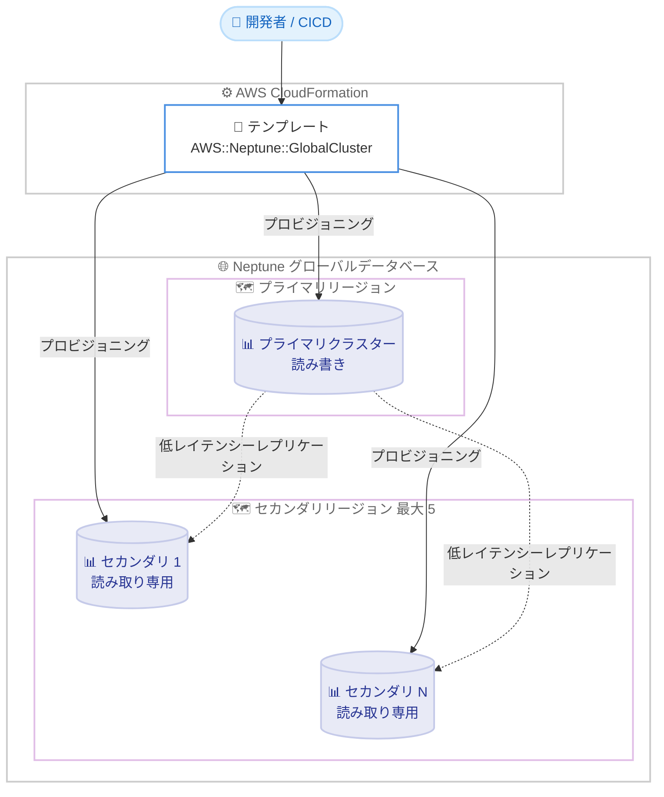

# Amazon Neptune - グローバルデータベースの AWS CloudFormation サポート

**リリース日**: 2026年6月24日
**サービス**: Amazon Neptune
**機能**: AWS CloudFormation によるグローバルデータベースのプロビジョニングと管理

📊 [このアップデートのインフォグラフィックを見る](https://takech9203.github.io/aws-news-summary/20260624-amazon-neptune-aws-cloudformation.html)
<!-- INFOGRAPHIC_BASE_URL は環境変数から取得 -->

## 概要

Amazon Neptune は、Neptune グローバルデータベースのプロビジョニングと管理に AWS CloudFormation を利用できるようになりました。新しい `AWS::Neptune::GlobalCluster` リソースタイプを使用することで、マルチリージョンのグラフデータベーストポロジーをコードとして定義できます。これにより、デプロイの自動化、設定のソース管理への保存、CI/CD パイプラインとの統合が可能になります。

Neptune グローバルデータベースは、読み書き可能なプライマリクラスター 1 つと、異なる AWS リージョンに配置できる最大 5 つの読み取り専用セカンダリクラスターで構成されます。これらは Neptune ストレージサブシステムを介した低レイテンシーレプリケーションで接続されます。一元化された書き込みと分散された読み取りを実現することで、グローバル規模のグラフアプリケーションを構築できます。

主なユースケースには、リージョンをまたいだ低レイテンシーの読み取りアクセス、ディザスタリカバリ、データレジデンシー (データ所在地) のコンプライアンス対応、書き込みを集中させつつ読み取りを分散する高可用性グラフデプロイメントが含まれます。この機能は、Neptune グローバルデータベースがサポートされているすべての AWS リージョンで利用可能です。

**アップデート前の課題**

このアップデート以前、Neptune グローバルデータベースの構成は手動操作に依存していました。

- 以前は Neptune グローバルデータベースを AWS マネジメントコンソールや AWS CLI、SDK を用いて手動で構成する必要があった
- 以前はマルチリージョン構成をコードとして一貫して再現することが難しく、環境間で構成のばらつきが生じやすかった
- 以前は CI/CD パイプラインへの統合や、構成のバージョン管理を標準的な手段で実現できなかった

**アップデート後の改善**

今回のアップデートにより、Infrastructure as Code (IaC) による一貫した運用が可能になりました。

- 今回のアップデートにより `AWS::Neptune::GlobalCluster` リソースタイプでマルチリージョントポロジーをコードとして定義できるようになった
- 今回のアップデートにより手動でのクラスター構成作業が不要になり、デプロイを自動化できるようになった
- 今回のアップデートにより設定をソース管理に保存し、CI/CD パイプラインと統合できるようになった

## アーキテクチャ図



上図は、CloudFormation テンプレートの `AWS::Neptune::GlobalCluster` リソースから、プライマリクラスターと複数リージョンのセカンダリクラスターを一括でプロビジョニングし、Neptune ストレージサブシステムを介して低レイテンシーレプリケーションを構成する流れを示しています。

## サービスアップデートの詳細

### 主要機能

1. **`AWS::Neptune::GlobalCluster` リソースタイプ**
   - Neptune グローバルデータベースの本体となるグローバルクラスターを CloudFormation で定義できる
   - マルチリージョンのグラフデータベーストポロジーをコードとして宣言的に管理できる
   - 既存の `AWS::Neptune::DBCluster` や `AWS::Neptune::DBInstance` などのリソースと組み合わせて構成できる

2. **Infrastructure as Code による自動デプロイ**
   - テンプレートをソース管理に保存し、バージョン管理しながら構成を再現できる
   - CI/CD パイプラインに統合し、環境間で一貫したデプロイを自動化できる
   - スタックの作成・更新・削除を通じてグローバルデータベースのライフサイクルを管理できる

3. **マルチリージョントポロジーの構成**
   - 読み書き可能なプライマリクラスター 1 つと、最大 5 つの読み取り専用セカンダリクラスターを構成できる
   - 各セカンダリクラスターを異なる AWS リージョンに配置できる
   - Neptune ストレージサブシステムを介した低レイテンシーレプリケーションで接続される

## 技術仕様

### グローバルデータベースの構成要素

| 項目 | 詳細 |
|------|------|
| プライマリクラスター | 1 つ。読み書き可能 (書き込みを集中) |
| セカンダリクラスター | 最大 5 つ。読み取り専用 (異なるリージョンに配置可能) |
| レプリケーション | Neptune ストレージサブシステムを介した低レイテンシーレプリケーション |
| CloudFormation リソースタイプ | `AWS::Neptune::GlobalCluster` |
| 提供リージョン | Neptune グローバルデータベースがサポートされるすべての AWS リージョン |

### テンプレート定義例

```yaml
Resources:
  NeptuneGlobalCluster:
    Type: AWS::Neptune::GlobalCluster
    Properties:
      GlobalClusterIdentifier: my-neptune-global-cluster
      Engine: neptune
      StorageEncrypted: true
```

上記は `AWS::Neptune::GlobalCluster` リソースを定義する最小構成の例です。実際の構成では、プライマリクラスターとセカンダリクラスターの `AWS::Neptune::DBCluster` リソースを組み合わせて、グローバルデータベースのトポロジー全体を定義します。

## 設定方法

### 前提条件

1. Neptune グローバルデータベースがサポートされている AWS リージョンを利用していること
2. CloudFormation スタックを作成・管理するための適切な IAM 権限を保有していること
3. Neptune グローバルデータベースのエンジンバージョン要件を満たしていること

### 手順

#### ステップ1: グローバルクラスターの定義

```yaml
Resources:
  NeptuneGlobalCluster:
    Type: AWS::Neptune::GlobalCluster
    Properties:
      GlobalClusterIdentifier: my-neptune-global-cluster
      Engine: neptune
      StorageEncrypted: true
```

CloudFormation テンプレートに `AWS::Neptune::GlobalCluster` リソースを記述し、グローバルデータベースの土台となるグローバルクラスターを定義します。

#### ステップ2: スタックのデプロイ

```bash
aws cloudformation deploy \
  --template-file neptune-global.yaml \
  --stack-name neptune-global-stack \
  --capabilities CAPABILITY_NAMED_IAM
```

定義したテンプレートをデプロイし、グローバルデータベースをプロビジョニングします。このコマンドはテンプレートからスタックを作成し、`AWS::Neptune::GlobalCluster` リソースを実体化します。

#### ステップ3: セカンダリリージョンの追加

セカンダリリージョンの `AWS::Neptune::DBCluster` リソースを追加で定義し、CI/CD パイプラインを通じてテンプレートを更新することで、読み取り専用クラスターを各リージョンに展開します。構成変更はソース管理によってバージョン管理され、レビューと自動デプロイが可能になります。

## メリット

### ビジネス面

- **運用一貫性の向上**: コードとして構成を管理することで、環境間のばらつきを排除し、再現性のあるデプロイを実現できる
- **市場投入の迅速化**: マルチリージョン構成の手動作業を排除し、自動化されたパイプラインで迅速にデプロイできる
- **コンプライアンス対応**: データレジデンシー要件に応じて、構成をコードで明示的に管理・監査できる

### 技術面

- **Infrastructure as Code**: グラフデータベースのトポロジーを宣言的に定義し、バージョン管理できる
- **CI/CD 統合**: 既存のパイプラインに統合し、テスト・レビュー・デプロイを自動化できる
- **構成の標準化**: テンプレートを再利用することで、複数環境にわたる標準的な構成を維持できる

## デメリット・制約事項

### 制限事項

- セカンダリクラスターは最大 5 つまでに制限される
- 利用は Neptune グローバルデータベースがサポートされるリージョンに限定される
- セカンダリクラスターは読み取り専用であり、書き込みはプライマリクラスターに集中する

### 考慮すべき点

- グローバルデータベースのトポロジー変更は、CloudFormation スタックの更新を通じて慎重に管理する必要がある
- マルチリージョン構成ではリージョン間のレプリケーションに伴うデータ転送コストを考慮する必要がある
- スタック削除時の影響範囲 (グローバルクラスターおよび関連クラスター) を事前に確認しておく必要がある

## ユースケース

### ユースケース1: リージョンをまたいだ低レイテンシー読み取りアクセス

**シナリオ**: グローバルにユーザーを抱えるグラフアプリケーションで、各地域のユーザーに近いリージョンから低レイテンシーで読み取りを提供したい。

**実装例**:
```yaml
# プライマリリージョンに加え、複数のセカンダリリージョンを定義
NeptuneGlobalCluster:
  Type: AWS::Neptune::GlobalCluster
  Properties:
    GlobalClusterIdentifier: global-graph-app
    Engine: neptune
```

**効果**: 各リージョンのセカンダリクラスターから読み取りを処理することで、エンドユーザーへの応答時間を短縮できる。

### ユースケース2: ディザスタリカバリ

**シナリオ**: プライマリリージョンの障害時に、別リージョンへ迅速にフェイルオーバーできる体制を構築したい。

**実装例**:
```yaml
# セカンダリクラスターを DR 用リージョンに配置
# 障害時にセカンダリを昇格させてサービスを継続
```

**効果**: 別リージョンのセカンダリクラスターを活用することで、リージョン障害時の事業継続性を確保できる。

### ユースケース3: データレジデンシーコンプライアンス

**シナリオ**: 規制要件により、特定リージョン内でデータを保持しながらグローバルなグラフサービスを提供する必要がある。

**実装例**:
```yaml
# 規制対象リージョンにクラスターを配置し、構成をコードで監査可能に管理
```

**効果**: 構成をコードで明示的に管理することで、データ所在地に関するコンプライアンス要件への対応と監査を容易にできる。

## 料金

AWS CloudFormation 自体の利用に追加料金はかかりません (一部のサードパーティリソースタイプを除く)。Neptune グローバルデータベースの利用にあたっては、各クラスターのインスタンス、ストレージ、I/O、リージョン間のデータ転送などに対して通常の Neptune 料金が適用されます。詳細は Amazon Neptune の料金ページを参照してください。

## 利用可能リージョン

Neptune グローバルデータベースがサポートされているすべての AWS リージョンで利用可能です。

## 関連サービス・機能

- **AWS CloudFormation**: Infrastructure as Code による Neptune グローバルデータベースのプロビジョニングと管理を実現する
- **Amazon Neptune グローバルデータベース**: マルチリージョンにわたるグラフデータベースの低レイテンシー読み取りとディザスタリカバリを提供する
- **AWS CLI / SDK**: CloudFormation スタックのデプロイや管理を自動化する際に併用できる

## 参考リンク

- 📊 [インフォグラフィック](https://takech9203.github.io/aws-news-summary/20260624-amazon-neptune-aws-cloudformation.html)
- [公式発表 (What's New)](https://aws.amazon.com/about-aws/whats-new/2026/06/amazon-neptune-aws-cloudformation/)
- [Amazon Neptune ドキュメント](https://docs.aws.amazon.com/neptune/latest/userguide/intro.html)
- [Neptune グローバルデータベース ドキュメント](https://docs.aws.amazon.com/neptune/latest/userguide/neptune-global-database.html)
- [Amazon Neptune 料金ページ](https://aws.amazon.com/neptune/pricing/)

## まとめ

今回のアップデートにより、Neptune グローバルデータベースを `AWS::Neptune::GlobalCluster` リソースタイプで Infrastructure as Code として管理できるようになりました。マルチリージョンのグラフデータベース構成を手動操作から解放し、CI/CD パイプラインと統合することで、再現性と一貫性のある運用が可能になります。グローバル規模のグラフアプリケーションや、ディザスタリカバリ、データレジデンシー対応を検討している場合は、CloudFormation テンプレートによる構成管理への移行を検討することをお勧めします。
