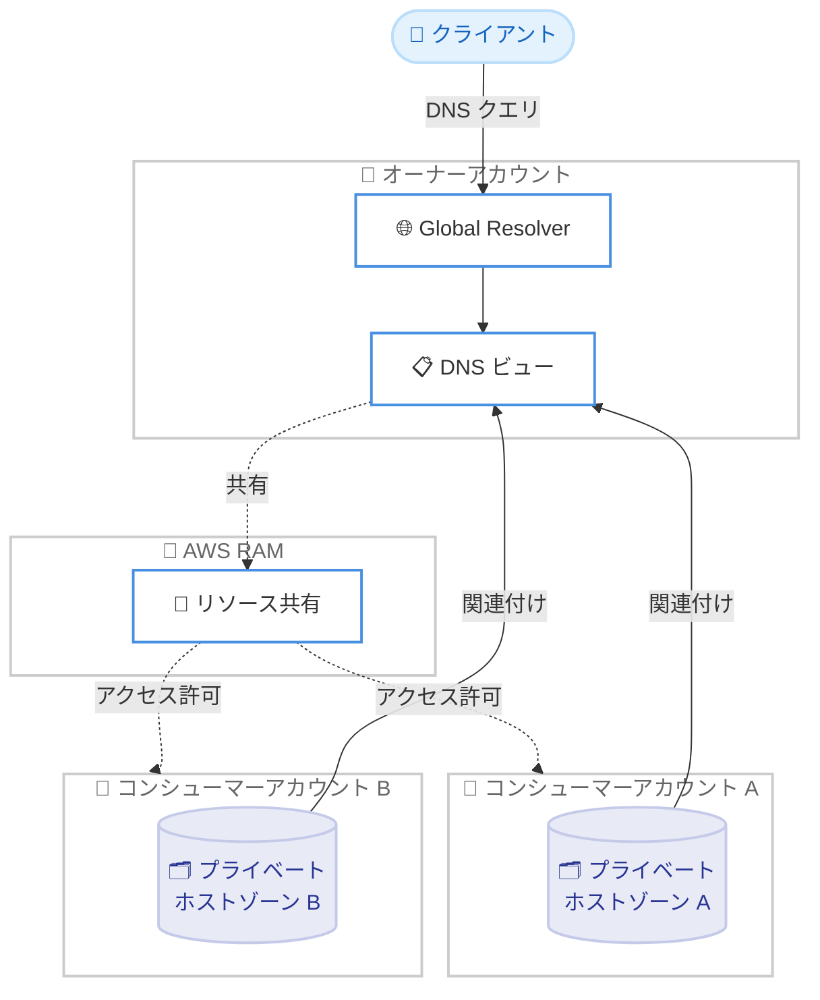

# Amazon Route 53 Global Resolver - AWS アカウント間での DNS ビュー共有

**リリース日**: 2026 年 6 月 24 日
**サービス**: Amazon Route 53
**機能**: Route 53 Global Resolver DNS ビュー共有

📊 [このアップデートのインフォグラフィックを見る](https://takech9203.github.io/aws-news-summary/20260624-amazon-route-53-global-resolver.html)

## 概要

Amazon Route 53 Global Resolver が、AWS Resource Access Manager (AWS RAM) を使用して他の AWS アカウントと DNS ビューを共有する機能をサポートしました。コンシューマーアカウント (共有を受ける側のアカウント) は、自身が所有する Route 53 プライベートホストゾーンを共有された DNS ビューに関連付けることができ、これにより、オーナーアカウント (共有元のアカウント) の Global Resolver を通じて、Global Resolver が稼働するすべての AWS リージョンでレコードを解決できるようになります。

この機能の重要な点は、ホストゾーンや DNS ビューの所有権を移転することなく共有が実現できることです。各チームは引き続き自身のプライベートホストゾーンを所有・管理しながら、一元化された Global Resolver を通じてレコードを解決可能にできます。これにより、マルチアカウント環境において、分散したホストゾーンの管理権限を維持したまま、DNS 解決を集約するアーキテクチャを構築できます。

アクセス制御は、AWS RAM の事前定義されたマネージドアクセス許可 (デフォルトの関連付けのみ、ライフサイクル管理、フルアクセス) を使用するか、カスタムアクセス許可を作成することで柔軟に設定できます。この機能は、Route 53 Global Resolver がサポートされるすべての AWS リージョンで追加料金なしで利用可能です。

**アップデート前の課題**

- 一元化された Global Resolver を通じてプライベートホストゾーンを解決可能にするには、ホストゾーンや DNS ビューの所有権を集約する必要があった
- 各チームがホストゾーンを所有・管理しながら、別アカウントの Global Resolver でレコードを解決させる仕組みがなかった
- マルチアカウント環境で DNS 解決を集約する際に、アカウント間の権限分離を維持することが難しかった

**アップデート後の改善**

- AWS RAM を使用して、所有権を移転せずに DNS ビューを他のアカウントと共有できるようになった
- コンシューマーアカウントが自身のプライベートホストゾーンを共有 DNS ビューに関連付け、オーナーの Global Resolver で解決可能にできるようになった
- AWS RAM マネージドアクセス許可またはカスタムアクセス許可により、共有時のアクセスレベルをきめ細かく制御できるようになった

## アーキテクチャ図



オーナーアカウントが AWS RAM を通じて DNS ビューを共有し、各コンシューマーアカウントが自身のプライベートホストゾーンを共有 DNS ビューに関連付けることで、オーナーの Global Resolver を通じた名前解決が実現します。

## サービスアップデートの詳細

### 主要機能

1. **AWS RAM による DNS ビュー共有**
   - オーナーアカウントが所有する DNS ビューを、AWS RAM を使用して他の AWS アカウントと共有できます
   - 共有時にホストゾーンや DNS ビューの所有権は移転されません
   - 共有先のコンシューマーアカウントは、自身のプライベートホストゾーンを共有 DNS ビューに関連付けられます

2. **所有権を維持したままの一元的な名前解決**
   - 各チームは引き続き自身のプライベートホストゾーンを所有・管理できます
   - コンシューマーが作成したプライベートホストゾーンの関連付けは、コンシューマーアカウントに属しますが、オーナーアカウントからも参照および削除が可能です
   - 関連付けられたレコードは、Global Resolver が稼働するすべての AWS リージョンで解決可能になります

3. **きめ細かなアクセス制御**
   - AWS RAM の事前定義されたマネージドアクセス許可を選択できます
   - デフォルトの関連付けのみ、ライフサイクル管理、フルアクセスの 3 つのレベルが用意されています
   - 特定のアクションのみを許可するカスタムアクセス許可も作成できます

## 技術仕様

### AWS RAM マネージドアクセス許可

| アクセス許可 | 内容 |
|------|------|
| デフォルト (関連付けのみ) | コンシューマーが自身のプライベートホストゾーンを共有 DNS ビューに関連付けることのみを許可 |
| ライフサイクル管理 | 関連付けの作成・削除など、ライフサイクル操作を許可 |
| フルアクセス | 共有された DNS ビューに対する完全な操作を許可 |
| カスタムアクセス許可 | 必要なアクションのみを個別に指定して許可 |

### 所有権と可視性

| 項目 | 詳細 |
|------|------|
| DNS ビューの所有権 | オーナーアカウントが保持 (共有しても移転されない) |
| プライベートホストゾーンの所有権 | コンシューマーアカウントが保持 |
| コンシューマー作成の関連付け | コンシューマーアカウントに属するが、オーナーからも参照・削除が可能 |
| レコードの解決範囲 | Global Resolver が稼働するすべての AWS リージョン |

## 設定方法

### 前提条件

1. オーナーアカウントで Route 53 Global Resolver と DNS ビューが構成されていること
2. コンシューマーアカウントで共有対象とするプライベートホストゾーンが存在すること
3. オーナーアカウントとコンシューマーアカウントの双方で AWS RAM が利用可能であること

### 手順

#### ステップ1: オーナーアカウントで DNS ビューを共有する

```bash
aws ram create-resource-share \
  --name "global-resolver-dns-view-share" \
  --resource-arns "arn:aws:route53:::view/<dns-view-id>" \
  --principals "<consumer-account-id>" \
  --permission-arns "<ram-managed-permission-arn>"
```

オーナーアカウントで AWS RAM のリソース共有を作成し、対象の DNS ビューをコンシューマーアカウントに共有します。`--permission-arns` で適用するマネージドアクセス許可を指定します。

#### ステップ2: コンシューマーアカウントで共有を承諾する

```bash
aws ram accept-resource-share-invitation \
  --resource-share-invitation-arn "<invitation-arn>"
```

コンシューマーアカウントで、オーナーから送信されたリソース共有の招待を承諾します。同一 AWS Organizations 内で共有が有効な場合は、招待の承諾が不要な場合があります。

#### ステップ3: プライベートホストゾーンを共有 DNS ビューに関連付ける

コンシューマーアカウントで、自身のプライベートホストゾーンを共有された DNS ビューに関連付けます。関連付け後、ホストゾーン内のレコードがオーナーの Global Resolver を通じて解決可能になります。設定の詳細は公式ドキュメントを参照してください。

## メリット

### ビジネス面

- **権限分離の維持**: 各チームが自身のホストゾーンの所有権を保持したまま、DNS 解決を集約できるため、組織のガバナンスとセキュリティ境界を維持できます
- **運用の集約**: 一元化された Global Resolver で複数アカウントのプライベートドメインを解決でき、運用が簡素化されます
- **追加コストなし**: Global Resolver がサポートされるすべてのリージョンで追加料金なしで利用できます

### 技術面

- **所有権の非移転**: ホストゾーンや DNS ビューの所有権を移転せずに共有できるため、既存の管理構造を変更する必要がありません
- **マルチリージョン解決**: 関連付けたレコードが Global Resolver の稼働するすべてのリージョンで解決可能になります
- **きめ細かなアクセス制御**: AWS RAM のマネージドアクセス許可とカスタムアクセス許可により、共有時のアクセスレベルを正確に制御できます

## デメリット・制約事項

### 制限事項

- DNS ビュー共有は、Route 53 Global Resolver がサポートされるリージョンでのみ利用可能です
- コンシューマーが作成した関連付けはオーナーアカウントからも削除できるため、運用上の取り決めが必要です

### 考慮すべき点

- 適切なアクセス許可レベルの選択が重要です。最小権限の原則に従い、必要なアクションのみを許可するアクセス許可を選択してください
- 複数アカウントから同一の DNS ビューに関連付ける場合、ドメイン名の重複や衝突を避けるための命名規則を検討してください

## ユースケース

### ユースケース1: 集約型 DNS アーキテクチャ

**シナリオ**: 複数の事業部門がそれぞれ独立した AWS アカウントを持ち、各部門がプライベートホストゾーンを管理している。組織全体で統一された Global Resolver を通じて名前解決を提供したい。

**効果**: 各部門がホストゾーンの所有権を保持したまま、中央の Global Resolver でレコードを解決可能にでき、ガバナンスと運用効率を両立できます。

### ユースケース2: チーム単位の DNS 管理委譲

**シナリオ**: ネットワークチームが Global Resolver と DNS ビューを所有し、アプリケーションチームが自身のプライベートホストゾーンを管理している。アプリケーションチームに関連付けのみを許可したい。

**効果**: デフォルトの関連付けのみのアクセス許可を使用することで、アプリケーションチームは自身のホストゾーンを共有 DNS ビューに関連付けられますが、DNS ビュー自体の構成は変更できず、適切な権限分離が実現します。

### ユースケース3: オンプレミスからのマルチアカウント名前解決

**シナリオ**: オンプレミス環境から、複数の AWS アカウントに分散したプライベートリソースの名前解決を行いたい。

**効果**: 各アカウントのプライベートホストゾーンを共有 DNS ビューに関連付けることで、オンプレミスから単一の Global Resolver エンドポイントを通じて、すべてのアカウントのプライベートドメインを解決できます。

## 料金

この機能は、Route 53 Global Resolver がサポートされるすべての AWS リージョンで追加料金なしで利用できます。Global Resolver 自体の利用料金については、Amazon Route 53 の料金ページを参照してください。

## 利用可能リージョン

Route 53 Global Resolver がサポートされるすべての AWS リージョンで利用可能です。対応リージョンの一覧は公式ドキュメントを参照してください。

## 関連サービス・機能

- **AWS Resource Access Manager (AWS RAM)**: DNS ビューの共有とアクセス許可の管理に使用します
- **Amazon Route 53 プライベートホストゾーン**: 共有 DNS ビューに関連付けて解決可能にする対象です
- **Route 53 Global Resolver**: 共有された DNS ビューを通じてマルチリージョンでの名前解決を提供します

## 参考リンク

- 📊 [インフォグラフィック](https://takech9203.github.io/aws-news-summary/20260624-amazon-route-53-global-resolver.html)
- [公式発表 (What's New)](https://aws.amazon.com/about-aws/whats-new/2026/06/amazon-route-53-global-resolver/)
- [ドキュメント (DNS ビューの共有)](https://docs.aws.amazon.com/Route53/latest/DeveloperGuide/gr-sharing-dns-views.html)
- [ドキュメント (Global Resolver の対応リージョン)](https://docs.aws.amazon.com/Route53/latest/DeveloperGuide/gr-what-is-global-resolver.html#regions)
- [料金ページ](https://aws.amazon.com/route53/pricing/)

## まとめ

Route 53 Global Resolver の DNS ビュー共有機能により、マルチアカウント環境でホストゾーンの所有権を維持したまま DNS 解決を集約できるようになりました。組織のガバナンスとセキュリティ境界を保ちつつ、一元化された名前解決アーキテクチャを構築したい場合に有効です。AWS RAM のアクセス許可を適切に選択し、最小権限の原則に従った共有設定を行うことを推奨します。
