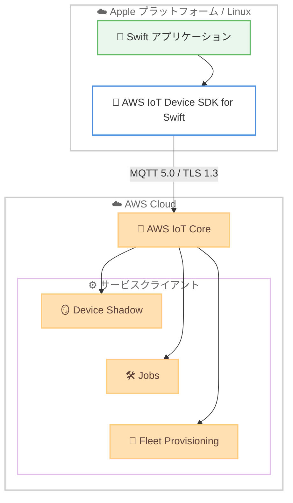

# AWS IoT - AWS IoT Device SDK for Swift

**リリース日**: 2026年6月24日
**サービス**: AWS IoT
**機能**: AWS IoT Device SDK for Swift (一般提供開始)

📊 [このアップデートのインフォグラフィックを見る](https://takech9203.github.io/aws-news-summary/20260624-aws-iot-device-sdk-swift.html)
<!-- INFOGRAPHIC_BASE_URL は環境変数から取得 -->

## 概要

AWS は、AWS IoT Device SDK for Swift の一般提供を開始しました。この SDK により、Swift 開発者は macOS、iOS、tvOS などの Apple プラットフォーム、および Linux 上で、セキュアでスケーラブルな IoT アプリケーションをネイティブに構築できます。これまで AWS IoT サービスにはネイティブの Swift サポートが存在しませんでしたが、今回のアップデートにより、本番環境で利用可能な安定した API が提供されます。

この SDK には、AWS IoT Device Shadow、Jobs、Fleet Provisioning の各サービスクライアントが統合されています。これにより、開発者はアプリケーションと AWS IoT Core の間でデバイスの状態を同期し、接続されたデバイスのリモート操作を大規模に管理し、セキュアなデバイスオンボーディングのための証明書とポリシーの作成を自動化できます。

主な対象ユーザーは、IoT デバイスフリートを管理するチームや、Apple エコシステム全体でクロスプラットフォームの IoT ソリューションを構築する開発者です。SDK は Swift Package Manager 経由でインストールでき、Apple iOS および tvOS 上では TLS 1.3 のサポートが組み込まれています。

**アップデート前の課題**

- 以前は AWS IoT サービスに対するネイティブの Swift サポートが存在しなかった
- 以前は Apple プラットフォーム向けの IoT アプリケーション開発において、本番環境で利用可能な安定した API が不足していた
- 以前は Device Shadow、Jobs、Fleet Provisioning などの機能を Swift から直接利用する手段が限られていた

**アップデート後の改善**

- 今回のアップデートにより、macOS、iOS、tvOS、Linux 上で Swift によるネイティブな IoT アプリケーション開発が可能になった
- 今回のアップデートにより、本番環境で利用可能な安定した API が提供され、回避策が不要になった
- 今回のアップデートにより、Device Shadow、Jobs、Fleet Provisioning の各サービスクライアントが統合され、開発体験が改善された

## アーキテクチャ図



Swift アプリケーションは SDK を介して MQTT 5.0 と TLS 1.3 で AWS IoT Core に接続し、Device Shadow、Jobs、Fleet Provisioning の各サービスクライアントを利用します。

## サービスアップデートの詳細

### 主要機能

1. **AWS IoT Device Shadow クライアント**
   - アプリケーションと AWS IoT Core の間でデバイスの状態を同期する
   - デバイスがオフラインの場合でも、最後に報告された状態と希望する状態を保持する
   - 状態の差分に基づいてデバイスの設定を更新できる

2. **AWS IoT Jobs クライアント**
   - 接続されたデバイスに対するリモート操作を大規模に管理する
   - ソフトウェアアップデートや再起動などのリモート操作を定義し、デバイスフリートに配信する
   - ジョブの実行状況を追跡できる

3. **AWS IoT Fleet Provisioning クライアント**
   - セキュアなデバイスオンボーディングのための証明書とポリシーの作成を自動化する
   - デバイスの大規模なプロビジョニングを効率化する
   - 手動での証明書管理の負担を軽減する

4. **マルチプラットフォーム対応とセキュア接続**
   - macOS、iOS、tvOS、Linux でネイティブに動作する
   - MQTT 5.0 を含む MQTT プロトコルで AWS IoT Core にセキュアに接続する
   - Apple iOS および tvOS 上では TLS 1.3 のサポートが組み込まれている

## 技術仕様

### サポートプラットフォームと要件

| 項目 | 詳細 |
|------|------|
| 対応プラットフォーム | macOS 12 以降、iOS 16 以降、tvOS 16 以降、Linux |
| Swift バージョン | Swift 5.10 以降 |
| 接続プロトコル | MQTT (MQTT 5.0 を含む) |
| 暗号化 | TLS 1.3 (Apple iOS / tvOS で組み込みサポート) |
| 認証方式 | X.509 証明書、AWS 認証情報、カスタム認証 |
| インストール方法 | Swift Package Manager |
| 統合サービスクライアント | Device Shadow、Jobs、Fleet Provisioning |

### Swift Package Manager での依存関係の追加

```swift
// Package.swift
dependencies: [
    .package(url: "https://github.com/aws/aws-iot-device-sdk-swift.git")
],
```

`Package.swift` ファイルにパッケージ URL を追加することで、SDK をプロジェクトの依存関係として組み込みます。

## 設定方法

### 前提条件

1. Swift 5.10 以降が利用可能な開発環境 (macOS、Linux など)
2. AWS IoT Core が有効化された AWS アカウント
3. デバイス認証用の X.509 証明書、または AWS 認証情報

### 手順

#### ステップ1: SDK をプロジェクトに追加する

```swift
// Package.swift
dependencies: [
    .package(url: "https://github.com/aws/aws-iot-device-sdk-swift.git")
],
```

`Package.swift` の `dependencies` に SDK のパッケージ URL を追加し、プロジェクトの依存関係として宣言します。

#### ステップ2: ソースからビルドする (任意)

```bash
git clone https://github.com/aws/aws-iot-device-sdk-swift.git
cd aws-iot-device-sdk-swift
swift build
```

リポジトリをクローンして `swift build` を実行することで、ソースから SDK をビルドできます。Swift Package Manager で依存関係として追加する場合、このステップは不要です。

#### ステップ3: 接続方式を選択して AWS IoT Core に接続する

SDK が提供する X.509 証明書、AWS 認証情報、カスタム認証のいずれかの認証方式を選択し、MQTT 5.0 で AWS IoT Core に接続します。具体的な接続コードは、リポジトリの Samples ディレクトリと MQTT5 User Guide を参照してください。

## メリット

### ビジネス面

- **Apple エコシステムへの展開**: macOS、iOS、tvOS アプリケーションから直接 AWS IoT を利用でき、Apple デバイスを活用した IoT ソリューションの開発が容易になる
- **本番環境での利用**: 安定した本番環境向けの API が提供されるため、回避策に依存しない信頼性の高い実装が可能になる
- **開発効率の向上**: Device Shadow、Jobs、Fleet Provisioning が統合され、これらの機能をゼロから実装する必要がなくなる

### 技術面

- **ネイティブ Swift サポート**: Swift で IoT アプリケーションをネイティブに記述でき、他言語のラッパーやブリッジが不要になる
- **セキュアな通信**: Apple iOS / tvOS 上で TLS 1.3 が組み込まれ、業界標準のセキュリティで転送中のデータを保護する
- **クロスプラットフォーム**: 単一の SDK で Apple プラットフォームと Linux の両方に対応でき、コードの再利用性が高まる

## デメリット・制約事項

### 制限事項

- TLS 1.3 の組み込みサポートは Apple iOS および tvOS プラットフォームに限定される
- macOS 12 以降、iOS 16 以降、tvOS 16 以降、Swift 5.10 以降という最小バージョン要件がある
- README には完全な接続コードのサンプルが含まれておらず、Samples ディレクトリと MQTT5 User Guide の参照が必要となる

### 考慮すべき点

- 既存の他言語向け AWS IoT Device SDK からの移行では、Swift 向けの実装に合わせた設計の見直しが必要となる場合がある
- デバイス認証に使用する証明書や認証情報の管理方針を事前に検討する

## ユースケース

### ユースケース1: iOS アプリからのデバイス状態同期

**シナリオ**: スマートホーム向けの iOS アプリで、接続された家電デバイスの状態をリアルタイムに表示・制御したい。

**実装例**:
```
iOS アプリ → AWS IoT Device SDK for Swift → Device Shadow → AWS IoT Core
```

**効果**: Device Shadow クライアントを利用することで、デバイスがオフラインの場合でも最後の状態を保持し、希望する状態を同期できる。

### ユースケース2: デバイスフリートへのリモート操作

**シナリオ**: macOS で動作する管理ツールから、フィールドに展開された多数の IoT デバイスにファームウェアアップデートを配信したい。

**実装例**:
```
macOS 管理ツール → Jobs クライアント → AWS IoT Core → デバイスフリート
```

**効果**: Jobs クライアントにより、リモート操作を定義してフリート全体に大規模に配信し、実行状況を追跡できる。

### ユースケース3: 大規模なデバイスオンボーディング

**シナリオ**: 工場出荷時に大量の Linux ベースの IoT デバイスをセキュアにオンボーディングしたい。

**実装例**:
```
Linux デバイス → Fleet Provisioning クライアント → AWS IoT Core (証明書 / ポリシー自動発行)
```

**効果**: Fleet Provisioning クライアントにより、証明書とポリシーの作成を自動化し、手動管理の負担を軽減しながらセキュアにデバイスを登録できる。

## 料金

AWS IoT Device SDK for Swift はオープンソースの SDK であり、SDK 自体の利用に追加料金は発生しません。AWS IoT Core への接続、メッセージング、Device Shadow、Jobs、Fleet Provisioning などの利用に対しては、AWS IoT Core の通常の料金が適用されます。詳細は AWS IoT Core の料金ページを参照してください。

## 利用可能リージョン

AWS IoT Device SDK for Swift はクライアント側の SDK であり、接続先の AWS IoT Core が利用可能なリージョンで使用できます。利用可能なリージョンの詳細は AWS の公式ドキュメントを参照してください。

## 関連サービス・機能

- **AWS IoT Core**: SDK の接続先となる中核サービス。MQTT メッセージングとデバイス管理を提供する
- **AWS IoT Device Shadow**: デバイスの状態をアプリケーションと同期する機能
- **AWS IoT Jobs**: 接続されたデバイスに対するリモート操作を大規模に管理する機能
- **AWS IoT Fleet Provisioning**: 証明書とポリシーの作成を自動化し、セキュアなデバイスオンボーディングを実現する機能

## 参考リンク

- 📊 [インフォグラフィック](https://takech9203.github.io/aws-news-summary/20260624-aws-iot-device-sdk-swift.html)
- [公式発表 (What's New)](https://aws.amazon.com/about-aws/whats-new/2026/06/aws-iot-device-sdk-swift/)
- [GitHub リポジトリ (aws/aws-iot-device-sdk-swift)](https://github.com/aws/aws-iot-device-sdk-swift)
- [AWS IoT Core ドキュメント](https://docs.aws.amazon.com/iot/)
- [AWS IoT Core 料金ページ](https://aws.amazon.com/iot-core/pricing/)

## まとめ

AWS IoT Device SDK for Swift の一般提供により、Swift 開発者は Apple プラットフォームと Linux 上でネイティブに AWS IoT アプリケーションを構築できるようになりました。Device Shadow、Jobs、Fleet Provisioning が統合され、本番環境で利用可能な API が提供されるため、Apple エコシステムを活用した IoT ソリューションの開発を検討しているチームは、Swift Package Manager 経由で SDK を導入し、サンプルを参照しながら実装を進めることを推奨します。
