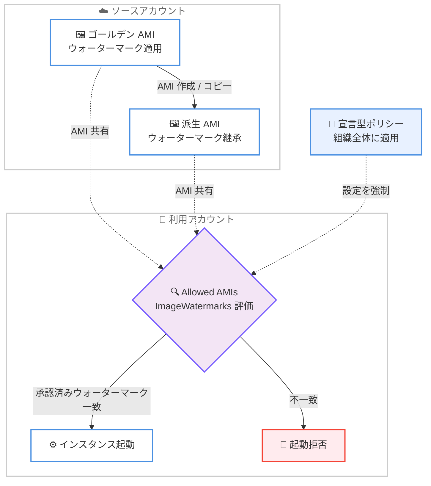

# Amazon EC2 - AMI ウォーターマーク

**リリース日**: 2026 年 6 月 24 日
**サービス**: Amazon EC2 (Elastic Compute Cloud)
**機能**: AMI Watermarks (AMI ウォーターマーク)

📊 [このアップデートのインフォグラフィックを見る](https://takech9203.github.io/aws-news-summary/20260624-ec2-image-watermarks-allowed-images.html)
<!-- INFOGRAPHIC_BASE_URL は環境変数から取得 -->

## 概要

Amazon EC2 は、プライベート AMI にカスタム識別子を埋め込むことができる AMI ウォーターマーク (AMI Watermarks) を発表しました。一度ウォーターマークを適用すると、その識別子は元の AMI から派生したすべての AMI に自動的に引き継がれます。リージョン間でコピーした場合でも、実行中のインスタンスから新しい AMI を作成した場合でも、ウォーターマークは保持されます。また、AMI を他のアカウントと共有した場合でもウォーターマークは表示されたままになります。

各ウォーターマークには、AMI ID、所有者 ID、リージョン、作成タイムスタンプなどのメタデータが含まれます。これにより、AMI が何回コピーされても来歴 (プロベナンス) が維持され、信頼できる AMI の識別、出所の追跡、組織全体でのガバナンスポリシーの適用が容易になります。

ウォーターマークは Allowed AMIs と組み合わせて利用でき、承認済みウォーターマークを持つ AMI のみにインスタンス起動を制限できます。さらに宣言型ポリシー (Declarative Policies) を通じて、組織全体に大規模にこの設定を適用できます。AWS Management Console、AWS CLI、SDK、および EC2 Image Builder から利用可能です。

**アップデート前の課題**

このアップデート以前は、信頼できる AMI を識別し、その出所を追跡する標準的な手段が限られていました。

- AMI の出所を示すためにタグを使用していたが、タグは AMI のコピーや派生時に確実に引き継がれる保証がなく、改ざんも容易だった
- リージョン間でコピーされた AMI や、実行中インスタンスから再作成された AMI について、元の信頼できるソースとの関連付けを追跡することが難しかった
- 他アカウントと共有した AMI に対して、組織が承認した正規の AMI であることを確実に示す仕組みがなかった

**アップデート後の改善**

今回のアップデートにより、AMI の来歴を確実に追跡し、ガバナンスを強化できるようになりました。

- ウォーターマークが派生 AMI、リージョン間コピー、共有 AMI に自動的に引き継がれるため、出所の追跡が確実になった
- Allowed AMIs の `ImageWatermarks` 条件と組み合わせることで、承認済みウォーターマークを持つ AMI のみにインスタンス起動を制限できるようになった
- 宣言型ポリシーを通じて、複数アカウント、複数リージョンに大規模にガバナンスを適用できるようになった

## アーキテクチャ図



ソースアカウントで適用したウォーターマークが派生 AMI に継承され、利用アカウントの Allowed AMIs がウォーターマークを評価して、承認済みの AMI のみインスタンス起動を許可する流れを示しています。

## サービスアップデートの詳細

### 主要機能

1. **カスタム識別子の埋め込み**
   - プライベート AMI にカスタム識別子 (ウォーターマーク) を埋め込む
   - ウォーターマークキーは `account-id:watermark-name` の形式で表現される
   - 信頼できる AMI の識別、出所の追跡、ガバナンスポリシーの適用に活用できる

2. **派生 AMI への自動継承**
   - ウォーターマークは元の AMI から派生したすべての AMI に自動的に引き継がれる
   - リージョン間でコピーした AMI にも継承される
   - 実行中のインスタンスから新しい AMI を作成した場合にも継承される
   - 他アカウントと共有した AMI でもウォーターマークは表示されたまま保持される

3. **メタデータの保持**
   - 各ウォーターマークには AMI ID、所有者 ID、リージョン、作成タイムスタンプなどのメタデータが含まれる
   - AMI が何回コピーされても来歴 (プロベナンス) が維持される
   - アカウントをまたいで関連する AMI を検索・フィルタリングできる

4. **Allowed AMIs および宣言型ポリシーとの統合**
   - Allowed AMIs の `ImageWatermarks` 条件と組み合わせて、承認済みウォーターマークを持つ AMI のみにインスタンス起動を制限できる
   - 宣言型ポリシーを通じて、複数アカウント、複数リージョンに大規模に設定を適用できる
   - Console、CLI、SDK、EC2 Image Builder のビルドパイプラインから適用できる

## 技術仕様

### Allowed AMIs の ImageWatermarks フィルタ

Allowed AMIs の評価条件として、ウォーターマークフィルタ (`ImageWatermarks`) を指定できます。フィルタは、AMI 上のいずれかのウォーターマークがいずれかのフィルタエントリに一致すれば、その AMI を許可します (OR ロジック)。

| フィールド | 詳細 |
|------|------|
| `WatermarkKey` | 一致させるウォーターマークキー (`account-id:watermark-name`) |
| `SourceImageRegion` | ウォーターマークを最初に適用した AMI のリージョン |
| `MaximumDaysSinceSourceImageCreated` | ウォーターマーク適用時のソース AMI の最大経過日数 |
| `MaximumDaysSinceWatermarkCreated` | ウォーターマーク適用からの最大経過日数 |

### Allowed AMIs の制限

| 項目 | 上限 |
|------|------|
| `ImageCriteria` あたりの `ImageCriterion` 数 | 10 |
| `ImageCriterion` あたりの `ImageWatermarks` 値数 | 50 |
| `ImageCriterion` あたりの `ImageProviders` 値数 | 200 |

### API変更履歴

| 日付 | サービス | 変更内容 |
|------|----------|----------|
| 2026/06/22 | [ec2](https://awsapichanges.com/archive/changes/d33e4c-ec2.html) | 2 updated api methods - `GetAllowedImagesSettings` と `ReplaceImageCriteriaInAllowedImagesSettings` がウォーターマークによる AMI フィルタリングに対応 |

### Allowed AMIs でのウォーターマーク条件の設定例

承認済みウォーターマークを持つ AMI のみを許可する `ImageCriterion` の例です。

```json
{
    "ImageCriteria": [
        {
            "ImageWatermarks": [
                {
                    "WatermarkKey": "111122223333:prod-baseline",
                    "MaximumDaysSinceWatermarkCreated": 90
                }
            ]
        }
    ]
}
```

この例では、アカウント `111122223333` の `prod-baseline` ウォーターマークを持ち、かつウォーターマーク適用から 90 日以内の AMI のみが許可されます。

## 設定方法

### 前提条件

1. ウォーターマークを適用する対象のプライベート AMI が存在すること
2. Allowed AMIs を操作するための IAM 権限 (`GetAllowedImagesSettings`、`EnableAllowedImagesSettings`、`ReplaceImageCriteriaInAllowedImagesSettings` など) を保有していること
3. 組織全体に適用する場合は、AWS Organizations と宣言型ポリシーを利用できること

### 手順

#### ステップ1: AMI にウォーターマークを適用する

```bash
# プライベート AMI にウォーターマークを適用する
# Console、CLI、SDK、または EC2 Image Builder のビルドパイプラインから適用できる
```

対象の AMI にカスタム識別子 (ウォーターマーク) を適用します。適用後は、その AMI から派生したすべての AMI にウォーターマークが自動的に引き継がれます。

#### ステップ2: Allowed AMIs を監査モードで評価する

```bash
# Allowed AMIs を監査モードで有効化し、影響を事前確認する
aws ec2 enable-allowed-images-settings \
    --allowed-images-settings-state audit-mode
```

監査モードでは、実際の制限をかけずに、どの AMI が許可されるかを事前に確認できます。`describe-images` のレスポンスに含まれる `ImageAllowed` フィールドで、有効化時に各 AMI が利用可能になるかどうかを判断できます。

#### ステップ3: ウォーターマーク条件を設定して有効化する

```bash
# ウォーターマーク条件を含む ImageCriteria を設定する
aws ec2 replace-image-criteria-in-allowed-images-settings \
    --image-criteria file://image-criteria.json

# 評価後、Allowed AMIs を有効化する
aws ec2 enable-allowed-images-settings \
    --allowed-images-settings-state enabled
```

承認済みウォーターマークを条件とする `ImageCriteria` を設定し、影響がないことを確認したうえで Allowed AMIs を有効化します。有効化後は、承認済みウォーターマークを持つ AMI のみがインスタンス起動に使用できるようになります。組織全体に適用する場合は、宣言型ポリシーを使用して複数アカウント、複数リージョンに一括で設定します。

## メリット

### ビジネス面

- **ガバナンスの強化**: 組織が承認した正規の AMI のみをインスタンス起動に使用するよう制限でき、コンプライアンス要件を満たしやすくなる
- **追加コストなし**: すべての AWS リージョンで追加料金なしで全顧客が利用可能
- **大規模適用**: 宣言型ポリシーを通じて、複数アカウント、複数リージョンに一貫したガバナンスを適用できる

### 技術面

- **来歴の確実な追跡**: ウォーターマークが派生 AMI、リージョン間コピー、共有 AMI に自動継承されるため、AMI の出所を確実に追跡できる
- **既存機能との統合**: Allowed AMIs や EC2 Image Builder と統合され、既存のワークフローに組み込みやすい
- **アカウント横断の検索**: ウォーターマークのメタデータを利用して、アカウントをまたいで関連する AMI を検索・フィルタリングできる

## デメリット・制約事項

### 制限事項

- ウォーターマークを適用できるのはプライベート AMI に限られる
- 1 つの `ImageCriterion` に指定できる `ImageWatermarks` は最大 50 件
- Allowed AMIs 自体は、自アカウントが所有する AMI の検出・利用を制限するものではなく、公開 AMI または共有 AMI の検出・利用のみを制御する

### 考慮すべき点

- Allowed AMIs を有効化する前に、必ず監査モードで影響範囲を確認することが推奨される
- AWS マネージドサービス (Amazon ECS、Amazon EKS、AWS Lambda Managed Instances など) は Amazon 発行の AMI に依存するため、条件設定時には `amazon` エイリアスを併せて許可することが推奨される
- 過度に厳しい条件 (例: 短すぎる経過日数制限) を設定すると、インスタンス起動が失敗する可能性がある

## ユースケース

### ユースケース1: ゴールデン AMI のガバナンス

**シナリオ**: セキュリティチームが標準化したゴールデン AMI を作成し、組織内の全アカウントで承認済み AMI のみを利用させたい。

**実装例**:
```
1. EC2 Image Builder でゴールデン AMI をビルドし、ウォーターマークを適用
2. Allowed AMIs の ImageWatermarks 条件にウォーターマークキーを指定
3. 宣言型ポリシーで組織全体に適用
```

**効果**: 派生 AMI も含めて承認済みのゴールデン AMI のみがインスタンス起動に使用され、未承認の AMI の使用を防止できる。

### ユースケース2: 鮮度を考慮した AMI 制限

**シナリオ**: パッチ適用が最近行われた新しい AMI のみを許可し、古い AMI からのインスタンス起動を防ぎたい。

**実装例**:
```json
{
    "ImageWatermarks": [
        {
            "WatermarkKey": "111122223333:prod-baseline",
            "MaximumDaysSinceWatermarkCreated": 30
        }
    ]
}
```

**効果**: ウォーターマーク適用から 30 日以内の AMI のみが許可され、常に最新のベースイメージを利用する運用を強制できる。

### ユースケース3: クロスアカウント共有 AMI の信頼性確認

**シナリオ**: 別アカウントから共有された AMI が、組織が信頼するソースに由来するものかを確認したい。

**実装例**:
```
1. 信頼できる発行元アカウントがウォーターマークを適用した AMI を共有
2. 利用側アカウントで ImageWatermarks 条件を設定
3. ウォーターマークのメタデータ (所有者 ID、リージョン、作成タイムスタンプ) で来歴を確認
```

**効果**: 共有 AMI でもウォーターマークが保持されるため、出所が確認できる信頼できる AMI のみを利用できる。

## 料金

AMI ウォーターマークは、すべての AWS リージョンで追加料金なしで全顧客が利用できます。

## 利用可能リージョン

AWS China (北京、Sinnet 運営) および AWS China (寧夏、NWCD 運営)、AWS GovCloud (US) リージョンを含む、すべての AWS リージョンで利用可能です。

## 関連サービス・機能

- **Allowed AMIs**: ウォーターマークを評価条件 (`ImageWatermarks`) として指定し、承認済み AMI のみにインスタンス起動を制限する機能
- **AWS Organizations 宣言型ポリシー (Declarative Policies)**: 複数アカウント、複数リージョンに Allowed AMIs 設定を大規模に適用する仕組み
- **EC2 Image Builder**: AMI ビルドパイプラインの一部としてウォーターマークを適用できるサービス

## 参考リンク

- 📊 [インフォグラフィック](https://takech9203.github.io/aws-news-summary/20260624-ec2-image-watermarks-allowed-images.html)
- [公式発表 (What's New)](https://aws.amazon.com/about-aws/whats-new/2026/06/ec2-image-watermarks-allowed-images)
- [ドキュメント (Control the discovery and use of AMIs with Allowed AMIs)](https://docs.aws.amazon.com/AWSEC2/latest/UserGuide/ec2-allowed-amis.html)
- [API リファレンス (ImageCriterionRequest)](https://docs.aws.amazon.com/AWSEC2/latest/APIReference/API_ImageCriterionRequest.html)

## まとめ

AMI ウォーターマークは、AMI の来歴を確実に追跡し、組織全体で AMI ガバナンスを強化するための重要な機能です。派生 AMI、リージョン間コピー、共有 AMI にウォーターマークが自動継承されるため、信頼できる AMI の識別が容易になります。まずは Allowed AMIs を監査モードで有効化し、ウォーターマーク条件の影響を確認したうえで、宣言型ポリシーによる組織全体への展開を検討することをお勧めします。
