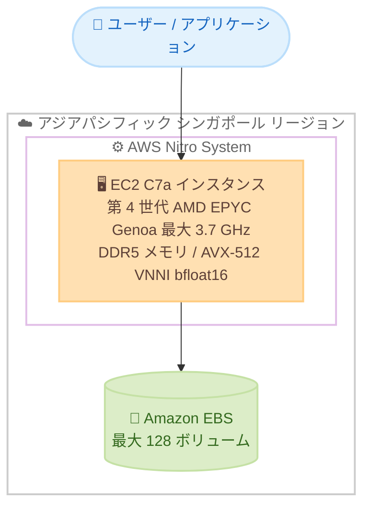

# Amazon EC2 - C7a インスタンスがアジアパシフィック (シンガポール) リージョンで利用可能に

**リリース日**: 2026年6月25日
**サービス**: Amazon EC2
**機能**: コンピューティング最適化 C7a インスタンス

📊 [このアップデートのインフォグラフィックを見る](https://takech9203.github.io/aws-news-summary/20260625-amazon-ec2-c7a-instances-asia-pacific-singapore-region.html)
<!-- INFOGRAPHIC_BASE_URL は環境変数から取得 -->

## 概要

AWS は、コンピューティング最適化された Amazon EC2 C7a インスタンスを、アジアパシフィック (シンガポール) リージョンで提供開始しました。C7a インスタンスは第 4 世代 AMD EPYC プロセッサ (コードネーム: Genoa、最大 3.7 GHz) を搭載し、従来世代の C6a インスタンスと比較して最大 50% 高いパフォーマンスを提供します。

C7a インスタンスは AWS Nitro System 上に構築されており、DDR5 メモリの採用により C6a と比べて 2.25 倍のメモリ帯域幅を実現しています。また、AVX-512、VNNI、bfloat16 といった新しい命令セットをサポートし、機械学習推論やメディア処理などの幅広いワークロードを効率的に実行できます。バッチ処理、分散分析、ハイパフォーマンスコンピューティング (HPC)、広告配信、大規模マルチプレイヤーゲーム、ビデオエンコーディングなど、コンピューティング負荷の高いワークロードに適しています。

これまでシンガポールリージョンで C7a を利用できなかったお客様も、今回のリージョン拡大により、低レイテンシーと高パフォーマンスを両立したコンピューティング基盤を当該リージョンで構築できるようになりました。

**アップデート前の課題**

- アジアパシフィック (シンガポール) リージョンでは、最新世代のコンピューティング最適化 C7a インスタンスを選択できなかった
- 当該リージョンで高いコンピューティングパフォーマンスを求める場合、旧世代の C6a などを利用する必要があった
- 1 インスタンスあたりの EBS ボリュームアタッチ数が C6a では最大 28 に制限されていた

**アップデート後の改善**

- アジアパシフィック (シンガポール) リージョンで C7a インスタンスを利用できるようになった
- C6a と比較して最大 50% 高いパフォーマンスと 2.25 倍のメモリ帯域幅が当該リージョンで利用可能になった
- 1 インスタンスあたり最大 128 個の EBS ボリュームアタッチが可能になり、ストレージ集約型ワークロードに対応しやすくなった

## アーキテクチャ図



AWS Nitro System 上に構築された C7a インスタンスが、シンガポールリージョンでユーザーアプリケーションを処理し、最大 128 個の Amazon EBS ボリュームを接続できる構成を示しています。

## サービスアップデートの詳細

### 主要機能

1. **第 4 世代 AMD EPYC プロセッサ (Genoa) の採用**
   - 最大 3.7 GHz で動作する第 4 世代 AMD EPYC プロセッサを搭載
   - 前世代の C6a インスタンスと比較して最大 50% 高いパフォーマンスを提供
   - AVX-512、VNNI、bfloat16 といった新しい命令セットをサポートし、機械学習推論やベクトル演算を高速化

2. **DDR5 メモリによる高帯域幅**
   - DDR5 メモリを採用し、高速なデータアクセスを実現
   - C6a インスタンスと比較して 2.25 倍のメモリ帯域幅を提供
   - レイテンシーに敏感なワークロードに最適化

3. **豊富なインスタンスサイズと EBS アタッチ数の拡張**
   - medium から 48xlarge まで 12 種類のサイズを提供 (ベアメタルサイズを含む)
   - 1 インスタンスあたり最大 128 個の EBS ボリュームアタッチに対応 (C6a は最大 28)
   - AWS Nitro System 上に構築され、セキュリティとパフォーマンスを両立

## 技術仕様

### C7a と C6a の比較

| 項目 | C7a | C6a |
|------|------|------|
| プロセッサ | 第 4 世代 AMD EPYC (Genoa) 最大 3.7 GHz | 第 3 世代 AMD EPYC (Milan) |
| パフォーマンス | C6a 比 最大 50% 向上 | 基準 |
| メモリ | DDR5 (C6a 比 2.25 倍の帯域幅) | DDR4 |
| 新命令セット | AVX-512、VNNI、bfloat16 | - |
| インスタンスサイズ | medium 〜 48xlarge (12 サイズ、ベアメタル含む) | medium 〜 48xlarge |
| EBS ボリュームアタッチ数 | 最大 128 | 最大 28 |
| 基盤 | AWS Nitro System | AWS Nitro System |

### 購入オプション

| オプション | 詳細 |
|------|------|
| オンデマンド | 長期契約なしで利用した分だけ支払い |
| スポットインスタンス | 中断を許容できるワークロードで最大割引を活用 |
| Savings Plans | 1 年または 3 年の利用コミットでコスト削減 |

## 設定方法

### 前提条件

1. アジアパシフィック (シンガポール) リージョン (ap-southeast-1) を利用できる AWS アカウント
2. EC2 インスタンスの起動に必要な IAM 権限
3. 対象リージョンの VPC、サブネット、セキュリティグループなどのネットワーク設定

### 手順

#### ステップ1: 利用可能なインスタンスタイプの確認

```bash
aws ec2 describe-instance-type-offerings \
  --location-type availability-zone \
  --filters "Name=instance-type,Values=c7a.*" \
  --region ap-southeast-1
```

このコマンドは、シンガポールリージョンの各アベイラビリティーゾーンで利用可能な C7a インスタンスタイプを一覧表示します。

#### ステップ2: C7a インスタンスの起動

```bash
aws ec2 run-instances \
  --image-id ami-xxxxxxxxxxxxxxxxx \
  --instance-type c7a.xlarge \
  --key-name my-key-pair \
  --subnet-id subnet-xxxxxxxx \
  --region ap-southeast-1
```

指定した AMI とサブネットを使用して、C7a インスタンス (例: c7a.xlarge) をシンガポールリージョンで起動します。`--instance-type` を変更することで medium から 48xlarge、ベアメタルまで選択できます。

#### ステップ3: ワークロードに合わせたサイズ選択

ワークロードの特性 (CPU 集約度、メモリ要件、EBS アタッチ数) に応じて適切なサイズを選択します。ストレージ集約型のワークロードでは、最大 128 個の EBS ボリュームアタッチに対応している点を活用できます。

## メリット

### ビジネス面

- **コストパフォーマンスの向上**: C6a 比で最大 50% のパフォーマンス向上により、同等のワークロードをより少ないインスタンス数で処理でき、コスト最適化につながります
- **リージョン内でのデータ配置**: シンガポールリージョン内で最新世代インスタンスを利用でき、データレジデンシー要件や低レイテンシー要件に対応しやすくなります
- **柔軟な購入オプション**: オンデマンド、スポット、Savings Plans を組み合わせることでコストを最適化できます

### 技術面

- **高いコンピューティング性能**: 最大 3.7 GHz の AMD EPYC プロセッサと DDR5 メモリにより、計算集約型ワークロードを高速に処理できます
- **機械学習推論の高速化**: AVX-512、VNNI、bfloat16 のサポートにより、推論やベクトル演算のパフォーマンスが向上します
- **ストレージ拡張性**: 最大 128 個の EBS ボリュームアタッチにより、複数ボリュームを必要とするデータベースや分析ワークロードに対応できます

## デメリット・制約事項

### 制限事項

- ベアメタルを含む全 12 サイズが、すべてのアベイラビリティーゾーンで提供されるとは限らないため、事前に確認が必要です
- スポットインスタンスは中断の可能性があるため、中断耐性のあるワークロードでの利用が前提となります
- 既存の C6a ワークロードを移行する場合、アプリケーションの互換性検証が推奨されます

### 考慮すべき点

- 新世代インスタンスへの移行時は、AMI やドライバーが最新世代に対応しているか確認してください
- AVX-512 などの新命令セットを活用するには、アプリケーションやライブラリ側の対応が必要な場合があります

## ユースケース

### ユースケース1: 分散分析・バッチ処理基盤

**シナリオ**: シンガポールを拠点とする企業が、夜間バッチや大規模なデータ分析処理を実行する基盤を構築する。

**実装例**:
```
c7a.8xlarge を複数台構成し、分散処理フレームワーク (Spark など) のワーカーノードとして利用
```

**効果**: C6a 比の高いパフォーマンスと DDR5 の広帯域メモリにより、処理時間の短縮とコスト効率の向上が期待できます。

### ユースケース2: 大規模マルチプレイヤーゲームのゲームサーバー

**シナリオ**: 東南アジア地域のプレイヤー向けに、低レイテンシーが求められるマルチプレイヤーゲームのサーバーを運用する。

**実装例**:
```
c7a.4xlarge をゲームサーバーとして配置し、需要に応じて Auto Scaling で水平スケール
```

**効果**: シンガポールリージョンに配置することで地域内プレイヤーへのレイテンシーを抑え、高い CPU 性能により多数の同時接続を安定して処理できます。

### ユースケース3: ビデオエンコーディング・メディア処理

**シナリオ**: メディア配信事業者が、動画コンテンツのトランスコード処理をリージョン内で実行する。

**実装例**:
```
c7a.48xlarge またはベアメタルインスタンスを用いて並列エンコード処理を実行
```

**効果**: 高クロックの AMD EPYC プロセッサと広帯域メモリにより、エンコード処理のスループットが向上します。

## 料金

C7a インスタンスは、オンデマンド、スポットインスタンス、Savings Plans の各購入オプションで利用できます。料金は使用するインスタンスサイズとリージョン、購入オプションによって異なります。最新の料金は AWS 公式の料金ページで確認してください。

## 利用可能リージョン

今回のアップデートにより、Amazon EC2 C7a インスタンスはアジアパシフィック (シンガポール) リージョン (ap-southeast-1) で利用可能になりました。C7a は他の複数のリージョンでもすでに提供されています。

## 関連サービス・機能

- **AWS Nitro System**: C7a インスタンスの基盤となる仮想化システムで、パフォーマンスとセキュリティを提供します
- **Amazon EBS**: C7a インスタンスに最大 128 個まで接続できるブロックストレージサービスです
- **AWS Savings Plans**: C7a インスタンスのコストを長期コミットにより削減できる料金モデルです

## 参考リンク

- 📊 [インフォグラフィック](https://takech9203.github.io/aws-news-summary/20260625-amazon-ec2-c7a-instances-asia-pacific-singapore-region.html)
- [公式発表 (What's New)](https://aws.amazon.com/about-aws/whats-new/2026/06/amazon-ec2-c7a-instances-asia-pacific-singapore-region/)
- [Amazon EC2 C7a インスタンス](https://aws.amazon.com/ec2/instance-types/c7a/)
- [Amazon EC2 料金](https://aws.amazon.com/ec2/pricing/)

## まとめ

Amazon EC2 C7a インスタンスがアジアパシフィック (シンガポール) リージョンで利用可能になり、第 4 世代 AMD EPYC プロセッサと DDR5 メモリによる高いコンピューティング性能を当該リージョンで活用できるようになりました。バッチ処理、分散分析、HPC、ビデオエンコーディングなどの計算集約型ワークロードを運用している場合は、C6a からの移行や新規構築の候補として C7a の検証を検討することをお勧めします。
