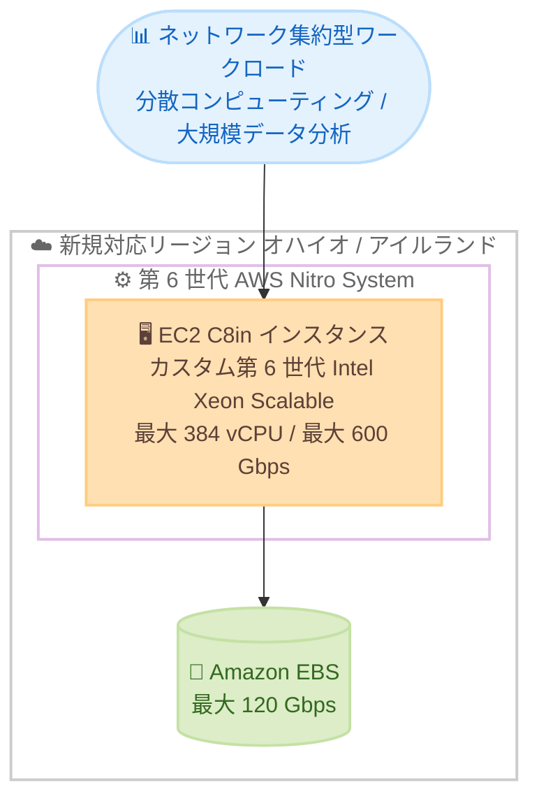

# Amazon EC2 - C8in インスタンスが追加リージョンで利用可能に

**リリース日**: 2026年6月25日
**サービス**: Amazon EC2
**機能**: ネットワーク最適化 C8in インスタンス

📊 [このアップデートのインフォグラフィックを見る](https://takech9203.github.io/aws-news-summary/20260625-amazon-ec2-c8in-ireland-ohio.html)
<!-- INFOGRAPHIC_BASE_URL は環境変数から取得 -->

## 概要

AWS は、ネットワーク最適化された Amazon EC2 C8in インスタンスを、米国東部 (オハイオ) リージョンおよび欧州 (アイルランド) リージョンで提供開始しました。C8in は AWS のみで利用可能なカスタム第 6 世代 Intel Xeon Scalable プロセッサを搭載し、最新の第 6 世代 AWS Nitro カードと組み合わせることで、前世代の C6in と比較して最大 43% 高いパフォーマンスを実現します。

C8in の最大の特徴は、最大 600 Gbps のネットワーク帯域幅です。これは AWS の拡張ネットワーキング対応 EC2 インスタンスの中で最も高い帯域幅であり、分散コンピューティングや大規模データ分析といったネットワーク集約型ワークロードに最適です。インスタンスサイズは最大 384 vCPU までスケールし、大規模な並列処理にも対応できます。

今回のリージョン拡大により、これまで米国東部 (バージニア北部)、米国西部 (オレゴン)、アジアパシフィック (東京、シドニー、シンガポール、マレーシア)、欧州 (スペイン、フランクフルト) で提供されていた C8in が、米国東部 (オハイオ) と欧州 (アイルランド) でも利用できるようになりました。Savings Plans、オンデマンド、スポットインスタンスの各購入オプションで提供されます。

**アップデート前の課題**

- 米国東部 (オハイオ) および欧州 (アイルランド) リージョンでは、最新世代のネットワーク最適化 C8in インスタンスを選択できなかった
- これらのリージョンで高いネットワーク帯域幅を必要とするワークロードを構築する場合、前世代の C6in などを利用する必要があった
- データレジデンシーや低レイテンシーの要件により、これらのリージョン内に最新世代インスタンスを配置できなかった

**アップデート後の改善**

- 米国東部 (オハイオ) と欧州 (アイルランド) で C8in インスタンスを利用できるようになった
- 当該リージョンで C6in 比 最大 43% 高いパフォーマンスと最大 600 Gbps のネットワーク帯域幅が利用可能になった
- これらのリージョンでデータレジデンシー要件を満たしつつ、ネットワーク集約型ワークロードを最新世代基盤で運用できるようになった

## アーキテクチャ図



第 6 世代 AWS Nitro System 上に構築された C8in インスタンスが、オハイオ / アイルランドリージョンで分散コンピューティングや大規模データ分析などのネットワーク集約型ワークロードを処理する構成を示しています。

## サービスアップデートの詳細

### 主要機能

1. **カスタム第 6 世代 Intel Xeon Scalable プロセッサの採用**
   - AWS のみで利用可能なカスタム第 6 世代 Intel Xeon Scalable プロセッサを搭載
   - 前世代の C6in インスタンスと比較して最大 43% 高いパフォーマンスを提供
   - 常時有効のメモリ暗号化など、最新世代プロセッサの機能を活用できる

2. **業界最高水準のネットワーク帯域幅**
   - 最大 600 Gbps のネットワーク帯域幅を提供し、拡張ネットワーキング対応 EC2 インスタンスの中で最も高い
   - 分散コンピューティングや大規模データ分析などのネットワーク集約型ワークロードに最適
   - 大きいサイズでは Elastic Fabric Adapter (EFA) もサポートし、低レイテンシーなノード間通信を実現

3. **最新の第 6 世代 AWS Nitro カードと大規模スケール**
   - 最新の第 6 世代 AWS Nitro カードを採用し、ネットワークとストレージの処理をオフロード
   - 最大 384 vCPU、768 GiB メモリまでスケールアップ可能
   - ベアメタルサイズ (metal-48xl、metal-96xl) も提供

## 技術仕様

### C8in インスタンスサイズ一覧

| サイズ | vCPU | メモリ (GiB) | ネットワーク帯域幅 (Gbps) | EBS 帯域幅 (Gbps) |
|------|------|------|------|------|
| large | 2 | 4 | 最大 25 | 最大 10 |
| xlarge | 4 | 8 | 最大 30 | 最大 10 |
| 2xlarge | 8 | 16 | 最大 40 | 最大 10 |
| 4xlarge | 16 | 32 | 最大 50 | 最大 10 |
| 8xlarge | 32 | 64 | 50 | 10 |
| 12xlarge | 48 | 96 | 75 | 15 |
| 16xlarge | 64 | 128 | 100 | 25 |
| 24xlarge | 96 | 192 | 150 | 30 |
| 32xlarge | 128 | 256 | 200 | 40 |
| 48xlarge | 192 | 384 | 300 | 60 |
| 96xlarge | 384 | 768 | 600 | 120 |
| metal-48xl | 192 | 384 | 300 | 60 |
| metal-96xl | 384 | 768 | 600 | 120 |

### C8in と C6in の比較

| 項目 | C8in | C6in |
|------|------|------|
| プロセッサ | カスタム第 6 世代 Intel Xeon Scalable (AWS 限定) | 第 3 世代 Intel Xeon Scalable (Ice Lake) |
| パフォーマンス | C6in 比 最大 43% 向上 | 基準 |
| Nitro カード | 第 6 世代 AWS Nitro カード | 旧世代 Nitro カード |
| 最大 vCPU | 384 | 128 |
| 最大ネットワーク帯域幅 | 600 Gbps | 200 Gbps |
| ストレージ | EBS のみ | EBS のみ |
| ベアメタル | metal-48xl、metal-96xl | あり |

### 購入オプション

| オプション | 詳細 |
|------|------|
| オンデマンド | 長期契約なしで利用した分だけ支払い |
| スポットインスタンス | 中断を許容できるワークロードで最大割引を活用 |
| Savings Plans | 1 年または 3 年の利用コミットでコスト削減 |

## 設定方法

### 前提条件

1. 米国東部 (オハイオ、us-east-2) または欧州 (アイルランド、eu-west-1) リージョンを利用できる AWS アカウント
2. EC2 インスタンスの起動に必要な IAM 権限
3. 対象リージョンの VPC、サブネット、セキュリティグループなどのネットワーク設定

### 手順

#### ステップ1: 利用可能なインスタンスタイプの確認

```bash
aws ec2 describe-instance-type-offerings \
  --location-type availability-zone \
  --filters "Name=instance-type,Values=c8in.*" \
  --region us-east-2
```

このコマンドは、米国東部 (オハイオ) リージョンの各アベイラビリティーゾーンで利用可能な C8in インスタンスタイプを一覧表示します。アイルランドリージョンの場合は `--region eu-west-1` を指定します。

#### ステップ2: C8in インスタンスの起動

```bash
aws ec2 run-instances \
  --image-id ami-xxxxxxxxxxxxxxxxx \
  --instance-type c8in.8xlarge \
  --key-name my-key-pair \
  --subnet-id subnet-xxxxxxxx \
  --region us-east-2
```

指定した AMI とサブネットを使用して、C8in インスタンス (例: c8in.8xlarge) をオハイオリージョンで起動します。`--instance-type` を変更することで large から 96xlarge、ベアメタルまで選択できます。

#### ステップ3: ワークロードに合わせたサイズと EFA 設定の選択

ネットワーク帯域幅の要件に応じて適切なサイズを選択します。最大 600 Gbps を必要とする場合は 96xlarge または metal-96xl を選択します。低レイテンシーなノード間通信が必要な HPC ワークロードでは、48xlarge 以上のサイズで Elastic Fabric Adapter (EFA) を有効化します。

## メリット

### ビジネス面

- **コストパフォーマンスの向上**: C6in 比で最大 43% のパフォーマンス向上により、同等のワークロードをより少ないインスタンス数で処理でき、コスト最適化につながります
- **リージョン内でのデータ配置**: オハイオおよびアイルランドリージョン内で最新世代インスタンスを利用でき、データレジデンシー要件や低レイテンシー要件に対応しやすくなります
- **柔軟な購入オプション**: オンデマンド、スポット、Savings Plans を組み合わせることでコストを最適化できます

### 技術面

- **業界最高水準のネットワーク性能**: 最大 600 Gbps の帯域幅により、ネットワークがボトルネックになりやすい分散処理や大規模データ転送を高速化できます
- **大規模スケールアップ**: 最大 384 vCPU、768 GiB メモリにより、単一インスタンスで大規模な並列処理に対応できます
- **EFA による低レイテンシー通信**: 大きいサイズでは EFA をサポートし、HPC や分散学習でのノード間通信を高速化できます

## デメリット・制約事項

### 制限事項

- ベアメタルを含む全サイズが、すべてのアベイラビリティーゾーンで提供されるとは限らないため、事前に確認が必要です
- C8in はローカル NVMe ストレージを持たず EBS のみのため、ローカルストレージが必要なワークロードには別のインスタンスファミリーを検討する必要があります
- スポットインスタンスは中断の可能性があるため、中断耐性のあるワークロードでの利用が前提となります

### 考慮すべき点

- 新世代インスタンスへの移行時は、AMI やドライバーが最新世代に対応しているか確認してください
- 最大 600 Gbps の帯域幅を活用するには、最上位サイズ (96xlarge / metal-96xl) の選択とアプリケーション側の並列性が必要です
- EFA を利用する場合は、対応するサイズの選択と EFA 対応の設定が必要です

## ユースケース

### ユースケース1: 大規模データ分析基盤

**シナリオ**: オハイオまたはアイルランドを拠点とする企業が、ペタバイト規模のデータを対象とした分散分析処理を実行する。

**実装例**:
```
c8in.48xlarge を複数台構成し、分散処理フレームワーク (Spark / Presto など) のワーカーノードとして利用
```

**効果**: 高いネットワーク帯域幅によりノード間のデータシャッフルが高速化され、分析ジョブの完了時間を短縮できます。

### ユースケース2: HPC・分散コンピューティング

**シナリオ**: 科学技術計算やシミュレーションなど、多数のノードが密結合で通信する HPC ワークロードを実行する。

**実装例**:
```
c8in.96xlarge を EFA 有効でクラスタープレイスメントグループ内に配置し、MPI ジョブを実行
```

**効果**: 最大 600 Gbps の帯域幅と EFA による低レイテンシー通信により、密結合の並列計算を効率的にスケールできます。

### ユースケース3: ネットワーク集約型のデータ転送・キャッシュ層

**シナリオ**: 大量のデータをリアルタイムに転送・配信する高スループットのキャッシュ層やプロキシ層を構築する。

**実装例**:
```
c8in.16xlarge を Auto Scaling グループで構成し、高スループットのキャッシュ / 配信ノードとして配置
```

**効果**: 高いネットワーク帯域幅により、単一インスタンスあたりのスループットを最大化し、必要なインスタンス台数を削減できます。

## 料金

C8in インスタンスは、オンデマンド、スポットインスタンス、Savings Plans の各購入オプションで利用できます。料金は使用するインスタンスサイズとリージョン、購入オプションによって異なります。最新の料金は AWS 公式の料金ページで確認してください。

## 利用可能リージョン

今回のアップデートにより、Amazon EC2 C8in インスタンスは米国東部 (オハイオ、us-east-2) および欧州 (アイルランド、eu-west-1) リージョンで利用可能になりました。これにより、C8in は以下のリージョンで提供されています。

- 米国東部 (バージニア北部、オハイオ)
- 米国西部 (オレゴン)
- アジアパシフィック (東京、シドニー、シンガポール、マレーシア)
- 欧州 (スペイン、フランクフルト、アイルランド)

## 関連サービス・機能

- **AWS Nitro System**: C8in インスタンスの基盤となる仮想化システムで、第 6 世代 Nitro カードがネットワークとストレージの処理をオフロードします
- **Elastic Fabric Adapter (EFA)**: 大きいサイズの C8in でサポートされ、HPC や分散学習でのノード間低レイテンシー通信を実現します
- **Amazon EBS**: C8in インスタンスに最大 120 Gbps の帯域幅で接続できるブロックストレージサービスです
- **AWS Savings Plans**: C8in インスタンスのコストを長期コミットにより削減できる料金モデルです

## 参考リンク

- 📊 [インフォグラフィック](https://takech9203.github.io/aws-news-summary/20260625-amazon-ec2-c8in-ireland-ohio.html)
- [公式発表 (What's New)](https://aws.amazon.com/about-aws/whats-new/2026/06/amazon-ec2-c8in-ireland-ohio/)
- [Amazon EC2 C8i および C8in インスタンス](https://aws.amazon.com/ec2/instance-types/c8i/)
- [Amazon EC2 料金](https://aws.amazon.com/ec2/pricing/)

## まとめ

Amazon EC2 C8in インスタンスが米国東部 (オハイオ) および欧州 (アイルランド) リージョンで利用可能になり、カスタム第 6 世代 Intel Xeon Scalable プロセッサと最大 600 Gbps のネットワーク帯域幅を当該リージョンで活用できるようになりました。分散コンピューティング、大規模データ分析、HPC などのネットワーク集約型ワークロードを運用している場合は、C6in からの移行や新規構築の候補として C8in の検証を検討することをお勧めします。
