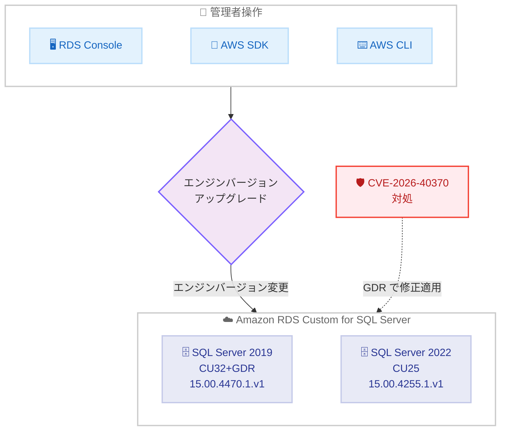

# Amazon RDS Custom for SQL Server - 最新 CU および GDR アップデートのサポート

**リリース日**: 2026 年 6 月 25 日
**サービス**: Amazon RDS Custom for SQL Server
**機能**: Microsoft SQL Server 向け累積的更新プログラム (CU) および General Distribution Release (GDR) アップデートのサポート

📊 [このアップデートのインフォグラフィックを見る](https://takech9203.github.io/aws-news-summary/20260625-amazon-rds-custom-supports-latest-cu-gdr-updates-microsoft-sql-server.html)
<!-- INFOGRAPHIC_BASE_URL は環境変数から取得 -->

## 概要

Amazon RDS Custom for SQL Server が、Microsoft SQL Server の最新の累積的更新プログラム (Cumulative Updates, CU) および General Distribution Release (GDR) アップデートのサポートを開始しました。今回のリリースでは、SQL Server 2019 CU32+GDR (KB5090407、RDS バージョン 15.00.4470.1.v1) および SQL Server 2022 CU25 (KB5081477、RDS バージョン 15.00.4255.1.v1) が利用可能になりました。

GDR アップデートは、CVE-2026-40370 で説明されている脆弱性に対処します。CU は機能改善やバグ修正を累積的に含む更新プログラムであり、GDR はセキュリティ修正など重要な修正のみを提供します。本アップデートでは、CU と GDR を組み合わせた更新が提供され、機能改善とセキュリティ修正の両方を適用できます。

Amazon RDS Custom for SQL Server は、データベースおよびオペレーティングシステムへの管理者アクセスを必要とする、レガシーかつカスタム、パッケージ化されたアプリケーション向けのマネージドデータベースサービスです。お客様は、Amazon RDS Management Console、AWS SDK、または AWS CLI を使用して、RDS Custom for SQL Server インスタンスをアップグレードし、これらの更新を適用できます。なお、本アップデートは RDS Custom を対象としており、標準の Amazon RDS for SQL Server 向けの GDR アップデートとは別のリリースです。

**アップデート前の課題**

- 以前は SQL Server 2019 CU32+GDR (KB5090407) および SQL Server 2022 CU25 (KB5081477) に相当する更新が RDS Custom で利用できなかった
- CVE-2026-40370 で説明されている脆弱性に対処する手段が限定されていた
- 最新の累積的更新プログラムによる機能改善とセキュリティ修正を反映した RDS Custom エンジンバージョンが提供されていなかった

**アップデート後の改善**

- 今回のアップデートにより、SQL Server 2019 CU32+GDR および SQL Server 2022 CU25 を含む RDS Custom エンジンバージョンへのアップグレードが可能になった
- 今回のアップデートにより、CVE-2026-40370 で説明されている脆弱性への対処が可能になった
- Amazon RDS Management Console、AWS SDK、AWS CLI から容易にアップグレードを実施できるようになった

## アーキテクチャ図



管理者がコンソール、SDK、または CLI からエンジンバージョンの変更を実行することで、CU および GDR が適用された RDS Custom エンジンバージョンに DB インスタンスをアップグレードする流れを示しています。GDR による CVE-2026-40370 の修正が両バージョンに適用されます。

## サービスアップデートの詳細

### 主要機能

1. **SQL Server 2019 CU32+GDR サポート**
   - RDS バージョン: 15.00.4470.1.v1
   - Microsoft KB: KB5090407
   - 累積的更新プログラム 32 に GDR のセキュリティ修正を統合

2. **SQL Server 2022 CU25 サポート**
   - RDS バージョン: 15.00.4255.1.v1
   - Microsoft KB: KB5081477
   - 累積的更新プログラム 25 による機能改善とバグ修正を提供

3. **CVE-2026-40370 への対処**
   - GDR アップデートが CVE-2026-40370 で説明されている脆弱性に対処
   - GDR チャネルを通じた重要なセキュリティ修正の提供

## 技術仕様

### 対応バージョン一覧

| SQL Server バージョン | アップデート種別 | KB 番号 | RDS バージョン |
|------|------|------|------|
| SQL Server 2019 | CU32+GDR | KB5090407 | 15.00.4470.1.v1 |
| SQL Server 2022 | CU25 | KB5081477 | 15.00.4255.1.v1 |

### 対処される CVE

| CVE 番号 | 概要 |
|------|------|
| CVE-2026-40370 | Microsoft SQL Server に存在する脆弱性。GDR アップデートで対処 |

### API 変更履歴

本アップデートは、エンジンバージョンの変更により CU/GDR を適用するものであり、新規 API の追加は伴いません。既存の RDS API (`ModifyDBInstance` 等) を使用してアップグレードを実行します。

## 設定方法

### 前提条件

1. 対象の SQL Server バージョン (2019 または 2022) を実行している Amazon RDS Custom for SQL Server インスタンスが存在すること
2. エンジンバージョンの変更を実行する権限 (`rds:ModifyDBInstance` など) を持つ IAM 権限があること
3. RDS Custom 固有のカスタマイズ (カスタム構成、エージェント等) がアップグレードと互換性があることを事前に確認していること

### 手順

#### ステップ1: 現在のエンジンバージョンを確認する

```bash
aws rds describe-db-instances \
  --db-instance-identifier my-rds-custom-instance \
  --query "DBInstances[].EngineVersion"
```

対象の DB インスタンスが現在実行しているエンジンバージョンを確認します。出力されたバージョンが上記の CU/GDR 適用済みバージョンより古い場合はアップグレードの対象となります。

#### ステップ2: 利用可能なアップグレード先バージョンを確認する

```bash
aws rds describe-db-engine-versions \
  --engine custom-sqlserver-ee \
  --engine-version 15.00.4470.1.v1 \
  --query "DBEngineVersions[].ValidUpgradeTarget[].EngineVersion"
```

現在のエンジンから移行可能なアップグレード先のバージョンを確認します。`--engine` には対象エディション (例: `custom-sqlserver-ee`、`custom-sqlserver-se`、`custom-sqlserver-web`) を指定します。

#### ステップ3: エンジンバージョンをアップグレードする

```bash
aws rds modify-db-instance \
  --db-instance-identifier my-rds-custom-instance \
  --engine-version 15.00.4470.1.v1 \
  --apply-immediately
```

DB インスタンスのエンジンバージョンを CU/GDR 適用済みバージョンに変更します。`--apply-immediately` を指定すると即時に適用され、省略すると次回のメンテナンスウィンドウで適用されます。アップグレード中はインスタンスの再起動が発生するため、本番環境では事前にスナップショットを取得し、メンテナンスウィンドウでの適用を検討してください。

## メリット

### ビジネス面

- **セキュリティリスクの低減**: CVE-2026-40370 で説明されている脆弱性に対処することで、セキュリティインシデントのリスクを低減できる
- **コンプライアンス対応**: 最新のセキュリティ修正を適用することで、セキュリティ基準やコンプライアンス要件への対応が容易になる
- **運用負荷の軽減**: マネージドサービスの仕組みにより、パッチ適用作業の負担を軽減できる

### 技術面

- **機能改善とセキュリティ修正の両立**: CU による機能改善・バグ修正と、GDR によるセキュリティ修正の両方を適用できる
- **管理者アクセスの維持**: RDS Custom の特性により、OS およびデータベースへの管理者アクセスを保ちながら更新を適用できる
- **複数の適用手段**: コンソール、SDK、CLI から適用できるため、既存の運用ワークフローへの組み込みや自動化が容易

## デメリット・制約事項

### 制限事項

- エンジンバージョンの変更にはインスタンスの再起動が伴い、一時的なダウンタイムが発生する
- アップグレード後に元のバージョンへ戻すことは容易ではないため、事前のスナップショット取得が推奨される
- RDS Custom 固有のカスタマイズがアップグレードと互換性があることを事前に検証する必要がある

### 考慮すべき点

- 本番環境への適用前に、テスト環境で動作検証とアプリケーションの互換性テストを実施することが望ましい
- CU には機能変更が含まれるため、ワークロードへの影響を確認すること
- Multi-AZ 構成の場合、フェイルオーバーの挙動とタイミングを計画する

## ユースケース

### ユースケース1: 本番データベースのセキュリティパッチ適用

**シナリオ**: SQL Server 2019 を RDS Custom で本番運用しており、CVE-2026-40370 への対処が必要なケース。

**実装例**:
```
1. スナップショットを取得
2. メンテナンスウィンドウを設定
3. エンジンバージョンを 15.00.4470.1.v1 に変更
```

**効果**: 計画的なメンテナンスウィンドウ内でセキュリティパッチを適用し、脆弱性のリスクを低減できる。

### ユースケース2: 最新 CU による機能改善の取り込み

**シナリオ**: SQL Server 2022 を運用しており、CU25 に含まれる機能改善とバグ修正を取り込みたいケース。

**実装例**:
```bash
# テスト環境で先行検証
aws rds modify-db-instance \
  --db-instance-identifier test-sql2022-instance \
  --engine-version 15.00.4255.1.v1 \
  --apply-immediately

# 検証後、本番環境にメンテナンスウィンドウで適用
aws rds modify-db-instance \
  --db-instance-identifier prod-sql2022-instance \
  --engine-version 15.00.4255.1.v1
```

**効果**: 機能改善を取り込みつつ、計画的なダウンタイムで影響を最小化できる。

### ユースケース3: コンプライアンス要件への対応

**シナリオ**: セキュリティ監査において、データベースエンジンが最新のセキュリティ修正を適用していることを示す必要があるケース。

**実装例**:
```
describe-db-instances で全インスタンスのエンジンバージョンを取得し、
CU/GDR 適用済みバージョンであることを確認
```

**効果**: 最新の CU/GDR 適用状況を可視化し、監査やコンプライアンス報告に活用できる。

## 料金

CU/GDR アップデートの適用自体に追加料金は発生しません。Amazon RDS Custom for SQL Server の通常の料金 (インスタンス、ストレージ、ライセンスなど) が適用されます。詳細は Amazon RDS Custom for SQL Server の料金ページを参照してください。

## 利用可能リージョン

Amazon RDS Custom for SQL Server が提供されているリージョンで利用可能です。詳細な提供状況については AWS の公式情報を参照してください。

## 関連サービス・機能

- **Amazon RDS for SQL Server**: 標準のフルマネージド SQL Server サービス。同日に標準 RDS 向けの GDR アップデートも別途リリースされている
- **AWS CLI / AWS SDK**: エンジンバージョンのアップグレードをプログラム的に実行する手段
- **Amazon RDS Custom のマルチ AZ 配置**: アップグレード時の可用性とダウンタイムに影響する構成オプション

## 参考リンク

- 📊 [インフォグラフィック](https://takech9203.github.io/aws-news-summary/20260625-amazon-rds-custom-supports-latest-cu-gdr-updates-microsoft-sql-server.html)
- [公式発表 (What's New)](https://aws.amazon.com/about-aws/whats-new/2026/06/amazon-rds-custom-supports-latest-cu-gdr-updates-microsoft-sql-server)
- [Amazon RDS Custom for SQL Server のアップグレード (ドキュメント)](https://docs.aws.amazon.com/AmazonRDS/latest/UserGuide/custom-upgrading-sqlserver.html)
- [Amazon RDS Custom 製品ページ](https://aws.amazon.com/rds/custom/)
- [KB5090407 - SQL Server 2019 CU32+GDR](https://support.microsoft.com/help/5090407)
- [KB5081477 - SQL Server 2022 CU25](https://support.microsoft.com/help/5081477)

## まとめ

本アップデートにより、Amazon RDS Custom for SQL Server で SQL Server 2019 CU32+GDR (KB5090407) および SQL Server 2022 CU25 (KB5081477) が利用可能になり、CVE-2026-40370 で説明されている脆弱性への対処と最新の機能改善の取り込みが可能になりました。対象バージョンを運用しているお客様は、スナップショット取得やテスト環境での検証などの準備を行ったうえで、計画的にエンジンバージョンのアップグレードを実施することが推奨されます。
