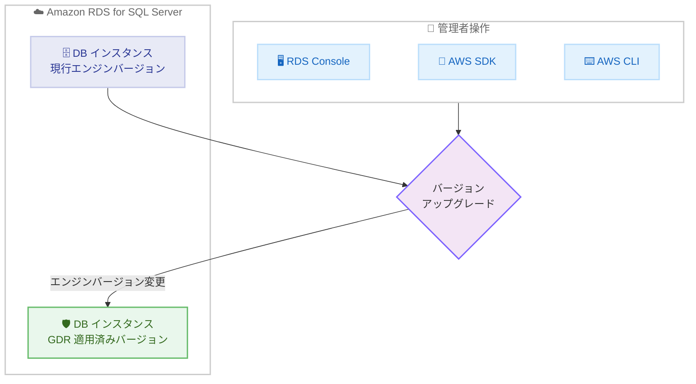

# Amazon RDS for SQL Server - 最新の GDR アップデートのサポート

**リリース日**: 2026 年 6 月 25 日
**サービス**: Amazon RDS for SQL Server
**機能**: Microsoft SQL Server 向け General Distribution Release (GDR) アップデートのサポート

📊 [このアップデートのインフォグラフィックを見る](https://takech9203.github.io/aws-news-summary/20260625-amazon-rds-supports-latest-gdr-updates-microsoft-sql-server.html)
<!-- INFOGRAPHIC_BASE_URL は環境変数から取得 -->

## 概要

Amazon RDS for SQL Server が、Microsoft SQL Server の最新の General Distribution Release (GDR) アップデートのサポートを開始しました。GDR は、機能追加を伴う累積的更新プログラム (CU) とは異なり、セキュリティ修正など重要な修正のみを提供する更新プログラムです。今回のリリースでは、SQL Server 2016、2017、2019、2022 の各バージョンに対応する GDR アップデートが利用可能になりました。

今回の GDR アップデートは、CVE-2026-32167 および CVE-2026-32176 で説明されている脆弱性に対処します。これらは Microsoft SQL Server に存在するセキュリティ上の脆弱性であり、本番環境で SQL Server を運用するお客様にとってはセキュリティ対策の観点から重要なアップデートです。

AWS は、Amazon RDS Management Console、AWS SDK、または AWS CLI を使用して、Amazon RDS for SQL Server インスタンスをアップグレードし、これらの更新を適用することを推奨しています。データベース管理者やセキュリティ運用担当者は、対象バージョンを運用している場合、計画的にアップグレードを実施することが望まれます。

**アップデート前の課題**

- 以前は最新の GDR アップデートが RDS で利用できず、CVE-2026-32167 および CVE-2026-32176 の脆弱性に対処できなかった
- セキュリティパッチを適用するために、自己管理の SQL Server 環境では手動でのパッチ適用作業が必要だった
- 最新のセキュリティ修正が反映された RDS エンジンバージョンが提供されていなかった

**アップデート後の改善**

- 今回のアップデートにより、最新の GDR を含む RDS エンジンバージョンへのアップグレードが可能になった
- 今回のアップデートにより、CVE-2026-32167 および CVE-2026-32176 で説明されている脆弱性への対処が可能になった
- マネージドサービスの仕組みを利用して、コンソール、SDK、CLI から容易にセキュリティ更新を適用できるようになった

## アーキテクチャ図



管理者がコンソール、SDK、または CLI からエンジンバージョンの変更を実行することで、GDR が適用された RDS エンジンバージョンに DB インスタンスをアップグレードする流れを示しています。

## サービスアップデートの詳細

### 主要機能

1. **対応する SQL Server バージョンと GDR アップデート**
   - SQL Server 2016 SP3+GDR KB5084821 (RDS バージョン 13.00.6485.1.v1)
   - SQL Server 2017 CU31+GDR KB5084818 (RDS バージョン 14.00.3525.1.v1)
   - SQL Server 2019 CU32+GDR KB5084816 (RDS バージョン 15.00.4465.1.v1)
   - SQL Server 2022 CU24+GDR KB5083252 (RDS バージョン 16.00.4250.1.v1)

2. **対処されるセキュリティ脆弱性**
   - CVE-2026-32167 で説明されている脆弱性に対処
   - CVE-2026-32176 で説明されている脆弱性に対処

3. **アップグレード方法**
   - Amazon RDS Management Console からのエンジンバージョン変更
   - AWS SDK を利用したプログラムによるアップグレード
   - AWS CLI を利用したアップグレード

## 技術仕様

### 対応バージョン一覧

| SQL Server バージョン | KB 番号 | RDS エンジンバージョン |
|------|------|------|
| 2016 SP3+GDR | KB5084821 | 13.00.6485.1.v1 |
| 2017 CU31+GDR | KB5084818 | 14.00.3525.1.v1 |
| 2019 CU32+GDR | KB5084816 | 15.00.4465.1.v1 |
| 2022 CU24+GDR | KB5083252 | 16.00.4250.1.v1 |

### 対処される CVE

| CVE 番号 | 概要 |
|------|------|
| CVE-2026-32167 | Microsoft SQL Server に存在する脆弱性。GDR アップデートで対処 |
| CVE-2026-32176 | Microsoft SQL Server に存在する脆弱性。GDR アップデートで対処 |

## 設定方法

### 前提条件

1. 対象の SQL Server バージョンを実行している Amazon RDS for SQL Server インスタンスが存在すること
2. エンジンバージョンの変更を実行する権限 (`rds:ModifyDBInstance` など) を持つ IAM 権限があること
3. アップグレードに伴うダウンタイムを許容できるメンテナンスウィンドウを計画していること

### 手順

#### ステップ1: 現在のエンジンバージョンを確認する

```bash
aws rds describe-db-instances \
  --db-instance-identifier my-sqlserver-instance \
  --query "DBInstances[].EngineVersion"
```

対象の DB インスタンスが現在実行しているエンジンバージョンを確認します。出力されたバージョンが、上記の GDR 適用済みバージョンより古い場合はアップグレードの対象となります。

#### ステップ2: 利用可能なアップグレード先バージョンを確認する

```bash
aws rds describe-db-engine-versions \
  --engine sqlserver-se \
  --engine-version 15.00.4465.1.v1 \
  --query "DBEngineVersions[].ValidUpgradeTarget[].EngineVersion"
```

現在のエンジンから移行可能なアップグレード先のバージョンを確認します。`--engine` には対象エディション (例: `sqlserver-se`、`sqlserver-ee`、`sqlserver-ex`、`sqlserver-web`) を指定します。

#### ステップ3: エンジンバージョンをアップグレードする

```bash
aws rds modify-db-instance \
  --db-instance-identifier my-sqlserver-instance \
  --engine-version 15.00.4465.1.v1 \
  --apply-immediately
```

DB インスタンスのエンジンバージョンを GDR 適用済みバージョンに変更します。`--apply-immediately` を指定すると即時に適用され、省略すると次回のメンテナンスウィンドウで適用されます。本番環境では事前にスナップショットを取得し、メンテナンスウィンドウでの適用を検討してください。

## メリット

### ビジネス面

- **セキュリティリスクの低減**: 既知の脆弱性 (CVE-2026-32167、CVE-2026-32176) に対処することで、セキュリティインシデントのリスクを低減できる
- **コンプライアンス対応**: 最新のセキュリティ修正を適用することで、セキュリティ基準やコンプライアンス要件への対応が容易になる
- **運用負荷の軽減**: マネージドサービスの仕組みにより、パッチ適用作業の負担を軽減できる

### 技術面

- **機能影響の最小化**: GDR はセキュリティ修正など重要な修正のみを含むため、CU と比較して機能変更の影響が小さい
- **複数の適用手段**: コンソール、SDK、CLI から適用できるため、運用の自動化や既存のワークフローへの組み込みが容易
- **幅広いバージョン対応**: SQL Server 2016 から 2022 までの主要バージョンに対応

## デメリット・制約事項

### 制限事項

- エンジンバージョンの変更にはダウンタイムが発生する
- GDR はセキュリティ修正など重要な修正に限定されており、新機能は含まれない
- アップグレード後に元のバージョンへ戻すことは容易ではないため、事前のスナップショット取得が推奨される

### 考慮すべき点

- 本番環境への適用前に、ステージング環境などで動作検証を実施することが望ましい
- マルチ AZ 構成の場合とシングル AZ 構成の場合でダウンタイムの挙動が異なるため、構成に応じた計画が必要
- アプリケーション側の接続再試行ロジックを確認し、アップグレード時の瞬断に備えること

## ユースケース

### ユースケース1: 本番データベースのセキュリティパッチ適用

**シナリオ**: SQL Server 2019 を本番環境で運用しており、CVE-2026-32167 および CVE-2026-32176 への対処が必要なケース。

**実装例**:
```
1. スナップショットを取得
2. メンテナンスウィンドウを設定
3. エンジンバージョンを 15.00.4465.1.v1 に変更
```

**効果**: 計画的なメンテナンスウィンドウ内でセキュリティパッチを適用し、脆弱性のリスクを低減できる。

### ユースケース2: 複数インスタンスへの一括適用の自動化

**シナリオ**: 多数の RDS for SQL Server インスタンスを運用しており、GDR アップデートを統一的に適用したいケース。

**実装例**:
```
AWS CLI または SDK を使い、対象インスタンスのリストに対して
modify-db-instance を順次実行するスクリプトを作成
```

**効果**: 手動操作を減らし、適用漏れを防ぎながら効率的にセキュリティ更新を展開できる。

### ユースケース3: コンプライアンス要件への対応

**シナリオ**: セキュリティ監査において、データベースエンジンが最新のセキュリティ修正を適用していることを示す必要があるケース。

**実装例**:
```
describe-db-instances で全インスタンスのエンジンバージョンを取得し、
GDR 適用済みバージョンであることを確認
```

**効果**: 最新の GDR 適用状況を可視化し、監査やコンプライアンス報告に活用できる。

## 料金

GDR アップデートの適用自体に追加料金は発生しません。Amazon RDS for SQL Server の通常の料金 (インスタンス、ストレージ、ライセンスなど) が適用されます。詳細は Amazon RDS for SQL Server の料金ページを参照してください。

## 利用可能リージョン

Amazon RDS for SQL Server が提供されているリージョンで利用可能です。詳細な提供状況については AWS の公式情報を参照してください。

## 関連サービス・機能

- **Amazon RDS**: 本アップデートの対象となるマネージドリレーショナルデータベースサービス
- **AWS CLI / AWS SDK**: エンジンバージョンのアップグレードをプログラム的に実行する手段
- **Amazon RDS のマルチ AZ 配置**: アップグレード時の可用性とダウンタイムに影響する構成オプション

## 参考リンク

- 📊 [インフォグラフィック](https://takech9203.github.io/aws-news-summary/20260625-amazon-rds-supports-latest-gdr-updates-microsoft-sql-server.html)
- [公式発表 (What's New)](https://aws.amazon.com/about-aws/whats-new/2026/06/amazon-rds-supports-latest-gdr-updates-microsoft-sql-server)
- [Amazon RDS for SQL Server ユーザーガイド](https://docs.aws.amazon.com/AmazonRDS/latest/UserGuide/CHAP_SQLServer.html)
- [Amazon RDS for SQL Server 料金ページ](https://aws.amazon.com/rds/sqlserver/pricing/)

## まとめ

本アップデートにより、Amazon RDS for SQL Server で CVE-2026-32167 および CVE-2026-32176 に対処する最新の GDR が利用可能になりました。対象バージョン (SQL Server 2016、2017、2019、2022) を運用しているお客様は、セキュリティリスクを低減するため、スナップショット取得などの準備を行ったうえで、計画的にエンジンバージョンのアップグレードを実施することが推奨されます。
