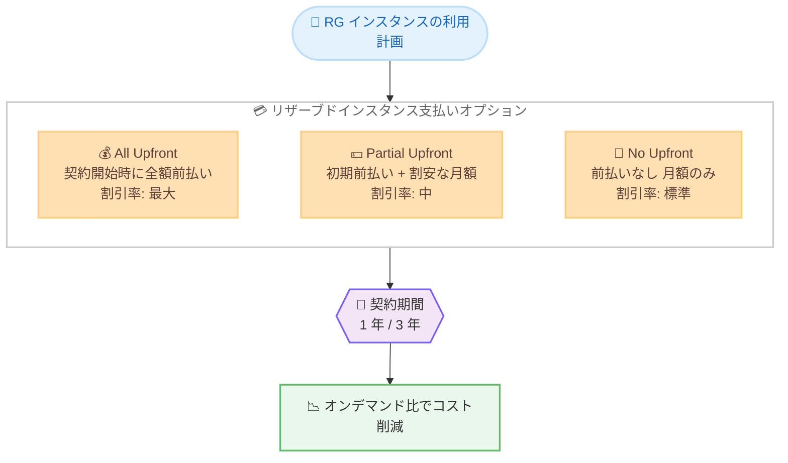

# Amazon Redshift - RG インスタンス向けリザーブドインスタンスの前払いオプション追加

**リリース日**: 2026 年 6 月 25 日
**サービス**: Amazon Redshift
**機能**: RG インスタンス向けリザーブドインスタンスの All Upfront / Partial Upfront 支払いオプション

📊 [このアップデートのインフォグラフィックを見る](https://takech9203.github.io/aws-news-summary/20260625-amazon-redshift-ri-upfront-pricing-rg-instances.html)
<!-- INFOGRAPHIC_BASE_URL は環境変数から取得 -->

## 概要

Amazon Redshift は、RG インスタンスのリザーブドインスタンス (Reserved Instance, RI) において、1 年および 3 年契約を対象とした All Upfront (全額前払い) と Partial Upfront (一部前払い) の支払いオプションの提供を開始しました。これにより、これまで利用可能だった No Upfront (前払いなし) と合わせて、3 種類の支払いオプションから選択できるようになりました。

リザーブドインスタンスは、一定期間の利用を事前にコミットすることで、オンデマンド料金と比較して大幅なコスト削減を実現する購入方式です。今回の前払いオプションの追加により、お客様は自社の財務状況やキャッシュフローの方針に合わせて、最適な支払い方法を柔軟に選択できるようになります。

具体的には、All Upfront は契約期間分の費用を契約開始時に一括で支払うことで最大の割引率を得られます。一方、Partial Upfront は初回の前払い金と、それに続く割安な月額料金に費用を分割して支払う方式です。これらのオプションは、東京リージョンや大阪リージョンを含む多くのリージョンで利用可能です。

**アップデート前の課題**

- RG インスタンスのリザーブドインスタンスでは No Upfront (前払いなし) のみが選択可能であり、支払い方法の選択肢が限られていた
- 前払いを行うことで得られる、より高い割引率を活用できなかった
- 財務方針として初期に費用を確定させたい場合でも、月額均等払いに限定されていた

**アップデート後の改善**

- All Upfront と Partial Upfront が追加され、3 種類の支払いオプションから選択できるようになった
- 全額前払いを選択することで、最大の割引率によるコスト削減が可能になった
- 初期費用と月額費用の配分を、財務の好みに応じて柔軟に最適化できるようになった

## アーキテクチャ図

3 種類の支払いオプションと契約期間の組み合わせにより、オンデマンド料金と比較したコスト削減を実現します。前払いの割合が大きいほど割引率が高くなる傾向があります。

## サービスアップデートの詳細

### 主要機能

1. **All Upfront (全額前払い)**
   - 契約期間分の費用を契約開始時に一括で支払う方式
   - 3 種類の支払いオプションの中で最大の割引率を提供
   - 初期に費用を確定させ、契約期間中の追加支払いを発生させたくない場合に適している

2. **Partial Upfront (一部前払い)**
   - 費用を初回の前払い金と、それに続く割安な月額料金に分割して支払う方式
   - All Upfront ほどの初期負担を避けつつ、No Upfront より高い割引率を得られる
   - 初期費用と継続費用のバランスを取りたい場合に適している

3. **No Upfront (前払いなし) — 従来から提供**
   - 前払いを行わず、契約期間にわたって月額料金のみを支払う方式
   - 初期費用を抑えたい場合に適している

## 技術仕様

### 支払いオプションの比較

| 支払いオプション | 前払い | 月額料金 | 割引率の傾向 | 提供状況 |
|------|------|------|------|------|
| All Upfront | 全額 | なし | 最大 | 今回追加 |
| Partial Upfront | 一部 | 割安な月額 | 中 | 今回追加 |
| No Upfront | なし | 月額のみ | 標準 | 従来から提供 |

### 契約期間

| 項目 | 詳細 |
|------|------|
| 対象インスタンス | Amazon Redshift RG インスタンス |
| 契約期間 | 1 年 / 3 年 |
| 適用対象 | リザーブドインスタンス (Reserved Instance) |

## メリット

### ビジネス面

- **コスト最適化の柔軟性**: 財務方針やキャッシュフローの状況に合わせて、3 種類の支払いオプションから最適なものを選択できる
- **割引率の最大化**: All Upfront を選択することで、オンデマンド料金と比較した割引率を最大化できる
- **予算管理の容易化**: 全額前払いにより契約期間中の費用を確定させ、予算計画を立てやすくなる

### 技術面

- **既存ワークロードへの影響なし**: 支払いオプションの選択はコミットメントの購入方式に関するものであり、稼働中のクラスター構成やパフォーマンスに影響しない
- **長期利用の前提に最適**: 安定して稼働する分析ワークロードに対し、1 年または 3 年のコミットメントでコストを抑えられる

## デメリット・制約事項

### 制限事項

- リザーブドインスタンスは契約期間中のコミットメントであり、途中での解約や柔軟な変更には制約がある
- All Upfront は初期に大きな費用が発生するため、キャッシュフローへの影響を考慮する必要がある

### 考慮すべき点

- 利用量が安定しないワークロードでは、リザーブドインスタンスのコミットメントが過剰になる可能性がある
- 契約期間 (1 年か 3 年) と支払いオプションの組み合わせは、利用見込みと財務方針の両面から検討することが望ましい

## ユースケース

### ユースケース1: 長期稼働の分析基盤でコストを最大限削減したい

**シナリオ**: 24 時間 365 日稼働する基幹分析基盤を Amazon Redshift の RG インスタンスで運用しており、今後 3 年間の利用が確実に見込まれている。

**効果**: 3 年契約の All Upfront を選択することで、最大の割引率を適用し、オンデマンド料金と比較して長期的なコストを大幅に削減できます。

### ユースケース2: 初期費用と継続費用のバランスを取りたい

**シナリオ**: 安定稼働は見込めるものの、契約開始時に全額を一括で支払うのは財務上避けたい。

**効果**: Partial Upfront を選択することで、初期前払い金を抑えつつ、No Upfront より高い割引率を得られ、初期費用と月額費用のバランスを最適化できます。

### ユースケース3: 初期費用を抑えてコミットメントを開始したい

**シナリオ**: 予算の制約により初期費用を最小限に抑えたいが、リザーブドインスタンスの割引は活用したい。

**効果**: 従来から提供されている No Upfront を選択することで、前払いなしで月額料金のみを支払いながら、オンデマンドより低い料金でコミットメントを開始できます。

## 料金

リザーブドインスタンスは、一定期間 (1 年または 3 年) の利用をコミットすることで、オンデマンド料金と比較して大幅なコスト削減を実現します。割引率は支払いオプションによって異なり、前払いの割合が大きいほど高い割引率が適用される傾向があります (All Upfront > Partial Upfront > No Upfront)。

具体的な料金および割引率は、リージョンやインスタンスの種類によって異なります。最新の料金は Amazon Redshift の料金ページを参照してください。

## 利用可能リージョン

All Upfront および Partial Upfront のオプションは、以下を含む多くのリージョンで利用可能です。

- アジアパシフィック: 東京、大阪、ソウル、シンガポール、シドニー、ムンバイ、ジャカルタ、香港、マレーシア、ハイデラバード、台湾、メルボルン、バンコク
- 米国: バージニア北部、オハイオ、オレゴン、北カリフォルニア
- 欧州: アイルランド、フランクフルト、ロンドン、パリ、ストックホルム、ミラノ、スペイン
- その他: カナダ (中部)、南米 (サンパウロ)、アフリカ (ケープタウン)、メキシコ (中部)

## 関連サービス・機能

- **AWS Cost Explorer**: リザーブドインスタンスの推奨事項の確認や、利用状況・カバレッジの分析に活用できる
- **AWS Budgets**: リザーブドインスタンスの利用率やカバレッジに対する予算アラートを設定できる
- **Amazon Redshift Serverless**: 利用量が変動するワークロードでは、コミットメント型ではなく従量課金型の選択肢として検討できる

## 参考リンク

- 📊 [インフォグラフィック](https://takech9203.github.io/aws-news-summary/20260625-amazon-redshift-ri-upfront-pricing-rg-instances.html)
- [公式発表 (What's New)](https://aws.amazon.com/about-aws/whats-new/2026/06/amazon-redshift-ri-upfront-pricing-rg-instances)
- [Amazon Redshift 料金ページ](https://aws.amazon.com/redshift/pricing/)

## まとめ

今回のアップデートにより、Amazon Redshift の RG インスタンスのリザーブドインスタンスで All Upfront と Partial Upfront が選択可能になり、支払いオプションが 3 種類に拡充されました。長期稼働が見込まれる分析ワークロードでは、利用見込みと財務方針に応じて契約期間と支払いオプションを組み合わせることで、コストを最適化できます。現在の利用状況を AWS Cost Explorer で確認し、最適なリザーブドインスタンスの購入計画を検討することを推奨します。
