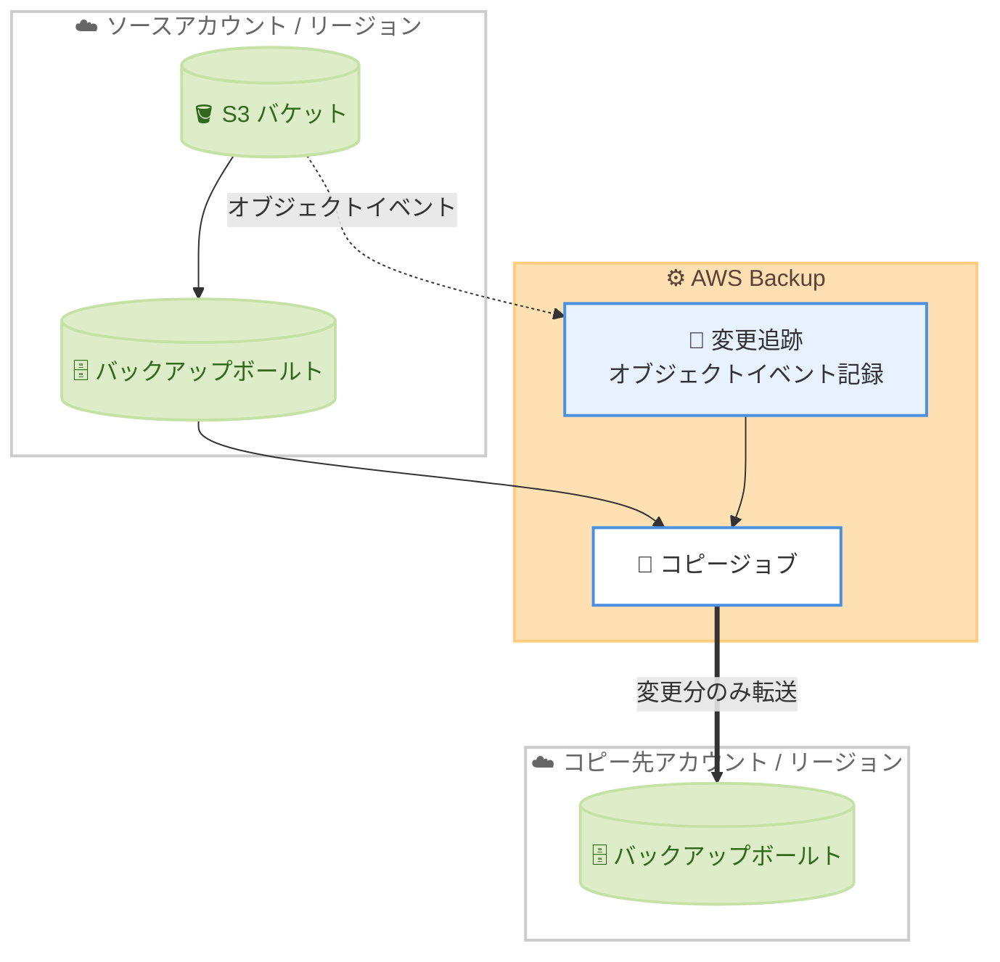

# AWS Backup - Amazon S3 バックアップコピーのパフォーマンス強化

**リリース日**: 2026 年 6 月 25 日
**サービス**: AWS Backup
**機能**: Amazon S3 バックアップコピーのパフォーマンス強化 (Enhanced Change Tracking)

📊 [このアップデートのインフォグラフィックを見る](https://takech9203.github.io/aws-news-summary/20260625-aws-backup-amazon-s3-copy-enhancement.html)
<!-- INFOGRAPHIC_BASE_URL は環境変数から取得 -->

## 概要

AWS Backup は、Amazon S3 バックアップのコピー操作を最大 8 倍高速化する機能強化を発表しました。この改善は、数百万のオブジェクトを含み、バックアップコピー間での変更率が低い S3 バケットに対して特に効果を発揮します。強化された変更追跡 (Enhanced Change Tracking) により、コピー先のアカウントやリージョンにあるすべてのオブジェクトをスキャンする必要がなくなり、アカウント間およびリージョン間で S3 バックアップをコピーするために必要な時間が短縮されます。

従来、S3 バックアップのコピー操作では、コピー先のオブジェクト全体をスキャンして差分を判定する処理が必要でした。今回のアップデートでは、AWS Backup がオブジェクトのイベントを発生時に記録する方式に変わり、コピー操作の高速化と処理時間の削減を実現しています。

この機能強化は、すべての新規 S3 バックアップのアカウント間コピージョブおよびリージョン間コピージョブに自動的に適用されます。追加料金は発生せず、AWS Backup が Amazon S3 バックアップのアカウント間コピーおよびリージョン間コピーをサポートするすべての AWS リージョンで有効になります。大量のオブジェクトを保持するバケットを保護するワークロードや、コンプライアンス目的でクロスリージョンレプリケーションを実施している組織にとって、バックアップ運用の効率化につながるアップデートです。

**アップデート前の課題**

- 以前は S3 バックアップのコピー時に、コピー先のアカウントまたはリージョンにあるすべてのオブジェクトをスキャンする必要があった
- 数百万のオブジェクトを含むバケットでは、変更されたオブジェクトがわずかであってもコピー操作に長い時間を要した
- スキャン処理のオーバーヘッドにより、アカウント間およびリージョン間のコピー完了までの時間が長くなっていた

**アップデート後の改善**

- 今回のアップデートにより、オブジェクトのイベントを発生時に記録する変更追跡方式が導入され、コピー先の全オブジェクトスキャンが不要になった
- 数百万のオブジェクトを含み、変更率が低いバケットでコピー操作が最大 8 倍高速化された
- すべての新規コピージョブに自動適用されるため、ユーザー側での設定変更が不要になった

## アーキテクチャ図

変更追跡がオブジェクトイベントを継続的に記録することで、コピージョブはコピー先の全オブジェクトをスキャンせずに変更分のみを効率的に転送します。

## サービスアップデートの詳細

### 主要機能

1. **強化された変更追跡 (Enhanced Change Tracking)**
   - オブジェクトのイベント (追加、更新、削除など) を発生時に記録する
   - コピー先のオブジェクト全体をスキャンする必要がなくなる
   - 記録された変更情報を基に、差分のみを効率的にコピーする

2. **最大 8 倍の高速化**
   - 数百万のオブジェクトを含むバケットで効果を発揮する
   - バックアップコピー間での変更率が低いケースで特に高速化される
   - スキャン処理のオーバーヘッドが削減され、コピー完了までの時間が短縮される

3. **自動適用とコスト無料**
   - すべての新規 S3 バックアップのアカウント間コピージョブおよびリージョン間コピージョブに自動適用される
   - ユーザー側での設定変更や有効化作業は不要である
   - 追加料金なしで利用できる

## 技術仕様

### 変更追跡方式の比較

| 項目 | アップデート前 | アップデート後 |
|------|----------------|----------------|
| 差分判定方法 | コピー先の全オブジェクトをスキャン | オブジェクトイベントを発生時に記録 |
| 大規模バケットの処理時間 | オブジェクト数に比例して増加 | 最大 8 倍高速 |
| 効果が高いケース | - | 数百万オブジェクト かつ 低変更率 |
| 設定 | - | 自動適用 (設定不要) |
| 追加料金 | - | なし |

### 対象となるコピー操作

| 項目 | 詳細 |
|------|------|
| 対象サービス | Amazon S3 のバックアップ |
| コピー種別 | アカウント間 (cross-account) コピー、リージョン間 (cross-Region) コピー |
| 適用対象 | すべての新規コピージョブ |

## メリット

### ビジネス面

- **バックアップ運用の効率化**: コピー時間が短縮されることで、バックアップウィンドウの短縮や運用負荷の軽減につながる
- **コスト増なしの改善**: 追加料金なしで自動的にパフォーマンス向上の恩恵を受けられる
- **コンプライアンス対応の強化**: リージョン間コピーが高速化されることで、災害対策やデータ保護要件への対応がより迅速になる

### 技術面

- **スキャン処理の削減**: コピー先の全オブジェクトスキャンが不要になり、処理オーバーヘッドが大幅に削減される
- **大規模ワークロードへの適合**: 数百万のオブジェクトを保持するバケットでスケーラブルなコピーが可能になる
- **設定変更不要**: 既存のバックアップ設定を変更することなく、新規コピージョブに自動適用される

## デメリット・制約事項

### 制限事項

- 機能強化は新規の S3 バックアップのアカウント間コピージョブおよびリージョン間コピージョブに適用される (既存のジョブへの遡及適用についての記載はない)
- 高速化の効果は、数百万のオブジェクトを含み、かつ変更率が低いバケットで最大となる。変更率が高いバケットでは効果が限定的となる可能性がある
- AWS Backup が Amazon S3 バックアップのアカウント間コピーおよびリージョン間コピーをサポートするリージョンでのみ有効

### 考慮すべき点

- 同一アカウント・同一リージョン内のコピーではなく、アカウント間およびリージョン間コピーが対象となる
- 高速化の度合い (最大 8 倍) はバケットのオブジェクト数や変更率に依存するため、実際のワークロードでの効果を確認することが推奨される

## ユースケース

### ユースケース1: 大規模データレイクのクロスリージョンバックアップ

**シナリオ**: 数百万のオブジェクトを保持するデータレイク用 S3 バケットを、災害対策として別リージョンへ定期的にバックアップコピーしている。日次の変更は全体のごく一部に限られる。

**効果**: 変更追跡により差分のみが効率的にコピーされ、コピー操作が最大 8 倍高速化される。バックアップウィンドウが短縮され、RPO (目標復旧時点) の改善につながる。

### ユースケース2: コンプライアンス目的のアカウント間バックアップ

**シナリオ**: 規制要件に対応するため、本番アカウントの S3 バックアップを専用のバックアップアカウントへコピーしている。オブジェクト数は膨大だが、変更頻度は低い。

**効果**: コピー先アカウントの全オブジェクトスキャンが不要になり、アカウント間コピーの処理時間が短縮される。追加コストなしでコンプライアンス対応の運用効率が向上する。

### ユースケース3: マルチリージョン構成のバックアップ集約

**シナリオ**: 複数リージョンで稼働するワークロードの S3 バックアップを、集約用のリージョンへ統合している。

**効果**: 各リージョンからのリージョン間コピーが高速化され、バックアップ集約全体の所要時間が削減される。設定変更なしで自動的に適用される。

## 料金

この機能強化は追加料金なしで提供されます。AWS Backup が Amazon S3 バックアップのアカウント間コピーおよびリージョン間コピーをサポートするすべての AWS リージョンで、コスト増加なしに有効になります。

なお、S3 バックアップのストレージ料金、バックアップコピー料金、データ転送料金などの既存の AWS Backup および Amazon S3 の料金体系は引き続き適用されます。詳細は AWS Backup の料金ページを参照してください。

## 利用可能リージョン

AWS Backup が Amazon S3 バックアップのアカウント間コピーおよびリージョン間コピーをサポートするすべての AWS リージョンで利用可能です。

## 関連サービス・機能

- **Amazon S3**: バックアップ対象となるオブジェクトストレージサービス。本機能はその S3 バックアップのコピーパフォーマンスを向上させる
- **AWS Backup ボールト**: バックアップデータの保存先。アカウント間およびリージョン間コピーのコピー先となる
- **AWS Organizations**: アカウント間コピーやクロスアカウントのバックアップ管理を行う際の基盤となる

## 参考リンク

- 📊 [インフォグラフィック](https://takech9203.github.io/aws-news-summary/20260625-aws-backup-amazon-s3-copy-enhancement.html)
- [公式発表 (What's New)](https://aws.amazon.com/about-aws/whats-new/2026/06/aws-backup-amazon-s3-copy-enhancement/)
- [AWS Backup ドキュメント](https://docs.aws.amazon.com/aws-backup/latest/devguide/whatisbackup.html)
- [AWS Backup 料金ページ](https://aws.amazon.com/backup/pricing/)

## まとめ

今回のアップデートにより、AWS Backup の Amazon S3 バックアップコピーが最大 8 倍高速化され、大規模かつ低変更率のバケットを運用する組織のバックアップ効率が大きく向上します。設定変更不要かつ追加料金なしで新規コピージョブに自動適用されるため、対象リージョンで S3 のアカウント間・リージョン間コピーを利用しているユーザーは、特別な対応なしに恩恵を受けられます。災害対策やコンプライアンス対応でクロスリージョンバックアップを行っている場合は、コピー時間の短縮効果を確認することを推奨します。
