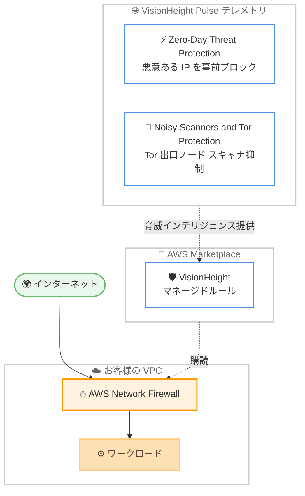

# AWS Network Firewall - VisionHeight マネージド脅威インテリジェンスルール

**リリース日**: 2026 年 6 月 25 日
**サービス**: AWS Network Firewall
**機能**: VisionHeight 提供のマネージドルールグループ (Zero-Day Threat Protection、Noisy Scanners and Tor Protection)

📊 [このアップデートのインフォグラフィックを見る]({INFOGRAPHIC_BASE_URL}/20260625-network-firewall-visionheight-managed-rules.html)
<!-- INFOGRAPHIC_BASE_URL は環境変数から取得 -->

## 概要

AWS Network Firewall は、VisionHeight が提供する 2 つの新しいマネージドルールグループ「Zero-Day Threat Protection」および「Noisy Scanners and Tor Protection」をサポートしました。これらのルールグループは AWS Marketplace を通じて利用可能で、VisionHeight の Pulse テレメトリを基盤とした独自の脅威インテリジェンスをお客様に提供します。

Zero-Day Threat Protection は、公開ブロックリストに掲載される前の悪意ある IP インフラストラクチャをプロアクティブにブロックします。これにより、新たに出現する脅威に対して数週間先回りした防御が可能になります。Noisy Scanners and Tor Protection は、アクティブな Tor 出口ノードとの通信をブロックし、既知の大量スキャン送信元からのトラフィックをフィルタリングすることで、ファイアウォールログのノイズを削減します。

今回の追加により、AWS Network Firewall のマネージドルール提供事業者は拡大しました。VisionHeight は、Check Point、Fortinet、Infoblox、Lumen、Rapid7、ThreatSTOP、Trend Micro といった既存の AWS Marketplace 販売事業者に加わる形となります。お客様はこれらの事業者から提供される脅威インテリジェンスを、自社で運用負荷を負うことなく利用できます。

**アップデート前の課題**

このアップデート以前は、以下のような課題が存在していました。

- ゼロデイ脅威に対応するには、公開ブロックリストに掲載されてから対処する必要があり、攻撃インフラストラクチャへの対応が後手に回りがちだった
- Tor 出口ノードや大量スキャン送信元からのノイズトラフィックがファイアウォールログを増大させ、SOC のアラート量や SIEM の取り込みコストが増加していた
- 独自の脅威インテリジェンスを取り込むには、自前でフィードを収集・管理する必要があった

**アップデート後の改善**

今回のアップデートにより、以下が可能になりました。

- VisionHeight の Pulse テレメトリに基づき、公開ブロックリスト掲載前の悪意ある IP インフラストラクチャをプロアクティブにブロックできるようになった
- Tor 出口ノードや大量スキャン送信元からのトラフィックを最初のパケットの時点で抑制し、ログノイズと運用コストを削減できるようになった
- AWS Marketplace を通じて VisionHeight のマネージドルールを購読するだけで、独自の脅威インテリジェンスを Network Firewall に取り込めるようになった

## アーキテクチャ図

VisionHeight が Pulse テレメトリから生成した脅威インテリジェンスを AWS Marketplace 経由のマネージドルールとして提供し、お客様の VPC に配置された AWS Network Firewall がそのルールを適用してインターネットからのトラフィックを検査します。

## サービスアップデートの詳細

### 主要機能

1. **Zero-Day Threat Protection**
   - 公開ブロックリストに掲載される前の悪意ある IP インフラストラクチャをプロアクティブにブロックする
   - VisionHeight の Pulse テレメトリに基づく独自の脅威インテリジェンスを活用する
   - 攻撃対象となるワークロードの防御を、新たに出現する脅威に対して数週間先回りして強化できる

2. **Noisy Scanners and Tor Protection**
   - アクティブな Tor 出口ノードとの通信をブロックし、Tor を侵入経路 出口経路として利用されることを排除する
   - 既知の大量スキャン送信元からのトラフィックをフィルタリングする
   - 日次の更新サイクルにより、イベントが生成される前の最初のパケット時点でノイズを抑制する
   - SOC のアラート量を削減し、SIEM の取り込みコストを抑える

3. **AWS Marketplace を通じた提供**
   - 2 つのルールグループは AWS Marketplace を通じて購読できる
   - VisionHeight は Check Point、Fortinet、Infoblox、Lumen、Rapid7、ThreatSTOP、Trend Micro と並ぶマネージドルール提供事業者として加わる

## 技術仕様

### マネージドルールグループの概要

| 項目 | 詳細 |
|------|------|
| ルールグループ 1 | Zero-Day Threat Protection |
| ルールグループ 2 | Noisy Scanners and Tor Protection |
| 提供事業者 | VisionHeight |
| 提供チャネル | AWS Marketplace |
| 基盤データ | VisionHeight Pulse テレメトリ |
| 更新サイクル | 日次 (Noisy Scanners and Tor Protection) |

## 設定方法

### 前提条件

1. AWS Network Firewall を利用可能な VPC とサブネット構成が存在すること
2. AWS Marketplace でのサブスクリプション購入権限を持つこと
3. Network Firewall のファイアウォールポリシーを管理する IAM 権限を持つこと

### 手順

#### ステップ 1: AWS Marketplace でルールグループを購読

AWS Marketplace にアクセスし、VisionHeight が提供する「Zero-Day Threat Protection」または「Noisy Scanners and Tor Protection」のマネージドルールグループを購読します。購読後、これらのルールグループが自身の AWS アカウントから利用可能になります。

#### ステップ 2: ファイアウォールポリシーへの追加

AWS Network Firewall コンソールから、対象のファイアウォールポリシーにマネージドルールグループを関連付けます。これにより、購読したルールグループが Network Firewall によるトラフィック検査に適用されます。

#### ステップ 3: 動作確認とログの確認

ルールグループ適用後、Network Firewall のログを確認し、想定どおりにトラフィックがブロック フィルタリングされているかを確認します。Noisy Scanners and Tor Protection を適用した場合は、ログノイズの削減効果も確認します。

## メリット

### ビジネス面

- **運用コストの削減**: ノイズトラフィックを最初のパケット時点で抑制することで、SOC のアラート量と SIEM の取り込みコストを削減できる
- **脅威への先回り対応**: 公開ブロックリスト掲載前の脅威をブロックすることで、インシデント発生リスクを低減できる
- **導入の容易さ**: AWS Marketplace を通じた購読のみで、独自の脅威インテリジェンスを取り込める

### 技術面

- **プロアクティブな防御**: 悪意ある IP インフラストラクチャを事前にブロックできる
- **ログノイズの削減**: Tor 出口ノードや大量スキャン送信元のトラフィックをフィルタリングし、ログの可読性を高める
- **最新の脅威情報**: 日次更新サイクルにより、最新の脅威インテリジェンスを反映できる

## デメリット・制約事項

### 制限事項

- マネージドルールグループは AWS Marketplace 経由の購読が前提となる
- 利用可能リージョンは AWS リージョン別サービスページで確認する必要がある
- 公式発表時点で、料金の詳細は明示されていない

### 考慮すべき点

- ルールグループ適用前に、正規のトラフィックが誤ってブロックされないか検証することが望ましい
- 複数のマネージドルール提供事業者を併用する場合、ルールの重複や評価順序を考慮する必要がある

## ユースケース

### ユースケース 1: ゼロデイ脅威への先回り防御

**シナリオ**: 公開されたばかりの攻撃キャンペーンに対して、ブロックリスト掲載を待たずにワークロードを保護したい。

**効果**: Zero-Day Threat Protection により、悪意ある IP インフラストラクチャを事前にブロックし、攻撃が到達する前に防御できます。

### ユースケース 2: SOC のアラート疲れの軽減

**シナリオ**: Tor 出口ノードや大量スキャンによるノイズトラフィックが大量のアラートを発生させ、SOC の運用負荷が高まっている。

**効果**: Noisy Scanners and Tor Protection により、ノイズを最初のパケット時点で抑制し、アラート量と SIEM コストを削減できます。

### ユースケース 3: コンプライアンス要件への対応

**シナリオ**: Tor 経由の通信を侵入経路 出口経路として遮断する必要がある規制環境で運用している。

**効果**: アクティブな Tor 出口ノードとの通信をブロックすることで、Tor を経路とした通信を排除し、コンプライアンス要件への対応を支援します。

## 料金

公式発表時点で、ルールグループの料金詳細は明示されていません。マネージドルールグループは AWS Marketplace を通じて提供されるため、各販売事業者の料金体系および AWS Network Firewall 自体の利用料金が適用されます。詳細は AWS Marketplace の製品ページおよび AWS Network Firewall の料金ページをご確認ください。

## 利用可能リージョン

公式発表では具体的なリージョンは明示されていません。サポートされるリージョンの一覧は、AWS リージョン別サービスページで確認してください。

## 関連サービス・機能

- **AWS Network Firewall**: 本アップデートの対象となるマネージド型ネットワークファイアウォールサービス
- **AWS Marketplace**: VisionHeight のマネージドルールグループを購読するためのチャネル
- **Amazon VPC**: Network Firewall を配置し、トラフィックを検査する対象のネットワーク環境

## 参考リンク

- 📊 [インフォグラフィック]({INFOGRAPHIC_BASE_URL}/20260625-network-firewall-visionheight-managed-rules.html)
- [公式発表 (What's New)](https://aws.amazon.com/about-aws/whats-new/2026/06/network-firewall-visionheight-managed-rules)
- [AWS Network Firewall 製品ページ](https://aws.amazon.com/network-firewall/)
- [ドキュメント](https://docs.aws.amazon.com/network-firewall/latest/developerguide/what-is-aws-network-firewall.html)
- [AWS Marketplace](https://aws.amazon.com/marketplace)

## まとめ

このアップデートにより、AWS Network Firewall は VisionHeight の Pulse テレメトリを基盤とした 2 つの新しいマネージドルールグループを利用できるようになりました。ゼロデイ脅威への先回り対応とログノイズの削減という 2 つの異なる価値を提供します。脅威インテリジェンスの強化やセキュリティ運用の効率化を検討しているお客様は、AWS Marketplace で各ルールグループを確認し、自社の要件に合わせて適用を検討することをお勧めします。
