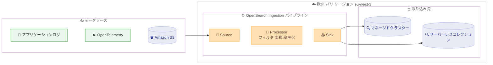

# Amazon OpenSearch Service - OpenSearch Ingestion の欧州 (パリ) リージョン対応

**リリース日**: 2026 年 6 月 25 日
**サービス**: Amazon OpenSearch Service
**機能**: Amazon OpenSearch Ingestion

📊 [このアップデートのインフォグラフィックを見る](https://takech9203.github.io/aws-news-summary/20260625-opensearch-ingestion-europe-paris-region-availability.html)
<!-- INFOGRAPHIC_BASE_URL は環境変数から取得 -->

## 概要

2026 年 6 月 25 日、Amazon OpenSearch Ingestion が欧州 (パリ) リージョン (eu-west-3) で利用可能になりました。このアップデートにより、パリリージョンのお客様は Amazon OpenSearch Service のマネージドクラスターやサーバーレスコレクションへデータを取り込む際に、OpenSearch Ingestion を使用できるようになりました。

Amazon OpenSearch Ingestion は、インデックス作成前にデータを取り込み、処理するためのフルマネージドかつサーバーレスのデータ収集サービスです。Data Prepper をベースとしており、ノーコードでデータのフィルタリング、変換、秘匿化 (redact)、ルーティングを実行できます。基盤となるリソースは自動的にプロビジョニングおよびスケールされるため、変動するワークロードに対してインフラ管理なしで対応できます。

今回のパリリージョン追加により、OpenSearch Ingestion は合計 17 の AWS リージョンで一般提供 (GA) されることになりました。欧州圏でのデータ所在地要件 (データレジデンシー) を持つお客様にとって、フランス国内でデータ取り込みパイプラインを構築できる選択肢が増えたことになります。

**アップデート前の課題**

- パリリージョン (eu-west-3) では OpenSearch Ingestion が利用できず、マネージドなデータ取り込み層をこのリージョンで構築できなかった
- データレジデンシー要件によりパリリージョンを利用するお客様は、Logstash や Jaeger などのサードパーティツールを自前で運用してデータを取り込む必要があった
- 自前のパイプラインを運用する場合、スケーリングやパッチ適用などのインフラ管理が必要だった

**アップデート後の改善**

- パリリージョン (eu-west-3) で OpenSearch Ingestion のパイプラインを直接構築できるようになった
- データレジデンシー要件を満たしながら、フルマネージドなデータ取り込み層を利用できるようになった
- ノーコードでフィルタリング、変換、秘匿化、ルーティングを行い、インフラ管理なしでパイプラインを運用できるようになった

## アーキテクチャ図



OpenSearch Ingestion パイプラインは Source (取り込み元)、Processor (加工処理)、Sink (出力先) の 3 要素で構成され、パリリージョン内でログ、メトリクス、トレースデータを処理して OpenSearch Service へ配信します。

## サービスアップデートの詳細

### 主要機能

1. **フルマネージド・サーバーレスなデータ取り込み**
   - インフラの管理、ソフトウェアのパッチ適用、クラスターの手動スケーリングが不要
   - リアルタイムのログ、メトリクス、トレースデータを OpenSearch Service ドメインや OpenSearch Serverless コレクションへストリーミング
   - Logstash や Jaeger などのサードパーティツールを置き換え可能

2. **ノーコードでのデータ加工**
   - フィルタリング、変換、秘匿化 (redact)、ルーティングをコード不要で実行
   - オープンソースの Data Prepper をベースとし、データのエンリッチ、正規化、集計に対応
   - 一般的なユースケース向けのパイプライン設定ブループリントを提供

3. **自動プロビジョニングとスケーリング**
   - お客様が定義したキャパシティ上限に基づいてパイプラインを自動スケール
   - ワークロードの変動に応じてキャパシティを増減
   - パイプラインの停止・開始によりコストを制御可能

## 技術仕様

### OpenSearch Ingestion の主要要素

| 項目 | 詳細 |
|------|------|
| 基盤技術 | Data Prepper (オープンソースのデータコレクター) |
| サポートバージョン | Data Prepper 2.x (現在はバージョン 2.7 でプロビジョニング) |
| 課金単位 | Ingestion OCU (OpenSearch Compute Unit) |
| 取り込み先 | マネージドクラスター (ドメイン)、OpenSearch Serverless コレクション |
| セキュリティ | VPC への接続オプション、CloudWatch によるモニタリング、CloudWatch Logs によるエラーログ |
| 操作方法 | AWS マネジメントコンソール、AWS SDK、OpenSearch Ingestion API |

### パイプライン設定例

```yaml
version: "2"
log-pipeline:
  source:
    http:
      path: "/log/ingest"
  processor:
    - grok:
        match:
          message: ["%{COMMONAPACHELOG}"]
  sink:
    - opensearch:
        hosts: ["https://search-my-domain.eu-west-3.es.amazonaws.com"]
        index: "apache_logs"
```

`version` で Data Prepper のメジャーバージョンを指定し、source・processor・sink を定義します。OpenSearch Ingestion は指定したメジャーバージョンの最新マイナーバージョンを自動的に選択してパイプラインをプロビジョニングします。

## 設定方法

### 前提条件

1. 取り込み先となる Amazon OpenSearch Service ドメインまたは OpenSearch Serverless コレクションが存在すること
2. パイプラインがアクセスするために必要な IAM ロールとアクセスポリシーが設定されていること
3. パリリージョン (eu-west-3) で作業を行うこと

### 手順

#### ステップ1: パイプライン設定の作成

```bash
aws osis create-pipeline \
  --pipeline-name my-paris-pipeline \
  --min-units 1 \
  --max-units 4 \
  --pipeline-configuration-body file://pipeline-config.yaml \
  --region eu-west-3
```

`create-pipeline` API でパイプラインを作成します。`--min-units` と `--max-units` で Ingestion OCU の最小・最大数を指定し、この範囲内で自動スケールされます。

#### ステップ2: パイプラインの状態確認

```bash
aws osis get-pipeline \
  --pipeline-name my-paris-pipeline \
  --region eu-west-3
```

`get-pipeline` API でパイプラインのステータスやエンドポイント情報を確認します。ステータスが `ACTIVE` になればデータの取り込みを開始できます。

#### ステップ3: データソースの接続とモニタリング

データプロデューサーをパイプラインのエンドポイントに接続してデータを送信します。Amazon CloudWatch でパフォーマンスを、CloudWatch Logs でエラーログを監視します。コスト制御のためにパイプラインの停止・開始も可能です。

## メリット

### ビジネス面

- **データレジデンシー対応**: フランス国内 (パリリージョン) でデータ取り込みを完結でき、欧州圏のデータ所在地要件を持つお客様の選択肢が広がる
- **運用コストの削減**: フルマネージドサービスのため、自前のパイプライン運用にかかる人的リソースを削減できる
- **コスト制御の柔軟性**: パイプラインの停止・開始や OCU 上限の設定により利用状況に応じてコストを最適化できる

### 技術面

- **インフラ管理の不要化**: スケーリング、パッチ適用、クラスター管理が自動化される
- **ノーコードでの加工**: Data Prepper ベースで複雑なデータ変換・秘匿化・ルーティングをコードなしで実現できる
- **セキュリティ強化**: VPC 接続オプションにより、ネットワークレベルでのセキュリティを追加できる

## デメリット・制約事項

### 制限事項

- OpenSearch Ingestion は OpenSearch Service が利用可能なリージョンの一部でのみ提供される (今回 17 リージョン)
- サポートされる Data Prepper のバージョンは 2.x であり、すべてのマイナーバージョンがサポートされるわけではない
- パイプラインのメジャーバージョンは、設定内の `version` オプションを手動で変更しない限り自動アップグレードされない

### 考慮すべき点

- データが流れていない場合でも、パイプラインに割り当てられた Ingestion OCU の分だけ課金される
- コスト最適化のため、不要なパイプラインは停止することを検討する
- 最小・最大 OCU の設定はワークロードのピークと平常時のバランスを考慮して決定する

## ユースケース

### ユースケース1: 欧州圏のアプリケーションログ集約基盤

**シナリオ**: フランス国内でサービスを展開する企業が、データレジデンシー要件を満たしながらアプリケーションログを集約・分析したい。

**実装例**:
```
アプリケーション → OpenSearch Ingestion (eu-west-3) → OpenSearch Service ドメイン
（grok プロセッサでログをパース、機密情報を redact）
```

**効果**: フランス国内でログ取り込みを完結させつつ、ノーコードで機密情報を秘匿化できる。

### ユースケース2: オブザーバビリティ (トレース・メトリクス) パイプライン

**シナリオ**: マイクロサービスの分散トレースとメトリクスを収集し、Jaeger を自前運用せずに OpenSearch で可視化したい。

**実装例**:
```
OpenTelemetry Collector → OpenSearch Ingestion (OTel trace source) → OpenSearch Serverless コレクション
```

**効果**: サードパーティツールの運用負荷を排除し、サーバーレスでトレースデータを取り込める。

### ユースケース3: S3 データのストリーミング取り込み

**シナリオ**: Amazon S3 に蓄積されたログを定期的に OpenSearch へ取り込み、検索・分析可能にしたい。

**実装例**:
```
Amazon S3 (SQS 通知) → OpenSearch Ingestion (S3 source) → OpenSearch Service ドメイン
```

**効果**: S3 のイベント通知をトリガーに、自動スケールするパイプラインでデータを取り込める。

## 料金

OpenSearch Ingestion の料金は、パイプラインに割り当てられた Ingestion OCU (OpenSearch Compute Unit) の数に基づきます。データがパイプラインを流れているかどうかにかかわらず、割り当てられた OCU 分が課金されます。OpenSearch Ingestion は利用状況に応じてパイプラインのキャパシティを自動的にスケールアップ・ダウンします。

詳細な料金は [Amazon OpenSearch Service の料金ページ](https://aws.amazon.com/opensearch-service/pricing/) を参照してください。

## 利用可能リージョン

今回のパリリージョン追加により、OpenSearch Ingestion は以下の合計 17 リージョンで一般提供されています。

- 米国東部 (オハイオ、バージニア北部)
- 米国西部 (オレゴン、北カリフォルニア)
- 欧州 (アイルランド、ロンドン、フランクフルト、スペイン、**パリ (新規)**、ストックホルム)
- アジアパシフィック (東京、シドニー、シンガポール、ムンバイ、ソウル)
- カナダ (中部)
- 南米 (サンパウロ)

## 関連サービス・機能

- **Amazon OpenSearch Service**: OpenSearch Ingestion の取り込み先となるマネージドクラスター (ドメイン) を提供
- **Amazon OpenSearch Serverless**: サーバーレスコレクションを取り込み先として選択可能
- **Data Prepper**: OpenSearch Ingestion の基盤となるオープンソースのデータコレクター
- **Amazon CloudWatch / CloudWatch Logs**: パイプラインのパフォーマンスモニタリングとエラーログの確認に使用

## 参考リンク

- 📊 [インフォグラフィック](https://takech9203.github.io/aws-news-summary/20260625-opensearch-ingestion-europe-paris-region-availability.html)
- [公式発表 (What's New)](https://aws.amazon.com/about-aws/whats-new/2026/06/opensearch-ingestion-europe-paris-region-availability)
- [Amazon OpenSearch Ingestion 機能ページ](https://aws.amazon.com/opensearch-service/features/ingestion/)
- [Amazon OpenSearch Ingestion デベロッパーガイド](https://docs.aws.amazon.com/opensearch-service/latest/developerguide/ingestion.html)
- [Amazon OpenSearch Service 料金ページ](https://aws.amazon.com/opensearch-service/pricing/)

## まとめ

Amazon OpenSearch Ingestion がパリリージョン (eu-west-3) で利用可能になり、欧州圏のデータレジデンシー要件を持つお客様もフルマネージドなデータ取り込み層を活用できるようになりました。サードパーティツールの自前運用が不要になり、ノーコードでのデータ加工とコスト制御が可能です。パリリージョンでログやオブザーバビリティ基盤を構築するお客様は、既存の取り込みパイプラインを OpenSearch Ingestion への移行を検討する価値があります。
