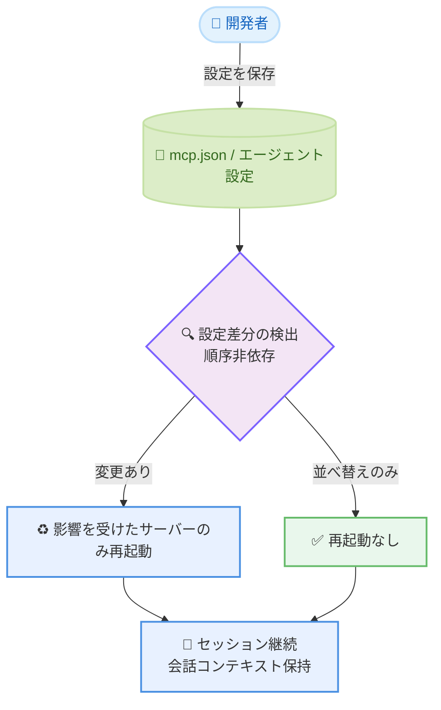

# Kiro - 設定のホットリロードとリソース継承制御

**リリース日**: 2026年6月26日
**サービス**: Kiro
**機能**: Config Hot-Reload and Resource Inheritance Control (v2.10.0)

📊 [このアップデートのインフォグラフィックを見る](https://takech9203.github.io/aws-news-summary/20260626-kiro-changelog-2026-06-26.html)

## 概要

Kiro v2.10.0 では、MCP (Model Context Protocol) のイテレーションにおける摩擦を取り除き、カスタムエージェントの作成者がコンテキストをより細かく制御できるようになりました。このリリースの中心は 2 つの機能です。1 つ目は、エージェント設定と MCP 設定をディスク上で保存した瞬間にライブで反映する「設定のホットリロード」です。2 つ目は、カスタムエージェントがデフォルトリソースの継承を無効化できる新しい設定です。

設定のホットリロードにより、セッションを再起動したり会話履歴を失ったりすることなく、設定変更が即座に反映されます。影響を受けたサーバーのみが再起動され、会話のコンテキストは保持されます。設定の差分は順序に依存しないため、環境変数の並べ替えだけでは不要な再起動が発生しません。

また、新しい `chat.disableInheritingDefaultResources` 設定により、カスタムエージェントがデフォルトの steering、skills、AGENTS.md を継承しないように制御できます。Kiro は AWS が提供するエージェント型 IDE であり、これらの改善は MCP サーバーやカスタムエージェントを頻繁に編集する開発者にとって有用です。

**アップデート前の課題**

- 以前は、エージェント設定や MCP 設定を変更した場合、変更を反映するためにセッションの再起動が必要でした
- 以前は、セッションを再起動すると会話履歴やコンテキストが失われていました
- v2.7.0 以降、カスタムエージェントはデフォルトリソース (steering、skills、AGENTS.md) を自動的に継承していましたが、これを無効化する手段がありませんでした

**アップデート後の改善**

- 今回のアップデートにより、設定をディスクに保存するだけで変更が即座に反映されるようになりました
- 今回のアップデートにより、セッションの再起動が不要になり、会話のコンテキストが保持されるようになりました
- 今回のアップデートにより、`chat.disableInheritingDefaultResources` 設定でデフォルトリソースの継承を無効化できるようになりました

## アーキテクチャ図



設定保存時のホットリロードフローを示しています。設定差分を検出し、変更があった場合は影響を受けたサーバーのみを再起動し、会話コンテキストを保持したままセッションを継続します。

## サービスアップデートの詳細

### 主要機能

1. **MCP とエージェント設定のホットリロード (MCP and Agent Config Hot-Reload)**
   - エージェント設定と MCP 設定をディスクに保存すると、変更がホットリロードされます
   - エージェント設定の編集、新しいエージェントファイルの追加、`mcp.json` の変更が、セッションを再起動せずに反映されます
   - 影響を受けたサーバーのみが再起動され、会話のコンテキストは保持されます
   - 設定の差分は順序に依存しないため、環境変数の並べ替えだけでは不要な再起動が発生しません

2. **カスタムエージェントのリソース継承制御 (Custom Agent Resource Inheritance)**
   - 新しい `chat.disableInheritingDefaultResources` 設定により、カスタムエージェントがデフォルトの steering、skills、AGENTS.md を継承しないようにできます
   - この設定を `true` にすると、カスタムエージェントのみを実行する場合に、グローバルリソースが取り込まれなくなります
   - v2.7.0 以降、カスタムエージェントはデフォルトリソースを自動的に継承していましたが、この設定によってその動作を無効化できます

## 技術仕様

### 設定項目

| 項目 | 詳細 |
|------|------|
| バージョン | v2.10.0 |
| 対象設定ファイル | `mcp.json`、エージェント設定ファイル |
| ホットリロード対象 | MCP 設定、エージェント設定 |
| 差分判定 | 順序非依存 (環境変数の並べ替えでは再起動しない) |
| コンテキスト保持 | セッション・会話履歴を維持 |
| 新規設定キー | `chat.disableInheritingDefaultResources` |

### 設定例

```json
{
  "chat.disableInheritingDefaultResources": true
}
```

`chat.disableInheritingDefaultResources` を `true` に設定すると、カスタムエージェントはデフォルトの steering、skills、AGENTS.md を継承しなくなります。

## 設定方法

### 前提条件

1. Kiro v2.10.0 以降がインストールされていること
2. MCP サーバーまたはカスタムエージェントを使用していること
3. リソース継承を無効化する場合は、カスタムエージェントのみを運用する構成であること

### 手順

#### ステップ1: 設定ファイルを編集して保存する

```bash
# mcp.json やエージェント設定ファイルをエディタで開いて編集し、保存する
```

設定ファイル (`mcp.json` やエージェント設定ファイル) を編集してディスクに保存すると、Kiro が変更を検出し、影響を受けた MCP サーバーのみを自動的に再起動します。セッションの再起動は不要で、会話のコンテキストはそのまま保持されます。

#### ステップ2: デフォルトリソースの継承を無効化する

```json
{
  "chat.disableInheritingDefaultResources": true
}
```

カスタムエージェントのみを実行し、グローバルなデフォルトリソース (steering、skills、AGENTS.md) を取り込みたくない場合は、`chat.disableInheritingDefaultResources` を `true` に設定します。これにより、カスタムエージェントが意図しないグローバルリソースを継承しなくなります。

## メリット

### ビジネス面

- **開発効率の向上**: 設定変更のたびにセッションを再起動する必要がなくなり、MCP やエージェントのイテレーションが高速化されます
- **コンテキストの維持**: 会話履歴を失わずに設定を変更できるため、作業の中断が減ります
- **制御性の向上**: カスタムエージェントの動作をより細かく制御でき、意図した構成での運用が容易になります

### 技術面

- **最小限の再起動**: 影響を受けたサーバーのみが再起動されるため、システム全体への影響が抑えられます
- **順序非依存の差分判定**: 環境変数の並べ替えだけでは不要な再起動が発生しません
- **リソース継承の明示的制御**: `chat.disableInheritingDefaultResources` により、グローバルリソースの継承を明示的に無効化できます

## デメリット・制約事項

### 制限事項

- ホットリロードの対象はエージェント設定と MCP 設定です。それ以外の設定変更の挙動は本リリースの対象範囲外です
- `chat.disableInheritingDefaultResources` を `true` にすると、デフォルトの steering、skills、AGENTS.md がカスタムエージェントに継承されなくなるため、これらのリソースに依存する運用では注意が必要です

### 考慮すべき点

- デフォルトリソースの継承は v2.7.0 以降の動作です。継承を無効化する前に、カスタムエージェントが必要なリソースを個別に保持しているか確認してください
- 本機能を利用するには Kiro v2.10.0 以降が必要です

## ユースケース

### ユースケース1: MCP サーバー設定の反復的な調整

**シナリオ**: 新しい MCP サーバーを追加したり、既存サーバーの設定を試行錯誤しながら調整したい。

**実装例**:
```bash
# mcp.json を編集して保存するだけで変更が反映される
```

**効果**: セッションを再起動せずに設定変更が即座に反映され、会話コンテキストを保持したまま素早く反復できます。

### ユースケース2: カスタムエージェントの追加

**シナリオ**: 作業中に新しいカスタムエージェントを追加したい。

**実装例**:
```bash
# 新しいエージェント設定ファイルを追加して保存する
```

**効果**: セッションを継続したまま新しいエージェントが利用可能になり、作業を中断せずに済みます。

### ユースケース3: カスタムエージェント専用環境の構築

**シナリオ**: グローバルなデフォルトリソースを取り込まず、カスタムエージェントのみで完結する環境を構築したい。

**実装例**:
```json
{
  "chat.disableInheritingDefaultResources": true
}
```

**効果**: デフォルトの steering、skills、AGENTS.md が継承されなくなり、カスタムエージェントが意図したリソースのみで動作します。

## 利用可能リージョン

グローバル

Kiro はグローバルに提供されるエージェント型 IDE です。本機能は Kiro v2.10.0 以降で利用できます。

## 関連サービス・機能

- **MCP (Model Context Protocol)**: 外部ツールやデータソースとエージェントを連携する仕組みで、本リリースの設定ホットリロードの主な対象です
- **カスタムエージェント**: ユーザーが定義するエージェントで、リソース継承制御の対象です
- **steering / skills / AGENTS.md**: カスタムエージェントが継承するデフォルトリソースで、`chat.disableInheritingDefaultResources` で継承を制御できます

## 参考リンク

- 📊 [インフォグラフィック](https://takech9203.github.io/aws-news-summary/20260626-kiro-changelog-2026-06-26.html)
- [Kiro Changelog](https://kiro.dev/changelog/)
- [Kiro Changelog (CLI v2.10)](https://kiro.dev/changelog/cli/2-10)
- [MCP 設定のホットリロード ドキュメント](https://kiro.dev/docs/cli/mcp/configuration/#hot-reload)

## まとめ

Kiro v2.10.0 は、設定のホットリロードによって MCP とエージェントのイテレーションを高速化し、会話コンテキストを保持したまま設定変更を即座に反映できるようにする重要なアップデートです。あわせて `chat.disableInheritingDefaultResources` 設定により、カスタムエージェントのリソース継承をより細かく制御できるようになりました。MCP サーバーやカスタムエージェントを頻繁に編集する開発者は、Kiro を v2.10.0 以降に更新し、これらの機能を活用することをお勧めします。
