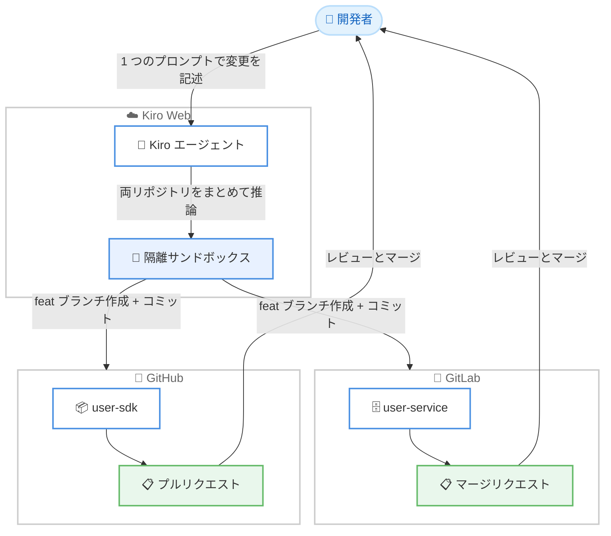

# Kiro - GitLab と GitHub をまたぐ変更を 1 セッションで調整

**リリース日**: 2026年6月26日
**サービス**: Kiro
**機能**: Kiro Web による GitLab と GitHub のクロスプロバイダー連携

📊 [このアップデートのインフォグラフィックを見る](https://takech9203.github.io/aws-news-summary/20260626-kiro-coordinating-changes-across-gitlab-and-github-in-one-session.html)

## 概要

Kiro Web が新たに GitLab をサポートし、これまでの GitHub サポートと併せて利用できるようになりました。これにより、コードが GitLab と GitHub の両方に分散している場合でも、両方のリポジトリを同一セッションに追加し、1 つの変更を自然言語で記述するだけで、Kiro が両プロバイダーにまたがって変更を適用できます。GitLab 側にはマージリクエスト (MR)、GitHub 側にはプルリクエスト (PR) がそれぞれ作成されます。

多くのチームは、相応の理由でプロバイダーをまたいでコードを管理しています。コミュニティが見つけやすいように公開 SDK を GitHub に置き、それが呼び出すサービスは GitLab 上の非公開リポジトリに置く、といったケースです。買収によって組織が 2 つのプロバイダーに分かれた場合や、フロントエンドとバックエンドのチームが別々のツールに落ち着いた場合もあります。理由は何であれ、1 つの変更が両方にまたがった瞬間にコストが発生します。

今回のアップデートにより、1 つの論理的な変更を 2 つのコンテキストで別々の PR と MR として手作業で管理する必要がなくなります。Kiro が両リポジトリをまとめて推論し、それぞれに必要な変更を適用するため、両者の不整合 (ドリフト) を防ぎます。Kiro Web はプレビュー段階で、Pro、Pro+、Power の各サブスクリプション契約者が app.kiro.dev で利用できます。

**アップデート前の課題**

- 以前は、GitLab と GitHub にまたがる 1 つの変更を、2 つの別々のタスクとして手作業で扱う必要があった
- 以前は、片方のプロバイダーへの反映を忘れることで、両者がドリフト (整合性の崩れ) を起こすリスクがあった
- 以前は、Kiro Web は GitHub のみをサポートしており、GitLab 上のリポジトリを扱えなかった

**アップデート後の改善**

- 今回のアップデートにより、GitLab と GitHub の両リポジトリを 1 つのセッションに追加できるようになった
- 今回のアップデートにより、1 つのプロンプトで両プロバイダーにまたがる変更を一貫して適用できるようになった
- 今回のアップデートにより、GitLab に MR、GitHub に PR が自動で作成され、クロスリポジトリの手作業による管理が不要になった

## アーキテクチャ図



開発者が 1 つのプロンプトで変更を記述すると、Kiro が隔離サンドボックス内で両リポジトリをまとめて推論し、GitLab には MR、GitHub には PR を作成する流れを示しています。

## サービスアップデートの詳細

### 主要機能

1. **Kiro Web の GitLab サポート**
   - これまでの GitHub サポートに加えて、GitLab のリポジトリを Kiro Web で扱えるようになった
   - GitLab と GitHub の両方を接続した状態で、1 つのセッションを開始できる
   - GitLab 側の変更にはマージリクエスト (MR) が作成される

2. **クロスプロバイダーの同時調整**
   - GitLab の `user-service` と GitHub の `user-sdk` のように、異なるプロバイダー上のリポジトリを同一セッションに追加できる
   - Kiro は両リポジトリを無関係な 2 つのタスクとして扱うのではなく、まとめて推論する
   - 1 つの変更要件 (例: ユーザーレスポンスへの `email` フィールド追加) を、両方のリポジトリに整合性を保ったまま反映する

3. **自律的な変更適用とブランチ作成**
   - 隔離されたサンドボックス内で両リポジトリを探索し、それぞれに必要な変更を判断して適用する
   - 各リポジトリにフィーチャーブランチを作成し、明確なメッセージでコミットを行う
   - 作業完了後、GitLab に MR、GitHub に PR がそれぞれ作成され、各プロバイダー上で内容の説明と変更アプローチが添えられる

## 技術仕様

### サポートプロバイダーと出力

| 項目 | 詳細 |
|------|------|
| 対応プロバイダー | GitLab (新規)、GitHub (既存) |
| GitLab 側の出力 | マージリクエスト (MR) |
| GitHub 側の出力 | プルリクエスト (PR) |
| 実行環境 | Kiro Web の隔離サンドボックス |
| 提供形態 | プレビュー (app.kiro.dev) |
| 対象サブスクリプション | Pro、Pro+、Power |

## 設定方法

### 前提条件

1. Pro、Pro+、または Power のいずれかの Kiro サブスクリプションを契約していること
2. Kiro Web (app.kiro.dev) にサインインできること
3. GitLab と GitHub の両方のアカウントを Kiro Web に接続していること

### 手順

#### ステップ 1: GitLab と GitHub を接続する

Kiro Web のドキュメントに従い、GitLab と GitHub の両プロバイダーを接続します。これにより、両方のプロバイダー上のリポジトリをセッションに追加できるようになります。

#### ステップ 2: 両方のリポジトリをセッションに追加する

新しいセッションを開始し、対象となるリポジトリを両プロバイダーから追加します。例として、GitLab の `user-service` と GitHub の `user-sdk` をアタッチします。

#### ステップ 3: 1 つのプロンプトで変更を記述する

変更内容を自然言語で記述します。Kiro が両リポジトリをまとめて推論し、各リポジトリに変更を適用してから、GitLab に MR、GitHub に PR を作成します。

```text
Add an email field to the user response in the service, and expose it through the SDK.
```

このプロンプトは、サービス側 (GitLab) のユーザーレスポンスに `email` フィールドを追加し、SDK 側 (GitHub) を通じてそれを公開するという、1 つの変更を両リポジトリに反映するよう指示しています。

## メリット

### ビジネス面

- **プロバイダー分割の維持**: 公開と非公開、チーム間の分担といった、意図的なプロバイダー分割をそのまま保ちながら作業できる
- **レビュープロセスの不変性**: レビューとマージは各プロバイダー上で従来どおり行え、既存のワークフローを変更する必要がない
- **作業漏れリスクの低減**: クロスリポジトリの手作業による管理を Kiro が肩代わりするため、片側への反映漏れによる不整合を防げる

### 技術面

- **統合された推論**: 両リポジトリをまとめて推論するため、変更がエンドツーエンドで一貫する
- **隔離サンドボックスでの実行**: サンドボックス内で探索と変更を行い、明確なコミットメッセージでフィーチャーブランチを作成する
- **整合性の確保**: 1 つの論理的な変更を 2 つのプロバイダーに一貫して適用し、両側のドリフトを防ぐ

## デメリット・制約事項

### 制限事項

- Kiro Web はプレビュー段階であり、提供内容が変更される可能性がある
- 利用には Pro、Pro+、または Power のサブスクリプションが必要となる
- 本機能は Kiro Web で提供されるものであり、対応プロバイダーは GitLab と GitHub である

### 考慮すべき点

- 作成された MR と PR は、各プロバイダー上で内容をレビューしてからマージする必要がある
- 自律的に変更が適用されるため、生成されたコミット内容とブランチを確認することが推奨される

## ユースケース

### ユースケース 1: 公開 SDK と非公開サービスの同時更新

**シナリオ**: コミュニティ向けの公開 SDK を GitHub に、その SDK が呼び出す非公開サービスを GitLab に置いているチームが、ユーザーレスポンスに新しいフィールドを追加したい。

**実装例**:
```text
Add an email field to the user response in the service, and expose it through the SDK.
```

**効果**: サービス側 (GitLab) と SDK 側 (GitHub) の変更が 1 セッションで整合性を保って適用され、それぞれ MR と PR が作成される。

### ユースケース 2: 買収後の組織横断的な変更

**シナリオ**: 買収により組織の半分が GitLab、もう半分が GitHub に分かれており、両環境にまたがる共通の変更を適用する必要がある。

**実装例**:
```text
両プロバイダーのリポジトリを 1 つのセッションに追加し、変更要件を記述する
```

**効果**: プロバイダー分割を維持したまま、1 つの変更を両環境へ一貫して反映でき、手作業の調整コストを削減できる。

### ユースケース 3: フロントエンドとバックエンドの連動変更

**シナリオ**: フロントエンドとバックエンドのチームが異なるプロバイダーを使用しており、API 仕様の変更を両方のコードベースへ同時に反映したい。

**実装例**:
```text
API 仕様の変更内容を記述し、両リポジトリをセッションに追加する
```

**効果**: 連動する変更が片側のみに反映される事態を防ぎ、両コードベースの整合性を保てる。

## 料金

本機能は Kiro Web の一部としてプレビュー提供されています。利用には Pro、Pro+、または Power のいずれかの Kiro サブスクリプションが必要です。詳細な料金は Kiro の料金ページを参照してください。

## 利用可能リージョン

グローバル

## 関連サービス・機能

- **GitLab**: マージリクエスト (MR) を通じて、GitLab 上のリポジトリへの変更を受け取るプロバイダー
- **GitHub**: プルリクエスト (PR) を通じて、GitHub 上のリポジトリへの変更を受け取るプロバイダー
- **Kiro Web**: ブラウザから Kiro エージェントを利用し、複数リポジトリにまたがる変更を調整するプラットフォーム

## 参考リンク

- 📊 [インフォグラフィック](https://takech9203.github.io/aws-news-summary/20260626-kiro-coordinating-changes-across-gitlab-and-github-in-one-session.html)
- [Kiro Blog: One Task, Two Providers](https://kiro.dev/blog/coordinating-changes-across-gitlab-and-github-in-one-session/)
- [Kiro Web Changelog: GitLab support and specs in the browser](https://kiro.dev/changelog/web/gitlab-support-and-specs-in-the-browser/)
- [GitLab 連携ガイド](https://kiro.dev/docs/web/gitlab/)
- [GitHub 連携ガイド](https://kiro.dev/docs/web/github/)
- [Kiro Web Changelog](https://kiro.dev/changelog/web/)

## まとめ

このアップデートにより、Kiro Web は GitLab をサポートし、GitLab と GitHub にまたがる 1 つの変更を 1 セッションで一貫して適用できるようになりました。意図的なプロバイダー分割を維持しつつ、クロスリポジトリの手作業による管理から解放される点が大きな価値です。複数プロバイダーにコードが分散しているチームは、Pro、Pro+、Power のサブスクリプションで app.kiro.dev のプレビューを試し、両プロバイダーをまたぐ変更を体験することをお勧めします。
