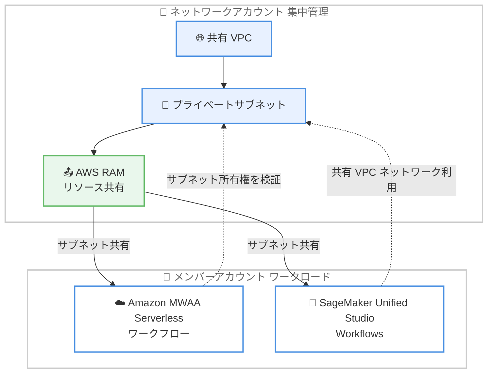

# Amazon MWAA Serverless - 共有 VPC 構成のサポート

**リリース日**: 2026年6月29日
**サービス**: Amazon Managed Workflows for Apache Airflow (MWAA) Serverless
**機能**: 共有 VPC サブネットのサポート

📊 [このアップデートのインフォグラフィックを見る](https://takech9203.github.io/aws-news-summary/20260629-amazon-mwaa-serverless-vpc.html)
<!-- INFOGRAPHIC_BASE_URL は環境変数から取得 -->

## 概要

Amazon Managed Workflows for Apache Airflow (MWAA) Serverless が、共有 VPC サブネットをサポートするようになりました。AWS Resource Access Manager (AWS RAM) を通じて別アカウントから共有されたサブネットを使用して、MWAA Serverless ワークフローを作成できるようになります。

これまで、AWS RAM で共有されたサブネットを利用するお客様は、MWAA Serverless ワークフローの作成時に検証エラーを受け取っていました。今回のアップデートにより、MWAA Serverless は共有 VPC 構成におけるサブネットの所有権を正しく検証するようになり、MWAA Provisioned 環境と同じ動作になりました。

AWS RAM を使用してアカウント間で VPC サブネットを共有することは、マルチアカウントのランディングゾーンアーキテクチャにおける一般的なパターンです。ネットワークを一元管理している組織は、回避策なしでメンバーアカウント内の共有サブネットを使用して MWAA Serverless ワークフローを起動できるようになります。また、共有 VPC ネットワークでプロジェクトを構成している Amazon SageMaker Unified Studio Workflows のユーザーも、このアップデートの恩恵を受けられます。

**アップデート前の課題**

- 以前は AWS RAM で共有されたサブネットを指定すると、MWAA Serverless ワークフローの作成時に検証エラーが発生していた
- 以前は共有 VPC を利用するために、メンバーアカウント内に専用の VPC とサブネットを作成するなどの回避策が必要だった
- 以前は MWAA Provisioned 環境と MWAA Serverless でネットワーク構成の挙動に差異があった

**アップデート後の改善**

- 今回のアップデートにより、AWS RAM で共有されたサブネットを使用して MWAA Serverless ワークフローを作成できるようになった
- 今回のアップデートにより、共有 VPC を利用するための回避策が不要になった
- 今回のアップデートにより、MWAA Provisioned 環境と一貫したサブネット所有権の検証が行われるようになった

## アーキテクチャ図



ネットワークアカウントが AWS RAM で共有したサブネットを、メンバーアカウントの MWAA Serverless ワークフローおよび SageMaker Unified Studio Workflows が直接利用できるようになったことを示しています。

## サービスアップデートの詳細

### 主要機能

1. **共有 VPC サブネットのサポート**
   - AWS RAM を通じて別アカウントから共有されたサブネットを MWAA Serverless ワークフローで指定できる
   - これまで発生していた、共有サブネット指定時の検証エラーが解消された
   - メンバーアカウント内に独自の VPC やサブネットを用意する回避策が不要になった

2. **サブネット所有権検証の改善**
   - 共有 VPC 構成におけるサブネットの所有権を正しく検証するようになった
   - MWAA Provisioned 環境と一貫した検証動作になり、プロビジョンドとサーバーレスでネットワーク設計を統一できる

3. **SageMaker Unified Studio Workflows への波及効果**
   - 共有 VPC ネットワークでプロジェクトを構成している Amazon SageMaker Unified Studio Workflows のユーザーも、このアップデートの恩恵を受けられる
   - Unified Studio のワークフローは内部的に MWAA Serverless を利用するため、同じネットワーク検証の改善が適用される

## 技術仕様

### Amazon MWAA がサポートする VPC タイプ

| Amazon VPC タイプ | サポート |
|------|------|
| 環境を作成するアカウントが所有する Amazon VPC | あり |
| 複数の AWS アカウントがリソースを作成する共有 Amazon VPC | あり |

公式ドキュメントによると、Amazon MWAA は環境作成アカウントが所有する VPC と、複数アカウントが利用する共有 VPC の両方をサポートします。今回のアップデートにより、MWAA Serverless でもこの共有 VPC のサポートが Provisioned 環境と同様に機能するようになりました。

### 共有 VPC とランディングゾーンの関係

| 項目 | 詳細 |
|------|------|
| 共有の仕組み | AWS Resource Access Manager (AWS RAM) によるサブネット共有 |
| 一般的な構成 | ネットワークを一元管理する専用アカウントからメンバーアカウントへサブネットを共有 |
| 適用パターン | マルチアカウントのランディングゾーンアーキテクチャ |
| 検証の対象 | MWAA Serverless が共有サブネットの所有権を検証 |

### API変更履歴

今回のアップデートに直接対応する公開 API メソッドの追加・変更は確認できませんでした。共有 VPC 構成におけるサブネット所有権の検証ロジックの改善が中心であり、ワークフロー作成 API のインターフェイス自体に変更はありません。

## 設定方法

### 前提条件

1. AWS Organizations 上でアカウント間のリソース共有が有効になっていること
2. ネットワーク管理アカウントで VPC とプライベートサブネットが作成されていること
3. AWS RAM を使用して対象のサブネットがメンバーアカウントへ共有されていること
4. MWAA がサポートするネットワーク要件 (異なるアベイラビリティーゾーンに配置された複数のサブネットなど) を満たしていること

### 手順

#### ステップ1: ネットワークアカウントでサブネットを共有する

```bash
# AWS RAM でサブネットをメンバーアカウントに共有する
aws ram create-resource-share \
  --name mwaa-shared-subnets \
  --resource-arns arn:aws:ec2:ap-northeast-1:111122223333:subnet/subnet-aaaa1111 \
                  arn:aws:ec2:ap-northeast-1:111122223333:subnet/subnet-bbbb2222 \
  --principals 444455556666
```

このコマンドは、ネットワーク管理アカウント (111122223333) が保有する 2 つのプライベートサブネットを、メンバーアカウント (444455556666) に対して AWS RAM 経由で共有します。MWAA は異なるアベイラビリティーゾーンに配置された複数のサブネットを必要とするため、複数のサブネットを共有します。

#### ステップ2: メンバーアカウントで共有サブネットを確認する

```bash
# メンバーアカウントで利用可能な共有サブネットを確認する
aws ec2 describe-subnets \
  --filters "Name=owner-id,Values=111122223333"
```

このコマンドは、メンバーアカウントから参照できる共有サブネットの一覧を表示します。`owner-id` が共有元アカウントになっていることを確認します。

#### ステップ3: 共有サブネットを指定して MWAA Serverless ワークフローを作成する

メンバーアカウントで MWAA Serverless ワークフローを作成する際に、ステップ 2 で確認した共有サブネットの ID を指定します。今回のアップデートにより、共有サブネットを指定しても検証エラーが発生せず、所有権が正しく検証されてワークフローを作成できます。詳細な手順は Amazon MWAA Serverless ユーザーガイドのネットワークに関するセクションを参照してください。

## メリット

### ビジネス面

- **ガバナンスの維持**: ネットワークを一元管理する組織が、集中管理ポリシーを維持したまま MWAA Serverless を導入できる
- **導入の迅速化**: 回避策が不要になり、メンバーアカウントでのワークフロー立ち上げにかかる手間と時間を削減できる
- **標準アーキテクチャへの適合**: マルチアカウントランディングゾーンという一般的な構成パターンにそのまま対応できる

### 技術面

- **ネットワーク設計の統一**: MWAA Provisioned 環境と一貫した動作になり、プロビジョンドとサーバーレスでネットワーク設計を共通化できる
- **重複リソースの削減**: メンバーアカウントごとに専用 VPC やサブネットを作成する必要がなくなり、ネットワークリソースの重複を回避できる
- **Unified Studio との連携**: 共有 VPC を利用する SageMaker Unified Studio Workflows でも同じ恩恵を受けられる

## デメリット・制約事項

### 制限事項

- 共有 VPC を利用するには、AWS RAM によるサブネット共有が事前に設定されている必要がある
- MWAA のネットワーク要件 (異なるアベイラビリティーゾーンへの複数サブネット配置など) は引き続き満たす必要がある
- 本アップデートは Amazon MWAA Serverless がサポートされているリージョンでのみ利用できる

### 考慮すべき点

- 共有サブネットのルートテーブルやセキュリティグループ、ネットワーク ACL は共有元アカウントの設定に依存するため、ネットワーク管理アカウントとの責任分界を明確にする必要がある
- 共有サブネットの IP アドレス枯渇に注意し、複数のワークロードがサブネットを共有する場合は CIDR 設計を見直す

## ユースケース

### ユースケース1: マルチアカウントランディングゾーンでのデータパイプライン

**シナリオ**: 大企業がネットワーク専用アカウントで VPC を一元管理し、事業部ごとのメンバーアカウントでデータパイプラインを運用している。

**実装例**:
```
ネットワークアカウント: 共有 VPC + プライベートサブネットを AWS RAM で共有
事業部アカウント: 共有サブネットを指定して MWAA Serverless ワークフローを作成
```

**効果**: 集中管理されたネットワークガバナンスを維持しながら、各事業部が独立してデータパイプラインを運用できる。

### ユースケース2: 専用 VPC 作成の回避によるコスト最適化

**シナリオ**: これまでメンバーアカウントごとに専用 VPC、NAT ゲートウェイ、VPC エンドポイントを用意していたが、運用コストとリソースの重複が課題だった。

**実装例**:
```
共有 VPC のサブネットと VPC エンドポイントを複数のメンバーアカウントで再利用
各メンバーアカウントでは MWAA Serverless ワークフローのみを作成
```

**効果**: NAT ゲートウェイや VPC エンドポイントなどの共有可能なネットワークリソースを集約し、重複コストを削減できる。

### ユースケース3: SageMaker Unified Studio Workflows での共有ネットワーク利用

**シナリオ**: データサイエンスチームが Amazon SageMaker Unified Studio を使用し、プロジェクトを組織の共有 VPC ネットワークで構成している。

**実装例**:
```
SageMaker Unified Studio プロジェクト: 共有 VPC ネットワークで構成
内部の Unified Studio Workflows が共有サブネットを利用して実行
```

**効果**: 別途ネットワークを構築することなく、組織の標準ネットワーク上で機械学習ワークフローを実行できる。

## 料金

本アップデート自体による追加料金は発生しません。Amazon MWAA Serverless および AWS RAM の通常の料金体系が適用されます。MWAA Serverless はワークフローの実行に応じた従量課金、AWS RAM のリソース共有自体は追加料金なしで利用できます。共有 VPC 内の NAT ゲートウェイや VPC エンドポイントなどには、それぞれのサービス料金が別途発生します。詳細は各サービスの料金ページを参照してください。

## 利用可能リージョン

Amazon MWAA Serverless がサポートされているすべての AWS リージョンで利用できます。

## 関連サービス・機能

- **AWS Resource Access Manager (AWS RAM)**: アカウント間で VPC サブネットなどのリソースを共有するためのサービス。本アップデートの前提となる
- **Amazon VPC**: MWAA Serverless ワークフローが利用するネットワーク基盤。共有 VPC の所有権検証が今回改善された
- **Amazon SageMaker Unified Studio Workflows**: 共有 VPC ネットワークで構成されたプロジェクトが本アップデートの恩恵を受ける
- **Amazon MWAA Provisioned 環境**: 本アップデートにより、サーバーレスとプロビジョンドでサブネット所有権の検証動作が一貫した

## 参考リンク

- 📊 [インフォグラフィック](https://takech9203.github.io/aws-news-summary/20260629-amazon-mwaa-serverless-vpc.html)
- [公式発表 (What's New)](https://aws.amazon.com/about-aws/whats-new/2026/06/amazon-mwaa-serverless-vpc/)
- [Amazon MWAA ネットワークの概要 (ドキュメント)](https://docs.aws.amazon.com/mwaa/latest/userguide/networking-about.html)
- [AWS Resource Access Manager ユーザーガイド](https://docs.aws.amazon.com/ram/latest/userguide/what-is.html)
- [Amazon MWAA 料金ページ](https://aws.amazon.com/managed-workflows-for-apache-airflow/pricing/)

## まとめ

このアップデートにより、AWS RAM で共有された VPC サブネットを使用して Amazon MWAA Serverless ワークフローを作成できるようになり、マルチアカウントランディングゾーンでの導入障壁が解消されました。MWAA Provisioned 環境と一貫したサブネット所有権検証が行われるようになったため、ネットワークを一元管理する組織は回避策なしで MWAA Serverless を利用できます。共有 VPC を採用している場合は、専用 VPC を作成する既存の回避策を見直し、共有サブネットを直接利用する構成への移行を検討することを推奨します。
