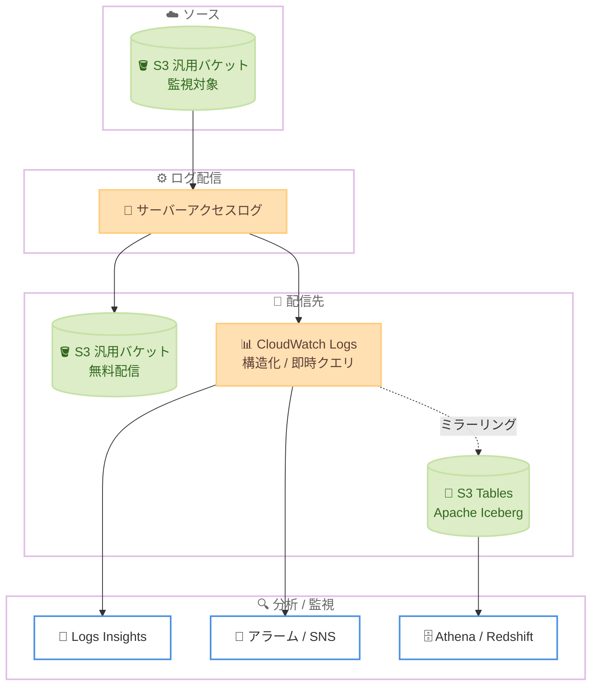

# Amazon S3 - サーバーアクセスログの CloudWatch Logs および S3 Tables への配信

**リリース日**: 2026年6月29日
**サービス**: Amazon Simple Storage Service (Amazon S3)
**機能**: サーバーアクセスログの Amazon CloudWatch Logs および Amazon S3 Tables への配信

📊 [このアップデートのインフォグラフィックを見る](https://takech9203.github.io/aws-news-summary/20260629-amazon-s3-cloudwatch-logs-tables.html)
<!-- INFOGRAPHIC_BASE_URL は環境変数から取得 -->

## 概要

Amazon S3 は、サーバーアクセスログ (Server Access Logs) を Amazon CloudWatch Logs および Amazon S3 Tables へ配信する新しい配信オプションをサポートしました。これまでサーバーアクセスログは S3 汎用バケットへの配信のみが可能でしたが、今回のアップデートにより、用途に応じて 3 つの配信先 (汎用バケット、CloudWatch Logs、S3 Tables) を柔軟に選択できるようになりました。

CloudWatch Logs への配信では、ログが構造化フィールドにパースされ、取り込み後すぐにクエリ可能になります。これにより、エラー率に対するアラーム設定、トラフィックパターンの監視、アカウントやリージョンをまたいだアクセスインシデントの調査、そして S3 アクセスアクティビティとその他の運用データとの相関分析が可能になります。AWS KMS による暗号化にも対応しています。

S3 Tables への配信では、ログを Apache Iceberg 形式で追加のストレージコストなしでミラーリングできます。ミラーリングされたログは、Amazon Athena、Amazon Redshift、その他の Iceberg 互換クエリエンジンから標準 SQL で即座にクエリできるため、アクセスパターンの監査、使用傾向の分析、コスト要因の特定に活用できます。これらの新しい配信パスは、既存の S3 汎用バケットへの無料配信を補完するものです。

**アップデート前の課題**

- 以前はサーバーアクセスログを S3 汎用バケットにしか配信できず、分析するには独自の転送パイプライン、パースロジック、ETL ジョブを構築する必要があった
- 以前はエラー率の急増やアクセスインシデントをリアルタイムに近い形で検知するための仕組みを自前で構築する必要があった
- 以前は複数アカウントやリージョンにまたがるアクセスログを横断的に集約・分析する手段が限られていた

**アップデート後の改善**

- 今回のアップデートにより、ログが CloudWatch Logs で構造化フィールドにパースされ、取り込み後すぐに CloudWatch Logs Insights でクエリできるようになった
- 今回のアップデートにより、メトリクスフィルターを使ったアラーム設定やクロスアカウント / クロスリージョンでの集約が可能になった
- 今回のアップデートにより、Apache Iceberg 形式の S3 Tables へのミラーリングで、Athena や Redshift から標準 SQL による即時分析が追加ストレージコストなしで可能になった

## アーキテクチャ図



監視対象の S3 汎用バケットのサーバーアクセスログを、3 つの配信先 (汎用バケット、CloudWatch Logs、S3 Tables) に配信し、Logs Insights やアラーム、Athena などで分析・監視する流れを示しています。S3 Tables への配信は CloudWatch Logs グループからミラーリングされます。

## サービスアップデートの詳細

### 主要機能

1. **CloudWatch Logs への配信**
   - サーバーアクセスログが構造化フィールドにパースされ、取り込み後数秒でクエリ可能になる
   - 独自の転送パイプライン、パースロジック、ETL ジョブが不要になる
   - CloudWatch Logs Insights による即時クエリに対応

2. **メトリクスフィルターとアラーム**
   - Standard ログクラスではメトリクスフィルターベースのアラームを設定可能
   - エラー率 (例: HTTP 403) の急増を検知し、SNS で通知できる
   - トラフィックパターンの監視やダッシュボードでの傾向分析に活用

3. **クロスアカウント / クロスリージョン集約**
   - クロスアカウントオブザーバビリティによる「その場でのクエリ」、または 1 つのアカウントへのログ集約が可能
   - 組織全体での展開はテレメトリ有効化ルール (アカウント、リージョン、タグ単位) で実施できる
   - 複数アカウント・リージョンにまたがるアクセスインシデントの調査が容易になる

4. **S3 Tables (Apache Iceberg) へのミラーリング**
   - CloudWatch Logs グループから S3 Tables へログをミラーリングできる
   - 追加のストレージコストなしで Apache Iceberg 形式で保存され、コンパクションとスナップショット管理は自動で行われる
   - Athena、Redshift、その他の Iceberg 互換エンジンから標準 SQL でクエリ可能

5. **AWS KMS による暗号化**
   - ログ グループの設定により KMS 暗号化を有効化できる
   - KMS 暗号化されたログ グループで S3 Tables を併用する場合は、`systemtables.cloudwatch.amazonaws.com` および `maintenance.s3tables.amazonaws.com` へのアクセス許可が必要

## 技術仕様

### ログ グループのクラスと機能の対応

| ログ グループクラス | メトリクスフィルター / アラーム | Logs Insights | S3 Tables 連携 | 特徴 |
|------|------|------|------|------|
| Standard | 対応 | 対応 | 対応 | メトリクスフィルターによるアラームが可能 |
| Infrequent Access | 非対応 | 対応 | 対応 | より低コストだがメトリクスフィルターは利用不可 |

ログ グループのクラスは作成時に固定され、後から変更できません。

### S3 Tables のテーブル構成

| 項目 | 詳細 |
|------|------|
| マネージドテーブルバケット | `aws-cloudwatch` |
| 名前空間 | `logs` |
| 完全修飾名 | `"s3tablescatalog/aws-cloudwatch"."logs"."amazon_s3__server_access"` |
| パーティション | `cwl__timestamp` による日次パーティション |
| 保持期間 | CloudWatch Logs グループの保持設定を共有 (独立していない) |

S3 Tables のコピーはログ グループの保持期間を共有します。ログ グループやログストリームを削除すると、Iceberg データも削除される点に注意が必要です。

### API変更履歴

今回のアップデートに直接対応する awsapichanges.com 上の API 変更履歴は、レポート作成時点 (過去 7 日間) では確認できませんでした。設定は CloudWatch Logs の `put-delivery-source`、`put-delivery-destination`、`create-delivery` および `observabilityadmin` の S3 Tables 連携 API を組み合わせて行います。

### CloudWatch Logs Insights クエリ例

```text
# 誰がどの操作でアクセスしているかを集計
stats count(*) as requests by requester, operation | sort requests desc
```

```text
# プレフィックス単位の読み取りボリュームを集計
filter operation like /REST\.GET\.OBJECT/
| parse key_name /^(?<prefix>[^\/]+)\//
| stats sum(bytes_sent_size) as total_bytes_returned, count(*) as requests by prefix
| sort total_bytes_returned desc | limit 10
```

## 設定方法

### 前提条件

1. ソースとなる S3 汎用バケットが存在すること
2. バケットと同じリージョンに CloudWatch Logs のログ グループが存在すること (`/aws/vendedlogs/` プレフィックスで作成すると自動作成される)
3. 配信および vended log delivery に必要な IAM 権限が付与されていること

### 手順

#### ステップ1: 配信元 (delivery source) の作成

```bash
aws logs put-delivery-source --name my-sal-source \
  --resource-arn arn:aws:s3:::my-bucket \
  --log-type S3_SERVER_ACCESS_LOGS --region us-east-1
```

バケットごとに配信元を作成し、サーバーアクセスログを配信対象として登録します。バケットと同じリージョン / アカウントを指定する必要があります。

#### ステップ2: 配信先 (delivery destination) の作成と配信の関連付け

```bash
# ログ グループごとに 1 回作成
aws logs put-delivery-destination --name my-sal-destination \
  --delivery-destination-configuration '{"destinationResourceArn": "..."}'

# バケットごとに配信を作成
aws logs create-delivery --delivery-source-name my-sal-source \
  --delivery-destination-arn ...
```

配信先 (CloudWatch Logs グループ) を登録し、配信元と関連付けて実際のログ配信を開始します。設定の反映には 15 ～ 20 分かかります。配信はベストエフォートであり、過去のログの遡及配信 (バックフィル) は行われません。

#### ステップ3: S3 Tables 連携の有効化 (任意)

```bash
aws observabilityadmin create-s3-table-integration \
  --role-arn ... --encryption '{"SseAlgorithm":"AES256"}'

aws logs associate-source-to-s3-table-integration \
  --integration-arn ... --data-source '{"name":"amazon_s3","type":"server_access"}'
```

S3 Tables へのミラーリングを有効化します。暗号化は必須で、SSE-S3 の場合は `{"SseAlgorithm":"AES256"}`、KMS を使う場合は `aws:kms` と `KmsKeyArn` を指定します。マネジメントコンソールからはバケットの [プロパティ] タブで [Enable S3 Tables integration] を選択することで、アカウント / リージョンごとに 1 回だけ有効化できます。

## メリット

### ビジネス面

- **運用コストの削減**: 独自のログ転送パイプラインや ETL ジョブの構築・保守が不要になり、開発・運用工数を削減できる
- **追加ストレージコストなしの分析基盤**: S3 Tables へのミラーリングは追加ストレージコストがかからず、コスト要因の特定や使用傾向の分析を低コストで実現できる
- **既存の無料配信との併用**: S3 汎用バケットへの既存の無料配信を維持しつつ、必要な分析機能を追加できる

### 技術面

- **即時クエリ性**: CloudWatch Logs では取り込み後数秒でクエリ可能、S3 Tables では標準 SQL による即時クエリが可能
- **横断的な可観測性**: クロスアカウント / クロスリージョンでのログ集約と調査が可能
- **標準フォーマットの活用**: Apache Iceberg 形式により Athena、Redshift など複数の Iceberg 互換エンジンから分析できる

## デメリット・制約事項

### 制限事項

- ログ グループのクラスは作成時に固定され、Infrequent Access クラスではメトリクスフィルター / アラームを利用できない
- 配信はベストエフォートのため、リアルタイムのアラート用途より傾向分析に適している。また過去ログの遡及配信は行われない
- S3 Tables のコピーはログ グループの保持期間を共有し、独立した保持設定はできない。ログ グループ削除時に Iceberg データも削除される

### 考慮すべき点

- 設定反映に 15 ～ 20 分かかるため、構成変更後すぐにログが配信されない点を考慮する
- メトリクスフィルターによるアラームが必要な場合は Standard ログクラスを選択する必要があり、コストとのトレードオフを検討する
- KMS 暗号化されたログ グループで S3 Tables を併用する場合、CloudWatch および S3 Tables のサービスプリンシパルへの KMS アクセス許可が必要

## ユースケース

### ユースケース1: 不正アクセスの検知とアラート

**シナリオ**: アクセス拒否 (HTTP 403) の急増を検知し、セキュリティチームへ即座に通知したい。

**実装例**:
```text
# メトリクスフィルターのパターン
{ $.http_status = 403 }
# しきい値: 5 分間に 100 リクエスト → SNS 通知
```

**効果**: Standard ログクラスのメトリクスフィルターにより、アクセス拒否の急増をアラームで検知し、インシデント対応を迅速化できます。

### ユースケース2: クロスアカウントでのアクセスインシデント調査

**シナリオ**: 複数の AWS アカウントにまたがる S3 バケットへのアクセスを 1 つのアカウントから横断的に調査したい。

**実装例**:
```text
# クロスアカウントオブザーバビリティで集約し Logs Insights でクエリ
stats count(*) as requests by requester, operation | sort requests desc
```

**効果**: クロスアカウント / クロスリージョンでログを集約・クエリでき、横断的なインシデント調査が可能になります。

### ユースケース3: コールドデータの特定によるコスト最適化

**シナリオ**: アクセス頻度の低いオブジェクトを特定し、ストレージクラスの見直しによるコスト最適化を行いたい。

**実装例**:
```text
# S3 Tables を Athena でクエリし、オブジェクト読み取り操作を分析
SELECT key_name, MAX(request_time) AS last_accessed
FROM "s3tablescatalog/aws-cloudwatch"."logs"."amazon_s3__server_access"
WHERE operation LIKE 'REST.GET.OBJECT%'
GROUP BY key_name
```

**効果**: アクセス傾向を SQL で分析し、コールドデータを特定してストレージコストを最適化できます。`last_accessed` が NULL の場合はコールドデータの強い兆候として扱えます。

## 料金

CloudWatch Logs への配信は vended log の料金 (ボリュームベースの段階的料金) が適用され、主なコスト要因となります。Infrequent Access クラスは取り込み料金が安価ですが、メトリクスフィルターは利用できません。ストレージはログを圧縮して保存し、両クラスとも同じ料金で、保持期間によりコストを制御します。クエリは Logs Insights でスキャンしたデータ量に応じて課金されます。

S3 Tables については、ストレージとテーブルメンテナンスに CloudWatch の取り込み / ストレージ料金を超える追加料金はかかりません。Athena からのクエリには、標準の S3 Tables リクエスト料金とクエリごとのスキャン課金が発生します。

### 料金例

| 使用量 | 月額料金（概算） |
|--------|------------------|
| S3 汎用バケットへの配信 | 無料 (配信自体は無料) |
| S3 Tables へのミラーリング (ストレージ) | 追加ストレージコストなし |
| CloudWatch Logs への取り込み / Logs Insights クエリ | 使用量に応じた従量課金 (詳細は料金ページを参照) |

正確な料金は使用量やリージョンにより異なるため、最新の料金は公式の料金ページを確認してください。

## 利用可能リージョン

AWS 中国リージョンおよび AWS GovCloud (US) リージョンを除く、すべての AWS リージョンで利用可能です。

## 関連サービス・機能

- **Amazon CloudWatch Logs**: サーバーアクセスログの構造化配信先。Logs Insights によるクエリ、メトリクスフィルター、アラームを提供
- **Amazon S3 Tables**: Apache Iceberg 形式でのログミラーリング先。SQL 分析の基盤を提供
- **Amazon Athena / Amazon Redshift**: S3 Tables にミラーリングされたログを標準 SQL でクエリする分析エンジン
- **AWS KMS**: ログデータの暗号化を提供
- **Amazon SNS**: メトリクスフィルターによるアラームの通知先

## 参考リンク

- 📊 [インフォグラフィック](https://takech9203.github.io/aws-news-summary/20260629-amazon-s3-cloudwatch-logs-tables.html)
- [公式発表 (What's New)](https://aws.amazon.com/about-aws/whats-new/2026/06/amazon-s3-cloudwatch-logs-tables/)
- [AWS Blog: Query Amazon S3 access logs instantly with CloudWatch and S3 Tables](https://aws.amazon.com/blogs/storage/query-amazon-s3-access-logs-instantly-with-cloudwatch-and-s3-tables/)
- [Amazon S3 ドキュメント (サーバーアクセスログ)](https://docs.aws.amazon.com/AmazonS3/latest/userguide/ServerLogs.html)
- [Amazon CloudWatch Logs 料金](https://aws.amazon.com/cloudwatch/pricing/)

## まとめ

今回のアップデートにより、Amazon S3 のサーバーアクセスログを CloudWatch Logs および S3 Tables へ直接配信できるようになり、独自のログ処理パイプラインを構築せずに即時クエリ、アラーム、クロスアカウント分析が実現できます。セキュリティ監視やコスト最適化を強化したい場合は、Standard / Infrequent Access のログクラスの選択と保持期間設定を検討したうえで、まず対象バケットで CloudWatch Logs 配信を有効化し、必要に応じて S3 Tables 連携を追加することを推奨します。
