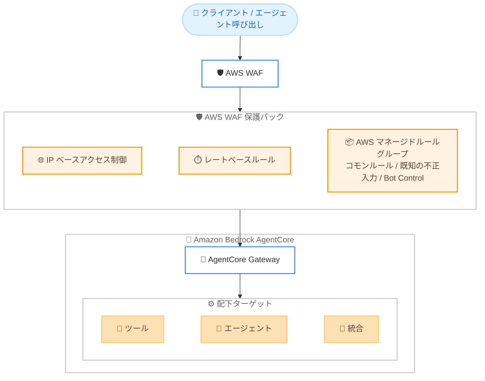

# AWS WAF - Amazon Bedrock AgentCore Gateway 保護

**リリース日**: 2026 年 6 月 29 日
**サービス**: AWS WAF (AWS Web Application Firewall)
**機能**: Amazon Bedrock AgentCore Gateway に対する AWS WAF 保護

📊 [このアップデートのインフォグラフィックを見る](https://takech9203.github.io/aws-news-summary/20260629-aws-waf-amazon-bedrock-agentcore.html)
<!-- INFOGRAPHIC_BASE_URL は環境変数から取得 -->

## 概要

AWS は、Amazon Bedrock AgentCore Gateway に対する AWS WAF (AWS Web Application Firewall) 保護の一般提供 (GA) を発表しました。これにより、エージェント型 AI ワークロードを一般的な Web エクスプロイトや不正利用から保護できるようになります。エージェント型アプリケーションをプロトタイプから本番環境へ移行する企業が増える中、本アップデートはセキュリティチームおよびプラットフォームチームに対して、Gateway レイヤーで一貫性のあるカスタマイズ可能な Web 保護を適用する手段を提供します。

AgentCore Gateway に AWS WAF の保護パック (Web ACL) を関連付けることで、IP ベースのアクセス制御、不正なトラフィックを抑制するレートベースルール、AWS マネージドルールグループ (コモンルールセット、既知の不正な入力、Bot Control を含む) を適用できます。保護パックは Gateway レベルで一度設定するだけで、AWS WAF がその Gateway の背後にあるすべてのターゲットに対して一貫して適用します。そのため、単一の設定で配下のすべてのツール、エージェント、統合を保護できます。

対象ユーザーは、本番環境でエージェント型 AI アプリケーションを運用するセキュリティ担当者やプラットフォームエンジニアです。AWS WAF と Amazon Bedrock AgentCore Gateway の両方が提供されているすべての AWS リージョンで利用できます。

**アップデート前の課題**

- 以前は AgentCore Gateway 自体に統合された Web アプリケーションファイアウォール保護を関連付ける標準的な手段がなく、エージェント型ワークロードへの不正アクセスやトラフィック濫用への対策が個別実装に依存していました
- 以前は Gateway の背後にある複数のツールやエージェント、統合それぞれに対して保護を個別に検討する必要がありました
- 以前は IP ベースのアクセス制御やレート制限を、エージェント型 AI のエントリポイントに対して一貫した形で適用しづらい状況でした

**アップデート後の改善**

- 今回のアップデートにより、AWS WAF の保護パックを AgentCore Gateway に直接関連付けて、一般的な Web エクスプロイトや濫用から保護できるようになりました
- 今回のアップデートにより、Gateway レベルで一度設定するだけで、配下のすべてのターゲットに保護が一貫適用され、個別設定が不要になりました
- 今回のアップデートにより、IP ベースのアクセス制御、レートベースルール、AWS マネージドルールグループをエージェント型 AI ワークロードに対して統一的に適用できるようになりました

## アーキテクチャ図



AWS WAF の保護パックを AgentCore Gateway に関連付けることで、Gateway に到達するトラフィックがツールやエージェントなどの配下ターゲットに渡る前に、IP 制御・レート制限・マネージドルールによる検査が行われます。

## サービスアップデートの詳細

### 主要機能

1. **IP ベースのアクセス制御**
   - 特定の IP アドレスや IP レンジに基づいてトラフィックを許可・拒否します
   - 信頼できるネットワークからのアクセスのみを許可するなど、エージェント型ワークロードへの到達制御を実現します

2. **レートベースルール**
   - 一定期間内のリクエスト数に基づいて、濫用的なトラフィックを抑制 (スロットリング) します
   - エージェント型 AI のエンドポイントに対する過剰なリクエストや乱用を緩和します

3. **AWS マネージドルールグループ**
   - コモンルールセット (Common Rule Set): 一般的な Web アプリケーションの脆弱性に対応します
   - 既知の不正な入力 (Known Bad Inputs): 既知の悪意あるリクエストパターンをブロックします
   - Bot Control: 自動化されたボットトラフィックを検出・管理します

4. **Gateway レベルの一括適用**
   - 保護パックを Gateway に一度関連付けるだけで、その Gateway の背後にあるすべてのターゲット (ツール、エージェント、統合) に保護が一貫適用されます
   - ターゲットごとの個別設定が不要となり、設定の一貫性と運用効率が向上します

## 技術仕様

### AWS WAF で保護可能なリソースタイプ

AWS WAF の保護パック (Web ACL) は、リージョナルリソースの 1 つとして Amazon Bedrock AgentCore Gateway をサポートします。保護パックおよびそれが使用する AWS WAF リソース (ルールグループ、IP セット、正規表現パターンセットなど) は、保護対象リソースと同じリージョンに配置する必要があります。

| 項目 | 詳細 |
|------|------|
| リソースタイプ | Amazon Bedrock AgentCore Gateway (リージョナルリソース) |
| 関連付け単位 | Gateway 単位 (1 つの Gateway に 1 つの保護パック) |
| 保護パックの配置 | 保護対象 Gateway と同一リージョン |
| 適用範囲 | Gateway 配下のすべてのターゲット (ツール、エージェント、統合) |
| データ保持 | 監視・管理する Web リクエストデータは保護対象リソースと同一リージョン内に保持 |

AWS WAF では、各 AWS リソースに対して関連付けできる保護パックは 1 つのみです (保護パックとリソースの関係は 1 対多)。

### 設定や権限など

保護パックを Gateway に関連付ける際の代表的な操作例です。

```bash
# 既存の Web ACL (保護パック) を AgentCore Gateway に関連付ける
aws wafv2 associate-web-acl \
  --web-acl-arn arn:aws:wafv2:ap-northeast-1:123456789012:regional/webacl/my-agentcore-protection/xxxxxxxx \
  --resource-arn arn:aws:bedrock-agentcore:ap-northeast-1:123456789012:gateway/my-gateway-id
```

`associate-web-acl` は、作成済みの保護パック (Web ACL) を `--resource-arn` で指定した AgentCore Gateway に関連付けます。Web ACL と Gateway は同一リージョンである必要があります。

## 設定方法

### 前提条件

1. Amazon Bedrock AgentCore Gateway が作成済みであること
2. AWS WAF の保護パック (Web ACL) を作成する権限があること
3. 保護パックと Gateway が同一リージョンに存在すること

### 手順

#### ステップ1: 保護パック (Web ACL) の作成

```bash
# リージョナルスコープで Web ACL を作成
aws wafv2 create-web-acl \
  --name my-agentcore-protection \
  --scope REGIONAL \
  --region ap-northeast-1 \
  --default-action Allow={} \
  --visibility-config SampledRequestsEnabled=true,CloudWatchMetricsEnabled=true,MetricName=agentcoreWAF \
  --rules file://rules.json
```

`create-web-acl` で、IP セット参照、レートベースルール、AWS マネージドルールグループを含むルールセットを定義した保護パックを作成します。`--scope REGIONAL` を指定する点に注意してください。

#### ステップ2: AgentCore Gateway への関連付け

```bash
# 作成した保護パックを Gateway に関連付け
aws wafv2 associate-web-acl \
  --web-acl-arn <作成した Web ACL の ARN> \
  --resource-arn <AgentCore Gateway の ARN>
```

`associate-web-acl` を実行すると、Gateway 配下のすべてのターゲットに保護が一貫適用されます。

#### ステップ3: モニタリングとルール調整

CloudWatch メトリクスとサンプリングされたリクエストを確認し、誤検知や濫用パターンに応じてレートベースルールのしきい値やマネージドルールの設定を調整します。本番適用前にはカウントモードでの評価を推奨します。

## メリット

### ビジネス面

- **本番移行の加速**: エージェント型 AI アプリケーションをプロトタイプから本番へ移行する際のセキュリティ要件を、マネージドな保護機能で満たせます
- **運用負荷の軽減**: Gateway レベルでの一元設定により、配下の各ターゲットを個別に保護する手間を削減できます
- **ガバナンスの強化**: セキュリティチームとプラットフォームチームが一貫したポリシーをエージェント型ワークロードに適用できます

### 技術面

- **一貫した保護適用**: 単一の保護パックで Gateway 配下のすべてのツール、エージェント、統合を保護できます
- **多層的な防御**: IP 制御、レート制限、マネージドルールグループを組み合わせた多層的な Web 保護を実現します
- **既存 AWS WAF 機能の活用**: 既存の AWS WAF の概念 (Web ACL、ルールグループ、IP セット) をそのまま AgentCore Gateway に適用できます

## デメリット・制約事項

### 制限事項

- 1 つの AgentCore Gateway に関連付けできる保護パックは 1 つのみです
- 保護パックと Gateway は同一リージョンに配置する必要があります
- 利用できるのは AWS WAF と Amazon Bedrock AgentCore Gateway の両方が提供されているリージョンに限られます

### 考慮すべき点

- レートベースルールやマネージドルールの設定によっては正当なトラフィックが影響を受ける可能性があるため、本番適用前にカウントモードでの評価が望ましいです
- AWS WAF の利用には別途 AWS WAF の料金が発生します (ルール数やリクエスト数などに基づく)

## ユースケース

### ユースケース1: 本番エージェント API の濫用防止

**シナリオ**: 公開された AgentCore Gateway 経由でエージェントを提供しており、過剰なリクエストによる濫用やコスト増加を防ぎたい。

**実装例**:
```
レートベースルールを設定し、単一 IP からの一定期間内のリクエスト数が
しきい値を超えた場合にブロックまたはスロットリングする
```

**効果**: エージェント型ワークロードへの過剰リクエストを抑制し、安定した運用とコスト管理を実現します。

### ユースケース2: 信頼できるネットワークからのアクセス限定

**シナリオ**: 社内システムや特定パートナーのみが利用するエージェント Gateway へのアクセスを、許可された IP レンジに制限したい。

**実装例**:
```
IP セットを作成し、許可リスト方式で保護パックに組み込む
許可外の IP からのリクエストを拒否
```

**効果**: 想定外のネットワークからのアクセスを遮断し、攻撃対象領域を縮小します。

### ユースケース3: 一般的な Web 脅威とボットへの対策

**シナリオ**: エージェント型アプリケーションを一般的な Web 攻撃や自動化されたボットトラフィックから保護したい。

**実装例**:
```
AWS マネージドルールグループ (コモンルールセット、既知の不正な入力、Bot Control)
を保護パックに追加して有効化
```

**効果**: 既知の脆弱性や悪意ある入力、ボットトラフィックに対する継続的に更新される防御を、運用負荷を抑えて適用できます。

## 料金

本アップデートに固有の追加料金は発表されていません。AWS WAF を利用する際は、AWS WAF の標準料金 (Web ACL、ルール、処理リクエスト数などに基づく従量課金) が適用されます。AWS マネージドルールグループや Bot Control など一部の機能には追加料金が発生する場合があります。詳細は AWS WAF の料金ページを参照してください。

## 利用可能リージョン

AWS WAF と Amazon Bedrock AgentCore Gateway の両方が利用可能なすべての AWS リージョンで提供されます。

## 関連サービス・機能

- **Amazon Bedrock AgentCore Gateway**: エージェント型 AI アプリケーションがツールや統合にアクセスするためのゲートウェイで、本機能の保護対象となります
- **AWS WAF マネージドルール**: コモンルールセット、既知の不正な入力、Bot Control など、AWS が管理・更新するルールグループを提供します
- **Amazon CloudWatch**: AWS WAF のメトリクスやサンプリングされたリクエストを可視化し、ルールのチューニングに活用できます

## 参考リンク

- 📊 [インフォグラフィック](https://takech9203.github.io/aws-news-summary/20260629-aws-waf-amazon-bedrock-agentcore.html)
- [公式発表 (What's New)](https://aws.amazon.com/about-aws/whats-new/2026/06/aws-waf-amazon-bedrock-agentcore/)
- [ドキュメント: AWS WAF で保護可能なリソース](https://docs.aws.amazon.com/waf/latest/developerguide/how-aws-waf-works-resources.html)
- [ドキュメント: Amazon Bedrock AgentCore Gateway](https://docs.aws.amazon.com/bedrock-agentcore/latest/devguide/gateway.html)

## まとめ

本アップデートにより、Amazon Bedrock AgentCore Gateway に AWS WAF の保護パックを関連付けて、エージェント型 AI ワークロードを一般的な Web 脅威や濫用から保護できるようになりました。Gateway レベルで一度設定するだけで配下のすべてのターゲットに一貫した保護が適用されるため、運用負荷を抑えながら本番環境のセキュリティ要件を満たせます。エージェント型アプリケーションを本番展開する際は、レートベースルールや AWS マネージドルールグループの導入を検討し、まずはカウントモードでの評価から始めることを推奨します。
