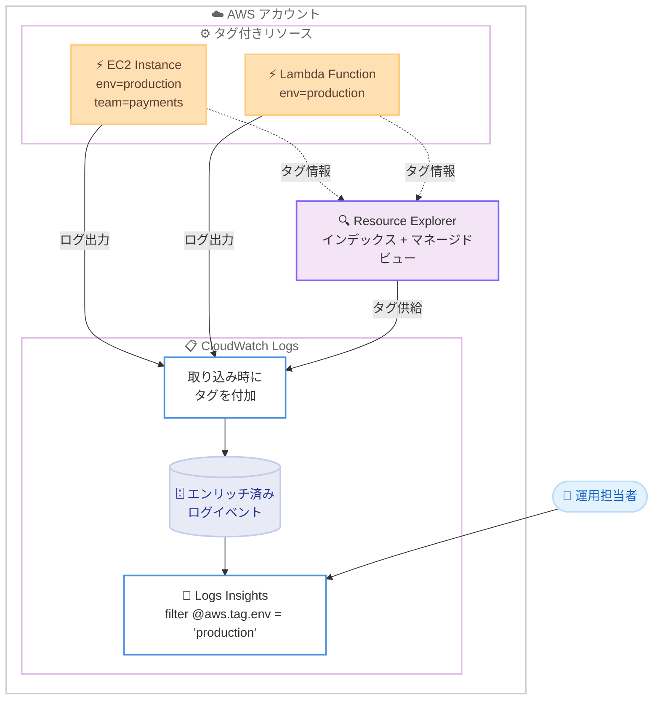

# Amazon CloudWatch Logs - リソースタグによるログイベントのエンリッチメント

**リリース日**: 2026 年 6 月 30 日
**サービス**: Amazon CloudWatch Logs
**機能**: リソースタグによるログイベントのエンリッチメント (Resource tags for telemetry)

📊 [このアップデートのインフォグラフィックを見る](https://takech9203.github.io/aws-news-summary/20260630-amazon-cloudwatch-logs-resource-tags.html)
<!-- INFOGRAPHIC_BASE_URL は環境変数から取得 -->

## 概要

Amazon CloudWatch Logs は、ログイベントに AWS リソースタグを付加 (エンリッチ) する機能を追加しました。これにより、チームの所有者、環境、コストセンター、アプリケーション名といったメタデータでログをフィルタリング、検索、分析することが容易になります。重要な点として、この機能はログ出力 (ロギングインストルメンテーション) 側のコード変更を一切必要としません。

タグエンリッチメントを有効にすると、CloudWatch Logs はログの取り込み (ingestion) 時点でリソースタグをログイベントに直接付加します。お客様はカスタムパイプラインを構築することなく、ログクエリ内でタグをすぐに利用して分析範囲を絞り込めます。たとえば、特定のチームが所有する本番リソースのログだけを抽出したり、インシデント調査時にコストセンター単位でログを絞り込んだりできます。

この機能はテレメトリ向けリソースタグ (resource tags for telemetry) 機能の一部であり、メトリクスへのタグ付加と同じ基盤を共有します。有効化すると、AWS Resource Explorer がアカウント内のリソースとタグをインデックス化し、CloudWatch がその情報を使ってログイベントとメトリクスにタグを付加します。追加コストなしで利用できます。

**アップデート前の課題**

- 以前は、ログをチームや環境、コストセンターなどの組織的なメタデータで絞り込むには、アプリケーション側でログメッセージにタグ情報を埋め込む必要があった
- 以前は、リソースタグをログに反映させるために、Lambda などを用いた独自のログ加工パイプラインを構築・運用する必要があった
- 以前は、タグでログを横断的に分析しようとすると、リソースの追加や変更のたびにインストルメンテーションの修正やパイプラインの保守が発生していた

**アップデート後の改善**

- 今回のアップデートにより、ロギングコードを変更することなくリソースタグでログを絞り込めるようになった
- 今回のアップデートにより、タグ付加のためのカスタムパイプラインの構築が不要になった
- 今回のアップデートにより、`@aws.tag.env` や `@aws.tag.team` などのファセットを使って CloudWatch Logs Insights でタグベースのクエリを実行できるようになった

## アーキテクチャ図



CloudWatch は Resource Explorer から取得したタグ情報を使い、ログ取り込み時にログイベントへタグを付加します。運用担当者は Logs Insights でタグをファセットとして指定し、分析範囲を絞り込めます。

## サービスアップデートの詳細

### 主要機能

1. **取り込み時のタグエンリッチメント**
   - ログイベントの取り込み時点で、関連する AWS リソースタグを自動的に付加する
   - アプリケーションのロギングインストルメンテーションを変更する必要がない
   - サポート対象リソースから出力されるログが対象となる

2. **タグベースの CloudWatch Logs Insights クエリ**
   - `@aws.tag.env`、`@aws.tag.team` などのファセットを使ってログをクエリできる
   - 例: `filter @aws.tag.env = 'production'`
   - カスタムパイプラインを構築せずに、すぐにタグでスコープを絞り込める

3. **メトリクスを含むテレメトリ全体での統一**
   - 同じ「テレメトリ向けリソースタグ」機能でメトリクスにもタグが付加される
   - タグベースの Metrics Insights クエリ、タグベースの CloudWatch アラーム、PromQL でのタグ利用にも対応する
   - 組織のタグ付け戦略 (チーム、環境、アプリケーション単位など) を監視全体で一貫して活用できる

## 技術仕様

### 機能概要

| 項目 | 詳細 |
|------|------|
| 機能名 | テレメトリ向けリソースタグ (resource tags for telemetry) |
| 対象 | ログイベントおよびインフラメトリクス |
| タグ供給元 | AWS Resource Explorer のインデックスとマネージドビュー |
| Logs Insights ファセット | `@aws.tag.<タグキー>` (例: `@aws.tag.env`、`@aws.tag.team`) |
| 有効化方法 | CloudWatch Settings、AWS CLI、AWS SDK、AWS CloudFormation |
| 料金 | 追加コストなし |
| 有効化スコープ | アカウント単位 (CloudFormation の `Scope` プロパティを `ACCOUNT` に設定) |

### ログエンリッチメント対応リソース (抜粋)

ログイベントへのタグ付加に対応する主なリソースタイプは以下のとおりです。メトリクスのみ対応のリソースも多数あるため、詳細は公式ドキュメントを参照してください。

| リソースタイプ | ログ対応 |
|----------------|----------|
| AWS::EC2::Instance | あり |
| AWS::Lambda::Function | あり |
| AWS::ECS::Cluster | あり |
| AWS::EKS::Cluster | あり |
| AWS::RDS::DBCluster | あり |
| AWS::ElasticLoadBalancingV2::LoadBalancer | あり |
| AWS::CloudFront::Distribution | あり |
| AWS::EC2::VPC / TransitGateway / VPNConnection | あり |
| AWS::NetworkFirewall::Firewall | あり |
| AWS::ElastiCache::CacheCluster | あり |

### 必要な IAM 権限

テレメトリ向けリソースタグを有効化するには、以下の権限を持つ IAM プリンシパルでサインインしている必要があります。

```json
{
  "Version": "2012-10-17",
  "Statement": [
    {
      "Effect": "Allow",
      "Action": [
        "observabilityadmin:StartTelemetryEnrichment",
        "observabilityadmin:GetTelemetryEnrichmentStatus",
        "iam:CreateServiceLinkedRole",
        "resource-explorer-2:CreateIndex",
        "resource-explorer-2:CreateManagedView",
        "resource-explorer-2:CreateStreamingAccessForService"
      ],
      "Resource": "*"
    }
  ]
}
```

CloudWatch コンソールから有効化する場合は、`observabilityadmin:GetTelemetryEnrichmentStatus` 権限も必要です。

## 設定方法

### 前提条件

1. テレメトリ向けリソースタグの有効化に必要な IAM 権限を持っていること
2. タグでの絞り込み対象とするリソースに、適切なリソースタグ (例: `env`、`team`、`cost-center`) が付与されていること
3. 利用対象が対応リージョンであること (利用可能リージョンを参照)

### 手順

#### ステップ1: コンソールから有効化

1. CloudWatch コンソール (https://console.aws.amazon.com/cloudwatch/) を開く
2. ナビゲーションペインで [CloudWatch] を選択し、[Settings] を選択する
3. [Enable resource tags for telemetry] ペインで機能をオンに切り替える

この操作により、Resource Explorer のインデックスとマネージドビューが作成され、CloudWatch がタグ情報を使ってテレメトリのエンリッチメントを開始します。

#### ステップ2: AWS CLI から有効化

```bash
aws observabilityadmin start-telemetry-enrichment
```

`start-telemetry-enrichment` コマンドはアカウントに対してテレメトリ向けリソースタグを有効化します。一度有効化すると、無効化するまで機能は有効なままになります。

#### ステップ3: AWS CloudFormation から有効化

```yaml
Resources:
  TelemetryEnrichment:
    Type: AWS::ObservabilityAdmin::TelemetryEnrichment
    Properties:
      Scope: ACCOUNT
```

`AWS::ObservabilityAdmin::TelemetryEnrichment` リソースを定義し、`Scope` を `ACCOUNT` に設定することで、アカウント全体で機能を有効化できます。Infrastructure as Code で一貫して管理したい場合に有効です。

## メリット

### ビジネス面

- **運用コストの削減**: タグ付加のためのカスタムパイプラインの構築・保守が不要になり、運用負荷とコストを削減できる
- **インシデント対応の迅速化**: チームや環境、コストセンター単位でログをすぐに絞り込めるため、調査時間を短縮できる
- **追加料金なし**: 追加コストなしで利用できるため、導入のハードルが低い

### 技術面

- **コード変更不要**: 既存のロギングインストルメンテーションを変更せずにタグでの分析が可能になる
- **メトリクスとの一貫性**: ログとメトリクスで同じタグベースの分析・アラート戦略を適用できる
- **既存タグの活用**: アカウントで既に運用しているリソースタグをそのまま利用できる

## デメリット・制約事項

### 制限事項

- 一部リージョン (Middle East (UAE)、Middle East (Bahrain)、Israel (Tel Aviv)) では利用できない
- ログエンリッチメントに対応するリソースタイプは限定されている (EC2、Lambda、ECS、EKS、RDS クラスター、ALB/NLB、CloudFront など)。メトリクスのみ対応のリソースも多い
- 有効化には Resource Explorer のインデックス作成と複数の IAM 権限が必要となる

### 考慮すべき点

- 機能を有効化すると Resource Explorer のインデックスとマネージドビューが自動作成されるため、Resource Explorer の利用状況を事前に確認することが望ましい
- タグでの分析を最大限活用するには、組織全体で一貫したタグ付け戦略 (タグキーの命名規則など) を整備しておくことが重要となる
- タグの値の変更がログイベントに反映されるタイミングは、Resource Explorer のインデックス更新に依存する

## ユースケース

### ユースケース1: 環境単位でのログ絞り込み

**シナリオ**: 本番環境で発生した問題を調査する際に、本番リソースのログだけを横断的に確認したい。

**実装例**:
```
filter @aws.tag.env = 'production'
| sort @timestamp desc
| limit 100
```

**効果**: 開発環境やステージング環境のノイズを除外し、本番環境のログだけに素早く絞り込んで調査できる。

### ユースケース2: チーム所有リソースの調査

**シナリオ**: マイクロサービス環境で、特定チームが所有するリソースのログのみを抽出してトラブルシューティングしたい。

**実装例**:
```
filter @aws.tag.team = 'payments' and @aws.tag.env = 'production'
| stats count(*) by bin(5m)
```

**効果**: チーム境界に沿ってログを絞り込めるため、責任範囲の明確な調査が可能になり、関係のないチームのログを参照せずに済む。

### ユースケース3: コストセンター単位での利用分析

**シナリオ**: コストセンターごとにアプリケーションのエラー傾向を把握し、チャージバックや改善対象の特定に役立てたい。

**実装例**:
```
filter @aws.tag.cost-center = 'cc-1234'
| filter @message like /ERROR/
| stats count(*) as errorCount by @aws.tag.app
```

**効果**: コストセンターやアプリケーション単位でエラー件数を集計でき、コスト配分と運用品質の両面から組織的な分析が可能になる。

## 料金

テレメトリ向けリソースタグによるログイベントのエンリッチメントは、追加コストなしで利用できます。CloudWatch Logs の取り込みや保存にかかる通常の料金は別途適用されます。なお、有効化に伴い作成される Resource Explorer のインデックスについては、Resource Explorer の料金体系に準じます。

## 利用可能リージョン

Middle East (UAE)、Middle East (Bahrain)、Israel (Tel Aviv) を除く、すべての商用 AWS リージョンで利用できます。

## 関連サービス・機能

- **AWS Resource Explorer**: タグ情報のインデックス化とマネージドビューの提供を担い、CloudWatch によるエンリッチメントの基盤となる
- **Amazon CloudWatch (Metrics Insights / アラーム)**: 同じテレメトリ向けリソースタグ機能により、メトリクスのタグベースクエリやアラートが可能になる
- **AWS Observability Admin (observabilityadmin)**: テレメトリエンリッチメントの有効化・状態確認 API を提供する
- **CloudWatch Logs Insights**: `@aws.tag.<キー>` ファセットを用いたタグベースのログクエリを実行する

## 参考リンク

- 📊 [インフォグラフィック](https://takech9203.github.io/aws-news-summary/20260630-amazon-cloudwatch-logs-resource-tags.html)
- [公式発表 (What's New)](https://aws.amazon.com/about-aws/whats-new/2026/06/amazon-cloudwatch-logs-resource-tags/)
- [ドキュメント: Resource tags for telemetry](https://docs.aws.amazon.com/AmazonCloudWatch/latest/monitoring/resource-tags-for-telemetry.html)
- [ドキュメント: Enable resource tags on telemetry](https://docs.aws.amazon.com/AmazonCloudWatch/latest/monitoring/EnableResourceTagsOnTelemetry.html)
- [ドキュメント: Using resource tags for telemetry](https://docs.aws.amazon.com/AmazonCloudWatch/latest/monitoring/UsingResourceTagsForTelemetry.html)
- [CloudWatch Logs Insights クエリ構文](https://docs.aws.amazon.com/AmazonCloudWatch/latest/logs/CWL_QuerySyntax.html)

## まとめ

このアップデートにより、ロギングコードの変更やカスタムパイプラインの構築なしに、リソースタグでログを絞り込み・分析できるようになりました。追加コストなしで利用でき、メトリクスとも統一されたタグベースの監視が実現できるため、組織でタグ付け戦略を運用しているお客様は CloudWatch Settings から本機能を有効化し、Logs Insights でのタグベースクエリを検証することを推奨します。
