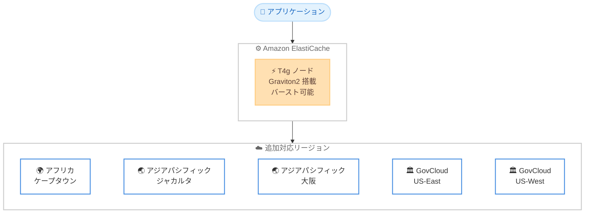

# Amazon ElastiCache - T4g ノードの追加リージョン対応

**リリース日**: 2026年6月30日
**サービス**: Amazon ElastiCache
**機能**: T4g ノードタイプの追加リージョン提供開始

📊 [このアップデートのインフォグラフィックを見る](https://takech9203.github.io/aws-news-summary/20260630-amazon-elasticache-t4g-additional-aws-regions.html)
<!-- INFOGRAPHIC_BASE_URL は環境変数から取得 -->

## 概要

Amazon ElastiCache が、T4g ノードタイプを新たに 5 つの AWS リージョンでサポートするようになりました。対象リージョンは、アフリカ (ケープタウン)、アジアパシフィック (ジャカルタ)、アジアパシフィック (大阪)、AWS GovCloud (米国東部)、AWS GovCloud (米国西部) です。

T4g ノードは AWS Graviton2 プロセッサを搭載しており、ベースラインの CPU パフォーマンスを提供しつつ、任意のタイミングで CPU 使用率をバースト (一時的に増加) させる機能を備えています。これにより、常時高い CPU 性能を必要とせず、利用が一時的にスパイクするようなワークロードに最適なノードタイプとなっています。

今回のリージョン拡大により、これらのリージョンを利用するお客様も、コスト効率の高いバースト可能なキャッシュノードを選択肢として利用できるようになりました。新規クラスターの作成、または既存クラスターの変更を通じて、コンソール、CLI、API から利用を開始できます。

**アップデート前の課題**

- 対象 5 リージョンでは、ElastiCache で T4g ノードタイプを選択できなかった
- バースト可能な低コストノードが利用できず、開発・テスト環境や小規模ワークロードでもより上位のノードタイプを選択する必要があった
- 大阪リージョンや GovCloud リージョンなど、データ所在地要件のある環境で Graviton2 ベースのバースト型ノードを活用できなかった

**アップデート後の改善**

- 対象 5 リージョンで T4g ノードタイプを選択できるようになった
- バースト可能なノードにより、断続的な負荷のワークロードでコストを最適化できるようになった
- Graviton2 プロセッサによる優れた価格性能比を、これらのリージョンでも活用できるようになった

## アーキテクチャ図



アプリケーションは Amazon ElastiCache を通じて、新たに対応した 5 リージョンで Graviton2 搭載の T4g バースト可能ノードを利用できます。

## サービスアップデートの詳細

### 主要機能

1. **T4g ノードタイプの追加リージョン提供**
   - アフリカ (ケープタウン)、アジアパシフィック (ジャカルタ)、アジアパシフィック (大阪)、AWS GovCloud (米国東部)、AWS GovCloud (米国西部) で利用可能になった
   - 既存リージョンと同様に、新規クラスター作成または既存クラスターの変更で利用できる

2. **AWS Graviton2 プロセッサによる価格性能比**
   - T4g ノードは AWS が独自設計した Arm ベースの Graviton2 プロセッサを搭載
   - 同等の x86 ベースのバースト型ノードと比較して、優れた価格性能比を実現

3. **バースト可能な CPU パフォーマンス**
   - ベースラインの CPU パフォーマンスを提供しつつ、任意のタイミングで CPU をバーストできる
   - 一時的に利用がスパイクするワークロードに最適

## 技術仕様

### T4g ノードの特性

| 項目 | 詳細 |
|------|------|
| プロセッサ | AWS Graviton2 (Arm ベース) |
| CPU モデル | バースト可能 (ベースライン + バースト) |
| 対応エンジン | Redis OSS / Valkey / Memcached (ElastiCache がサポートするエンジン) |
| 適したワークロード | 断続的・一時的に負荷がスパイクするワークロード、開発・テスト環境 |
| 操作方法 | コンソール、AWS CLI、API |

### バースト可能ノードの動作

T4g などのバースト可能ノードは、CPU クレジットの概念に基づいて動作します。ベースライン使用率を下回る期間にクレジットが蓄積され、負荷が高まった際にそのクレジットを消費してバーストします。常時高負荷ではないキャッシュワークロードにおいて、コストとパフォーマンスのバランスを取ることができます。

## 設定方法

### 前提条件

1. Amazon ElastiCache を利用できる AWS アカウント
2. 対象リージョン (ケープタウン、ジャカルタ、大阪、GovCloud US-East / US-West のいずれか) へのアクセス
3. クラスターを作成するための適切な IAM 権限

### 手順

#### ステップ1: 新規クラスターで T4g ノードを指定する

```bash
aws elasticache create-cache-cluster \
  --cache-cluster-id my-t4g-cluster \
  --engine redis \
  --cache-node-type cache.t4g.micro \
  --num-cache-nodes 1 \
  --region ap-northeast-3
```

新規のキャッシュクラスターを作成する際に、`--cache-node-type` で T4g ファミリーのノード (例: `cache.t4g.micro`) を指定します。`--region` で対象リージョン (例: 大阪リージョンの `ap-northeast-3`) を指定します。

#### ステップ2: 既存クラスターのノードタイプを変更する

```bash
aws elasticache modify-cache-cluster \
  --cache-cluster-id my-existing-cluster \
  --cache-node-type cache.t4g.small \
  --apply-immediately
```

既存のクラスターに対して `modify-cache-cluster` でノードタイプを T4g に変更します。`--apply-immediately` を指定すると、変更を即座に適用します。指定しない場合は次回のメンテナンスウィンドウで適用されます。

## メリット

### ビジネス面

- **コスト最適化**: バースト可能なノードにより、常時高負荷ではないワークロードでコストを抑えられる
- **対象リージョンの拡大**: 大阪リージョンや GovCloud など、データ所在地要件のある環境でも T4g を活用できる
- **小規模ワークロードへの適合**: 開発・テスト環境や小規模本番環境に適した低コストの選択肢が増えた

### 技術面

- **Graviton2 による価格性能比**: Arm ベースの Graviton2 プロセッサで優れた価格性能比を実現
- **柔軟なスケーリング**: 既存クラスターのノードタイプ変更で容易に移行できる
- **バースト機能**: 一時的な負荷スパイクに対し、追加設定なしで CPU をバーストできる

## デメリット・制約事項

### 制限事項

- バースト可能ノードは CPU クレジットに基づいて動作するため、継続的に高 CPU 使用率が必要なワークロードには不向き
- 料金および詳細なリージョン別の提供状況は Amazon ElastiCache 料金ページで確認する必要がある

### 考慮すべき点

- 持続的に高い CPU 性能を必要とするワークロードでは、M 系や R 系など他のノードファミリーの検討が推奨される
- 既存の x86 ベースノードから移行する場合、アプリケーション側の互換性は通常問題ないが、性能特性の違いを事前に検証することが望ましい

## ユースケース

### ユースケース1: 開発・テスト環境のキャッシュ

**シナリオ**: 大阪リージョンで稼働する開発環境において、低コストでキャッシュレイヤーを用意したい

**実装例**:
```
cache.t4g.micro ノードで単一ノードクラスターを構築
```

**効果**: バースト可能なノードにより、断続的な開発作業のコストを最小限に抑えられる

### ユースケース2: 断続的にスパイクする本番ワークロード

**シナリオ**: 特定時間帯のみアクセスが集中する Web アプリケーションのセッションキャッシュ

**実装例**:
```
cache.t4g.small ノードでクラスターを構築し、平常時のコストを抑えつつスパイク時にバースト
```

**効果**: 平常時はベースライン性能で低コスト運用し、ピーク時には CPU バーストで対応できる

### ユースケース3: GovCloud 環境でのコスト効率化

**シナリオ**: GovCloud リージョンで運用するアプリケーションで、コスト効率の高いキャッシュノードを利用したい

**実装例**:
```
AWS GovCloud (US-West) で cache.t4g.medium ノードを利用
```

**効果**: データ所在地要件を満たしながら、Graviton2 による価格性能比のメリットを得られる

## 料金

T4g ノードの料金は、ノードサイズ、リージョン、利用時間に基づいて課金されます。具体的な料金およびリージョンごとの提供状況は、Amazon ElastiCache 料金ページで確認してください。バースト可能ノードは、同等性能の汎用ノードと比較して低コストでベースライン性能を提供する点が特徴です。

## 利用可能リージョン

今回のアップデートで T4g ノードがサポートされた追加リージョンは以下のとおりです。

- アフリカ (ケープタウン)
- アジアパシフィック (ジャカルタ)
- アジアパシフィック (大阪)
- AWS GovCloud (米国東部)
- AWS GovCloud (米国西部)

なお、T4g ノードは上記以外の多くのリージョンでも引き続き利用可能です。最新のリージョン別提供状況は Amazon ElastiCache 料金ページを参照してください。

## 関連サービス・機能

- **AWS Graviton2**: T4g ノードが搭載する Arm ベースプロセッサ。価格性能比の向上に寄与
- **Amazon ElastiCache for Redis OSS / Valkey / Memcached**: T4g ノードを利用できるキャッシュエンジン
- **Amazon EC2 T4g インスタンス**: 同じ Graviton2 ベースのバースト可能インスタンスファミリー。コンピューティング層でも同様の特性を活用できる

## 参考リンク

- 📊 [インフォグラフィック](https://takech9203.github.io/aws-news-summary/20260630-amazon-elasticache-t4g-additional-aws-regions.html)
- [公式発表 (What's New)](https://aws.amazon.com/about-aws/whats-new/2026/06/amazon-elasticache-t4g-additional-aws-regions/)
- [ドキュメント (Supported node types)](https://docs.aws.amazon.com/AmazonElastiCache/latest/red-ug/CacheNodes.SupportedTypes.html)
- [料金ページ (Amazon ElastiCache pricing)](https://aws.amazon.com/elasticache/pricing/)

## まとめ

今回のアップデートにより、Amazon ElastiCache の T4g ノードがアフリカ (ケープタウン)、アジアパシフィック (ジャカルタ・大阪)、AWS GovCloud (US-East / US-West) の 5 リージョンで利用可能になりました。これらのリージョンでバースト可能かつ Graviton2 搭載の低コストノードを活用したいお客様は、新規クラスターの作成または既存クラスターのノードタイプ変更を検討してください。特に断続的な負荷のワークロードや開発・テスト環境において、コスト最適化の有効な選択肢となります。
