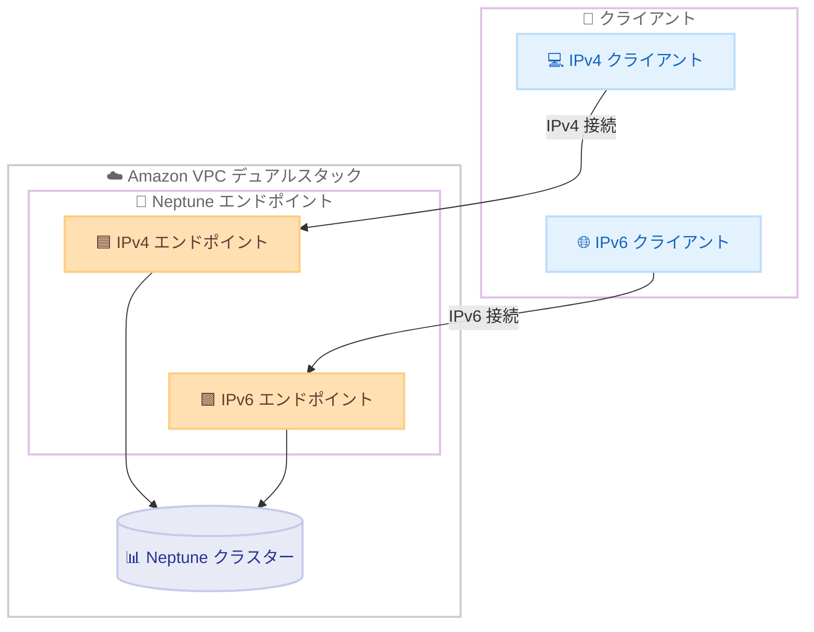

# Amazon Neptune - IPv6 デュアルスタックサポート

**リリース日**: 2026 年 6 月 30 日
**サービス**: Amazon Neptune
**機能**: デュアルスタックモード (IPv4/IPv6)

📊 [このアップデートのインフォグラフィックを見る](https://takech9203.github.io/aws-news-summary/20260630-amazon-neptune-ipv6.html)
<!-- INFOGRAPHIC_BASE_URL は環境変数から取得 -->

## 概要

Amazon Neptune がデュアルスタックモードに対応しました。これにより、データベースクラスターは IPv4、IPv6、またはその両方のプロトコルを同時に受け付けられるようになります。組織は既存の IPv4 デプロイメントとの後方互換性を維持しながら、IPv6 への移行を進められます。

Neptune のデュアルスタックモードには 2 種類の構成があります。プライベートデュアルスタックモードは、インターネットから隔離された IPv6 エンドポイントを提供し、内部アプリケーションやプライベートなグラフデータベースに適しています。パブリックデュアルスタックモードは、インターネットからアクセス可能な IPv6 エンドポイントを提供し、インターネット向けアプリケーションやハイブリッドネットワーク環境をサポートします。

クライアントは好みのプロトコルを使用してシームレスに接続でき、アプリケーション側の変更は不要です。この機能は Amazon Neptune がサポートされているすべての AWS リージョンで利用できます。

**アップデート前の課題**

- 以前は Neptune クラスターへの接続が IPv4 のみに限定されており、IPv6 ネイティブなネットワーク環境からの直接接続ができなかった
- IPv6 への移行を進める組織にとって、グラフデータベース層が IPv4 のみのため、ネットワーク全体の IPv6 化のボトルネックとなっていた
- IPv4 アドレスの枯渇に伴うアドレス管理の負担や、IPv6 を求めるコンプライアンス要件への対応が困難だった

**アップデート後の改善**

- 今回のアップデートにより、IPv4 と IPv6 の両方のプロトコルで同時に接続を受け付けられるようになった
- 既存の IPv4 クライアントとの後方互換性を維持しながら、IPv6 への段階的な移行が可能になった
- アプリケーションコードの変更なしに、クライアントが好みのプロトコルで接続できるようになった

## アーキテクチャ図

デュアルスタックモードでは、Neptune クラスターが IPv4 と IPv6 の両方のエンドポイントを提供し、クライアントは好みのプロトコルでアクセスできます。

## サービスアップデートの詳細

### 主要機能

1. **デュアルスタックモード**
   - IPv4、IPv6、またはその両方のプロトコルで同時に接続を受け付ける
   - 既存の IPv4 デプロイメントとの後方互換性を維持
   - クライアントはアプリケーションの変更なしに、好みのプロトコルで接続可能

2. **プライベートデュアルスタックモード**
   - インターネットから隔離された IPv6 エンドポイントを提供
   - 内部アプリケーションやプライベートなグラフデータベース向け
   - VPC 内部からのセキュアな接続に適している

3. **パブリックデュアルスタックモード**
   - インターネットからアクセス可能な IPv6 エンドポイントを提供
   - インターネット向けアプリケーションをサポート
   - ハイブリッドネットワーク環境での利用に適している

## 技術仕様

### ネットワークタイプ構成

| 項目 | 詳細 |
|------|------|
| 対応プロトコル | IPv4、IPv6、デュアルスタック (IPv4 + IPv6) |
| プライベートモード | インターネットから隔離された IPv6 エンドポイント |
| パブリックモード | インターネットからアクセス可能な IPv6 エンドポイント |
| アプリケーション変更 | 不要 (クライアントが好みのプロトコルで接続) |
| 前提条件 | デュアルスタック対応の VPC およびサブネット |

### 設定や権限など

デュアルスタックモードを利用するには、Neptune クラスターを配置する VPC とサブネットが IPv6 CIDR ブロックを持ち、デュアルスタックに対応している必要があります。

## 設定方法

### 前提条件

1. Neptune クラスターを配置する VPC が IPv6 CIDR ブロックを持つこと
2. 関連するサブネットがデュアルスタック (IPv4 + IPv6) に対応していること
3. セキュリティグループのインバウンドルールで IPv6 トラフィックを許可していること

### 手順

#### ステップ1: VPC とサブネットを IPv6 に対応させる

VPC とサブネットに IPv6 CIDR ブロックを割り当て、デュアルスタック構成にします。Amazon VPC コンソールまたは AWS CLI で IPv6 CIDR ブロックの関連付けを行います。

#### ステップ2: Neptune クラスターのネットワークタイプを設定する

Neptune クラスターの作成時または変更時に、ネットワークタイプとしてデュアルスタックを選択します。プライベート用途かパブリック用途かに応じて、エンドポイントの公開範囲を構成します。

#### ステップ3: クライアントから接続する

クライアントは IPv4 または IPv6 のいずれかのプロトコルで Neptune エンドポイントへ接続します。アプリケーション側の変更は不要で、クライアントの環境に応じて自動的に適切なプロトコルが使用されます。

## メリット

### ビジネス面

- **将来への対応**: IPv6 への移行要件やコンプライアンス要件に対応し、長期的なネットワーク戦略を支援する
- **段階的移行**: 既存の IPv4 環境を維持したまま IPv6 へ移行できるため、移行リスクとダウンタイムを最小化できる
- **追加コストなしの移行**: アプリケーションの改修が不要なため、移行に伴う開発コストを抑えられる

### 技術面

- **後方互換性**: IPv4 クライアントと IPv6 クライアントが共存できる
- **アプリケーション変更不要**: クライアントが好みのプロトコルで透過的に接続できる
- **柔軟な構成**: プライベートとパブリックの両モードに対応し、ユースケースに応じて選択できる

## デメリット・制約事項

### 制限事項

- デュアルスタックモードを利用するには、VPC とサブネットがあらかじめ IPv6 に対応している必要がある
- 既存の IPv4 のみの VPC 構成では、IPv6 CIDR ブロックの追加などの準備作業が必要となる

### 考慮すべき点

- IPv6 トラフィックを許可するよう、セキュリティグループやネットワーク ACL のルールを見直す必要がある
- パブリックデュアルスタックモードを利用する場合は、インターネットからのアクセス経路となるため、アクセス制御を適切に設計する必要がある

## ユースケース

### ユースケース1: IPv6 ネイティブ環境への移行

**シナリオ**: 企業ネットワーク全体を IPv6 へ移行している組織で、グラフデータベース層も IPv6 に対応させたい。

**効果**: デュアルスタックモードにより、既存の IPv4 アプリケーションを稼働させたまま、新規の IPv6 クライアントを段階的に追加でき、移行をスムーズに進められる。

### ユースケース2: 内部グラフデータベースのプライベート IPv6 化

**シナリオ**: 社内アプリケーションが利用するプライベートなグラフデータベースを、インターネットから隔離したまま IPv6 で運用したい。

**効果**: プライベートデュアルスタックモードにより、インターネットから隔離された IPv6 エンドポイントを提供し、セキュアな内部接続を実現する。

### ユースケース3: ハイブリッドネットワーク環境での接続

**シナリオ**: オンプレミスと AWS をまたぐハイブリッド環境で、IPv6 を利用する外部アプリケーションから Neptune へアクセスしたい。

**効果**: パブリックデュアルスタックモードにより、インターネット経由で IPv6 エンドポイントへアクセスでき、ハイブリッドネットワーク構成に対応できる。

## 料金

今回の発表において、デュアルスタックモードの利用に伴う追加料金についての記載はありません。Neptune クラスターの料金体系については、公式の料金ページを参照してください。

## 利用可能リージョン

Amazon Neptune がサポートされているすべての AWS リージョンで利用可能です。

## 関連サービス・機能

- **Amazon VPC**: デュアルスタック構成の基盤となる VPC とサブネットの IPv6 対応を提供する
- **AWS PrivateLink**: プライベートな接続経路を構成する際に関連する
- **Amazon Route 53**: エンドポイントの名前解決において IPv6 (AAAA レコード) と連携する

## 参考リンク

- 📊 [インフォグラフィック](https://takech9203.github.io/aws-news-summary/20260630-amazon-neptune-ipv6.html)
- [公式発表 (What's New)](https://aws.amazon.com/about-aws/whats-new/2026/06/amazon-neptune-ipv6/)
- [ドキュメント (Setting up Amazon Neptune)](https://docs.aws.amazon.com/neptune/latest/userguide/neptune-setup.html)
- [Amazon Neptune 料金ページ](https://aws.amazon.com/neptune/pricing/)

## まとめ

Amazon Neptune のデュアルスタックモード対応により、組織はアプリケーションを変更することなく IPv4 環境を維持したまま IPv6 への移行を進められます。IPv6 への移行要件やコンプライアンス要件を持つ組織は、まず VPC とサブネットの IPv6 対応状況を確認し、プライベートまたはパブリックのいずれの構成が要件に合うかを検討することをお勧めします。
