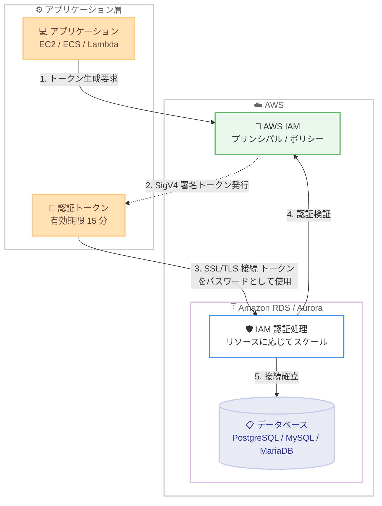

# Amazon RDS - IAM データベース認証の接続レートスケーリング

**リリース日**: 2026 年 6 月 30 日
**サービス**: Amazon RDS / Amazon Aurora
**機能**: IAM データベース認証の動的接続スケーリング (Connection Rate Scaling)

📊 [このアップデートのインフォグラフィックを見る](https://takech9203.github.io/aws-news-summary/20260630-amazon-rds-iam.html)
<!-- INFOGRAPHIC_BASE_URL は環境変数から取得 -->

## 概要

Amazon RDS は、IAM データベース認証における動的な接続スケーリング (dynamic connection scaling) を提供開始しました。これにより、新規の IAM 認証リクエストを処理できるレートが、データベースインスタンスの利用可能なリソースに応じて拡張されるようになりました。

これまで IAM データベース認証は、パスワードを使わずに認証トークンを用いてデータベースへ接続できる便利な仕組みでしたが、新規認証リクエストの処理能力が制約となり、高頻度に新規接続を確立するワークロードでは性能上の限界に達することがありました。今回のアップデートにより、IAM 認証の処理性能がインスタンスの利用可能なリソースとともにスケールするため、大量の接続パターンを持つエンタープライズワークロードでも IAM 認証を活用しやすくなりました。

インスタンスが処理できる新規 IAM 認証リクエストの数は、利用可能なリソースとワークロードの特性に依存します。最適な性能を得るために、AWS は IAM ユーザーまたは IAM 引き受けロール (assumed role) のプリンシパルを再利用して認証トークンを生成すること、あるいは認証トークン自体を再利用することを推奨しています。本機能は、IAM データベース認証がサポートされるすべての AWS リージョン (AWS GovCloud (US) リージョンを含む) で、PostgreSQL、MySQL、MariaDB の各エンジンを対象に利用できます。

**アップデート前の課題**

- 新規 IAM 認証リクエストの処理能力が固定的で、高頻度に新規接続を確立するワークロードでは認証処理がボトルネックになることがあった
- インスタンスサイズを大きくしても、IAM 認証リクエストの処理レートが必ずしもそれに比例してスケールしなかった
- 大量の接続パターンを持つエンタープライズワークロードで IAM 認証の採用をためらう要因となっていた

**アップデート後の改善**

- IAM 認証の処理性能がインスタンスの利用可能なリソースとともにスケールするようになった
- より大きなインスタンスを使用することで、より高い新規認証リクエストレートを処理できるようになった
- 高ボリュームの接続パターンを持つワークロードでも IAM 認証を活用しやすくなった

## アーキテクチャ図



アプリケーションは IAM プリンシパルを用いて SigV4 署名による認証トークンを生成し、そのトークンをパスワードとして SSL/TLS 経由でデータベースに接続します。今回のアップデートにより、ステップ 3 から 4 の認証処理がインスタンスのリソースに応じてスケールします。

## サービスアップデートの詳細

### 主要機能

1. **リソースに応じた動的接続スケーリング**
   - 新規 IAM 認証リクエストを処理できるレートが、インスタンスの利用可能なリソースに応じて拡張される
   - インスタンスサイズを大きくすることで、より高い認証リクエストレートを処理できる
   - 処理可能なリクエスト数は利用可能なリソースとワークロードの特性に依存する

2. **エンタープライズワークロードへの対応**
   - 高ボリュームの接続パターンを持つワークロードでも IAM 認証を活用可能
   - パスワード管理を排し、IAM による一元的なアクセス管理を大規模環境でも適用しやすくなった

3. **推奨されるベストプラクティス**
   - IAM ユーザーまたは IAM 引き受けロールのプリンシパルを再利用して認証トークンを生成する
   - 生成した認証トークン自体を再利用する (トークンの有効期限は 15 分)
   - これらにより認証処理のオーバーヘッドを抑え、最適な性能を引き出せる

## 技術仕様

### IAM データベース認証の基本仕様

| 項目 | 詳細 |
|------|------|
| 対応エンジン | Amazon Aurora および Amazon RDS の PostgreSQL、MySQL、MariaDB |
| トークン生成方式 | AWS Signature Version 4 (SigV4) |
| トークン有効期限 | 15 分 |
| トークンサイズ | 一般的に最小約 1 KB (IAM タグやポリシー、ARN 長などにより増減) |
| 通信の暗号化 | SSL / TLS による暗号化 |
| 必要な追加メモリ | データベースインスタンスに 300 〜 1000 MiB の追加メモリが必要 |

### API 変更履歴

今回のアップデートは IAM 認証処理の内部的な性能改善であり、新規 API メソッドの追加や API の変更を伴うものではありません。認証トークンの生成には、従来どおり `generate-db-auth-token` (AWS CLI) や各 SDK の AuthTokenGenerator を使用します。

### IAM ポリシー例

```json
{
    "Version": "2012-10-17",
    "Statement": [
        {
            "Effect": "Allow",
            "Action": [
                "rds-db:connect"
            ],
            "Resource": [
                "arn:aws:rds-db:us-east-1:123456789012:dbuser:db-ABCDEFGHIJKL01234/db_user_name"
            ]
        }
    ]
}
```

`rds-db:connect` アクションにより、指定したデータベースユーザーへの IAM 認証による接続を許可します。

## 設定方法

### 前提条件

1. 対象の Amazon RDS / Aurora インスタンスで IAM データベース認証が有効になっていること
2. データベース側で IAM 認証用のデータベースアカウントが作成されていること (PostgreSQL では `rds_iam` ロール、MySQL / MariaDB では `AWSAuthenticationPlugin`)
3. 接続するプリンシパルに `rds-db:connect` を許可する IAM ポリシーがアタッチされていること

### 手順

#### ステップ 1: 認証トークンの生成

```bash
aws rds generate-db-auth-token \
  --hostname mydb.123456789012.us-east-1.rds.amazonaws.com \
  --port 5432 \
  --region us-east-1 \
  --username db_user_name
```

データベースのエンドポイント、ポート、リージョン、ユーザー名を指定して、有効期限 15 分の認証トークンを生成します。トークンはパスワードの代わりに使用します。

#### ステップ 2: トークンを使用したデータベース接続

```bash
psql "host=mydb.123456789012.us-east-1.rds.amazonaws.com \
  port=5432 \
  dbname=mydb \
  user=db_user_name \
  sslmode=require" \
  password="<生成したトークン>"
```

生成したトークンをパスワードとして指定し、SSL / TLS を有効にしてデータベースへ接続します。PostgreSQL では `sslmode=require` 以上を指定する必要があります。

#### ステップ 3: 高ボリュームワークロードでの最適化

大量の新規接続を確立するアプリケーションでは、毎回新しいプリンシパルでトークンを生成するのではなく、同一の IAM プリンシパルを再利用してトークンを生成します。さらに、生成したトークンを有効期限 (15 分) の範囲内で再利用することで、認証処理のオーバーヘッドを抑えられます。AWS JDBC ドライバや AWS Python ドライバの IAM 認証プラグインを利用すると、トークンのキャッシュと再利用が容易になります。

## メリット

### ビジネス面

- **大規模環境でのパスワードレス認証**: パスワードを排し、IAM による一元的なアクセス管理を高ボリュームワークロードにも拡大できる
- **セキュリティガバナンスの向上**: データベース資格情報をアプリケーションコードに保持する必要がなくなり、IAM の監査・統制の枠組みを活用できる
- **追加コストなしの性能向上**: 既存の IAM データベース認証を利用しているワークロードが、追加料金なしで性能改善の恩恵を受けられる

### 技術面

- **リソースに応じたスケーラビリティ**: インスタンスサイズに応じて認証処理レートが拡張され、垂直スケーリングが認証性能にも反映される
- **EC2 インスタンスプロファイルとの連携**: EC2 上のアプリケーションがインスタンス固有の認証情報を用いてパスワードレスで接続できる
- **SSL / TLS の標準化**: IAM 認証では通信が常に暗号化されるため、転送時の保護が組み込みで確保される

## デメリット・制約事項

### 制限事項

- インスタンスが処理できる新規 IAM 認証リクエスト数は、利用可能なリソースとワークロードの特性に依存し、無制限ではない
- IAM データベース認証には追加の計算リソースが必要で、データベースインスタンスに 300 〜 1000 MiB の追加メモリが求められる
- CloudWatch および CloudTrail は IAM 認証 (`generate-db-auth-token` の呼び出し) をログに記録しない
- PostgreSQL では IAM 認証と Kerberos 認証を同時に有効化できず、レプリケーション接続にも IAM 認証を使用できない
- RDS on Outposts では IAM データベース認証はサポートされない
- カスタム Route 53 DNS レコードを使用してトークンを生成することはできない (DB インスタンスエンドポイントが必要)

### 考慮すべき点

- バースト可能 (burstable) クラスのインスタンスでは、IAM 認証用の追加メモリを確保するため、バッファやキャッシュなど他のパラメータのメモリ使用量を同程度削減してメモリ枯渇を避ける必要がある
- 認証トークンは最小約 1 KB と比較的大きいため、データベースドライバやツールがトークンを切り詰めないことを確認する必要がある (切り詰められると認証検証が失敗する)
- 一時的な認証情報でトークンを生成する場合、接続時点でもその認証情報が有効である必要がある

## ユースケース

### ユースケース 1: マイクロサービスからの高頻度接続

**シナリオ**: コンテナベースのマイクロサービスが、リクエストごとに短命なデータベース接続を大量に確立する環境。新規認証処理がボトルネックになっていた。

**実装例**:
```
- インスタンスクラスを十分なリソースを持つサイズに設定
- 各サービスは共通の IAM ロールを引き受けてトークンを生成
- AWS JDBC ドライバの IAM 認証プラグインでトークンをキャッシュ・再利用
```

**効果**: インスタンスリソースに応じて認証処理レートがスケールし、高頻度の新規接続を IAM 認証で安定して処理できる。

### ユースケース 2: パスワード管理の全社的な廃止

**シナリオ**: 複数のデータベースを運用する組織が、データベースパスワードの管理・ローテーション負荷を削減し、IAM 中心のアクセス管理へ統一したい。

**実装例**:
```
- すべての RDS / Aurora インスタンスで IAM データベース認証を有効化
- アプリケーションは EC2 インスタンスプロファイルや IAM ロールでトークンを生成
- rds-db:connect を最小権限で付与する IAM ポリシーで統制
```

**効果**: パスワードの保管・ローテーションが不要になり、大規模環境でも IAM による一元的なアクセス制御を実現できる。

### ユースケース 3: サーバーレスアプリケーションの接続スパイク対応

**シナリオ**: Lambda などのサーバーレス関数が、トラフィックスパイク時に多数の同時実行から新規接続を確立する。

**実装例**:
```
- 関数の実行ロールに rds-db:connect 権限を付与
- 有効期限 15 分内でトークンを再利用し、トークン生成回数を抑制
- Amazon RDS Proxy と組み合わせて接続プールを最適化
```

**効果**: スパイク時の新規認証リクエストがインスタンスリソースに応じてスケールし、IAM 認証を維持したまま接続スパイクに対応できる。

## 料金

本機能は IAM データベース認証の性能改善であり、機能の利用自体に追加料金は発生しません。Amazon RDS / Aurora のインスタンス、ストレージ、データ転送などの通常料金が適用されます。なお、認証処理にはインスタンスの計算リソース (追加メモリ) が必要となるため、ワークロードによってはインスタンスサイズの見直しを検討してください。

## 利用可能リージョン

IAM データベース認証がサポートされるすべての AWS リージョン (AWS GovCloud (US) リージョンを含む) で利用できます。対象エンジンは Amazon Aurora および Amazon RDS の PostgreSQL、MySQL、MariaDB です。エンジンやバージョンごとの対応状況の詳細は、ドキュメントの「Supported Regions and DB engines for IAM database authentication」を参照してください。

## 関連サービス・機能

- **AWS IAM**: 認証トークンの生成元となるプリンシパルとポリシーを管理する。`rds-db:connect` アクションで接続を制御する
- **Amazon RDS Proxy**: 接続プーリングにより接続管理を効率化し、IAM 認証と組み合わせて高頻度接続を最適化できる
- **AWS JDBC / Python ドライバ**: IAM 認証プラグインによりトークンの生成・キャッシュ・再利用を容易にする
- **Amazon EC2**: インスタンスプロファイルの認証情報を用いてパスワードレスでデータベースに接続できる

## 参考リンク

- 📊 [インフォグラフィック](https://takech9203.github.io/aws-news-summary/20260630-amazon-rds-iam.html)
- [公式発表 (What's New)](https://aws.amazon.com/about-aws/whats-new/2026/06/amazon-rds-iam/)
- [ドキュメント (IAM database authentication for MariaDB, MySQL, and PostgreSQL)](https://docs.aws.amazon.com/AmazonRDS/latest/UserGuide/UsingWithRDS.IAMDBAuth.html)
- [料金ページ (Amazon RDS)](https://aws.amazon.com/rds/pricing/)

## まとめ

今回のアップデートにより、IAM データベース認証の処理性能がインスタンスのリソースに応じてスケールするようになり、これまで採用をためらわれていた高ボリュームの接続パターンを持つエンタープライズワークロードでも IAM 認証を活用しやすくなりました。追加料金なしで恩恵を受けられるため、既存の IAM 認証ワークロードでは性能の改善を確認するとともに、プリンシパルやトークンの再利用といったベストプラクティスの適用を検討することを推奨します。
