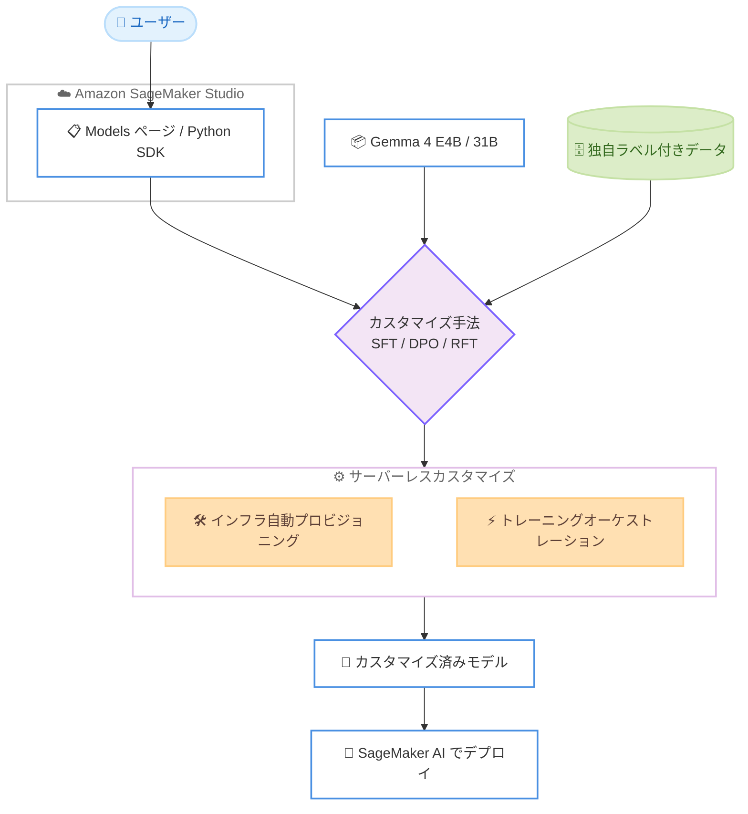

# Amazon SageMaker AI - Gemma 4 モデルのサーバーレスモデルカスタマイズ

**リリース日**: 2026 年 6 月 30 日
**サービス**: Amazon SageMaker AI
**機能**: Gemma 4 モデルのサーバーレスモデルカスタマイズ

📊 [このアップデートのインフォグラフィックを見る](https://takech9203.github.io/aws-news-summary/20260630-amazon-sagemaker-ai-gemma-4.html)
<!-- INFOGRAPHIC_BASE_URL は環境変数から取得 -->

## 概要

Amazon SageMaker AI は、Google DeepMind が開発したオープンモデルファミリーである Gemma 4 の E4B モデルと 31B モデルについて、サーバーレスでのモデルカスタマイズに対応しました。カスタマイズ手法として、教師ありファインチューニング (SFT)、直接選好最適化 (DPO)、強化ファインチューニング (RFT) の 3 種類を利用できます。

これまで SageMaker AI 上では Gemma 4 モデルをデプロイして推論に利用できましたが、今回のアップデートにより、お客様独自のドメインやワークフローに合わせてこれらのモデルを適応させることが可能になりました。モデルカスタマイズを使用すると、独自データを用いて基盤モデルを調整し、ドメイン固有タスクの精度向上、組織のトーンへの出力の整合、ラベル付きデータを活用した新しいタスクの性能向上などを実現できます。

サーバーレスカスタマイズでは、インフラのプロビジョニングとトレーニングのオーケストレーションをすべて SageMaker AI が処理し、お客様は使用した分のみ料金を支払います。これにより、クラスター管理の負担なくデータの準備と評価に集中できます。また今回の発表により、Gemma に加えて Nova、Nemotron 3、Qwen、Llama、gpt-oss、DeepSeek など、サーバーレスカスタマイズに対応するモデルの選択肢がさらに拡大しました。

**アップデート前の課題**

- SageMaker AI 上で Gemma 4 モデルをデプロイして推論できたものの、独自データでカスタマイズすることはできなかった
- 基盤モデルをファインチューニングするには、トレーニング用インフラのプロビジョニングやオーケストレーションを自前で管理する必要があった
- ドメイン固有タスクの精度や組織のトーンへの整合を高めるには、汎用モデルをそのまま利用せざるを得なかった

**アップデート後の改善**

- 今回のアップデートにより Gemma 4 E4B および 31B モデルを SFT、DPO、RFT でカスタマイズできるようになった
- サーバーレス方式により、インフラのプロビジョニングとトレーニングのオーケストレーションが不要になった
- 使用した分のみの従量課金で、独自データを用いたドメイン適応や出力トーンの整合が可能になった

## アーキテクチャ図



ユーザーは SageMaker Studio または Python SDK からカスタマイズジョブを起動し、独自データと Gemma 4 モデルを基にサーバーレス環境で SFT / DPO / RFT を実行して、カスタマイズ済みモデルを得る流れを示しています。

## サービスアップデートの詳細

### 主要機能

1. **Gemma 4 モデルのサーバーレスカスタマイズ**
   - Google DeepMind が開発したオープンモデル Gemma 4 の E4B および 31B モデルに対応
   - デプロイによる推論利用に加え、独自ドメインやワークフローへの適応が可能
   - インフラ管理なしでカスタマイズジョブを実行

2. **3 種類のカスタマイズ手法**
   - 教師ありファインチューニング (SFT): ラベル付きデータで特定タスクの精度を向上
   - 直接選好最適化 (DPO): 選好データを用いて出力を組織の意図やトーンに整合
   - 強化ファインチューニング (RFT): 報酬に基づいてモデルの性能を強化

3. **対応モデルの拡大**
   - Gemma に加えて Nova、Nemotron 3、Qwen、Llama、gpt-oss、DeepSeek 各ファミリーのモデルもサーバーレスカスタマイズに対応
   - 用途に応じて多様なオープンモデルから選択可能

4. **フルマネージドなサーバーレス実行**
   - インフラのプロビジョニングとトレーニングのオーケストレーションを SageMaker AI が自動処理
   - 使用した分のみの従量課金

## 技術仕様

### 対応モデルとカスタマイズ手法

| 項目 | 詳細 |
|------|------|
| 対応 Gemma モデル | Gemma 4 E4B、Gemma 4 31B |
| カスタマイズ手法 | SFT (教師ありファインチューニング)、DPO (直接選好最適化)、RFT (強化ファインチューニング) |
| その他の対応モデルファミリー | Nova、Nemotron 3、Qwen、Llama、gpt-oss、DeepSeek |
| 実行方式 | サーバーレス (インフラ管理不要、従量課金) |
| 起動方法 | SageMaker Studio の Models ページ、または SageMaker Python SDK |

### カスタマイズ手法の使い分け

| 手法 | 必要なデータ | 主な用途 |
|------|--------------|----------|
| SFT | ラベル付き (入力と期待出力のペア) | ドメイン固有タスクの精度向上、新しいタスクへの適応 |
| DPO | 選好データ (好ましい応答と好ましくない応答のペア) | 組織のトーンや意図への出力の整合 |
| RFT | 報酬シグナル | 報酬に基づくモデル性能の強化 |

## 設定方法

### 前提条件

1. Amazon SageMaker AI を利用可能な AWS アカウント
2. SageMaker Studio へのアクセス、または SageMaker Python SDK を利用できる実行環境
3. カスタマイズに使用する独自データ (手法に応じてラベル付きデータや選好データを準備)

### 手順

#### ステップ 1: カスタマイズジョブの起動

Amazon SageMaker Studio の Models ページを開き、Gemma 4 E4B または 31B を選択してカスタマイズジョブを作成します。GUI 上でカスタマイズ手法 (SFT / DPO / RFT) とデータを指定します。

#### ステップ 2: Python SDK での実行

```bash
pip install sagemaker
```

SageMaker Python SDK をインストールし、プログラムからカスタマイズジョブを定義・実行します。SDK を使うことで、ジョブの作成からモデルの管理までをコードで自動化できます。詳細は SageMaker Python SDK のモデルカスタマイズドキュメントを参照してください。

#### ステップ 3: カスタマイズ済みモデルのデプロイ

カスタマイズが完了したモデルを SageMaker AI にデプロイし、推論エンドポイントとして利用します。サーバーレスでカスタマイズされたモデルを、自社のワークフローへ組み込みます。

## メリット

### ビジネス面

- **コスト最適化**: 使用した分のみの従量課金のため、トレーニング用クラスターを常時確保する必要がない
- **市場投入の迅速化**: インフラ構築の手間がなく、独自データを用いたモデル適応を素早く開始できる
- **出力品質の向上**: ドメイン固有タスクの精度や組織のトーンへの整合により、ビジネス価値の高い応答を得られる

### 技術面

- **運用負荷の軽減**: インフラのプロビジョニングとトレーニングのオーケストレーションを SageMaker AI が自動処理
- **手法の柔軟性**: SFT、DPO、RFT から目的に応じて最適なカスタマイズ手法を選択可能
- **モデルの選択肢**: Gemma を含む多様なオープンモデルファミリーをカスタマイズ可能

## デメリット・制約事項

### 制限事項

- 現時点で利用可能なリージョンは米国東部 (バージニア北部)、米国西部 (オレゴン)、アジアパシフィック (東京)、欧州 (アイルランド) に限られる
- Gemma 4 のサーバーレスカスタマイズ対象は E4B および 31B モデル
- カスタマイズ手法ごとに適切な形式のデータ (ラベル付きデータ、選好データなど) を準備する必要がある

### 考慮すべき点

- カスタマイズの効果はデータの品質と量に依存するため、データ準備と評価のプロセスが重要
- 手法 (SFT / DPO / RFT) ごとに適したユースケースが異なるため、目的に応じた選択が必要
- 従量課金のため、トレーニングデータ量やジョブ実行回数に応じてコストが変動する

## ユースケース

### ユースケース 1: 専門ドメインへの精度向上

**シナリオ**: 法務や医療など専門分野の文書処理を行う企業が、汎用モデルでは専門用語の扱いに課題を抱えている。

**実装例**:
```
Gemma 4 31B + SFT
専門分野のラベル付きデータ (質問と専門的な回答のペア) で教師ありファインチューニング
```

**効果**: ドメイン固有タスクにおける応答精度が向上し、専門的な業務での実用性が高まる。

### ユースケース 2: 組織トーンへの整合

**シナリオ**: カスタマーサポート向けのチャットボットで、ブランドの声やトーンに沿った応答を生成したい。

**実装例**:
```
Gemma 4 E4B + DPO
好ましい応答と好ましくない応答の選好データで直接選好最適化
```

**効果**: 組織のトーンやガイドラインに整合した出力が得られ、一貫したブランド体験を提供できる。

### ユースケース 3: 新しいタスクへの性能強化

**シナリオ**: 既存モデルでは性能が不十分な新しいタスクに対し、報酬シグナルを用いて性能を高めたい。

**実装例**:
```
Gemma 4 31B + RFT
タスクの成否を評価する報酬関数を用いて強化ファインチューニング
```

**効果**: 報酬に基づいてモデルが最適化され、対象タスクでの性能が向上する。

## 料金

サーバーレスカスタマイズでは、インフラのプロビジョニングとトレーニングのオーケストレーションを SageMaker AI が処理し、使用した分のみの従量課金となります。トレーニングに使用したリソース量に応じて課金されるため、クラスターを常時確保するコストは発生しません。具体的な料金は Amazon SageMaker AI の料金ページを参照してください。

## 利用可能リージョン

以下の 4 リージョンで利用可能です。

- 米国東部 (バージニア北部)
- 米国西部 (オレゴン)
- アジアパシフィック (東京)
- 欧州 (アイルランド)

## 関連サービス・機能

- **Amazon SageMaker Studio**: Models ページからカスタマイズジョブを起動する統合開発環境
- **SageMaker Python SDK**: プログラムからカスタマイズジョブを定義・実行するための SDK
- **Amazon SageMaker AI 推論**: カスタマイズ済みモデルをデプロイして推論を提供する機能

## 参考リンク

- 📊 [インフォグラフィック](https://takech9203.github.io/aws-news-summary/20260630-amazon-sagemaker-ai-gemma-4.html)
- [公式発表 (What's New)](https://aws.amazon.com/about-aws/whats-new/2026/06/amazon-sagemaker-ai-gemma-4/)
- [ドキュメント (モデルカスタマイズ)](https://docs.aws.amazon.com/sagemaker/latest/dg/customize-model.html)
- [SageMaker Python SDK ドキュメント](https://sagemaker.readthedocs.io/en/stable/model_customization/index.html)

## まとめ

今回のアップデートにより、Gemma 4 E4B / 31B モデルを SFT、DPO、RFT を用いてサーバーレスでカスタマイズできるようになり、インフラ管理なしで独自データに基づくモデル適応が可能になりました。東京リージョンでも利用できるため、ドメイン固有タスクの精度向上や組織トーンへの整合を目指すお客様は、SageMaker Studio の Models ページまたは Python SDK からカスタマイズジョブを試すことを推奨します。
