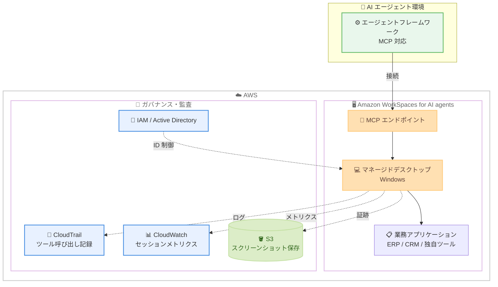

# Amazon WorkSpaces for AI agents - 一般提供開始

**リリース日**: 2026 年 6 月 30 日
**サービス**: Amazon WorkSpaces
**機能**: Amazon WorkSpaces for AI agents (AI エージェント向け WorkSpaces)

📊 [このアップデートのインフォグラフィックを見る](https://takech9203.github.io/aws-news-summary/20260630-amazon-workspaces-ai.html)
<!-- INFOGRAPHIC_BASE_URL は環境変数から取得 -->

## 概要

Amazon WorkSpaces for AI agents の一般提供 (GA) が開始されました。この機能により、AI エージェントはマネージドな WorkSpaces 環境を通じて、デスクトップアプリケーションへ安全にアクセスし操作できるようになります。

多くの企業では、ERP システム、CRM、メインフレーム、独自開発ツールといったデスクトップアプリケーション上で重要な業務プロセスを実行しています。これらのアプリケーションは近代化が難しく、API 連携の整備も容易ではありません。WorkSpaces for AI agents は、AI エージェントに対してマネージドなクラウドワークスペースを提供します。エージェントは人間と同じように画面を認識し、アプリケーションを操作できます。アプリケーションの近代化やカスタム統合の開発は不要です。

エージェントは、人間のユーザーと同じ ID 制御、ネットワーク分離、コンプライアンス境界を継承します。これにより、組織は保険金請求処理、患者記録の更新、取引決済、バックオフィス業務などのワークフローを、ガバナンスを維持したまま自動化できます。本機能は Model Context Protocol (MCP) を使用するあらゆるエージェントフレームワークと連携し、料金はアクティブなセッション時間に基づいてスケールします。

**アップデート前の課題**

- デスクトップ上の業務アプリケーション (ERP、CRM、メインフレーム等) を自動化するには、API 連携やアプリケーションの近代化など、大規模な開発が必要だった
- AI エージェントが既存の業務アプリケーションを操作する標準的な手段がなく、独自の統合を個別に構築する必要があった
- エージェントによる自動化を、人間のユーザーと同じセキュリティ境界やコンプライアンス境界の中で実行することが難しかった

**アップデート後の改善**

- アプリケーションの近代化やカスタム統合なしに、AI エージェントがデスクトップアプリケーションを人間と同じように操作できるようになった
- MCP に対応したあらゆるエージェントフレームワークから、標準的な MCP エンドポイント経由で接続できるようになった
- エージェントが人間のユーザーと同じ ID 制御、ネットワーク分離、コンプライアンス境界を継承し、ガバナンスを維持したまま自動化できるようになった

## アーキテクチャ図

AI エージェントは標準 MCP エンドポイント経由でマネージドデスクトップに接続し、業務アプリケーションを操作します。すべてのツール呼び出しは CloudTrail に記録され、セッションメトリクスは CloudWatch、スクリーンショットは S3 に保存されます。

## サービスアップデートの詳細

### 主要機能

1. **MCP ツールフォワーディング (MCP tool forwarding)**
   - エージェントは、コンピュータ操作 (computer use) ツールではなく、直接的な MCP 呼び出しを通じてアプリケーションやデスクトップ OS とやり取りできます
   - 画面解析に依存する操作と比較して、精度が向上し、レイテンシーとコストが低減されます
   - システムはサブタスクを最も効率的な経路にルーティングし、MCP ツールを優先しつつ、必要に応じて画面レベルの操作にフォールバックします

2. **リアルタイムセッション制御 (Real-time session control)**
   - エージェントの活動状況をリアルタイムで可視化できます
   - 閲覧のみの監視に加えて、セッションの途中でアクセスを取り消す (一時停止・停止する) ことができます
   - 運用担当者は、エージェントの動作を監視しながら、問題があれば即座に介入できます

3. **ドメイン参加フリートのサポート (Domain-joined fleet support)**
   - エージェントは、既存の Active Directory ID のもとで動作できます
   - 従業員向けに設定済みのアクセスポリシーを、そのままエージェントに適用できます
   - 監査時の操作主体の特定 (attribution) が容易になります

## 技術仕様

### サービスの仕組み

| 段階 | 内容 |
|------|------|
| Connect (接続) | エージェントは標準 MCP エンドポイント経由で WorkSpaces Applications 環境に接続。認証は IAM で行い、指定したアプリケーションが事前構成された Windows デスクトップにアクセスする |
| Take action (操作) | ビジョンによる操作と MCP ツールを組み合わせ、サブタスクを最も効率的な経路にルーティング。MCP ツールを優先し、必要に応じて画面レベルの操作にフォールバックする |
| Monitor and control (監視・制御) | リアルタイムで監視。閲覧のみの観察、またはセッション途中での一時停止・停止が可能 |

### 監査・ロギング

| 項目 | 詳細 |
|------|------|
| AWS CloudTrail | すべてのツール呼び出しを記録 |
| Amazon CloudWatch | セッションメトリクスを追跡 |
| Amazon S3 | スクリーンショットを保存 |
| ID 管理 | IAM および Active Directory (ドメイン参加フリート) による制御 |

### 設計上の特徴

- 標準 MCP エンドポイント経由で接続するため、独自 SDK は不要でベンダーロックインが発生しません
- 既存の AI フレームワークやモデルと互換性があります
- API 開発やアプリケーションの近代化が不要で、エージェントはデスクトップインターフェースと直接やり取りします
- 10 年以上にわたり信頼されてきた WorkSpaces のインフラストラクチャ上に構築されています

## メリット

### ビジネス面

- **既存資産の活用**: 近代化が難しい ERP、CRM、メインフレーム、独自ツールを、改修なしで自動化の対象にできます
- **ガバナンスの維持**: エージェントは人間のユーザーと同じ ID 制御、ネットワーク分離、コンプライアンス境界を継承するため、統制を維持したまま自動化を進められます
- **業務効率の向上**: 保険金請求処理、患者記録の更新、取引決済、バックオフィス業務などの定型ワークフローを自動化できます

### 技術面

- **開発コストの削減**: カスタム統合や API 開発が不要で、標準 MCP エンドポイント経由で接続できます
- **精度とコストの最適化**: MCP ツールフォワーディングにより、画面解析に依存する操作と比較して精度が向上し、レイテンシーとコストが低減されます
- **監査性の確保**: CloudTrail、CloudWatch、S3 によって、ツール呼び出し、メトリクス、スクリーンショットを記録し、監査証跡を残せます

## デメリット・制約事項

### 制限事項

- 対応する AI エージェントフレームワークは Model Context Protocol (MCP) に対応している必要があります
- デスクトップ環境は Windows ベースの WorkSpaces Applications 環境を前提とします
- 利用可能リージョンは公式発表時点で明示されていないため、利用前にリージョン対応状況の確認が必要です

### 考慮すべき点

- 料金はアクティブなセッション時間に基づいてスケールするため、エージェントの実行時間を考慮したコスト試算が必要です
- 画面解析を伴う操作はレイテンシーが高くなる可能性があるため、可能な範囲で MCP ツールフォワーディングを活用する設計が望まれます
- リアルタイムでセッションを監視・制御する運用体制を整えることが推奨されます

## ユースケース

### ユースケース1: 保険金請求処理とコンプライアンス対応

**シナリオ**: 保険会社が、複数の業務アプリケーションにまたがる請求データの照合と、監査対応資料の取りまとめを行う。

**効果**: AI エージェントが請求データのクロスリファレンスと監査資料の作成を自動化し、処理時間を短縮しながら、CloudTrail によって操作証跡を残せます。

### ユースケース2: 患者記録の更新

**シナリオ**: 医療機関が、独自の電子カルテシステムや関連アプリケーションに対して患者記録を更新する。

**効果**: アプリケーションの近代化なしに、エージェントが人間と同じ操作で記録を更新できます。Active Directory ID のもとで動作するため、既存のアクセスポリシーと監査要件を満たせます。

### ユースケース3: バックオフィス業務の自動化

**シナリオ**: 企業の管理部門が、請求書入力、勘定照合、アプリケーション間のデータ転送、HR・プロビジョニング・福利厚生システム間の異動処理などを行う。

**効果**: 複数のデスクトップアプリケーションをまたぐ定型業務をエージェントが自動化し、担当者の手作業を削減します。

## 料金

料金はアクティブなセッション時間に基づいてスケールします。エージェントが実際に WorkSpaces 環境を利用している時間に応じて課金されるモデルです。具体的な単価やリージョン別の料金は、公式の料金ページを確認してください。

## 利用可能リージョン

公式発表時点では、利用可能リージョンの一覧は明示されていません。利用前に最新のリージョン対応状況を公式ドキュメントおよび料金ページで確認してください。

## 関連サービス・機能

- **Amazon WorkSpaces / WorkSpaces Applications**: 本機能の基盤となるマネージドデスクトップインフラストラクチャ
- **Model Context Protocol (MCP)**: エージェントフレームワークとの標準的な接続プロトコル
- **AWS IAM / Active Directory**: エージェントの ID 制御とアクセス管理
- **AWS CloudTrail / Amazon CloudWatch / Amazon S3**: ツール呼び出しの記録、セッションメトリクスの追跡、スクリーンショットの保存

## 参考リンク

- 📊 [インフォグラフィック](https://takech9203.github.io/aws-news-summary/20260630-amazon-workspaces-ai.html)
- [公式発表 (What's New)](https://aws.amazon.com/about-aws/whats-new/2026/06/amazon-workspaces-ai/)
- [製品ページ (Amazon WorkSpaces for AI agents)](https://aws.amazon.com/workspaces/ai-agents/)
- [ドキュメント (Agent access)](https://docs.aws.amazon.com/appstream2/latest/developerguide/agent-access.html)

## まとめ

Amazon WorkSpaces for AI agents の GA により、近代化が難しい既存のデスクトップアプリケーションを、AI エージェントが人間と同じように操作して自動化できるようになりました。MCP ツールフォワーディング、リアルタイムセッション制御、ドメイン参加フリートのサポートといった新機能により、精度・コスト・ガバナンスの面が強化されています。まずは保険金請求処理やバックオフィス業務など定型性の高いワークフローを対象に、リージョン対応状況と料金を確認したうえで概念実証を進めることを推奨します。
