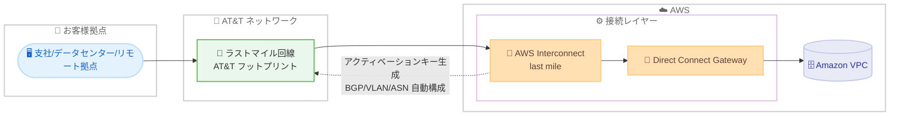

# AWS Interconnect - last mile - AT&T をパートナーとしたゲート付きプレビューを開始

**リリース日**: 2026 年 6 月 30 日
**サービス**: AWS Interconnect - last mile
**機能**: フルマネージドなラストマイル接続 (AT&T パートナー、ゲート付きプレビュー)

📊 [このアップデートのインフォグラフィックを見る](https://takech9203.github.io/aws-news-summary/20260630-aws-announces-AWS-interconnect-last-mile-ATT-gated-preview.html)
<!-- INFOGRAPHIC_BASE_URL は環境変数から取得 -->

## 概要

AWS は、支社、データセンター、リモート拠点を数クリックで AWS に接続できるフルマネージドな接続サービス「AWS Interconnect - last mile」を発表しました。このサービスは、ネットワークセットアップに伴う手間と複雑さを排除することを目的としています。今回、通信キャリアである AT&T をパートナーとしたゲート付きプレビュー (gated preview) として提供が開始されました。AWS のクラウドイノベーションと AT&T の広範なネットワークフットプリントを組み合わせることで、企業のクラウド接続方法を刷新します。

利用者は、希望する AWS リージョン、帯域速度、Direct Connect Gateway ID、パートナーサブスクライバー ID を選択するだけで、AWS へのプライベートかつ高速な接続を即座に確立できます。接続を開始すると、AWS がアクティベーションキーを生成し、AT&T 側でのプロビジョニングを完了させます。従来、専門知識が必要だった BGP ピアリング、VLAN 設定、ASN の割り当てといった複雑なネットワーク構成が自動化されます。

このサービスは、ネットワークエンジニアやインフラ担当者を主な対象とし、ラストマイル (拠点から AWS までの最終区間) の接続をシンプルにします。高可用性を考慮した設計で、SLA によるサポートも提供されます。現時点では米国のお客様を対象に、AT&T とのゲート付きプレビューとして利用可能です。

**アップデート前の課題**

このアップデート以前は、拠点から AWS への専用線接続の構築に多くの手間がかかっていました。

- 以前は、ラストマイル回線の手配とネットワーク機器の設定を個別に行う必要があった
- 以前は、BGP ピアリング、VLAN 設定、ASN 割り当てなどを手動で構成する必要があり、専門知識と時間を要した
- 以前は、キャリアと AWS 側のプロビジョニングを別々に調整する必要があり、接続確立までに時間がかかった

**アップデート後の改善**

今回のアップデートにより、ラストマイル接続の構築が大幅に簡素化されました。

- 今回のアップデートにより、リージョン、帯域、Direct Connect Gateway ID、パートナーサブスクライバー ID を指定するだけで数クリックで接続を開始できるようになった
- 今回のアップデートにより、BGP ピアリング、VLAN 設定、ASN 割り当てといった複雑な構成が自動化され、手動設定が不要になった
- 今回のアップデートにより、容量の事前プロビジョニングとゼロダウンタイムメンテナンス、SLA による高可用性が提供されるようになった

## アーキテクチャ図

お客様拠点から AT&T のラストマイル回線を経由し、AWS Interconnect と Direct Connect Gateway を通じて Amazon VPC へプライベート接続する流れを示しています。BGP、VLAN、ASN の構成は AWS Interconnect が自動的に処理します。

## サービスアップデートの詳細

### 主要機能

1. **数クリックでのラストマイル接続の確立**
   - 希望する AWS リージョン、帯域速度、Direct Connect Gateway ID、パートナーサブスクライバー ID を選択するだけでプライベートかつ高速な接続を開始できる
   - 接続開始後、AWS がアクティベーションキーを生成し、AT&T でのプロビジョニングを完了する
   - 拠点から AWS までの最終区間 (ラストマイル) の接続を、複雑なネットワークセットアップなしに実現する

2. **複雑なネットワーク構成の自動化**
   - BGP ピアリング、VLAN 設定、ASN 割り当てを自動的に構成する
   - 容量の事前プロビジョニングにより、接続確立を迅速化する
   - ネットワークの専門知識がなくても接続を構築できる

3. **高可用性とゼロダウンタイムメンテナンス**
   - 高可用性を考慮した設計で、SLA によるサポートが提供される
   - ゼロダウンタイムメンテナンスにより、運用中の接続への影響を抑える

4. **パートナー向けオープン API パッケージ**
   - パートナーは GitHub で公開されているオープン API パッケージ (OpenAPI 3.0 仕様) を通じて容易にサービスへ参画できる
   - このパッケージはマネージドな L3 (レイヤー 3) 接続を調整するための対称型 API を定義している

## 技術仕様

### 接続に必要なパラメータ

| 項目 | 詳細 |
|------|------|
| AWS リージョン | 接続先となる希望の AWS リージョン |
| 帯域速度 (bandwidth) | 確立する接続の帯域幅 |
| Direct Connect Gateway ID | 接続先の Direct Connect Gateway の ID |
| パートナーサブスクライバー ID | パートナー (AT&T) 側のサブスクライバー識別子 |
| アクティベーションキー | 接続開始時に AWS が生成し、AT&T 側のプロビジョニングに使用する |

### 自動構成される項目

| 項目 | 詳細 |
|------|------|
| BGP ピアリング | 経路交換のためのピアリング設定を自動化 |
| VLAN 設定 | 仮想 LAN の構成を自動化 |
| ASN 割り当て | 自律システム番号の割り当てを自動化 |
| 容量 | 事前プロビジョニングにより迅速な接続確立を実現 |

### パートナー向けオープン API パッケージ

- GitHub リポジトリ (https://github.com/aws/Interconnect) で OpenAPI 3.0 仕様が公開されている
- `connection-coordinator` ディレクトリにコアとなる API 仕様 (`openapi.yaml`) とプロトコルドキュメント (`Protocols.md`) が含まれる
- マネージドな L3 接続を調整するための対称型 API を定義し、パートナーが標準化された方法で接続を調整できるようにする
- ライセンスは Apache-2.0

## 設定方法

### 前提条件

1. 対象が米国のお客様であること (ゲート付きプレビューのため)
2. Direct Connect Gateway が作成済みであること
3. AWS Interconnect - last mile のプレビューアクセスをリクエストし、承認されていること

### 手順

#### ステップ1: プレビューアクセスをリクエスト

AWS Interconnect - last mile はゲート付きプレビューのため、まずプレビュー申請ページからアクセスをリクエストします。承認後にサービスの利用が可能になります。

#### ステップ2: 接続の作成

AWS コンソールで、希望する AWS リージョン、帯域速度、Direct Connect Gateway ID、パートナーサブスクライバー ID を選択して接続を作成します。この操作により、AWS が接続に必要な構成を準備します。

#### ステップ3: アクティベーションキーによるプロビジョニング完了

接続を開始すると、AWS がアクティベーションキーを生成します。このキーを用いて AT&T 側でプロビジョニングを完了することで、拠点から AWS への接続が確立されます。BGP ピアリング、VLAN 設定、ASN 割り当ては自動的に構成されます。

## メリット

### ビジネス面

- **接続構築の迅速化**: 数クリックで接続を開始でき、拠点から AWS までの接続確立にかかる時間を短縮できる
- **運用負荷の軽減**: 複雑なネットワーク構成が自動化されるため、専門人材への依存を減らせる
- **信頼性の担保**: SLA に裏付けられた高可用性設計により、ミッションクリティカルなワークロードにも適用しやすい

### 技術面

- **構成の自動化**: BGP、VLAN、ASN の設定が自動化され、手動設定に伴う設定ミスのリスクを低減できる
- **ゼロダウンタイムメンテナンス**: 運用中の接続に影響を与えずにメンテナンスを実施できる
- **標準化されたパートナー連携**: オープン API パッケージにより、パートナーとの連携が標準化されている

## デメリット・制約事項

### 制限事項

- 現時点ではゲート付きプレビューであり、利用にはアクセスリクエストと承認が必要
- 提供対象は米国のお客様に限定される
- 現時点でのパートナーは AT&T のみ

### 考慮すべき点

- プレビュー段階のサービスであるため、本番環境への適用は提供状況や SLA を十分に確認したうえで判断する必要がある
- AT&T のネットワークフットプリントが利用可能なエリアかどうかを事前に確認する必要がある
- 料金体系はプレビュー段階では公開情報が限られるため、AWS アカウントチームへの確認が推奨される

## ユースケース

### ユースケース1: 支社から AWS へのプライベート接続

**シナリオ**: 米国内に複数の支社を持つ企業が、各拠点から AWS 上の業務システムへ低レイテンシかつセキュアに接続したい。

**効果**: 各支社から AT&T のラストマイル回線経由で AWS へ数クリックで接続でき、拠点ごとの複雑なネットワーク設定作業を削減できます。

### ユースケース2: オンプレミスデータセンターとのハイブリッド接続

**シナリオ**: オンプレミスデータセンターを運用する企業が、AWS とのハイブリッド構成でミッションクリティカルなワークロードを稼働させたい。

**効果**: Direct Connect Gateway を介したプライベート接続を SLA 付きで確立でき、高可用性を求められるハイブリッド環境の信頼性を高められます。

### ユースケース3: パートナーによる接続サービスの提供

**シナリオ**: ネットワークサービスプロバイダーが、自社の顧客に対して AWS への接続サービスを標準化された形で提供したい。

**効果**: GitHub で公開されているオープン API パッケージ (OpenAPI 3.0) を活用することで、マネージドな L3 接続を調整する標準化されたインテグレーションを構築できます。

## 料金

プレビュー段階のため、料金に関する詳細な公開情報は限られています。正確な料金体系については、AWS アカウントチームまたは公式ドキュメントでの確認を推奨します。

## 利用可能リージョン

現時点では、AT&T をパートナーとしたゲート付きプレビューとして、米国のお客様を対象に提供されています。利用にはプレビューアクセスのリクエストと承認が必要です。

## 関連サービス・機能

- **AWS Direct Connect**: 専用のネットワーク接続を提供するサービス。AWS Interconnect - last mile は Direct Connect Gateway と連携してプライベート接続を確立する
- **AWS Direct Connect Gateway**: 複数の VPC やリージョンへの接続を集約するゲートウェイ。接続作成時に ID を指定する
- **Amazon VPC**: 接続先となる仮想プライベートクラウド。ラストマイル接続を通じてプライベートにアクセスする

## 参考リンク

- 📊 [インフォグラフィック](https://takech9203.github.io/aws-news-summary/20260630-aws-announces-AWS-interconnect-last-mile-ATT-gated-preview.html)
- [公式発表 (What's New)](https://aws.amazon.com/about-aws/whats-new/2026/06/aws-announces-AWS-interconnect-last-mile-ATT-gated-preview/)
- [ドキュメント](https://docs.aws.amazon.com/interconnect/)
- [オープン API パッケージ (GitHub)](https://github.com/aws/Interconnect)
- [プレビューアクセスのリクエスト](https://pages.awscloud.com/AWSInterconnect-LastMile-Preview.html)

## まとめ

AWS Interconnect - last mile は、BGP、VLAN、ASN といった複雑なネットワーク構成を自動化し、数クリックで拠点から AWS へのプライベート接続を確立できるフルマネージドサービスです。現時点では AT&T をパートナーとした米国向けのゲート付きプレビューですが、ラストマイル接続の構築を大幅に簡素化する点で注目に値します。対象となるお客様は、プレビューアクセスをリクエストし、既存の Direct Connect Gateway と組み合わせて評価を進めることを推奨します。
