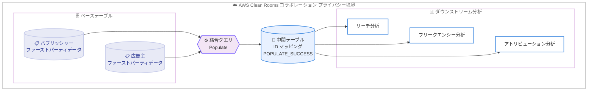

# AWS Clean Rooms - SQL 中間テーブルのサポート

**リリース日**: 2026 年 6 月 30 日
**サービス**: AWS Clean Rooms
**機能**: SQL クエリ向け中間テーブル (Intermediate Tables)

📊 [このアップデートのインフォグラフィックを見る](https://takech9203.github.io/aws-news-summary/20260630-aws-clean-rooms-intermediate-tables.html)
<!-- INFOGRAPHIC_BASE_URL は環境変数から取得 -->

## 概要

AWS Clean Rooms が、SQL クエリ向けの中間テーブル (Intermediate Tables) をサポートしました。これにより、パートナー企業と共同で実施する複雑な複数ステップの分析ワークフローに、より高い柔軟性をもたらします。お客様は SQL クエリの結果をコラボレーション内の中間テーブルに書き込み、その後の分析で再利用できるようになりました。

中間テーブルは、複雑な結合の再利用から、ダウンストリーム分析向けの共有 ID マッピングテーブルの構築まで、複数ステップの分析ワークフローを実現します。これらの処理はすべてコラボレーションのプライバシー境界内で完結します。例えば、パブリッシャーと広告主がそれぞれのファーストパーティデータを結合して ID マッピングテーブルを構築し、それをリーチ、フリークエンシー、アトリビューションの各分析にまたがって再利用することで、コストを削減しパフォーマンスを最適化できます。

AWS Clean Rooms は、企業とそのパートナーが、互いの基礎となるデータを開示したりコピーしたりすることなく、共同で保有するデータセットを分析し協働することを支援するサービスです。中間テーブルのデータは AWS マネージドストレージに保存され、コラボレーションの外部にエクスポートされることはありません。

**アップデート前の課題**

- 複数ステップの分析を行う場合、複雑な結合や ID マッピングの計算を分析ごとに毎回実行する必要があった
- 同じ中間結果を複数の分析で再利用できず、繰り返しの計算によりコストとクエリ実行時間が増加していた
- リーチ、フリークエンシー、アトリビューションなど関連する複数の分析間で、共通の中間データを共有する仕組みがなかった

**アップデート後の改善**

- SQL クエリの結果を中間テーブルとしてコラボレーション内に保存し、後続の分析で再利用できるようになった
- 複雑な結合や共有 ID マッピングテーブルを一度だけ計算し、複数のダウンストリーム分析で活用することでコストとパフォーマンスを最適化できるようになった
- プライバシー境界を維持したまま、複数ステップの分析ワークフローを構築できるようになった

## アーキテクチャ図

ベーステーブルを結合して中間テーブルを生成し、複数のダウンストリーム分析で再利用するフローを示しています。中間テーブルは `POPULATE_SUCCESS` 状態になった後に分析から参照できます。

## サービスアップデートの詳細

### 主要機能

1. **中間テーブルへの SQL クエリ結果の保存**
   - SQL クエリの結果をコラボレーションスコープの中間テーブルに書き込める
   - データは AWS マネージドストレージに保存され、コラボレーション外部にはエクスポートされない
   - 中間テーブルは分析ランナーが作成し、所有・管理する

2. **後続分析での再利用**
   - 中間テーブルは、設定済みテーブルと同様に SQL クエリや PySpark ジョブから名前で参照できる
   - 複雑な結合や共有 ID マッピングテーブルを一度計算し、複数の分析で再利用できる
   - 中間テーブルを別の中間テーブルのベーステーブルとして利用するネスト構成も可能

3. **プライバシー制御の継承と遅延適用 (Deferred Enforcement)**
   - 中間テーブルは、生成元のベーステーブルからプライバシー制御を継承する
   - 一部の制御は中間テーブルの作成・populate 時には評価されず、後続分析で参照された時点で適用される (遅延適用)
   - First-party (すべてのベーステーブルを作成者が所有) と Multi-party (複数のデータプロバイダー由来) の分類により、制御の適用方法が決まる

## 技術仕様

### 中間テーブルのライフサイクル

中間テーブルを分析で参照する前に、まずデータを populate (生成) し、カスタム分析ルールをアタッチする必要があります。テーブルのステータスが `POPULATE_SUCCESS` になっている必要があります。

| ステータス | 詳細 |
|------|------|
| CREATED | 中間テーブルのリソースは存在するが、データはまだ生成されていない |
| POPULATE_STARTED | populate 操作が進行中 |
| POPULATE_SUCCESS | データが正常に生成され、分析から参照可能 |
| POPULATE_FAILED | populate 操作が正常に完了しなかった |
| DISALLOWED_BY_DATA_PROVIDER | データプロバイダーが中間テーブルを不許可にした状態。再許可されるまで分析で利用不可 |
| BASE_TABLE_REMOVED | populate に使用したベーステーブルがコラボレーションから削除された状態。分析で利用不可 |
| RETENTION_PERIOD_EXPIRED | 設定した保持期間に基づき中間テーブルのバージョンが期限切れになった状態。保存データはクリーンアップされ、再利用には再 populate が必要。デフォルトの保持期間は 30 日 |

### 継承されるプライバシー制御 (Deferred Controls)

| 遅延制御 | 継承方法 |
|------|------|
| 許可された結果受信者 (Allowed result receivers) | すべてのベーステーブルの積集合 (intersection) として継承 |
| 出力禁止カラム (Disallowed output columns) | すべてのベーステーブルの和集合 (union) として継承 |
| 許可された追加分析 (Allowed additional analyses) | ベーステーブルの中で最も制限的な値を継承 |
| 追加分析 (Additional analyses) | ベーステーブルの中で最も制限的な値を継承 |

### 予算 (Budgets) の扱い

設定済みテーブルと同様に、中間テーブルにもアクセス予算 (Access budgets) と差分プライバシー予算 (Differential privacy budgets) を設定できます。

- **アクセス予算**: populate 時 (ベーステーブルに対する分析実行) と、中間テーブルへのアクセス時の両方で減算される。キャッシュされたデータへのアクセスであっても、ベーステーブルの利用としてプライバシー追跡上カウントされる (ネストされた中間テーブルの推移的な依存関係も含む)
- **差分プライバシー予算**: populate 時にベーステーブルの差分プライバシーが有効な場合は予算が減算されノイズが注入される。中間テーブルに差分プライバシーを設定した場合、利用時にコラボレーションの単一予算オーナーのイプシロンが減算される

### API変更履歴

| 日付 | サービス | 変更内容 |
|------|----------|----------|
| 2026/06/30 | [cleanrooms](https://awsapichanges.com/) | 中間テーブルの作成・populate・分析ルール設定・削除に関連する API の追加（詳細は AWS API Changes を参照） |

## 設定方法

### 前提条件

1. AWS Clean Rooms のコラボレーションが作成されており、メンバーが参加していること
2. 中間テーブルの生成に使用するベーステーブル (設定済みテーブル、ID マッピングテーブル、または他の中間テーブル) が利用可能であること
3. 分析ランナーとしての適切な権限を保有していること

### 手順

#### ステップ1: 中間テーブルの作成

コラボレーション内で中間テーブルリソースを作成します。この時点ではステータスは `CREATED` で、データはまだ生成されていません。

#### ステップ2: 中間テーブルの populate

ベーステーブルに対する SQL クエリ (例: ファーストパーティデータの結合) を実行し、その結果を中間テーブルに書き込みます。正常に完了するとステータスが `POPULATE_SUCCESS` になります。

#### ステップ3: 分析ルールのアタッチと再利用

中間テーブルにカスタム分析ルールをアタッチした後、後続の SQL クエリや PySpark ジョブから設定済みテーブルと同様に名前で参照し、リーチ、フリークエンシー、アトリビューションなどの分析で再利用します。

## メリット

### ビジネス面

- **コスト削減**: 複雑な結合や ID マッピングの計算を一度だけ実行し再利用することで、繰り返し計算によるコストを削減できる
- **協働の高度化**: パブリッシャーと広告主など、複数の当事者が共有 ID マッピングテーブルを基盤として一貫した分析を実施できる
- **プライバシー保護の維持**: 基礎データを開示・コピーすることなく、プライバシー境界内で複数ステップの分析を実現できる

### 技術面

- **パフォーマンス最適化**: 中間結果をキャッシュすることで、後続分析のクエリ実行時間を短縮できる
- **ワークフローの簡素化**: 設定済みテーブルと同じ方法で SQL や PySpark から参照でき、ネスト構成も可能
- **きめ細かなプライバシー制御**: ベーステーブルから制御を継承し、遅延適用により参照時点で最も制限的な制御を適用できる

## デメリット・制約事項

### 制限事項

- 中間テーブルを分析で参照するには、事前に populate し、ステータスが `POPULATE_SUCCESS` になっている必要がある
- ベーステーブルがコラボレーションから削除されると、中間テーブルは `BASE_TABLE_REMOVED` 状態となり利用できなくなる
- 中間テーブルのバージョンには保持期間があり、デフォルトは 30 日。期限切れになると保存データはクリーンアップされ、再利用には再 populate が必要

### 考慮すべき点

- 中間テーブルのストレージは、テーブルを削除するまで標準料金で課金される
- アクセス予算は populate 時と利用時の両方で減算されるため、予算設計時に二重の消費を考慮する必要がある
- 差分プライバシーでは中間テーブルが新しいデータセットとして扱われるため、populate 時のトランスフォーメーションでユーザー数を増幅させた場合、元のユーザー母集団に対する影響は追跡されない点に注意が必要

## ユースケース

### ユースケース1: 広告のリーチ・フリークエンシー・アトリビューション分析

**シナリオ**: パブリッシャーと広告主がそれぞれのファーストパーティデータをコラボレーション内で結合し、共通の ID マッピングテーブルを構築する。

**効果**: 構築した ID マッピングテーブルを中間テーブルとしてリーチ、フリークエンシー、アトリビューションの各分析で再利用でき、結合処理の重複を排除してコストとパフォーマンスを最適化できる。

### ユースケース2: 複雑な結合の再利用

**シナリオ**: 複数のテーブルを結合する重い処理を含む分析を、条件を変えて何度も実行する必要がある。

**効果**: 結合結果を中間テーブルに保存することで、後続の各分析では結合済みデータを参照するだけで済み、クエリ実行時間とコストを削減できる。

### ユースケース3: 段階的なデータ加工パイプライン

**シナリオ**: 生データをクレンジング・集計し、その結果をさらに別の集計に渡す多段階の分析パイプラインをコラボレーション内で構築する。

**効果**: 各段階の結果を中間テーブルとして保持し、ネスト構成でダウンストリーム分析に渡すことで、プライバシー境界を維持したまま複数ステップのワークフローを実現できる。

## 料金

中間テーブルのストレージは、テーブルが削除されるまで標準料金で課金されます。また、populate 操作および中間テーブルへのアクセスは、ベーステーブルに対する分析実行・利用としてアクセス予算や差分プライバシー予算を消費します。具体的な料金は AWS Clean Rooms の料金ページを参照してください。

## 利用可能リージョン

本アップデートの発表では、対応リージョンの個別の記載はありません。利用可能なリージョンの詳細は、[AWS リージョン表](https://docs.aws.amazon.com/general/latest/gr/clean-rooms.html#clean-rooms_region)を参照してください。

## 関連サービス・機能

- **AWS Clean Rooms ID マッピングテーブル**: 中間テーブルとして構築・再利用する共有 ID マッピングの基盤となる
- **AWS Clean Rooms 差分プライバシー (Differential Privacy)**: 中間テーブルに対しても予算を設定でき、ノイズ注入によるプライバシー保護を提供する
- **AWS Clean Rooms PySpark 分析**: 中間テーブルは SQL に加え PySpark ジョブからも名前で参照できる

## 参考リンク

- 📊 [インフォグラフィック](https://takech9203.github.io/aws-news-summary/20260630-aws-clean-rooms-intermediate-tables.html)
- [公式発表 (What's New)](https://aws.amazon.com/about-aws/whats-new/2026/06/aws-clean-rooms-intermediate-tables)
- [ドキュメント (Intermediate tables)](https://docs.aws.amazon.com/clean-rooms/latest/userguide/working-with-intermediate-tables.html)
- [AWS Clean Rooms 製品ページ](https://aws.amazon.com/clean-rooms/)

## まとめ

SQL 中間テーブルのサポートにより、AWS Clean Rooms はプライバシー境界を維持したまま、複雑な複数ステップの分析ワークフローを効率的に実行できるようになりました。複雑な結合や共有 ID マッピングを一度計算して再利用することで、コスト削減とパフォーマンス最適化を実現できます。広告分析など繰り返しの中間処理を伴うコラボレーションを運用しているお客様は、保持期間 (デフォルト 30 日) やストレージ課金、予算消費の挙動を考慮しながら、中間テーブルの導入を検討することを推奨します。
