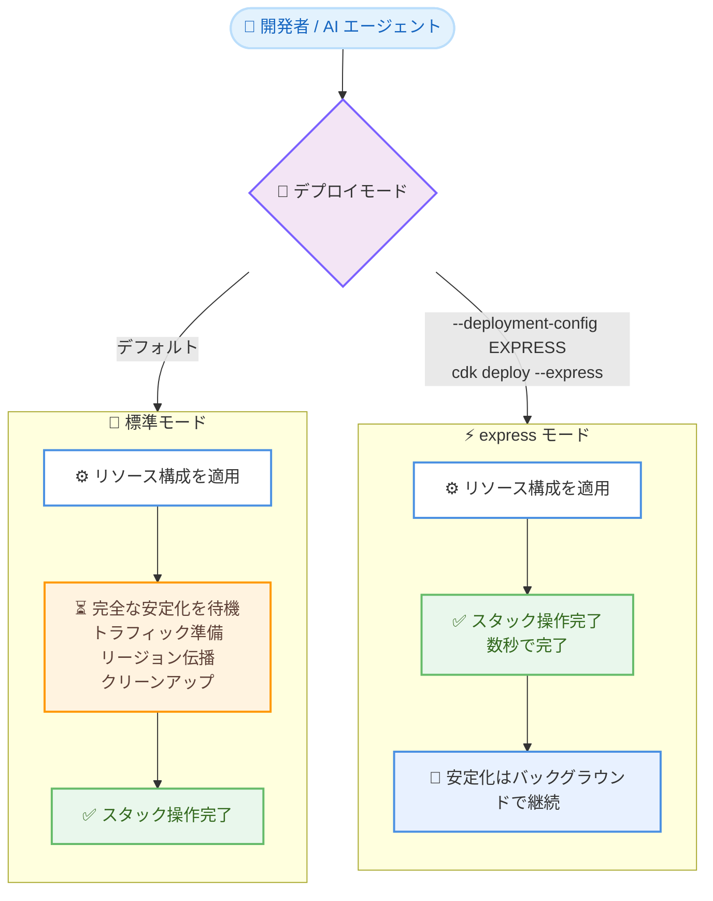

# AWS CloudFormation / CDK - express モード

**リリース日**: 2026 年 6 月 30 日
**サービス**: AWS CloudFormation / AWS CDK
**機能**: express モード (Express deployment mode)

📊 [このアップデートのインフォグラフィックを見る](https://takech9203.github.io/aws-news-summary/20260630-aws-cloudformation-cdk.html)
<!-- INFOGRAPHIC_BASE_URL は環境変数から取得 -->

## 概要

AWS は、CloudFormation および CDK の新しいデプロイモードである express モードを発表しました。express モードを利用すると、開発者やインフラを構築する AI エージェントのデプロイ時間を最大 4 倍短縮できます (AWS 内部ベンチマークによる)。

従来の標準デプロイモードでは、CloudFormation は各リソースが完全に安定化した状態 (fully stabilized state) に到達するまで待機してから、そのリソースの操作を完了と報告していました。express モードでは、CloudFormation がリソース構成を適用したことを確認した時点でスタック操作を完了とみなし、トラフィック準備状況の確認、リージョン間のプロパゲーション、リソースのクリーンアップといった追加の安定化チェックを待ちません。例えば、Amazon CloudFront ディストリビューションの作成では、従来はグローバルプロパゲーションのために 5 〜 10 分の待機が必要でしたが、express モードでは構成適用後に数秒で完了し、プロパゲーションはバックグラウンドで継続されます。

express モードは、開発時の反復的なワークフローや、AI エージェントによるインフラ構築のように、フィードバックの速さが重視されるシナリオに適しています。テンプレートの変更は不要で、既存のすべての CloudFormation テンプレートおよびネストされたスタック (nested stacks) で利用できます。

**アップデート前の課題**

- リソースが完全に安定化するまで CloudFormation が待機するため、開発時の反復サイクルで毎回長い待ち時間が発生していた
- CloudFront のプロパゲーションのように、設定自体は適用済みでも完了報告まで数分待つ必要があった
- デプロイ失敗時にはロールバックの完了を待ってから修正・再試行する必要があり、イテレーションが遅延していた

**アップデート後の改善**

- リソース構成が適用された時点で操作が完了するため、デプロイ時間が最大 4 倍短縮された
- 安定化チェックはバックグラウンドで継続され、開発者は即座に次の作業へ進める
- ロールバックがデフォルトで無効化され、失敗時に即座に修正して再デプロイ (fix-and-retry) できる

## アーキテクチャ図



標準モードとexpress モードの違いを示した図です。express モードでは構成適用後すぐにスタック操作が完了し、安定化処理はバックグラウンドで進行します。

## サービスアップデートの詳細

### 主要機能

1. **構成適用時点での操作完了**
   - 標準モードでは、CloudFormation は各リソースが完全に安定化した状態に達するまで待機する (例: EC2 インスタンスが `running` 状態になるまで待つ)
   - express モードでは、リソースの作成・更新・削除を行う API 呼び出しが成功した時点で操作完了とみなす
   - 操作完了後も、リソースはまだ初期化中・プロパゲーション中であったり、削除処理が進行中であったりする場合がある

2. **依存関係の維持とエラーハンドリング**
   - express モードでも、CloudFormation はリソースを依存関係の順序どおりに処理する
   - 同一スタック内の依存リソースの失敗も引き続き適切に処理される
   - リソースの整合性はテンプレートと一貫した状態が保たれる (CDK hotswap とは異なり、スタックの状態がドリフトしない)

3. **ロールバックのデフォルト無効化**
   - express モードではロールバックがデフォルトで無効化される
   - リソース操作が失敗してもロールバックの完了を待たずに、即座に修正して再デプロイできる
   - 必要に応じて `disableRollback` を `false` に設定すればロールバックを再度有効化できる

4. **テンプレート変更不要・ネストされたスタック対応**
   - 既存のすべての CloudFormation テンプレートでそのまま利用できる
   - 親スタックで express モードを指定すると、階層内のすべてのネストされたスタックに設定が伝播される

## 技術仕様

### 標準モードと express モードの比較

| 項目 | 標準モード | express モード |
|------|------------|----------------|
| 操作完了の判定 | リソースが完全に安定化した時点 | リソース構成の適用が確認された時点 |
| デプロイ速度 | 通常 | 最大 4 倍高速 (内部ベンチマーク) |
| ロールバック | 有効 | デフォルトで無効 (再有効化可能) |
| テンプレート変更 | 不要 | 不要 |
| 推奨用途 | 本番デプロイ | 開発・反復ワークフロー |

### express モードと CDK hotswap の比較

| 機能 | express モード | CDK hotswap |
|------|----------------|-------------|
| デプロイの仕組み | すべてのリソース操作を CloudFormation 経由で実行 | CloudFormation をバイパスしてサービス API を直接呼び出し |
| テンプレート互換性 | 既存のすべてのテンプレートに対応 | 限定的なリソースタイプのみサポート |
| スタックの状態 | テンプレートと一貫した状態を維持 | テンプレートからドリフトする可能性あり |
| ロールバック | 対応 (デフォルト無効) | 非対応 |
| リソースカバレッジ | すべての CloudFormation リソースタイプ | 限定的 (Lambda、ECS、Step Functions など) |

### リソースの準備状況に関する挙動例

| リソースタイプ | 操作 | 準備状況の挙動 |
|----------------|------|----------------|
| Amazon CloudFront ディストリビューション | 作成/更新 | 構成適用後、グローバルへのデプロイに数分かかる場合がある |
| Amazon EC2 インスタンス | 作成 | スタック操作完了後もユーザーデータスクリプト実行やステータスチェックで初期化中の場合がある |
| AWS Lambda 関数 | 削除 | 削除完了報告後もリソースのクリーンアップが進行中の場合がある |
| Amazon ECS サービス | 作成/更新 | スタック操作完了後もタスクが起動中・定常状態到達中の場合がある |

### デプロイ設定

```json
{
  "mode": "EXPRESS",
  "disableRollback": false
}
```

## 設定方法

### 前提条件

1. CloudFormation が利用可能な AWS リージョンであること (すべてのサポートリージョンで利用可能)
2. CDK で利用する場合は、`--express` フラグに対応した CDK バージョンであること
3. StackSets および AWS SAM では express モードは利用できないため、対象外であること

### 手順

#### ステップ 1: AWS CLI でスタックを作成する

```bash
aws cloudformation create-stack --stack-name my-stack \
    --template-body file://my-template.yaml \
    --deployment-config '{"mode": "EXPRESS"}'
```

`--deployment-config` パラメータに `{"mode": "EXPRESS"}` を指定することで、express モードでスタックを作成します。更新時は `update-stack`、削除時は `delete-stack` に同じパラメータを付与します。

#### ステップ 2: CDK で express モードを使用する

```bash
cdk deploy --express
```

CDK では `cdk deploy` コマンドに `--express` フラグを付与するだけで express モードを利用できます。

#### ステップ 3: ロールバックを再有効化する (任意)

```bash
aws cloudformation create-stack --stack-name my-stack \
    --template-body file://my-template.yaml \
    --deployment-config '{"mode": "EXPRESS", "disableRollback": false}'
```

express モードではロールバックがデフォルトで無効化されますが、`disableRollback` を `false` に設定することで、失敗時の自動ロールバックを有効化できます。変更セット (change set) を使用する場合は、`create-change-set` 時に同じ `--deployment-config` を指定します。

## メリット

### ビジネス面

- **開発生産性の向上**: デプロイ待ち時間が最大 4 倍短縮され、開発者の反復サイクルが高速化する
- **AI エージェント活用の促進**: インフラを構築する AI エージェントの待ち時間を削減し、自律的なイテレーションを効率化できる
- **既存資産の活用**: テンプレート変更不要でそのまま適用できるため、導入コストが低い

### 技術面

- **整合性の維持**: CloudFormation を経由するため、スタックの状態がテンプレートからドリフトしない (CDK hotswap との違い)
- **依存関係の保持**: 高速化しても依存関係の順序とエラーハンドリングは維持される
- **柔軟なロールバック制御**: デフォルトで無効化しつつ、必要に応じて再有効化できる

## デメリット・制約事項

### 制限事項

- CloudFormation StackSets では express モードを利用できない
- AWS SAM のデプロイでは express モードを利用できない
- カスタムリソース (`AWS::CloudFormation::CustomResource` および `Custom::*`) は express モードでもデフォルトの挙動に従い、レスポンスシグナルを待機する (`ServiceTimeout` プロパティで最大待機時間を設定可能)

### 考慮すべき点

- スタック操作完了後もリソースが完全に稼働可能とは限らない (CloudFront のプロパゲーション、EC2 の初期化、ECS タスクの起動などがバックグラウンドで進行)
- リソースが完全に安定化・稼働していることを確認したい本番デプロイでは、標準デプロイモードの利用が推奨される
- ロールバックがデフォルトで無効化されるため、本番運用に流用する場合は `disableRollback` の設定を明示的に検討する必要がある

## ユースケース

### ユースケース 1: 開発時の反復的なテンプレート編集

**シナリオ**: 開発者が CloudFormation テンプレートを繰り返し編集し、構成が有効かどうかを素早く確認したい。

**実装例**:
```bash
aws cloudformation update-stack --stack-name dev-stack \
    --template-body file://my-template.yaml \
    --deployment-config '{"mode": "EXPRESS"}'
```

**効果**: リソースの完全な安定化を待たずに構成の妥当性を確認でき、フィードバックループが大幅に短縮される。

### ユースケース 2: CloudFront を含むスタックの高速デプロイ

**シナリオ**: CloudFront ディストリビューションを含むスタックを頻繁にデプロイするが、プロパゲーション待ちの 5 〜 10 分がボトルネックになっている。

**実装例**:
```bash
cdk deploy --express
```

**効果**: 構成適用後に数秒でスタック操作が完了し、グローバルへのプロパゲーションはバックグラウンドで継続するため、開発の流れが止まらない。

### ユースケース 3: AI エージェントによるインフラ構築

**シナリオ**: AI エージェントがインフラを自律的に構築・反復しており、各デプロイの待ち時間がエージェントのスループットを制約している。

**実装例**:
```bash
aws cloudformation create-stack --stack-name agent-stack \
    --template-body file://generated-template.yaml \
    --deployment-config '{"mode": "EXPRESS"}'
```

**効果**: デプロイ完了までの待ち時間が短縮され、ロールバック無効化により失敗時の即座な fix-and-retry が可能になり、エージェントの反復効率が向上する。

## 料金

express モードの利用自体に追加料金は発生しません。CloudFormation および CDK の通常の利用料金体系が適用されます。詳細は AWS CloudFormation の料金ページを参照してください。

## 利用可能リージョン

CloudFormation がサポートされているすべての AWS リージョンで利用可能です。

## 関連サービス・機能

- **AWS CDK**: `cdk deploy --express` で express モードを利用でき、開発時のデプロイを高速化できる
- **CDK hotswap**: 同じく開発高速化を目的とする機能だが、CloudFormation をバイパスして直接 API を呼び出すため対応リソースが限定的。express モードはすべてのリソースタイプに対応し、スタックの整合性を維持する
- **CloudFormation 変更セット (change set)**: 変更セット作成時に `--deployment-config` を指定することで express モードを適用できる
- **ネストされたスタック (nested stacks)**: 親スタックで express モードを指定すると、すべてのネストされたスタックに設定が伝播される

## 参考リンク

- 📊 [インフォグラフィック](https://takech9203.github.io/aws-news-summary/20260630-aws-cloudformation-cdk.html)
- [公式発表 (What's New)](https://aws.amazon.com/about-aws/whats-new/2026/06/aws-cloudformation-cdk/)
- [ドキュメント (Deploy stacks faster with express mode)](https://docs.aws.amazon.com/AWSCloudFormation/latest/UserGuide/cloudformation-express-mode.html)
- [AWS CloudFormation 料金ページ](https://aws.amazon.com/cloudformation/pricing/)

## まとめ

CloudFormation / CDK の express モードは、リソースの完全な安定化を待たずに構成適用時点でスタック操作を完了させることで、デプロイ時間を最大 4 倍短縮する開発者向けの機能です。テンプレート変更不要で既存環境にそのまま適用でき、ネストされたスタックや CDK にも対応しています。本番デプロイでは標準モードを維持しつつ、開発・反復ワークフローや AI エージェントによるインフラ構築では express モードを積極的に活用し、フィードバックループの高速化を図ることを推奨します。
