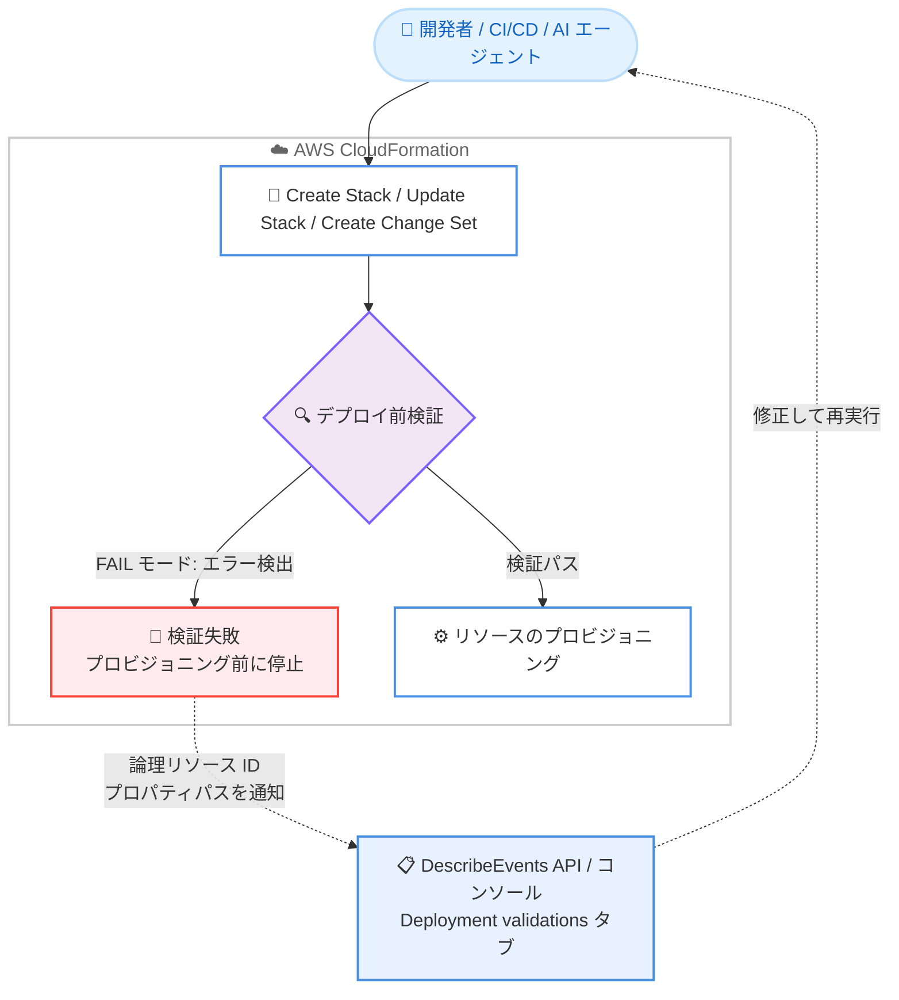

# AWS CloudFormation / CDK - 全スタック操作でのデプロイ前検証

**リリース日**: 2026 年 6 月 30 日
**サービス**: AWS CloudFormation, AWS CDK
**機能**: デプロイ前検証 (Pre-deployment validation) の Create Stack / Update Stack 操作への拡張

📊 [このアップデートのインフォグラフィックを見る](https://takech9203.github.io/aws-news-summary/20260630-aws-cloudformation.html)
<!-- INFOGRAPHIC_BASE_URL は環境変数から取得 -->

## 概要

AWS CloudFormation は、デプロイ前検証 (pre-deployment validation) を Create Stack および Update Stack 操作で自動的に実行するようになりました。これにより、リソースのプロビジョニングが開始される前に、よくあるデプロイエラーを数秒で検出できます。従来、デプロイ前検証は変更セット (change set) の作成時にのみ利用可能でしたが、今回のアップデートで同じ検証が Create Stack / Update Stack でも動作します。

この機能は、開発者が手動で繰り返しデプロイを試みるケース、CI/CD パイプライン、そしてインフラをプロビジョニングする AI エージェントのいずれにとっても、フィードバックループを大幅に短縮します。検証エラーが検出されると、操作はリソースのプロビジョニングを開始する前に停止し、論理リソース ID とプロパティのパスを含む詳細なフィードバックが提供されます。

加えて、変更セット作成時には 3 つの新しい警告 (WARN) モードの検証チェックが追加されました。サービスクォータの上限チェック、AWS Config Recorder の競合検出、Amazon ECR リポジトリの削除準備チェックです。AWS CDK でも `cdk deploy` と `cdk validate` の両方が、コンストラクトレベルのトレーシングを含む統合レポートで検証結果を表示します。

**アップデート前の課題**

- デプロイ前検証は変更セットの作成時にのみ利用可能で、Create Stack / Update Stack を直接実行する場合は恩恵を受けられなかった
- よくあるエラー (プロパティの構文エラー、リソース名の競合など) を発見するために、実際にプロビジョニングを試みてロールバックするサイクルを待つ必要があった
- 開発の試行錯誤や AI エージェントによる自動プロビジョニングにおいて、エラー検出までの時間が長くフィードバックループが遅かった

**アップデート後の改善**

- Create Stack / Update Stack 操作でもデプロイ前検証が自動で実行され、数秒でエラーのフィードバックを得られるようになった
- リソースのプロビジョニングが始まる前にエラーで停止するため、無駄なロールバックが不要になった
- 変更セット作成時に、サービスクォータ、Config Recorder 競合、ECR リポジトリ削除準備の 3 つの新しい警告チェックが追加された
- AWS CDK で構造化された検証結果が得られ、AI エージェントや自動化ツールが応答を解析して自己修正できるようになった

## アーキテクチャ図



デプロイ前検証は操作の一部として実行され、FAIL モードで検証に失敗した場合はリソースがプロビジョニングされる前に操作が停止します。検証結果は DescribeEvents API またはコンソールの Operation ビューで確認できます。

## サービスアップデートの詳細

### 主要機能

1. **Create Stack / Update Stack へのデプロイ前検証の拡張**
   - プロパティ構文検証とリソース名の競合検出が、Create Stack / Update Stack / Create Change Set のすべての操作で実行される
   - FAIL モードの検証では、エラー検出時にリソースのプロビジョニング前に操作が停止し、スタックステータスに検証失敗が反映される
   - 各エラーには論理リソース ID とテンプレート内のプロパティパスが含まれ、問題の特定を支援する

2. **3 つの新しい警告 (WARN) モード検証 (変更セット作成時)**
   - **サービスクォータ検証**: 新しいリソースの作成がアカウントのサービスクォータを超過する可能性がある場合に警告
   - **Config Recorder 競合検出**: 記録が有効でないアカウントに Config ルールを追加する場合、または Recorder が既に有効なアカウントで Recorder を定義する場合に警告
   - **ECR リポジトリ削除準備検証**: 削除対象の ECR リポジトリにイメージが残っている場合に警告

3. **AWS CDK での統合検証レポート**
   - `cdk deploy` と `cdk validate` の両方が、コンストラクトレベルのトレーシングを含む統合レポートで検証結果を表示
   - AI エージェントや自動化ツールが構造化された応答を解析し、自己修正できる

4. **検証結果の確認方法**
   - DescribeEvents API に操作 ID を指定して取得
   - CloudFormation コンソールでスタックの Events タブから操作 ID (またはバナー、ステータス理由のリンク) を選択し、Operation ビューの Deployment validations タブで確認

## 技術仕様

### 検証タイプと実行対象操作

| 検証タイプ | モード | 実行対象操作 |
|------|------|------|
| プロパティ構文検証 | FAIL | CreateStack, UpdateStack, CreateChangeSet |
| リソース名の競合検出 | FAIL | CreateStack, UpdateStack, CreateChangeSet |
| S3 バケットの空チェック | WARN | CreateChangeSet |
| サービスクォータ | WARN | CreateChangeSet |
| Config Recorder 競合 | WARN | CreateChangeSet |
| ECR リポジトリ削除準備 | WARN | CreateChangeSet |

FAIL モードはエラー検出時に操作を停止し、WARN モードは操作を継続しながら警告を提供します。なお、デプロイ前検証は Create Stack / Update Stack に数秒程度の小さなレイテンシを追加します。

### 検証エラーの確認 (DescribeEvents API)

```bash
aws cloudformation describe-events \
  --stack-name MyStack
```

このコマンドは、指定したスタックの操作イベントと検証結果を取得します。出力には `VALIDATION_ERROR` イベントが含まれ、`LogicalResourceId`、`ResourceType`、`ValidationName`、`ValidationStatusReason`、`ValidationPath` などのフィールドで問題箇所を特定できます。

```json
{
   "OperationEvents": [
      {
         "EventType": "VALIDATION_ERROR",
         "LogicalResourceId": "NotificationBucket",
         "ResourceType": "AWS::S3::Bucket",
         "ValidationFailureMode": "FAIL",
         "ValidationName": "PROPERTY_VALIDATION",
         "ValidationStatus": "FAILED",
         "ValidationStatusReason": "#/NotificationConfiguration/QueueConfigurations/0: required key [Event] not found",
         "ValidationPath": "/Resources/NotificationBucket/Properties/NotificationConfiguration/QueueConfigurations/0"
      }
   ]
}
```

### 必要な IAM 権限

変更セット作成時に実行される検証チェックには、以下の追加権限が必要です。

| 検証チェック | 必要な権限 |
|------|------|
| サービスクォータチェック | `cloudwatch:GetMetricData`, `lambda:GetAccountSettings`, `servicequotas:GetServiceQuota`, `ec2:DescribeSecurityGroups`, `iam:GetAccountSummary` |
| Recorder 競合チェック | `config:ListConfigurationRecorders` |
| S3 バケット空チェック / ECR リポジトリチェック | `s3:ListBucketV2`, `ecr:ListImages` |

## 設定方法

### 前提条件

1. スタックの作成・更新、または変更セットの作成と、アカウント内のリソース読み取りに必要な IAM 権限を持っていること
2. 変更セット作成時の各検証チェックに対応する追加の IAM 権限 (上記の表を参照) を持っていること
3. デプロイ前に検証したい CloudFormation テンプレートがあること

### 手順

#### ステップ1: 通常どおりスタックを作成または更新する

```bash
aws cloudformation create-stack \
  --stack-name MyStack \
  --template-body file://template.yaml
```

デプロイ前検証はデフォルトで有効化されているため、追加の設定は不要です。このコマンドの実行時に検証が自動で実行されます。

#### ステップ2: 検証結果を確認する

```bash
aws cloudformation describe-events \
  --stack-name MyStack
```

検証でエラーが検出された場合、操作はプロビジョニング開始前に停止します。このコマンドで検証結果を確認し、問題箇所を特定します。コンソールの場合は、スタックの Events タブから操作 ID を選択し、Deployment validations タブで詳細を確認できます。

#### ステップ3: 必要に応じて検証をスキップする

```bash
aws cloudformation create-stack \
  --stack-name MyStack \
  --template-body file://template.yaml \
  --disable-validation
```

特定の操作で検証をスキップする場合は、CLI の `--disable-validation` フラグ、または API の `CreateStack` / `UpdateStack` / `CreateChangeSet` における `DisableValidation` パラメータを使用します。既に `cfn-lint`、`cdk validate`、CI チェックなどでテンプレートを検証済みの場合や、操作のレイテンシを最小化したい場合、既知の誤検知を回避したい場合に利用します。

## メリット

### ビジネス面

- **開発サイクルの短縮**: デプロイエラーのフィードバックを数秒で得られるため、手動の試行錯誤や CI/CD パイプラインでの待ち時間を削減できる
- **運用コストの削減**: プロビジョニング前にエラーを検出することで、無駄なリソース作成とロールバックを回避できる
- **AI エージェントによる自動化の信頼性向上**: 構造化された検証結果により、AI エージェントが自己修正してインフラを安全にプロビジョニングできる

### 技術面

- **早期のエラー検出**: 論理リソース ID とプロパティパスを含む詳細なフィードバックで、問題箇所を迅速に特定できる
- **追加設定不要**: デフォルトで有効化されており、既存のワークフローにそのまま組み込める
- **CDK との統合**: `cdk deploy` / `cdk validate` でコンストラクトレベルのトレーシングを含む統合レポートを利用できる

## デメリット・制約事項

### 制限事項

- 3 つの新しい警告チェック (サービスクォータ、Config Recorder 競合、ECR リポジトリ削除準備) と S3 バケット空チェックは、現時点では変更セット作成時のみ実行され、Create Stack / Update Stack では実行されない
- デプロイ前検証はよくあるデプロイ失敗シナリオに焦点を当てており、デプロイの成功を保証するものではない
- S3 バケットの検証はオブジェクトの存在のみを確認し、バケットポリシーなど削除を妨げる他の制約は確認しない
- Create Stack / Update Stack に数秒程度の小さなレイテンシが追加される
- 一部のリソースタイプ (例: `AWS::CloudFormation::CustomResource`、`AWS::CloudFormation::Macro`、`AWS::AppMesh::Mesh` など) はデプロイ前検証の対象外

### 考慮すべき点

- 変更セットを使うと WARN モードの検証を含む 6 種類すべての検証を利用できるため、警告を事前に確認したい場合は変更セットの作成が有効
- テンプレートを変更した場合、変更セットの検証結果は特定の変更セットに紐づくため、更新された検証結果を得るには新しい変更セットを作成する必要がある
- 中国リージョンでは利用できない

## ユースケース

### ユースケース1: CI/CD パイプラインでのデプロイ前チェック

**シナリオ**: チームが CI/CD パイプラインで CloudFormation テンプレートをデプロイしている。従来はプロビジョニングを試みてからエラーで失敗し、ロールバックを待つ必要があった。

**実装例**:
```bash
aws cloudformation create-change-set \
  --stack-name MyStack \
  --change-set-name PreDeployCheck \
  --change-set-type CREATE \
  --template-body file://template.yaml
# 検証結果を describe-events で確認してから execute-change-set
```

**効果**: 変更セット作成時に 6 種類の検証 (警告を含む) が実行され、プロビジョニング前に問題を検出してパイプラインの失敗を削減できる。

### ユースケース2: AI エージェントによるインフラプロビジョニング

**シナリオ**: AI エージェントが CDK や CloudFormation を使ってインフラを自動的にプロビジョニングする。エージェントがエラーを解析して自己修正する必要がある。

**実装例**:
```bash
cdk deploy
# または検証のみ実行
cdk validate
```

**効果**: コンストラクトレベルのトレーシングを含む構造化された検証レポートにより、AI エージェントが応答を解析し、テンプレートを自動で修正できる。

### ユースケース3: 時間制約のあるデプロイでの検証スキップ

**シナリオ**: 既に `cfn-lint` や CI チェックでテンプレートを検証済みで、本番デプロイのレイテンシを最小化したい。

**実装例**:
```bash
aws cloudformation update-stack \
  --stack-name MyStack \
  --template-body file://template.yaml \
  --disable-validation
```

**効果**: `--disable-validation` フラグで検証をスキップし、デプロイ前検証によるレイテンシを排除できる。

## 料金

デプロイ前検証は AWS CloudFormation の機能の一部として提供され、追加料金は発生しません。CloudFormation の料金体系に準じます。詳細は公式の料金ページを参照してください。

## 利用可能リージョン

AWS CloudFormation がサポートされるすべての AWS リージョンで利用可能です (中国リージョンを除く)。

## 関連サービス・機能

- **AWS CDK**: `cdk deploy` および `cdk validate` がデプロイ前検証の結果をコンストラクトレベルのトレーシングと共に表示
- **AWS Service Quotas**: サービスクォータ検証で、リソース作成がアカウントのクォータを超過する可能性を事前にチェック
- **AWS Config**: Config Recorder 競合検出で、テンプレートと既存の Config 設定の競合を検出
- **Amazon ECR**: ECR リポジトリ削除準備検証で、削除対象リポジトリにイメージが残っているかをチェック

## 参考リンク

- 📊 [インフォグラフィック](https://takech9203.github.io/aws-news-summary/20260630-aws-cloudformation.html)
- [公式発表 (What's New)](https://aws.amazon.com/about-aws/whats-new/2026/06/aws-cloudformation/)
- [ドキュメント (Validate stack deployments)](https://docs.aws.amazon.com/AWSCloudFormation/latest/UserGuide/validate-stack-deployments.html)
- [AWS CloudFormation 料金ページ](https://aws.amazon.com/cloudformation/pricing/)

## まとめ

このアップデートにより、CloudFormation のデプロイ前検証が Create Stack / Update Stack 操作にも拡張され、リソースのプロビジョニング前に数秒でエラーを検出できるようになりました。デフォルトで有効化されており追加設定は不要なため、手動デプロイ、CI/CD パイプライン、AI エージェントによる自動化のいずれにおいてもフィードバックループの短縮が期待できます。変更セットを併用すれば 3 つの新しい警告チェックを含む包括的な検証が可能になるため、デプロイの信頼性向上のために活用を検討してください。
