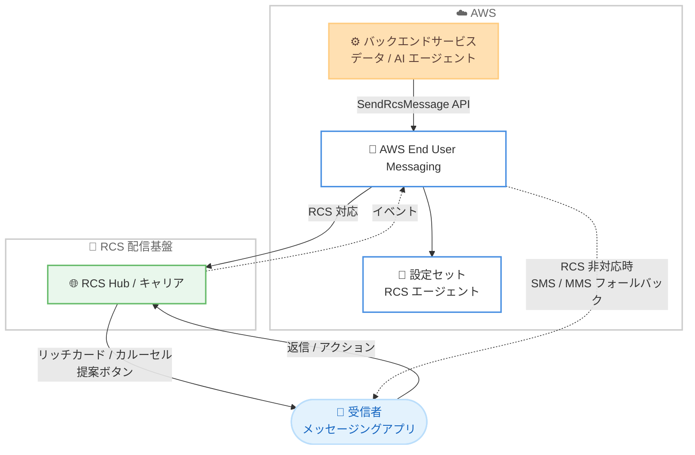

# AWS End User Messaging - RCS リッチメディアおよびインタラクティブメッセージング

**リリース日**: 2026年6月30日
**サービス**: AWS End User Messaging
**機能**: RCS リッチメディアおよびインタラクティブメッセージング (SendRcsMessage API)

📊 [このアップデートのインフォグラフィックを見る](https://takech9203.github.io/aws-news-summary/20260630-aws-end-user-messaging-rcs.html)
<!-- INFOGRAPHIC_BASE_URL は環境変数から取得 -->

## 概要

AWS End User Messaging が、RCS (Rich Communication Services) のリッチメディアおよびインタラクティブメッセージングに対応しました。この機能は、サポート対象の 22 か国すべてで利用できます。新しい SendRcsMessage API を使用することで、リッチカード、カルーセル、画像、動画、そしてインタラクティブな提案ボタンを送信できます。受信者はこれらのボタンを通じて、メッセージングアプリの中で直接アクションを実行できます。

RCS は、SMS の後継として位置づけられるメッセージング標準であり、ブランドが認証された送信者として、リッチな双方向コミュニケーションを提供できます。今回のアップデートにより、受信者はメッセージングアプリを離れることなく、予約の確認、商品カタログの閲覧、Webview での支払い完了、現在地の共有、AI エージェントとの対話といった操作を実行できます。これにより、Web やモバイルアプリの体験を会話の中に直接取り込めます。

対象ユーザーは、SMS や MMS を活用してきた企業のうち、より高度な顧客エンゲージメントやコンバージョン向上を求めるマーケティング、カスタマーサポート、トランザクション通知などの担当者です。RCS に対応していない受信者向けには、設定可能な SMS または MMS フォールバックが用意されており、到達性を確保できます。

**アップデート前の課題**

- 以前は、AWS End User Messaging の RCS でテキスト中心のメッセージングが主体であり、リッチカードやカルーセルなどのリッチメディアを活用しにくかった
- 以前は、受信者にアクションを促す際にメッセージングアプリの外部 (Web サイトや別アプリ) へ遷移させる必要があり、離脱が発生しやすかった
- 以前は、双方向のやり取りが多いワークフローにおいて、メッセージごとの課金がコスト面の懸念となっていた

**アップデート後の改善**

- 今回のアップデートにより、4 種類のメッセージタイプ (テキスト、ファイル、リッチカード、カルーセル) と 6 種類のアクションを組み合わせて、リッチでインタラクティブなメッセージを送信できるようになった
- 今回のアップデートにより、予約確認、カタログ閲覧、Webview での支払い、現在地共有、AI エージェントとの対話などを、メッセージングアプリ内で完結できるようになった
- 今回のアップデートにより、24 時間のセッション内であればメッセージ数無制限の定額制となる RCS Conversation 料金が導入され、双方向ワークフローのコストを予測しやすくなった

## アーキテクチャ図



バックエンドサービスが SendRcsMessage API を呼び出すと、AWS End User Messaging が RCS 配信基盤を経由してリッチなメッセージを受信者に届けます。RCS 非対応の受信者には SMS または MMS にフォールバックします。

## サービスアップデートの詳細

### 主要機能

1. **4 種類の RCS メッセージタイプ**
   - テキスト: 従来同様のテキストメッセージ
   - ファイル: 画像や動画などのメディアファイルを送信
   - リッチカード: タイトル、説明、メディア、提案ボタンを含む単一のカード
   - カルーセル: 複数のリッチカードを横並びでスワイプ表示

2. **6 種類のアクション (提案)**
   - 返信 (Replies): 受信者がワンタップで定型の返信を送信
   - URL: Web ページを開く
   - Webview: メッセージングアプリ内で Web コンテンツを表示し、支払いなどを完結
   - 電話発信 (Phone calls): 指定番号への発信を促す
   - 地図 (Maps): 位置情報や現在地共有
   - カレンダーイベント (Calendar events): 予定の登録を促す
   - これらのアクションは任意のメッセージタイプと組み合わせて利用できます

3. **設定可能な SMS / MMS フォールバック**
   - 受信者が RCS に対応していない場合に備え、メッセージごとに SMS または MMS へのフォールバックを設定可能
   - これにより、受信者の環境に依存せず到達性を確保

4. **AI エージェントとの連携**
   - RCS をバックエンドサービス、データ、AI をエンドユーザーに接続するインターフェイス層として活用
   - 受信者はメッセージングアプリを離れることなく AI エージェントと対話可能

## 技術仕様

### メッセージタイプとアクションの組み合わせ

| 項目 | 詳細 |
|------|------|
| メッセージタイプ | テキスト、ファイル、リッチカード、カルーセル (4 種類) |
| アクション | 返信、URL、Webview、電話発信、地図、カレンダーイベント (6 種類) |
| フォールバック | SMS または MMS (メッセージごとに設定可能) |
| 対応国 | 22 か国 (メッセージング)、21 か国 (RCS Conversation 料金) |
| 主要 API | SendRcsMessage |

### API変更履歴

| 日付 | サービス | 変更内容 |
|------|----------|----------|
| 2026/06/29 | [sms-voice](https://awsapichanges.com/archive/changes/4839f1-sms-voice.html) | 3 new 10 updated api methods - Q1 の RCS for business ローンチの拡張として、リッチメディアおよびインタラクティブメッセージングをサポートする API を追加 |

新規追加された主な API メソッドは以下のとおりです。

- `SendRcsMessage`: リッチカード、カルーセル、提案ボタンを含む RCS メッセージを送信
- `SetRcsMessageSpendLimitOverride`: RCS メッセージの利用上限を設定
- `DeleteRcsMessageSpendLimitOverride`: RCS メッセージの利用上限設定を削除

加えて、`CreateRcsAgent`、`DescribeRcsAgents`、`UpdateRcsAgent`、`DeleteRcsAgent` などの RCS エージェント管理メソッドや、設定セット、イベント送信先関連のメソッドが更新されています。

### SendRcsMessage のリクエスト例 (Python / boto3)

```python
client.send_rcs_message(
    DestinationPhoneNumber='string',
    OriginationIdentity='string',
    RcsMessageContent={
        'Content': {
            'RichCard': {
                'CardContent': {
                    'Title': 'string',
                    'Description': 'string',
                    'Media': {
                        'FileUrl': 'string',
                        'ThumbnailUrl': 'string',
                        'Height': 'string'
                    },
                    'Suggestions': [
                        {
                            'Reply': {
                                'Text': 'string',
                                'PostbackData': 'string'
                            }
                        }
                    ]
                }
            }
        }
    }
)
```

リッチカードにメディアと提案ボタン (返信) を含めて送信する例です。実際のパラメータ構造は公式ドキュメントを参照してください。

## 設定方法

### 前提条件

1. AWS End User Messaging が利用可能なリージョンでアカウントが有効化されていること
2. RCS for business のオンボーディングが完了し、RCS エージェントが登録されていること
3. 送信元として利用する電話番号またはオリジネーションアイデンティティが構成済みであること

### 手順

#### ステップ1: RCS エージェントの確認

```bash
aws pinpoint-sms-voice-v2 describe-rcs-agents
```

登録済みの RCS エージェントの状態を確認します。リッチメッセージの送信には、承認済みのエージェントが必要です。

#### ステップ2: リッチメッセージの送信

```bash
aws pinpoint-sms-voice-v2 send-rcs-message \
  --destination-phone-number "+81XXXXXXXXXX" \
  --origination-identity "your-rcs-agent-id" \
  --rcs-message-content file://rich-card.json
```

`rich-card.json` にリッチカードやカルーセル、提案ボタンの定義を記述してメッセージを送信します。RCS 非対応の受信者向けにフォールバックを設定する場合は、メッセージコンテンツ内でフォールバック設定を指定します。

#### ステップ3: 受信者アクションのハンドリング

受信者が提案ボタンをタップした際の返信やアクションは、設定セットに紐づけたイベント送信先 (Amazon SNS、Amazon Kinesis Data Firehose など) を通じて受け取れます。これにより、AI エージェントやバックエンドワークフローと連携できます。

## メリット

### ビジネス面

- **顧客エンゲージメントの向上**: リッチカードやカルーセルにより、テキストのみの SMS よりも訴求力の高いコミュニケーションを実現
- **コンバージョン率の向上**: 予約確認や支払いをメッセージングアプリ内で完結でき、外部遷移による離脱を削減
- **コスト予測の容易化**: RCS Conversation 料金により、24 時間セッション内のメッセージ数が無制限の定額制となり、双方向ワークフローのコストを抑制

### 技術面

- **単一 API での実装**: SendRcsMessage API でリッチメディアとインタラクティブ要素をまとめて送信可能
- **到達性の確保**: SMS / MMS フォールバックにより、受信者の対応状況に依存せずメッセージを配信
- **AI / バックエンド連携**: イベント送信先を通じて受信者アクションを取得し、AI エージェントやバックエンド処理と統合可能

## デメリット・制約事項

### 制限事項

- 利用には RCS for business のオンボーディングと承認済みエージェントが必要
- リッチメディアおよびインタラクティブメッセージングはサポート対象の 22 か国に限定される
- RCS Conversation 料金は 21 か国が対象であり、対応国は料金体系が異なる場合がある

### 考慮すべき点

- 受信者の端末やキャリアが RCS に対応していない場合はフォールバックが発生するため、フォールバック時の料金とメッセージ設計を考慮する必要がある
- リッチコンテンツに使用するメディアファイルのホスティングとサイズ要件を事前に確認する
- 国ごとに対応状況や規制が異なるため、配信対象国ごとの要件確認が必要

## ユースケース

### ユースケース1: 予約確認とリマインダー

**シナリオ**: 飲食店や医療機関が、予約のリマインダーをリッチカードで送信し、受信者がワンタップで予約を確定またはカレンダーに登録できるようにする。

**実装例**:
```
リッチカード (店舗画像 + 予約日時)
  + 提案ボタン: [予約を確定する] (返信)
  + 提案ボタン: [カレンダーに追加] (カレンダーイベント)
  + 提案ボタン: [地図を見る] (地図)
```

**効果**: 予約のノーショー (無断キャンセル) を削減し、顧客の利便性を向上

### ユースケース2: 商品カタログと購入

**シナリオ**: EC 事業者が、複数の商品をカルーセルで提示し、受信者が気になる商品の Webview で支払いまで完結できるようにする。

**実装例**:
```
カルーセル (複数のリッチカード)
  各カード: 商品画像 + 価格
  + 提案ボタン: [今すぐ購入] (Webview)
  + 提案ボタン: [詳細を見る] (URL)
```

**効果**: メッセージングアプリ内でのシームレスな購買体験により、コンバージョン率を向上

### ユースケース3: AI エージェントによるカスタマーサポート

**シナリオ**: 企業のサポート窓口が、RCS を通じて AI エージェントとの対話を提供し、よくある問い合わせを自動応答する。

**実装例**:
```
テキストメッセージ (AI エージェントの応答)
  + 提案ボタン: [はい / いいえ] (返信)
  + 提案ボタン: [担当者に電話] (電話発信)
```

**効果**: 24 時間セッションの定額料金を活用し、コストを抑えつつ双方向サポートを実現

## 料金

AWS End User Messaging では、新たに RCS Conversation 料金が 21 か国向けに導入されました。これは、24 時間のセッション内でメッセージ数無制限となる定額制の料金体系です。双方向のやり取りが多いワークフローにおいて、メッセージごとの課金を気にすることなくコミュニケーションを設計できます。

料金は国や送信内容により異なります。また、SMS / MMS フォールバックが発生した場合は、それぞれの料金が別途適用されます。正確な料金は公式の料金ページを参照してください。

## 利用可能リージョン

AWS End User Messaging が利用可能なすべての AWS リージョンで利用できます。リッチメディアおよびインタラクティブメッセージングはサポート対象の 22 か国で、RCS Conversation 料金は 21 か国で利用可能です。

## 関連サービス・機能

- **Amazon SNS / Amazon Kinesis Data Firehose**: イベント送信先として、受信者の返信やアクションを受け取りバックエンド処理と連携
- **AWS End User Messaging SMS / MMS**: RCS 非対応の受信者向けフォールバックチャネルとして機能
- **Amazon Bedrock などの AI サービス**: RCS をインターフェイス層として、受信者と AI エージェントの対話を実現

## 参考リンク

- 📊 [インフォグラフィック](https://takech9203.github.io/aws-news-summary/20260630-aws-end-user-messaging-rcs.html)
- [公式発表 (What's New)](https://aws.amazon.com/about-aws/whats-new/2026/06/aws-end-user-messaging-rcs/)
- [ドキュメント (Sending rich RCS messages)](https://docs.aws.amazon.com/sms-voice/latest/userguide/rcs-rich-messaging.html)
- [API 変更履歴 (awsapichanges.com)](https://awsapichanges.com/archive/changes/4839f1-sms-voice.html)

## まとめ

今回のアップデートにより、AWS End User Messaging の RCS でリッチカード、カルーセル、インタラクティブな提案ボタンを活用できるようになり、メッセージングアプリ内で予約確認、購入、AI 対話などを完結できるようになりました。双方向ワークフロー向けの定額制 RCS Conversation 料金も導入されています。SMS や MMS を活用している企業は、SendRcsMessage API と RCS エージェントの構成を確認し、リッチでインタラクティブな顧客コミュニケーションの導入を検討することをおすすめします。
