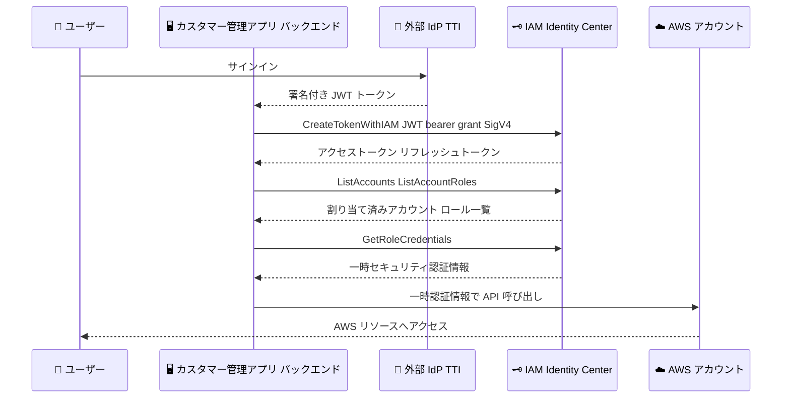

# AWS IAM Identity Center - カスタマー管理アプリケーションによるプログラムによる AWS アカウントアクセス

**リリース日**: 2026 年 6 月 30 日
**サービス**: AWS IAM Identity Center
**機能**: カスタマー管理アプリケーションによるプログラムによる AWS アカウントアクセス

📊 [このアップデートのインフォグラフィックを見る](https://takech9203.github.io/aws-news-summary/20260630-aws-iam-identity-center-account-access-customer-managed-apps.html)
<!-- INFOGRAPHIC_BASE_URL は環境変数から取得 -->

## 概要

AWS IAM Identity Center は、カスタマー管理アプリケーションがユーザーに代わってプログラムによる方法で AWS アカウントへアクセスできる機能を発表しました。この機能には、ユーザーに割り当てられたアカウントとロールの検出、および AWS アカウントアクセスに必要な一時認証情報の取得が含まれます。

外部の ID プロバイダー (IdP) を通じてユーザーを認証するカスタマー管理アプリケーションを持っている場合、その IdP を IAM Identity Center の信頼されたトークン発行者 (Trusted Token Issuer、TTI) として設定できます。今回のリリースにより、このアプリケーションに対して AWS アカウントアクセスを有効化できるようになりました。IdP を通じてすでにサインインしているユーザーは、別途の認証フローを経ることなく、割り当てられた AWS アカウントにアクセスし、承認されたロールの一時的なセキュリティ認証情報を取得できます。

これにより、IdP でのサインイン後に再度発生していた冗長なサインインプロンプトが排除されます。本機能は IAM Identity Center の組織インスタンスで利用でき、管理者は各カスタマー管理アプリケーションに対して明示的に AWS アカウントアクセスを有効化する必要があります。

**アップデート前の課題**

- 外部 IdP で認証済みのユーザーであっても、カスタマー管理アプリケーションから AWS アカウントにアクセスするには別途の認証フローが必要だった
- アプリケーションがユーザーに代わってプログラムによる方法で AWS アカウントとロールを検出し、一時認証情報を取得する標準的な仕組みがなかった
- IdP でのサインインに加え、AWS アクセスのための冗長なサインインプロンプトがユーザー体験を損なっていた

**アップデート後の改善**

- IdP で発行された JWT トークンを IAM Identity Center のトークンと交換し、プログラムによる方法で AWS アカウントへアクセスできるようになった
- アプリケーションがユーザーに割り当てられたアカウントとロールを検出し、一時的な AWS 認証情報を取得できるようになった
- IdP でサインイン済みのユーザーに対する追加のサインインプロンプトが不要になり、シングルサインオン体験が実現された

## アーキテクチャ図



外部 IdP で認証済みのユーザーが、追加のサインインなしにカスタマー管理アプリケーション経由で AWS アカウントへアクセスするまでの一連のトークン交換フローを示しています。

## サービスアップデートの詳細

### 主要機能

1. **JWT ベアラートークンによるトークン交換**
   - アプリケーションは外部 IdP から受け取った署名付き JWT トークンを `CreateTokenWithIAM` API に渡し、IAM Identity Center のトークンと交換する
   - グラントタイプには `urn:ietf:params:oauth:grant-type:jwt-bearer` を使用する
   - この呼び出しには Signature Version 4 (SigV4) 認証が必要

2. **アカウントとロールの検出**
   - 取得した IAM Identity Center トークンを使用し、アクセスポータル API の `ListAccounts` および `ListAccountRoles` を呼び出す
   - ユーザーに割り当てられた AWS アカウントとロールをプログラムによる方法で検出できる

3. **一時認証情報の取得**
   - `GetRoleCredentials` API を呼び出し、ユーザーが承認されているロールの一時的な AWS セキュリティ認証情報を取得する
   - 取得した認証情報を使用してユーザーに代わって AWS リソースへアクセスできる

4. **リフレッシュトークンによる再認証の省略**
   - アプリケーション設定時にリフレッシュトークングラントを有効にしている場合、`CreateTokenWithIAM` はアクセストークンとともにリフレッシュトークンを返す
   - `refresh_token` グラントタイプで `CreateTokenWithIAM` を呼び出すことで、JWT ベアラートークン交換を繰り返すことなく新しいアクセストークンを取得できる

## 技術仕様

### 使用する API

| API | 役割 |
|------|------|
| `CreateTokenWithIAM` | JWT トークンを IAM Identity Center トークンに交換する (OIDC API、SigV4 認証が必要) |
| `ListAccounts` | ユーザーに割り当てられたアカウントを列挙する (ポータル API) |
| `ListAccountRoles` | ユーザーに割り当てられたロールを列挙する (ポータル API) |
| `GetRoleCredentials` | ロールの一時セキュリティ認証情報を取得する (ポータル API) |
| `PutApplicationAccessScope` | `sso:account:access` スコープをプログラムによる方法で有効化する (管理 API) |
| `DeleteApplicationAccessScope` | アカウントアクセスを無効化する (管理 API) |

### 設定スコープと有効化条件

| 項目 | 詳細 |
|------|------|
| スコープ | `sso:account:access` |
| 対象インスタンス | IAM Identity Center の組織インスタンスのみ |
| 有効化権限 | 管理アカウント管理者または委任管理者のみ |
| アプリケーション要件 | JWT をサポートし、認証情報を安全に保存できるバックエンドサーバーコンポーネントを持つこと |

### スコープ有効化のリクエスト例

```json
{
  "ApplicationArn": "arn:aws:sso::123456789012:application/ssoins-1234567890abcdef/apl-1234567890abcdef",
  "Scope": "sso:account:access"
}
```

## 設定方法

### 前提条件

1. JWT をサポートする、IAM Identity Center に設定済みのカスタマー管理アプリケーション (認証情報を安全に保存できるバックエンドサーバーコンポーネントが必須。SPA などのブラウザベースアプリケーションやパブリッククライアントは非対応)
2. アプリケーションにアタッチされた信頼されたトークン発行者 (TTI)
3. AWS Organizations の管理アカウントまたは IAM Identity Center の委任管理者アカウントへのアクセス権

### 手順

#### ステップ 1: マネジメントコンソールでアカウントアクセスを有効化する

1. 組織の管理アカウントまたは委任管理者アカウントで AWS マネジメントコンソールにサインインする
2. IAM Identity Center コンソールを開く
3. ナビゲーションペインで [Applications] を選択する
4. [Customer managed] タブを選択する
5. 設定したいアプリケーション名を選択する
6. [AWS account access] セクションで [Enable AWS account access] をオンにする

外部 IdP で認証済みのユーザーに対し、アプリケーションがポータル API を呼び出してアカウントとロールを列挙し、一時認証情報を取得できるようになります。

#### ステップ 2: AWS CLI でアカウントアクセスを有効化する (プログラムによる方法)

```bash
aws sso-admin put-application-access-scope \
  --application-arn arn:aws:sso::123456789012:application/ssoins-1234567890abcdef/apl-1234567890abcdef \
  --scope "sso:account:access"
```

このコマンドは指定したカスタマー管理アプリケーションに `sso:account:access` スコープを付与し、プログラムによる方法で AWS アカウントアクセスを有効化します。管理アカウントまたは委任管理者アカウントから実行する必要があります。

#### ステップ 3: アプリケーションからトークンを交換しアクセスする

IdP から受け取った JWT トークンを `CreateTokenWithIAM` に渡してアクセストークンを取得し、`ListAccounts`、`ListAccountRoles`、`GetRoleCredentials` を順に呼び出して一時認証情報を取得します。取得した認証情報を使用して、ユーザーに代わって AWS リソースへアクセスします。

## メリット

### ビジネス面

- **シームレスなユーザー体験**: IdP でサインイン済みのユーザーに対する冗長な再認証が不要になり、シングルサインオン体験が向上する
- **一元的なガバナンス**: 管理アカウント管理者または委任管理者のみが各アプリケーションのアカウントアクセスを有効化でき、アカウントレベルのリソースへのアクセスを集中管理できる
- **既存の ID 基盤の活用**: 既存の外部 IdP をそのまま信頼されたトークン発行者として利用でき、新たな認証基盤を構築する必要がない

### 技術面

- **標準的なプロトコルの利用**: OAuth 2.0 の JWT ベアラーグラントを使用し、業界標準に沿ったトークン交換を実現する
- **一時認証情報による安全性**: 長期的なアクセスキーではなく一時的なセキュリティ認証情報を使用するため、漏洩時のリスクを低減できる
- **リフレッシュトークン対応**: リフレッシュトークンを利用することで、トークン交換を繰り返すことなくアクセストークンを更新できる

## デメリット・制約事項

### 制限事項

- IAM Identity Center の組織インスタンスでのみ利用可能 (アカウントインスタンスは非対応)
- バックエンドサーバーコンポーネントを持つアプリケーションのみが対象で、SPA などのブラウザベースアプリケーションやパブリッククライアントは非対応
- `sso:account:access` スコープを有効化できるのは管理アカウント管理者または委任管理者のみ
- 有効化されたアプリケーションは、認証済みユーザーが利用可能なすべてのアカウントとロールにアクセスでき、特定のアカウントやロールに制限することはできない

### 考慮すべき点

- スコープがユーザーの全アクセス権限に及ぶため、この機能を有効化する前にアクセスレベルを十分に理解する必要がある
- IAM Identity Center のアクセストークンとリフレッシュトークンはバックエンドサーバー上に保持し、クライアントサイドのコードに公開してはならない
- トークンや認証情報をログ、エラーメッセージ、デバッグ出力に記録しないこと
- トークンを URL クエリパラメーターで渡さず、アクセストークンには `x-amz-sso_bearer_token` ヘッダーを使用すること
- AWS CloudTrail を使用してアプリケーションによる API 呼び出しを監視することが推奨される

## ユースケース

### ユースケース 1: 社内開発者ポータルからの AWS アクセス

**シナリオ**: 企業が独自に開発した開発者ポータルを運用しており、開発者は社内の IdP でサインインしている。ポータルから各開発者の権限に応じた AWS アカウントのリソースを表示・操作したい。

**実装例**:
```
1. 開発者が社内 IdP でポータルにサインイン
2. ポータルバックエンドが JWT を CreateTokenWithIAM で交換
3. ListAccounts / ListAccountRoles で割り当てアカウントを表示
4. GetRoleCredentials で一時認証情報を取得し操作を実行
```

**効果**: 開発者は AWS への追加サインインなしに、自身の権限範囲でリソースを操作できる

### ユースケース 2: SaaS 型運用ツールからのマルチアカウント管理

**シナリオ**: 自社で構築した運用ダッシュボードから、ユーザーごとに割り当てられた複数の AWS アカウントを横断的に管理したい。

**実装例**:
```
1. ユーザーが外部 IdP でダッシュボードにサインイン
2. バックエンドがトークン交換でアクセストークンを取得
3. ListAccounts で割り当てられた全アカウントを列挙
4. 各アカウントの一時認証情報を取得して情報を集約
```

**効果**: ユーザーの権限セット割り当てに基づき、アクセス可能なアカウントのみを安全に横断管理できる

### ユースケース 3: 長時間稼働するバックエンド処理での認証維持

**シナリオ**: ユーザーに代わって定期的に AWS リソースへアクセスするバックエンド処理を、再サインインなしで継続したい。

**実装例**:
```
1. 初回に CreateTokenWithIAM でリフレッシュトークンを取得
2. アクセストークン失効時は refresh_token グラントで更新
3. 更新したアクセストークンで GetRoleCredentials を再取得
```

**効果**: JWT ベアラートークン交換を繰り返すことなく、アクセストークンを更新して処理を継続できる

## 料金

本機能の利用に伴う追加料金については、IAM Identity Center の料金ページを参照してください。IAM Identity Center 自体は追加料金なしで利用できます。

## 利用可能リージョン

すべての商用 AWS リージョン、AWS GovCloud (US) リージョン、および中国リージョンで利用可能です。

## 関連サービス・機能

- **AWS Organizations**: 組織インスタンスの管理アカウントまたは委任管理者アカウントから本機能を有効化する
- **外部 ID プロバイダー (IdP)**: 信頼されたトークン発行者 (TTI) として設定し、ユーザー認証と JWT 発行を担う
- **AWS CloudTrail**: アプリケーションによる API 呼び出しを監視し、セキュリティを確保する
- **AWS Security Token Service (STS)**: 取得した一時セキュリティ認証情報による AWS リソースアクセスの基盤となる

## 参考リンク

- 📊 [インフォグラフィック](https://takech9203.github.io/aws-news-summary/20260630-aws-iam-identity-center-account-access-customer-managed-apps.html)
- [公式発表 (What's New)](https://aws.amazon.com/about-aws/whats-new/2026/06/aws-iam-identity-center-account-access-customer-managed-apps/)
- [ドキュメント: Enable AWS account access for customer managed applications](https://docs.aws.amazon.com/singlesignon/latest/userguide/enable-account-access-customer-managed-apps.html)
- [CreateTokenWithIAM API リファレンス](https://docs.aws.amazon.com/singlesignon/latest/OIDCAPIReference/API_CreateTokenWithIAM.html)
- [AWS access portal API リファレンス](https://docs.aws.amazon.com/singlesignon/latest/PortalAPIReference/API_Operations.html)
- [PutApplicationAccessScope API リファレンス](https://docs.aws.amazon.com/singlesignon/latest/APIReference/API_PutApplicationAccessScope.html)

## まとめ

このアップデートにより、外部 IdP で認証済みのユーザーが、カスタマー管理アプリケーションを通じて追加のサインインなしに AWS アカウントへプログラムによる方法でアクセスできるようになりました。OAuth 2.0 の JWT ベアラーグラントと一時認証情報を組み合わせた標準的な仕組みにより、シームレスなユーザー体験とセキュリティを両立できます。自社開発の開発者ポータルや運用ツールから AWS アクセスを提供している組織は、信頼されたトークン発行者の設定と `sso:account:access` スコープの有効化を検討するとよいでしょう。
