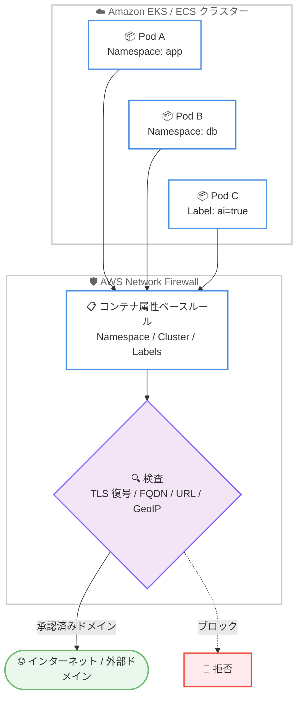

# AWS Network Firewall - コンテナ属性ベースのインスペクション

**リリース日**: 2026 年 6 月 30 日
**サービス**: AWS Network Firewall
**機能**: コンテナ属性ベースのルール (Container attribute-based rules)

📊 [このアップデートのインフォグラフィックを見る](https://takech9203.github.io/aws-news-summary/20260630-aws-network-firewall-container-attributes-referencing.html)
<!-- INFOGRAPHIC_BASE_URL は環境変数から取得 -->

## 概要

AWS は、AWS Network Firewall の新機能として、コンテナ属性ベースのルール (Container attribute-based rules) を発表しました。この機能により、Amazon Elastic Kubernetes Service (Amazon EKS) および Amazon Elastic Container Service (Amazon ECS) 上で稼働するコンテナ化ワークロード (生成 AI アプリケーションを含む) のセキュリティ保護を簡素化できます。

これまで、コンテナ環境ではポッドのスケールや再起動のたびに IP アドレスが変化するため、IP ベースのファイアウォールルールは頻繁に破綻していました。今回のアップデートにより、Namespace、Cluster Name、Labels (Amazon EKS)、Cluster Name、Container Instance Attributes (Amazon ECS) といったネイティブなコンテナ構成要素を使ってファイアウォールポリシーを記述できるようになりました。

この機能は、動的で急速に変化するコンテナ環境を保護するために必要なエンタープライズグレードのネットワークセキュリティコントロールを提供します。セキュリティエンジニア、DevSecOps 担当者、プラットフォームチームが対象ユーザーです。

**アップデート前の課題**

コンテナ環境における従来の課題を以下に示します。

- 以前は IP アドレスベースのルールを管理する必要があり、ポッドのスケールや再起動のたびにルールが破綻していた
- 以前は動的なコンテナ環境に対して静的なネットワークセキュリティルールを適用することが困難だった
- 以前は複数クラスターにまたがる一元的なセキュリティ管理が煩雑だった

**アップデート後の改善**

今回のアップデートによる改善点を以下に示します。

- 今回のアップデートにより Namespace や Cluster Name、Labels などのネイティブなコンテナ属性を使ってルールを記述できるようになった
- 今回のアップデートにより IP ベースの複雑なルール管理が不要になった
- 今回のアップデートによりコンテナのスケールに合わせてルールが自動的に適応するようになった

## アーキテクチャ図



コンテナのメタデータ (Namespace や Labels など) に基づいてトラフィックを識別し、AWS Network Firewall が各種フィルタリングを適用する流れを示しています。

## サービスアップデートの詳細

### 主要機能

1. **コンテナ属性ベースのルール定義**
   - Amazon EKS では Namespace、Cluster Name、Labels を使用してルールを記述できる
   - Amazon ECS では Cluster Name、Container Instance Attributes を使用してルールを記述できる
   - IP アドレスではなくネイティブなコンテナ構成要素を参照するため、ポッドのスケールや再起動に自動的に適応する

2. **多様な検査・フィルタリング機能との連携**
   - TLS 復号による暗号化トラフィックのディープパケットインスペクション (DPI)
   - FQDN ベースのフィルタリングにより、特定のポッドを承認済みドメインのみに制限
   - URL カテゴリフィルタリング (Malicious、Phishing、Malware など 50 種類以上のカテゴリ)
   - GeoIP フィルタリングによる地理的な IP アドレス制限

3. **一元的なマルチクラスターセキュリティ**
   - AWS Network Firewall、Amazon EKS、Amazon ECS のネイティブ統合により、複数クラスターにまたがるセキュリティを一元管理できる
   - ビジネス要件および規制コンプライアンスへの対応を支援

## 技術仕様

### サポートされるコンテナ属性

| サービス | サポートされる属性 |
|------|------|
| Amazon EKS | Namespace、Cluster Name、Labels |
| Amazon ECS | Cluster Name、Container Instance Attributes |

### 検査・フィルタリング方式

| 方式 | 説明 |
|------|------|
| TLS 復号 | 暗号化トラフィックのディープパケットインスペクションを実施 |
| FQDN フィルタリング | 特定のポッドを承認済みドメインのみに制限 |
| URL カテゴリフィルタリング | `aws_url_category` キーワードで完全な URL を評価 (HTTPS は TLS インスペクションが必要) |
| ドメインカテゴリフィルタリング | `aws_domain_category` キーワードで TLS SNI や HTTP Host からドメインを評価 (TLS インスペクション不要) |
| GeoIP フィルタリング | `geoip` キーワードで地理的な IP アドレスを制限 |

### URL/ドメインカテゴリフィルタリングの利用例

```
# 悪意のあるドメインへのアクセスをブロックする Suricata 互換ルールの例
drop tls $HOME_NET any -> $EXTERNAL_NET any (aws_domain_category:Malicious; sid:1;)

# 特定カテゴリの URL をブロックする例 (HTTPS の場合は TLS インスペクションが必要)
drop http $HOME_NET any -> $EXTERNAL_NET any (aws_url_category:Phishing,Malware; sid:2;)
```

## 設定方法

### 前提条件

1. Amazon EKS または Amazon ECS 上で稼働するコンテナワークロードが存在すること
2. AWS Network Firewall が対象 VPC にデプロイされていること
3. HTTPS トラフィックに対して URL カテゴリフィルタリングを行う場合は、TLS インスペクションが有効化されていること

### 手順

#### ステップ 1: コンテナ属性を参照するルールグループを作成

AWS Network Firewall のルールグループで、Namespace や Cluster Name、Labels といったコンテナ属性を参照するステートフルルールを定義します。これにより、IP アドレスを直接指定することなく、コンテナのメタデータに基づいてトラフィックを識別できます。

#### ステップ 2: フィルタリングポリシーを適用

作成したルールグループに対し、TLS 復号、FQDN フィルタリング、URL カテゴリフィルタリング、GeoIP フィルタリングなどのポリシーを組み合わせて適用します。承認済みドメインのみへの通信を許可するといった制御が可能です。

#### ステップ 3: ファイアウォールポリシーに関連付け

定義したルールグループをファイアウォールポリシーに関連付け、対象の VPC に適用します。以降はコンテナのスケールや再起動が発生しても、ルールが自動的に適応します。

## メリット

### ビジネス面

- **運用負荷の軽減**: IP ベースのルールを手動で更新する必要がなくなり、運用コストを削減できる
- **コンプライアンス対応**: 一元的なマルチクラスターセキュリティにより、規制要件への対応を支援
- **追加費用なし**: AWS Network Firewall の一部として追加費用なしで利用できる

### 技術面

- **動的環境への自動適応**: ポッドのスケールや再起動に合わせてルールが自動的に更新される
- **ネイティブ統合**: AWS Network Firewall、Amazon EKS、Amazon ECS のネイティブ統合により設定が簡素化される
- **多層防御**: TLS 復号や URL カテゴリフィルタリングなど、複数の検査方式を組み合わせられる

## デメリット・制約事項

### 制限事項

- HTTPS トラフィックに対して URL カテゴリフィルタリングを行うには TLS インスペクションが必須となる
- URL/ドメインカテゴリフィルタリングのキーワードと GeoIP フィルタリングは同一ルール内で併用できないため、別々のルールを作成する必要がある
- URL/ドメインカテゴリフィルタリングは、各接続でカテゴリ検索が追加されるため、トラフィックのレイテンシーが増加する可能性がある

### 考慮すべき点

- TLS インスペクションを有効化する場合、証明書管理などの追加設定が必要となる
- 利用可能なリージョンは AWS Capabilities by Region ページで事前に確認する必要がある

## ユースケース

### ユースケース 1: 生成 AI アプリケーションのアウトバウンド制御

**シナリオ**: Amazon EKS 上で稼働する生成 AI アプリケーションのポッドが、承認された AI/ML API エンドポイントのみと通信するように制限したい。

**実装例**:
```
# ai=true ラベルを持つポッドを対象に、承認済みドメインのみへのアクセスを許可
pass tls (labels: ai=true) $HOME_NET any -> approved-ai-domains any (sid:10;)
drop tls (labels: ai=true) $HOME_NET any -> $EXTERNAL_NET any (sid:11;)
```

**効果**: データ漏洩リスクを低減し、承認外のドメインへの通信を防止できます。

### ユースケース 2: Namespace 単位のトラフィック分離

**シナリオ**: 開発用と本番用の Namespace で異なるネットワークポリシーを適用し、環境間のトラフィックを分離したい。

**実装例**:
```
# production Namespace は特定のドメインカテゴリをブロック
drop tls (namespace: production) $HOME_NET any -> $EXTERNAL_NET any (aws_domain_category:Malicious,Phishing; sid:20;)
```

**効果**: 環境ごとに適切なセキュリティレベルを適用し、本番環境の保護を強化できます。

### ユースケース 3: 複数クラスターの一元的なセキュリティ管理

**シナリオ**: 複数の Amazon EKS / ECS クラスターに対して、共通のセキュリティポリシーを一元的に適用したい。

**実装例**:
```
# 複数クラスターを Cluster Name で識別し、共通の GeoIP フィルタを適用
drop tls (cluster: prod-cluster-1) $HOME_NET any -> $EXTERNAL_NET any (geoip:dst,CN,RU; sid:30;)
```

**効果**: クラスターが増えても一貫したセキュリティポリシーを維持でき、コンプライアンス対応が容易になります。

## 料金

コンテナ属性ベースのインスペクションは、AWS Network Firewall の一部として追加費用なしで利用できます。AWS Network Firewall の標準料金 (エンドポイント時間あたりの料金およびトラフィック処理量に応じた料金) が適用されます。

TLS インスペクションや URL カテゴリフィルタリングなど、既存の機能を利用する場合はそれぞれの標準料金が適用されます。

## 利用可能リージョン

利用可能なリージョンの完全な一覧は、AWS Capabilities by Region ページで確認できます。ご利用予定のリージョンでの提供状況を事前にご確認ください。

## 関連サービス・機能

- **Amazon EKS**: Namespace、Cluster Name、Labels を参照してファイアウォールルールを記述する対象
- **Amazon ECS**: Cluster Name、Container Instance Attributes を参照してファイアウォールルールを記述する対象
- **AWS Network Firewall TLS インスペクション**: HTTPS トラフィックの URL カテゴリフィルタリングに必要な機能

## 参考リンク

- 📊 [インフォグラフィック](https://takech9203.github.io/aws-news-summary/20260630-aws-network-firewall-container-attributes-referencing.html)
- [公式発表 (What's New)](https://aws.amazon.com/about-aws/whats-new/2026/06/aws-network-firewall-container-attributes-referencing)
- [ドキュメント](https://docs.aws.amazon.com/network-firewall/latest/developerguide/rule-groups-url-filtering.html)
- [AWS Network Firewall 製品ページ](https://aws.amazon.com/network-firewall/)

## まとめ

AWS Network Firewall のコンテナ属性ベースのルールは、動的なコンテナ環境における IP ベースルールの管理という長年の課題を解決する重要なアップデートです。Amazon EKS / ECS を利用しているチームは、追加費用なしでネイティブなコンテナ属性を使ったセキュリティポリシーを導入できるため、まずは非本番環境で Namespace や Labels を参照するルールを検証することをおすすめします。
