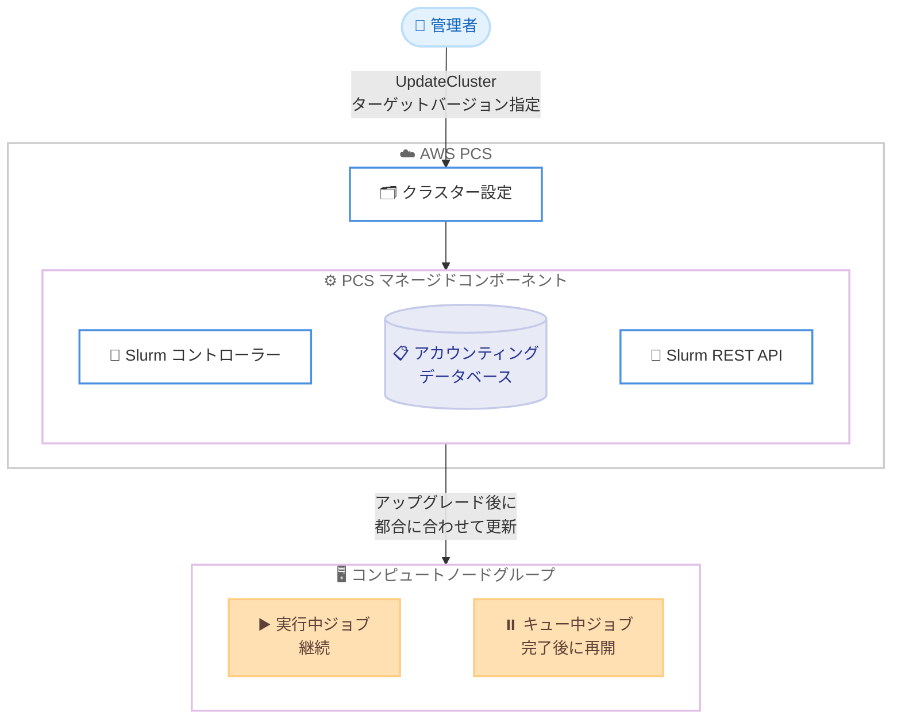

# AWS Parallel Computing Service - Slurm メジャーバージョンのインプレースアップグレード

**リリース日**: 2026 年 6 月 30 日
**サービス**: AWS Parallel Computing Service (PCS)
**機能**: マネージドな Slurm インプレースメジャーバージョンアップグレード

📊 [このアップデートのインフォグラフィックを見る](https://takech9203.github.io/aws-news-summary/20260630-aws-parallel-computing-service-upgrade.html)
<!-- INFOGRAPHIC_BASE_URL は環境変数から取得 -->

## 概要

AWS Parallel Computing Service (PCS) は、既存クラスターに対するマネージドな Slurm バージョンのインプレースアップグレードに対応しました。これにより、お客様はクラスターを最大 3 つの Slurm メジャーバージョン先まで、実行中のジョブを中断することなく移行できます。

PCS は HPC (ハイパフォーマンスコンピューティング) ワークロードを Slurm を使用して実行・スケーリングするためのマネージドサービスです。今回のアップデートでは、コントローラー、アカウンティングデータベース、REST API といった PCS が管理するすべての Slurm コンポーネントのアップグレードを PCS 側が処理します。アップグレードは AWS Management Console、AWS CLI、または UpdateCluster API からクラスター設定にターゲットの Slurm バージョンを指定するだけで開始できます。

実行中のジョブはアップグレード中も中断されずに継続し、キューに入っているジョブは操作の完了後に再開されます。アカウンティングデータはデータベース内で保持されます。コントローラーのアップグレード完了後は、お客様の都合に合わせてコンピュートノードを新しい Slurm バージョンに更新できます。

**アップデート前の課題**

- 以前は Slurm のメジャーバージョンを上げる際に、クラスターインフラを再構築する必要があった
- 以前はバージョンアップグレードに伴い、実行中のジョブやアカウンティングデータへの影響を慎重に管理する必要があった
- 以前はコントローラー、アカウンティングデータベース、REST API といった各コンポーネントを個別に手動で更新する必要があった

**アップデート後の改善**

- 今回のアップデートにより、既存クラスターをインフラの再構築なしにバージョンアップグレードできるようになった
- 今回のアップデートにより、実行中のジョブを中断せずにアップグレードを実施できるようになった
- 今回のアップデートにより、PCS が管理する Slurm コンポーネント (コントローラー、アカウンティングデータベース、REST API) を一括でアップグレードできるようになった

## アーキテクチャ図



管理者が UpdateCluster でターゲットバージョンを指定すると、PCS がコントローラー、アカウンティングデータベース、REST API をマネージドにアップグレードし、その後コンピュートノードを任意のタイミングで更新します。

## サービスアップデートの詳細

### 主要機能

1. **マネージドなインプレースアップグレード**
   - 既存クラスターのインフラを再構築せずに Slurm メジャーバージョンを更新できる
   - 1 回の更新で最大 3 つのメジャーバージョン先まで移行可能 (4 つ以上先の場合は複数ステップに分割)
   - Console、CLI、UpdateCluster API のいずれからでも実行可能

2. **PCS マネージドコンポーネントの一括更新**
   - Slurm コントローラーをターゲットのメジャーバージョンへ移行
   - アカウンティングが有効な場合、アカウンティングデータベースのデータをアップグレード後も保持
   - Slurm REST API が有効な場合、UpdateCluster 操作の一環として自動的に新バージョンへ更新

3. **実行中ジョブへの配慮**
   - ローリング更新では、コンピュートノード上で実行中のジョブはコントローラーの一時的な停止に依存せず継続実行
   - キューに入っているジョブは操作完了後に再開
   - アップグレード後、お客様の都合に合わせてコンピュートノードを新バージョンへ更新

## 技術仕様

### バージョン互換性

1 回の更新で 3 つを超えるメジャーバージョンをスキップすることはできません。ターゲットが現在のバージョンより 3 メジャーバージョン以上先にある場合は、複数の連続したステップで更新します。クラスターとすべてのコンピュートノードは、更新を開始する前に同じ Slurm バージョンで動作している必要があります。

| 現在のクラスターバージョン | 互換性のあるターゲットバージョン |
|------|------|
| 25.11 | 該当なし (最新) |
| 25.05 | 25.11 |
| 24.11 (EOL) | 25.11, 25.05 |
| 24.05 (EOL) | 25.11, 25.05, 24.11 |
| 23.11 (EOL) | (オプション 2 のみ) 25.05, 24.11, 24.05 |

### 更新の 2 つのパス

| 項目 | オプション 1: ローリング更新 | オプション 2: フルフリートリサイクル |
|------|------|------|
| 実行中ジョブ | ジョブの終了は不要 | すべての実行中ジョブを終了 |
| AMI 要件 | 現在と対象の両方の Slurm バージョンを含む必要がある | 対象の Slurm バージョンのみで可 |
| 最小コントローラーバージョン | 24.05 | 制限なし |
| 更新後のコンピュートフリート | 一時的にバージョン混在。ドレイン手順が必要 | 全ノードが対象バージョンで新規起動 |

### アップグレード中の影響

| 項目 | 詳細 |
|------|------|
| 新規ジョブの投入 | コントローラー停止中は新規ジョブの投入やスケジューラーコマンドの実行ができない |
| 自動スケーリング | 更新中は一時停止。新規インスタンスの起動やスケールダウンによる終了は更新完了まで行われない |
| アカウンティングデータ | アカウンティング有効時はデータが保持され、ジョブレコードはバージョン変更後も残る |
| Slurm REST API | UpdateCluster の一環として自動更新。更新中はエンドポイントが利用不可で、クラスターが ACTIVE 状態に戻ると再開 |

### API変更履歴

| 日付 | サービス | 変更内容 |
|------|----------|----------|
| 2026/06/30 | PCS (UpdateCluster) | クラスター設定で Slurm のターゲットバージョンを指定可能に |

## 設定方法

### 前提条件

1. クラスターとすべてのコンピュートノードが同じ Slurm バージョン (バージョン "A") で動作していること
2. すべてのコンピュートノードが Slurm バージョン "A" の最新パッチおよび最新の AWS PCS エージェントで動作していること
3. ターゲットの Slurm バージョンと最新の AWS PCS エージェントを含む AMI を準備または特定していること

### 手順

#### ステップ1: ターゲット AMI の準備

ターゲットの Slurm バージョンと最新の AWS PCS エージェントを含む AMI をビルドまたは特定します。ローリング更新 (オプション 1) では、現在と対象の両方の Slurm バージョンを含むデュアルバージョン AMI が必要です。

#### ステップ2: クラスターの更新

```bash
aws pcs update-cluster \
  --cluster-identifier my-hpc-cluster \
  --scheduler '{"type":"SLURM","version":"25.11"}'
```

UpdateCluster 操作によりコントローラーをターゲットのメジャーバージョンへ移行します。アカウンティングデータベースと REST API も PCS によって自動的に更新されます。バージョン更新と他の設定変更 (例: アカウンティングの有効化) を 1 回のリクエストにまとめることもできます。

#### ステップ3: コンピュートノードグループの更新

```bash
aws pcs update-compute-node-group \
  --cluster-identifier my-hpc-cluster \
  --compute-node-group-identifier my-compute-group \
  --ami-id ami-0123456789abcdef0
```

各コンピュートノードグループを新しい AMI に向けることで、新しいノードがターゲットバージョンを使用するようにします。コントローラーのアップグレード完了後、お客様の都合に合わせて実施できます。バージョン混在の期間は最小限に抑えることが推奨されます。

## メリット

### ビジネス面

- **ダウンタイムの最小化**: 実行中のジョブを中断せずにアップグレードできるため、HPC ワークロードの稼働を維持しながらバージョンを更新できる
- **運用負荷の軽減**: インフラの再構築が不要になり、アップグレードに伴う運用作業を削減できる
- **長期サポートの確保**: 新しい Slurm バージョンは EOL までのサポート期間が長く、計画的な保守がしやすくなる

### 技術面

- **マネージドな一括更新**: コントローラー、アカウンティングデータベース、REST API を PCS が一括で更新するため、コンポーネントごとの手動対応が不要
- **データの保全**: アカウンティングデータが保持され、ジョブレコードの履歴を失わずにバージョン移行できる
- **柔軟な更新パス**: ローリング更新とフルフリートリサイクルの 2 つのオプションから、ジョブ中断の許容度に応じて選択できる

## デメリット・制約事項

### 制限事項

- 1 回の更新で 3 つを超えるメジャーバージョンをスキップできない (4 つ以上先は複数ステップが必要)
- コントローラー停止中は新規ジョブの投入やスケジューラーコマンドの実行ができない
- 更新中は自動スケーリングが一時停止する
- ローリング更新 (オプション 1) には最小コントローラーバージョン 24.05 が必要

### 考慮すべき点

- フリートにバージョン "A" のノードが残っている間は、ターゲットバージョン固有の Slurm 設定を追加しない (旧 slurmd が新パラメータを認識できない可能性がある)
- バージョン混在の期間は最小限に抑えることが推奨される
- 23.11 (EOL) からの更新はフルフリートリサイクル (オプション 2) のみ対応

## ユースケース

### ユースケース1: EOL バージョンからの計画的アップグレード

**シナリオ**: 24.11 (EOL) で稼働している研究機関の HPC クラスターを、サポート期間の長い最新バージョン 25.11 へ移行したい。

**実装例**:
```bash
aws pcs update-cluster \
  --cluster-identifier research-cluster \
  --scheduler '{"type":"SLURM","version":"25.11"}'
```

**効果**: 1 回の更新で最新バージョンへ移行でき、長期サポートとセキュリティパッチを確保できる。

### ユースケース2: 長時間ジョブを中断しないローリング更新

**シナリオ**: 数日間にわたるシミュレーションジョブが実行中のクラスターで、ジョブを止めずに Slurm バージョンを更新したい。

**実装例**:
```
# デュアルバージョン AMI を準備し、オプション 1 (ローリング更新) を選択
# 実行中ジョブはコントローラー停止に依存せず継続実行される
```

**効果**: 長時間ジョブを終了させることなくコントローラーを更新でき、ワークロードの完了を待たずにアップグレードを進められる。

### ユースケース3: 複数バージョンをまたぐ段階的アップグレード

**シナリオ**: 23.11 (EOL) のクラスターを 25.11 まで引き上げたいが、3 メジャーバージョンを超えるため 1 回では更新できない。

**実装例**:
```
# 23.11 → 25.05 (オプション 2) → 25.11 のように複数の連続ステップで更新
```

**効果**: バージョン互換性の制約を踏まえた段階的な移行により、確実に最新バージョンへ到達できる。

## 料金

今回のインプレースアップグレード機能自体に追加料金は記載されていません。AWS PCS の通常の料金 (クラスター管理料金および利用するコンピュート/ストレージリソースの料金) が適用されます。詳細は AWS PCS の料金ページを参照してください。

## 利用可能リージョン

AWS PCS が利用可能なすべての AWS リージョンで提供されます。

## 関連サービス・機能

- **Slurm**: PCS がマネージドで提供するオープンソースのジョブスケジューラー。本機能はそのメジャーバージョンアップグレードを対象とする
- **Amazon EC2**: コンピュートノードグループの基盤となる計算リソース。AMI を通じて Slurm バージョンを反映する
- **AWS PCS コンピュートノードグループ**: コントローラー更新後に新しい AMI へ更新する対象

## 参考リンク

- 📊 [インフォグラフィック](https://takech9203.github.io/aws-news-summary/20260630-aws-parallel-computing-service-upgrade.html)
- [公式発表 (What's New)](https://aws.amazon.com/about-aws/whats-new/2026/06/aws-parallel-computing-service-upgrade/)
- [ドキュメント](https://docs.aws.amazon.com/pcs/latest/userguide/working-with_clusters_version_update.html)
- [料金ページ](https://aws.amazon.com/pcs/pricing/)

## まとめ

AWS PCS のマネージドな Slurm インプレースアップグレードにより、HPC クラスターを再構築せず、実行中のジョブを中断することなく最大 3 メジャーバージョン先まで移行できるようになりました。EOL バージョンを利用しているクラスターの管理者は、バージョン互換性の表とジョブ中断の許容度を確認し、ローリング更新またはフルフリートリサイクルのいずれかのパスでアップグレード計画を立てることを推奨します。
