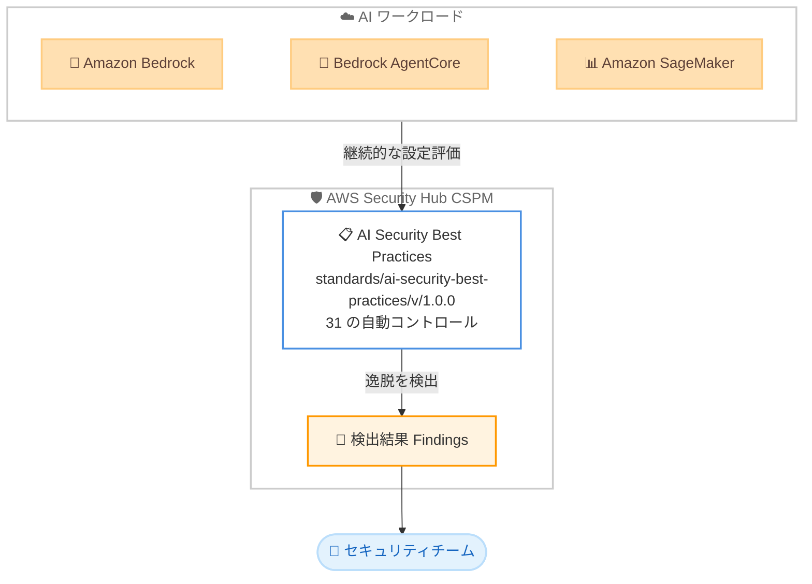

# AWS Security Hub CSPM - AI セキュリティベストプラクティス標準

**リリース日**: 2026 年 6 月 30 日
**サービス**: AWS Security Hub CSPM (Cloud Security Posture Management)
**機能**: AI Security Best Practices standard (31 の自動コントロール)

📊 [このアップデートのインフォグラフィックを見る](https://takech9203.github.io/aws-news-summary/20260630-aws-security-hub-cspm-ai-security.html)
<!-- INFOGRAPHIC_BASE_URL は環境変数から取得 -->

## 概要

AWS は、AWS Security Hub CSPM の新しいセキュリティ標準として「AI Security Best Practices standard」を発表しました。これは、デプロイされた AI リソースがセキュリティのベストプラクティスに準拠していない状態を検出する 31 個の自動セキュリティコントロールのセットです。AWS のセキュリティ専門家によって策定されており、Amazon Bedrock、Amazon Bedrock AgentCore、Amazon SageMaker のワークロードを推奨されるセキュリティ設定に照らして継続的に評価します。

この標準の特徴は、手動の評価やカスタムルールの作成を必要とせずに、生成 AI および機械学習ワークロードのセキュリティ態勢を自動で評価できる点にあります。ネットワーク分離、保存時および転送時の暗号化、VPC 配置、KMS キーの使用、プライベートコンテナレジストリの要件、認可コントロールといった重要なセキュリティドメインをカバーしています。

各コントロールはセキュリティカテゴリに分類され、リソースがベストプラクティスから逸脱した場合に検出結果 (findings) を生成します。標準識別子は `standards/ai-security-best-practices/v/1.0.0` です。AI ワークロードを本番環境で運用するセキュリティチームやプラットフォームチームにとって、生成 AI 特有のセキュリティリスクを継続的に可視化できる重要なアップデートです。

**アップデート前の課題**

このアップデート以前は、AI ワークロードのセキュリティ評価に以下のような課題がありました。

- Bedrock や SageMaker などの AI リソースのセキュリティ設定を、手動でレビューする必要があった
- 生成 AI 特有のセキュリティ要件に対応するため、独自のカスタムチェックルールを作成する必要があった
- AI リソースの設定逸脱を継続的に監視する標準化された仕組みが存在しなかった

**アップデート後の改善**

今回のアップデートにより、以下が可能になりました。

- 31 個の事前定義されたコントロールにより、AI リソースのセキュリティ評価が自動化された
- カスタムルールを作成することなく、Bedrock、Bedrock AgentCore、SageMaker のベストプラクティス準拠状況を継続的に評価できるようになった
- AWS のセキュリティ専門家が定義した標準に基づき、設定逸脱を検出結果として一元的に把握できるようになった

## アーキテクチャ図



Security Hub CSPM が AI ワークロードの設定を AI Security Best Practices standard に照らして継続的に評価し、ベストプラクティスから逸脱したリソースについて検出結果を生成してセキュリティチームに通知する流れを示しています。

## サービスアップデートの詳細

### 主要機能

1. **31 の自動セキュリティコントロール**
   - AWS のセキュリティ専門家が策定した 31 個の事前定義コントロールを提供
   - デプロイ済みの AI リソースがベストプラクティスに準拠していない場合を自動検出
   - 手動評価やカスタムルールの作成が不要

2. **対象サービスの広範なカバレッジ**
   - Amazon Bedrock のワークロードを評価
   - Amazon Bedrock AgentCore のランタイム、ゲートウェイ、メモリストア、カスタムブラウザを評価
   - Amazon SageMaker のノートブックインスタンス、エンドポイント、モデル、モニタリングジョブ、フィーチャーグループを評価

3. **重要なセキュリティドメインの網羅**
   - ネットワーク分離
   - 保存時および転送時の暗号化
   - VPC 配置
   - KMS キーの使用
   - プライベートコンテナレジストリの要件
   - 認可コントロール

4. **検出結果の生成とカテゴリ分類**
   - 各コントロールにセキュリティカテゴリが割り当てられる
   - リソースがベストプラクティスから逸脱すると検出結果 (findings) を生成
   - Security Hub の一元的なダッシュボードで設定逸脱を把握可能

## 技術仕様

### 標準の基本情報

| 項目 | 詳細 |
|------|------|
| 標準名 | AI Security Best Practices standard |
| 標準識別子 | `standards/ai-security-best-practices/v/1.0.0` |
| コントロール数 | 31 |
| 対象サービス | Amazon Bedrock、Amazon Bedrock AgentCore、Amazon SageMaker |
| 評価方式 | 継続的な自動評価 (手動評価・カスタムルール不要) |

### 対象リソースとセキュリティドメイン

| 対象サービス | 主な評価対象リソース |
|------|------|
| Amazon Bedrock | Bedrock ワークロード全般 |
| Amazon Bedrock AgentCore | ランタイム、ゲートウェイ、メモリストア、カスタムブラウザ |
| Amazon SageMaker | ノートブックインスタンス、エンドポイント、モデル、モニタリングジョブ、フィーチャーグループ |

## 設定方法

### 前提条件

1. 対象リージョンで AWS Security Hub CSPM が有効化されていること
2. Amazon Bedrock、Bedrock AgentCore、または Amazon SageMaker のリソースをデプロイしていること
3. Security Hub の標準を有効化するための適切な IAM 権限を保有していること

### 手順

#### ステップ1: Security Hub CSPM の有効化

```bash
aws securityhub enable-security-hub
```

対象リージョンで Security Hub CSPM を有効化します。すでに有効化済みの場合はこのステップは不要です。

#### ステップ2: AI Security Best Practices standard の有効化

```bash
aws securityhub batch-enable-standards \
  --standards-subscription-requests \
  StandardsArn="arn:aws:securityhub:<region>::standards/ai-security-best-practices/v/1.0.0"
```

AI Security Best Practices standard を有効化します。`<region>` には対象リージョンのコードを指定します。有効化すると、対象の AI リソースに対する 31 のコントロールによる自動評価が開始されます。

#### ステップ3: 検出結果の確認

Security Hub のコンソールまたは API で、生成された検出結果を確認します。ベストプラクティスから逸脱したリソースについて、セキュリティカテゴリごとに整理された検出結果が表示されるため、内容に応じて該当リソースの設定を修正します。

## メリット

### ビジネス面

- **AI ワークロードのガバナンス強化**: 生成 AI および機械学習の利用拡大に伴うセキュリティリスクを、標準化された方法で継続的に管理できます
- **コンプライアンス対応の効率化**: AWS のセキュリティ専門家が定義した基準に準拠することで、社内のセキュリティ要件やコンプライアンス監査への対応が容易になります
- **運用コストの削減**: カスタムルールの開発・保守が不要となり、セキュリティチームの工数を削減できます

### 技術面

- **自動化された継続的評価**: 手動評価を排除し、リソースの変更を継続的に監視します
- **広範なリソースカバレッジ**: Bedrock AgentCore のランタイムからメモリストア、SageMaker のフィーチャーグループまで、AI ワークロードを構成する多様なリソースを網羅します
- **Security Hub への統合**: 既存の Security Hub のワークフローや検出結果集約の仕組みをそのまま活用できます

## デメリット・制約事項

### 制限事項

- 評価対象は Amazon Bedrock、Amazon Bedrock AgentCore、Amazon SageMaker のリソースに限定されます
- 標準のバージョンは v1.0.0 であり、コントロールの内容は将来のバージョンで更新される可能性があります
- Security Hub CSPM が有効化されているリージョンでのみ利用可能です

### 考慮すべき点

- 30 日間の無料トライアル終了後は、Security Hub CSPM の通常のセキュリティチェック料金が適用されます
- 検出結果はベストプラクティスからの逸脱を示すものであり、各組織の要件に応じてコントロールの抑制 (suppress) や例外管理を検討する必要があります

## ユースケース

### ユースケース1: 生成 AI アプリケーションのセキュリティ態勢管理

**シナリオ**: Amazon Bedrock を利用した生成 AI アプリケーションを本番運用しており、暗号化や VPC 配置などのセキュリティ設定が組織のベストプラクティスに準拠しているか継続的に確認したい。

**実装例**:
```
AI Security Best Practices standard を有効化し、
Bedrock リソースの保存時暗号化・KMS キー使用・
ネットワーク分離の設定を自動評価
```

**効果**: 設定逸脱が発生した時点で検出結果が生成され、迅速な是正が可能になります。

### ユースケース2: AI エージェント基盤のガバナンス

**シナリオ**: Amazon Bedrock AgentCore を用いた AI エージェント基盤を構築しており、ランタイム、ゲートウェイ、メモリストア、カスタムブラウザの設定を一元的に監査したい。

**実装例**:
```
AgentCore のランタイム・ゲートウェイ・
メモリストア・カスタムブラウザに対する
認可コントロールとプライベートコンテナレジストリ
要件のコントロールを評価
```

**効果**: エージェント基盤を構成する各コンポーネントのセキュリティ設定を、専門家定義の基準で継続的に検証できます。

### ユースケース3: 機械学習パイプラインのコンプライアンス確認

**シナリオ**: Amazon SageMaker でモデル開発から推論エンドポイントまでを運用しており、ノートブックインスタンスやエンドポイントが社内のセキュリティ要件を満たしているか定期的に確認したい。

**実装例**:
```
SageMaker のノートブックインスタンス・
エンドポイント・モデル・モニタリングジョブ・
フィーチャーグループに対する VPC 配置と
暗号化のコントロールを評価
```

**効果**: 機械学習パイプライン全体のセキュリティ設定を自動で監査し、コンプライアンス監査への対応工数を削減できます。

## 料金

AI Security Best Practices standard は、AWS Security Hub CSPM のセキュリティチェック料金体系に従います。Security Hub CSPM は AWS 無料利用枠を通じて 30 日間無料で試用できます。トライアル期間終了後は、評価対象のセキュリティチェック数に基づく従量課金が適用されます。詳細な料金は AWS Security Hub の料金ページを参照してください。

## 利用可能リージョン

AWS Security Hub CSPM が利用可能なすべての AWS リージョンで提供されます。これには AWS GovCloud (US) および中国リージョンが含まれます。

## 関連サービス・機能

- **Amazon Bedrock**: 基盤モデルを利用した生成 AI アプリケーションの構築サービス。本標準の主要な評価対象です
- **Amazon Bedrock AgentCore**: AI エージェントの構築・運用基盤。ランタイム、ゲートウェイ、メモリストアなどが評価対象となります
- **Amazon SageMaker**: 機械学習モデルの構築・トレーニング・デプロイサービス。ノートブックやエンドポイントなどが評価対象となります
- **AWS Key Management Service (KMS)**: 暗号化キーの管理サービス。KMS キーの使用に関するコントロールが含まれます

## 参考リンク

- 📊 [インフォグラフィック](https://takech9203.github.io/aws-news-summary/20260630-aws-security-hub-cspm-ai-security.html)
- [公式発表 (What's New)](https://aws.amazon.com/about-aws/whats-new/2026/06/aws-security-hub-cspm-ai-security/)
- [ドキュメント (What is Security Hub)](https://docs.aws.amazon.com/securityhub/latest/userguide/what-is-securityhub.html)

## まとめ

AI Security Best Practices standard は、生成 AI および機械学習ワークロードのセキュリティ態勢管理を自動化する重要なアップデートです。Bedrock、Bedrock AgentCore、SageMaker を本番運用している組織は、本標準を有効化することで、カスタムルールを作成することなく専門家定義のベストプラクティスに基づいた継続的な評価を開始できます。まずは 30 日間の無料トライアルで対象リソースの設定逸脱状況を可視化することを推奨します。
