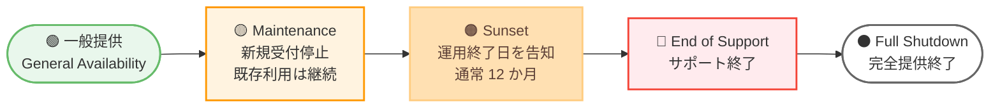

# AWS - サービス提供状況のアップデート (Service Availability Updates)

**リリース日**: 2026 年 6 月 30 日
**サービス**: 複数の AWS サービス・機能
**機能**: サービスライフサイクルの変更 (Maintenance / Sunset / End of Support)

📊 [このアップデートのインフォグラフィックを見る](https://takech9203.github.io/aws-news-summary/20260630-aws-service-availability.html)
<!-- INFOGRAPHIC_BASE_URL は環境変数から取得 -->

## 概要

AWS は 2026 年 6 月 30 日、複数の AWS サービスおよび機能について提供状況 (Availability) の変更を発表しました。これは、サービスやその機能がライフサイクルの段階を移行する際に行われる重要なアナウンスメントです。今回の発表では、複数のサービスが「Maintenance (メンテナンス)」「Sunset (サンセット)」「End of Support (サポート終了)」の各段階に移行します。

AWS のサービスライフサイクルは、新規顧客の受け入れ停止から運用終了までを段階的に進めることで、お客様の運用への影響を最小限に抑えることを目的としています。各段階の定義は次のとおりです。

- **Maintenance (メンテナンス)**: 新規顧客はオンボーディングできなくなります。既存の利用者は引き続き利用できます。AWS は運用とサポートを継続しますが、機能の拡張や追加は行いません。
- **Sunset (サンセット)**: 利用者は推奨される代替手段への移行計画を立てる必要があります。サンセットには通常 12 か月程度のタイムラインが設定され、サンセット日に AWS は運用とサポートを終了します。
- **End of Support (サポート終了)**: 該当サービス・機能は指定日をもって利用できなくなります。

Solutions Architect およびシステム運用担当者は、自社のワークロードで該当サービスを利用していないかを確認し、必要に応じて移行計画を策定することが求められます。AWS は各サービスについて移行ガイドを用意しており、AWS Product Lifecycle Page および各サービスのドキュメントから参照できます。

**アップデート前の課題**

- 該当サービスの今後の提供方針が明示されておらず、移行計画を立てる判断材料が不足していた
- どのサービス・機能が新規受付を停止するのか、いつサポートが終了するのかを一元的に把握しづらかった

**アップデート後の改善**

- Maintenance / Sunset / End of Support の各段階が明示され、計画的な移行判断が可能になった
- AWS Product Lifecycle Page と移行ガイドにより、代替サービスへの移行手順を確認できるようになった

## アーキテクチャ図

AWS のサービスライフサイクルは、一般提供から Maintenance、Sunset、End of Support を経て Full Shutdown へと段階的に移行します。今回のアナウンスメントでは、複数のサービスがこれらの段階に移行します。

## サービスアップデートの詳細

### 主要機能

1. **Maintenance (メンテナンス) に移行するサービス・機能**
   - 新規顧客は 2026 年 7 月 30 日からオンボーディングできなくなります (一部例外あり)。
   - 既存の利用者は引き続き利用でき、AWS は運用とサポートを継続します。
   - 機能の拡張や追加は行われないため、代替サービスの検討が推奨されます。

2. **Sunset (サンセット) に移行するサービス・機能**
   - 運用とサポートを終了する日 (サンセット日) が告知されます。
   - 利用者は推奨される代替手段への移行計画を立てる必要があります。

3. **End of Support (サポート終了) となるサービス・機能**
   - 2026 年 6 月 30 日をもって利用できなくなります。

### Maintenance (メンテナンス) に移行するサービス・機能一覧

新規顧客は原則として 2026 年 7 月 30 日から利用できなくなります。既存の利用者は引き続き利用可能です。

| サービス・機能 | 補足 |
|------|------|
| Amazon Bedrock Agents (2023 年 11 月リリース) | Amazon Bedrock Agents Classic に名称変更 |
| Amazon Cognito Sync | - |
| Amazon Kendra | - |
| Amazon Q Business | - |
| AWS Directory Service - Simple AD | - |
| AWS IoT Device Defender - Detect | 新規顧客の受付停止は 2026 年 8 月 31 日から |
| AWS Mainframe Modernization - Self-Managed Experience | - |
| AWS Management Console - myApplications | - |
| AWS Resource Groups - Group Lifecycle Events | - |
| AWS Service Catalog - Application Registry | - |
| AWS Systems Manager - Application Manager | - |

**Amazon SageMaker AI の Maintenance 移行対象機能**

以下の Amazon SageMaker AI の機能が Maintenance に移行します。

| 機能 |
|------|
| Amazon Augmented AI (A2I) |
| Clarify |
| Debugger |
| GeoSpatial |
| Ground Truth |
| Mechanical Turk |
| Model Monitor |
| Profiler |
| Role Manager |
| Studio Lab |

### Sunset (サンセット) に移行するサービス・機能一覧

運用とサポートを終了する日が告知されます。具体的なサンセット日は各サービスのドキュメントを参照してください。

| サービス・機能 |
|------|
| Amazon WorkSpaces - PCoIP |
| Amazon WorkSpaces - Pool |
| AWS Managed Services (AMS) Advanced |
| AWS re:Post Private |

### End of Support (サポート終了) となるサービス・機能一覧

2026 年 6 月 30 日をもって利用できなくなります。

| サービス・機能 | 補足 |
|------|------|
| Amazon Chime SDK - Carrier Voice Focus | - |
| Amazon SageMaker AI - Ground Truth Plus | - |
| AWS Elemental MediaLive および MediaPackage | 一部のリージョンのみ |

## 技術仕様

### ライフサイクル段階の定義

| 段階 | 新規受付 | 既存利用 | サポート | 機能拡張 |
|------|----------|----------|----------|----------|
| Maintenance | 不可 | 可能 | 継続 | なし |
| Sunset | 不可 | サンセット日まで可能 | サンセット日に終了 | なし |
| End of Support | 不可 | 不可 | 終了 | なし |
| Full Shutdown | 不可 | 不可 | なし (完全撤去) | なし |

### 主要な日付

| 日付 | 対象 | 内容 |
|------|------|------|
| 2026 年 6 月 30 日 | End of Support 対象 | サポート終了 (利用不可) |
| 2026 年 7 月 30 日 | Maintenance 対象 (大半) | 新規顧客の受付停止 |
| 2026 年 8 月 31 日 | AWS IoT Device Defender - Detect | 新規顧客の受付停止 |

## 設定方法

### 前提条件

1. 自社のワークロードで利用している AWS サービス・機能を棚卸しする
2. 該当サービスがどのライフサイクル段階に移行するかを確認する
3. AWS Product Lifecycle Page および各サービスのドキュメントで代替手段を確認する

### 手順

#### ステップ1: 影響を受けるサービスの特定

AWS Config や AWS Cost and Usage Report、各サービスのコンソールを用いて、該当サービス・機能の利用状況を確認します。Maintenance に移行するサービスは既存利用が可能なため、継続利用するか移行するかを判断します。

#### ステップ2: 代替サービスへの移行計画の策定

End of Support 対象のサービスは 2026 年 6 月 30 日をもって利用できなくなるため、最優先で代替手段への移行を検討します。Sunset 対象のサービスはサンセット日 (通常 12 か月程度のタイムライン) までに移行を完了させる計画を立てます。

#### ステップ3: 移行ガイドの活用

AWS が用意した移行ガイドおよび各サービスのドキュメントに従って、代替サービスへの移行を実施します。AWS Product Lifecycle Page では RSS フィードも提供されており、今後の提供状況の変更を追跡できます。

## メリット

### ビジネス面

- **計画的な移行**: ライフサイクル段階と日付が明示されることで、計画的に移行のためのリソースと予算を確保できます。
- **運用継続性の確保**: Maintenance 段階のサービスは既存利用が継続されるため、即時の運用停止リスクを回避できます。
- **代替手段の明確化**: 移行ガイドにより、推奨される代替サービスへの移行経路が明確になります。

### 技術面

- **段階的な移行**: 各段階が定義されているため、影響範囲を見極めながら段階的に移行を進められます。
- **追跡可能性**: AWS Product Lifecycle Page の RSS フィードで提供状況の変更を継続的に把握できます。

## デメリット・制約事項

### 制限事項

- Maintenance に移行したサービス・機能では、今後の機能拡張や追加が行われません。
- End of Support 対象のサービスは 2026 年 6 月 30 日をもって利用できなくなります。
- Sunset 対象のサービスはサンセット日に運用とサポートが終了します。

### 考慮すべき点

- Amazon Bedrock Agents は Amazon Bedrock Agents Classic へ名称が変更されるため、後続のサービス (新世代の Agents 機能) との混同に注意が必要です。
- AWS IoT Device Defender - Detect の新規受付停止日は 2026 年 8 月 31 日と、他の Maintenance 対象 (7 月 30 日) とは異なります。
- AWS Elemental MediaLive および MediaPackage の End of Support は一部のリージョンのみが対象です。対象リージョンは公式ドキュメントで確認してください。
- 具体的なサンセット日や移行タイムラインは、各サービスのドキュメントリンクに記載されており、本概要ページには明記されていません。

## ユースケース

### ユースケース1: Amazon Kendra を利用した検索システムの移行検討

**シナリオ**: エンタープライズ検索に Amazon Kendra を利用しているが、Maintenance への移行に伴い今後の機能拡張が行われない。

**効果**: 既存利用は継続できるため、運用を維持しながら、Amazon Bedrock Knowledge Bases など代替手段への移行を計画的に検討できます。

### ユースケース2: Amazon WorkSpaces - PCoIP からの移行

**シナリオ**: 仮想デスクトップ環境で Amazon WorkSpaces の PCoIP プロトコルを利用しているが、Sunset 段階に移行した。

**効果**: サンセット日までに DCV (旧 NICE DCV) など他のプロトコルや WorkSpaces の代替構成への移行計画を策定し、運用停止を回避できます。

### ユースケース3: End of Support 対象サービスの即時対応

**シナリオ**: メディアワークフローで AWS Elemental MediaLive / MediaPackage を特定リージョンで利用しているが、2026 年 6 月 30 日に End of Support となる。

**効果**: 対象リージョンを確認し、サポート対象リージョンへの移行や代替アーキテクチャへの切り替えを最優先で実施することで、サービス停止の影響を回避できます。

## 料金

本アナウンスメントは提供状況の変更に関するものであり、新たな料金は発生しません。各サービスの料金は、Maintenance 段階では従来どおり適用されます。移行先サービスの料金については、各サービスの料金ページを参照してください。

## 利用可能リージョン

本アナウンスメントは全リージョンに関わるサービスライフサイクルの変更です。AWS Elemental MediaLive および MediaPackage の End of Support は一部のリージョンのみが対象です。対象リージョンの詳細は公式ドキュメントを確認してください。

## 関連サービス・機能

- **Amazon Bedrock**: Amazon Bedrock Agents が Classic に移行するため、後続の Agents 機能や Bedrock Knowledge Bases などが代替・関連サービスとなります。
- **Amazon SageMaker AI**: 複数の機能が Maintenance に移行し、Ground Truth Plus は End of Support となります。
- **Amazon WorkSpaces**: PCoIP と Pool が Sunset に移行します。

## 参考リンク

- 📊 [インフォグラフィック](https://takech9203.github.io/aws-news-summary/20260630-aws-service-availability.html)
- [公式発表 (What's New)](https://aws.amazon.com/about-aws/whats-new/2026/06/aws-service-availability/)
- [AWS Product Lifecycle Page (ドキュメント)](https://docs.aws.amazon.com/general/latest/gr/service-lifecycle.html)

## まとめ

本アナウンスメントは、複数の AWS サービス・機能が Maintenance、Sunset、End of Support の各段階に移行する重要なライフサイクル変更です。特に End of Support 対象のサービスは 2026 年 6 月 30 日をもって利用できなくなるため、Solutions Architect は自社ワークロードの利用状況を速やかに棚卸しし、AWS Product Lifecycle Page と移行ガイドを参照して計画的な移行を進めることが推奨されます。
