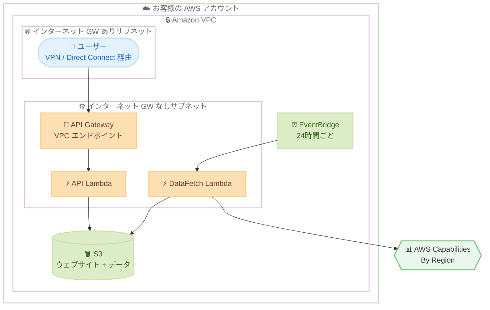

# Capability Insights for AWS - リージョンケイパビリティのオープンソースソリューション

**リリース日**: 2026 年 6 月 30 日
**サービス**: Capability Insights for AWS
**機能**: セルフホスト型リージョンケイパビリティダッシュボード (オープンソース)

📊 [このアップデートのインフォグラフィックを見る](https://takech9203.github.io/aws-news-summary/20260630-capability-insights-aws.html)

## 概要

AWS は、リージョンごとのケイパビリティデータをお客様自身の Amazon Virtual Private Cloud (VPC) 内にデプロイできるオープンソースソリューション「Capability Insights for AWS」を発表しました。これは、お客様が所有するインフラストラクチャ上で、自社のネットワーク内かつ自社のガバナンス下にリージョンケイパビリティデータを配置したいというニーズに応えるセルフホスト型ダッシュボードです。

このダッシュボードは、全リージョンの AWS ケイパビリティデータを 24 時間ごとに自動更新します。対象となるデータは、サービス、機能、API オペレーション、AWS CloudFormation リソースタイプを網羅します。さらに、Workload Analysis コンポーネントは AWS CloudTrail ログと AWS CloudFormation スタックをスキャンし、200 以上のサービスをアカウントが実際に使用しているサービスの数まで絞り込みます。これにより、従来は数週間を要していたギャップ分析を短時間のレビューへと短縮できます。

データレジデンシー要件を持つ組織、内部レポートを必要とするコンプライアンスチーム、リージョン拡張やマルチリージョンリカバリ戦略を計画しているチームを主な対象としています。すべてのデータは VPC の境界内に留まります。

**アップデート前の課題**

- マルチリージョンアーキテクチャを設計する際、リージョンごとのケイパビリティ情報を自社が所有・管理するインフラ上で参照する手段が限られていた
- データレジデンシーやコンプライアンス要件を持つ組織にとって、外部のデータソースへの依存が制約となっていた
- どのサービスが利用可能かを把握するためのギャップ分析に数週間を要し、200 以上のサービスから自社が実際に使用するサービスを特定する作業が煩雑だった

**アップデート後の改善**

- リージョンケイパビリティデータを自社の VPC 内にデプロイし、自社のガバナンス下で管理できるようになった
- すべてのデータが VPC 境界内に留まるため、データレジデンシーやコンプライアンス要件を満たしやすくなった
- Workload Analysis により、CloudTrail ログと CloudFormation スタックをスキャンして実際に使用中のサービスへ絞り込み、ギャップ分析を数週間から短時間のレビューへ短縮できるようになった

## アーキテクチャ図



DataFetch Lambda が EventBridge のスケジュールに基づき AWS Capabilities By Region のデータを取得して S3 に保存し、ユーザーは VPC 内から API Gateway と API Lambda を経由してダッシュボードにアクセスします。すべてのデータは VPC 境界内に留まります。

## サービスアップデートの詳細

### 主要機能

1. **リージョンケイパビリティダッシュボード**
   - 全リージョンの AWS ケイパビリティデータを 24 時間ごとに自動更新
   - サービス、機能、API オペレーション、CloudFormation リソースタイプを網羅
   - データソースである AWS Capabilities By Region から情報を取得

2. **Workload Analysis (Usage Analysis)**
   - CloudTrail ログと CloudFormation スタックをスキャンし、アカウントが実際に使用しているサービスを特定
   - 200 以上のサービスを実使用サービスの数まで絞り込み
   - 数週間規模のギャップ分析を短時間のレビューへ短縮
   - パーソナライズ機能 ("My Stuff") をオプトインで追加

3. **セルフホスト型デプロイ**
   - お客様自身の VPC 内にデプロイし、自社のネットワークとガバナンス下で運用
   - すべてのデータが VPC 境界内に留まる
   - オープンソース (Apache-2.0 ライセンス) として提供され、追加のライセンス費用は不要

4. **オプトイン拡張スタック**
   - Policy Enforcer: IAM マネージドポリシーまたはサービスコントロールポリシー (SCP) を生成
   - Chat: Amazon Bedrock のツール利用ループで動作する読み取り専用の会話型アシスタント

## 技術仕様

### CloudFormation スタック構成

このソリューションは複数の CloudFormation スタックで構成されます。

| スタック | 区分 | 主な構成要素 |
|------|------|------|
| Capability Insights Stack | コア | S3、API Gateway (VPC エンドポイント)、API Lambda、DataFetch Lambda、EventBridge ルール、S3 ゲートウェイエンドポイント |
| Sample Environment Stack | オプション | VPC、サブネット、EC2 インスタンス、IAM ロール (開発・テスト用) |
| Usage Analysis Stack | オプトイン | Step Functions、CloudTrail / CloudFormation アナライザ Lambda、Glue、Lake Formation、EventBridge スケジュール |
| Policy Enforcer Stack | オプトイン | DynamoDB、GSI、VPC 外の IAM ヘルパー Lambda |
| Chat Stack | オプトイン | VPC 外の Lambda 上で動作する Amazon Bedrock ツール利用ループ |

### 必要な AWS サービス

| 区分 | サービス |
|------|------|
| コアスタック | AWS Lambda、Amazon S3、Amazon API Gateway、Amazon EventBridge、VPC / VPC エンドポイント、AWS CloudFormation |
| オプトインスタック | AWS Step Functions、Amazon Athena、AWS Glue、AWS Lake Formation、AWS CloudTrail、Amazon DynamoDB、AWS IAM、Amazon Bedrock |

## 設定方法

### 前提条件

1. ローカル環境に AWS CLI (設定済み) と Node.js (自動インストール用) が必要
2. DNS 解決を有効化した VPC
3. インターネットゲートウェイありのサブネット (ユーザーアクセス用) と、インターネットゲートウェイなしのサブネット (Lambda コンピュート用)
4. オンボーディング時に提供される S3 アクセスポイントの ARN (パブリックデータの利用にはオンボーディング不要、PREVIEW データの利用には AWS アカウントチームとの連携が必要)

### 手順

#### ステップ1: リポジトリのクローンと依存関係のインストール

```bash
git clone https://github.com/aws/capability-insights-for-aws.git
cd capability-insights-for-aws
npm install
```

GitHub からソースコードを取得し、デプロイに必要な依存関係をインストールします。

#### ステップ2: デプロイの実行

```bash
npm run deploy
```

このコマンドはアセットのビルド、パラメータの入力受付、スタックのデプロイ、ウェブサイトのアップロード、初回同期のトリガーを実行します。オプトイン機能を有効化する場合は、`--enable-usage-analysis`、`--enable-policy-enforcer`、`--enable-chat` のフラグを付与します。

#### ステップ3: ダッシュボードへのアクセス

ウェブサイトは S3 にホストされ、VPC 内からのみアクセス可能です。VPN、AWS Direct Connect、AWS Client VPN、または EC2 SOCKS プロキシ経由でアクセスします。手動デプロイの場合は、リリースから `build-assets.zip` をダウンロードし、`aws cloudformation deploy` を使用して AWS CLI と CloudFormation のみでデプロイできます。

## メリット

### ビジネス面

- **データガバナンスの強化**: すべてのデータが自社の VPC 境界内に留まるため、データレジデンシー要件やコンプライアンス要件を満たしやすい
- **コスト効率**: オープンソースとして提供され、追加のライセンス費用が不要。標準的な AWS サービス料金のみが発生
- **意思決定の迅速化**: 数週間を要していたギャップ分析を短時間のレビューへ短縮し、リージョン拡張計画を加速

### 技術面

- **完全な所有と管理**: ホスティングインフラを自社が所有・管理し、ネットワーク構成やセキュリティポリシーを自社で制御
- **自動更新**: 24 時間ごとに全リージョンのケイパビリティデータを自動更新し、手動メンテナンスを不要化
- **実使用ベースの分析**: CloudTrail と CloudFormation のデータに基づき、実際に使用中のサービスへ絞り込んだ分析を提供

## デメリット・制約事項

### 制限事項

- ウェブサイトは VPC 内からのみアクセス可能で、VPN、Direct Connect、Client VPN、または SOCKS プロキシなどのアクセス経路が必要
- IAM および Amazon Bedrock には VPC エンドポイントが存在しないため、Policy Enforcer の IAM ヘルパー Lambda と Chat の Lambda は VPC 外で動作する
- PREVIEW データの利用には AWS アカウントチームとの連携によるオンボーディングが必要

### 考慮すべき点

- セルフホスト型のため、デプロイと運用はお客様の責任で行う
- Chat 機能を利用する場合は Amazon Bedrock の Claude モデルへのアクセスが必要
- 必要な AWS サービスが存在するリージョンへのデプロイが前提となる

## ユースケース

### ユースケース1: データレジデンシー要件への対応

**シナリオ**: 規制対象業界の組織が、リージョンケイパビリティ情報を外部に送信せず、自社のネットワーク内で参照したい。

**効果**: すべてのデータが VPC 境界内に留まるため、データレジデンシーおよびコンプライアンス要件を満たしながらリージョンケイパビリティを把握できます。

### ユースケース2: マルチリージョンリカバリ戦略の計画

**シナリオ**: マルチリージョンの DR 構成を計画しているチームが、リカバリ先リージョンで必要なサービスや機能が利用可能かを確認したい。

**効果**: 全リージョンのサービス、機能、API オペレーション、CloudFormation リソースタイプを横断的に比較し、リカバリ戦略のギャップを迅速に特定できます。

### ユースケース3: リージョン拡張前のギャップ分析

**シナリオ**: 新しいリージョンへの拡張を検討しているチームが、現行で使用中のサービスが拡張先リージョンで利用可能かを確認したい。

**効果**: Workload Analysis が CloudTrail と CloudFormation をスキャンして実使用サービスへ絞り込むため、200 以上のサービスを精査することなく、短時間で拡張可否を判断できます。

## 料金

Capability Insights for AWS 自体はオープンソースとして提供され、追加のライセンス費用は発生しません。標準的な AWS サービス料金 (Lambda、S3、API Gateway、EventBridge、Step Functions、Athena、Glue などの利用分) のみが発生します。実際のコストは、有効化するスタックや更新頻度、データ量に応じて変動します。

## 利用可能リージョン

必要なサービス (AWS Lambda、Amazon S3、Amazon API Gateway、Amazon EventBridge、AWS Step Functions、Amazon Athena、AWS Glue) が存在する任意のリージョンにデプロイ可能です。

## 関連サービス・機能

- **AWS Capabilities By Region**: 本ソリューションが取得するリージョンケイパビリティデータのソース
- **AWS CloudTrail**: Workload Analysis が実使用サービスを特定するためにスキャンするログソース
- **AWS CloudFormation**: ソリューションのデプロイ基盤であり、Workload Analysis のスキャン対象
- **Amazon Bedrock**: オプトインの Chat 機能で会話型アシスタントを駆動

## 参考リンク

- 📊 [インフォグラフィック](https://takech9203.github.io/aws-news-summary/20260630-capability-insights-aws.html)
- [公式発表 (What's New)](https://aws.amazon.com/about-aws/whats-new/2026/06/capability-insights-aws/)
- [GitHub リポジトリ](https://github.com/aws/capability-insights-for-aws)

## まとめ

Capability Insights for AWS は、リージョンケイパビリティデータを自社の VPC 内にデプロイできるオープンソースのセルフホスト型ソリューションであり、データレジデンシーやコンプライアンス要件を持つ組織にとって有力な選択肢となります。マルチリージョンアーキテクチャの設計やリージョン拡張、DR 戦略の計画を進めているチームは、GitHub リポジトリからソリューションをデプロイし、Workload Analysis によるギャップ分析の効率化を検討することをお勧めします。
