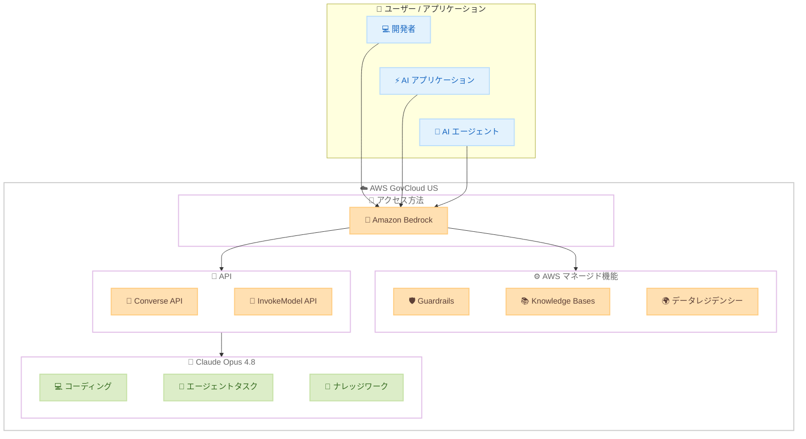

# Amazon Bedrock - Claude Opus 4.8 が AWS GovCloud (US) で利用可能に

**リリース日**: 2026 年 6 月 30 日
**サービス**: Amazon Bedrock
**機能**: Claude Opus 4.8 モデルアクセス (AWS GovCloud (US))

📊 [このアップデートのインフォグラフィックを見る](https://takech9203.github.io/aws-news-summary/20260630-claude-opus-4.8-aws-govcloud-us.html)
<!-- INFOGRAPHIC_BASE_URL は環境変数から取得 -->

## 概要

Anthropic の最も高性能な汎用モデルである Claude Opus 4.8 が、AWS GovCloud (US) で利用可能になりました。これにより、米国政府機関やその関連事業者、規制対象ワークロードを扱う組織が、データレジデンシーやコンプライアンス要件を満たしながら最先端の生成 AI モデルを本番環境で活用できるようになります。

Claude Opus 4.8 は、コーディング、エージェントタスク、ナレッジワークの 3 つの領域で大幅な改善を実現しています。長時間の自律実行、深い推論、出力の一貫性が強化されており、本番 AI アプリケーションを構築する開発者やエンタープライズに適しています。AWS GovCloud (US) では、これらの能力を、米国の規制要件に対応した分離環境内で利用できます。

Amazon Bedrock はお客様のデータを AWS インフラストラクチャ内に保持し、Guardrails、Knowledge Bases、リージョンデータレジデンシーといった AWS マネージド機能を備えた統一サービスを通じて Claude Opus 4.8 へのアクセスを提供します。

**アップデート前の課題**

- AWS GovCloud (US) 上の規制対象ワークロードでは、最新世代の高性能な Claude モデルを本番利用できなかった
- コンプライアンス要件を満たすため、生成 AI の採用範囲が制限される場合があった
- 標準リージョンでは利用可能なエージェント機能を、データレジデンシー制約のある環境で適用しづらかった

**アップデート後の改善**

- AWS GovCloud (US) のコンプライアンス境界内で Claude Opus 4.8 を本番利用可能に
- データを AWS インフラストラクチャ内に保持しながら、長時間の自律実行や深い推論を活用可能に
- Guardrails や Knowledge Bases などの AWS マネージド機能を規制環境でそのまま組み合わせて利用可能に

## アーキテクチャ図



AWS GovCloud (US) 内の Amazon Bedrock を通じて Claude Opus 4.8 にアクセスし、Converse API や InvokeModel API 経由でモデルを呼び出します。データは GovCloud (US) のコンプライアンス境界内に保持され、Guardrails や Knowledge Bases などの AWS マネージド機能と組み合わせて利用できます。

## サービスアップデートの詳細

### 主要機能

1. **コーディング能力の強化**
   - エンジニアのようにコードベースを読解し、変更前に計画を策定
   - 実際のリポジトリにおける長時間のコーディングセッション全体でコンテキストを維持
   - 複雑なコード変更に対する精度と一貫性が向上

2. **エージェントタスクの改善**
   - 障害発生時に停止せず、代替経路を自律的に発見
   - 自身のエラーを検出し自動的にリカバリ
   - 適切なタイミングでユーザーに確認を求める判断能力の向上

3. **ナレッジワークの高度化**
   - 長文ドキュメント全体にわたる情報の統合・要約
   - 出力内容の自己検証による品質保証
   - 専門家のレビューに耐える構造化された成果物の提供

4. **AWS GovCloud (US) での提供**
   - 米国の規制対象ワークロードに対応した分離環境内でのモデル利用
   - データを AWS インフラストラクチャ内に保持するリージョンデータレジデンシー
   - Guardrails、Knowledge Bases などの AWS マネージド機能との統合

### アクセス方法

| 方法 | 特徴 |
|------|------|
| Amazon Bedrock (GovCloud) | AWS マネージド機能 (Guardrails、Knowledge Bases) と統合、GovCloud (US) 内でのデータレジデンシー |
| 統一推論 API | Converse API / InvokeModel API を通じた一貫したインターフェースでモデルを呼び出し |

## 技術仕様

### 提供環境の概要

| 項目 | 詳細 |
|------|------|
| サービス | Amazon Bedrock |
| パーティション | AWS GovCloud (US) |
| モデル | Anthropic Claude Opus 4.8 |
| データ保持 | データは AWS インフラストラクチャ内に保持 |
| 連携機能 | Guardrails、Knowledge Bases、リージョンデータレジデンシー |

### 設定や権限など

```json
{
  "Version": "2012-10-17",
  "Statement": [
    {
      "Effect": "Allow",
      "Action": [
        "bedrock:InvokeModel",
        "bedrock:Converse",
        "bedrock:ConverseStream"
      ],
      "Resource": "arn:aws-us-gov:bedrock:us-gov-west-1::foundation-model/anthropic.claude-opus-4-8-v1"
    }
  ]
}
```

GovCloud (US) では ARN のパーティションが `aws-us-gov` となる点に注意してください。実際のモデル ID とリージョンは公式ドキュメントで確認してください。

## 設定方法

### 前提条件

1. AWS GovCloud (US) アカウントが有効であること
2. Amazon Bedrock へのアクセス権限 (IAM ポリシー) が設定されていること
3. AWS GovCloud (US) の対象リージョンで Claude Opus 4.8 のモデルアクセスが有効化されていること

### 手順

#### ステップ 1: モデルアクセスの有効化

AWS GovCloud (US) の Amazon Bedrock コンソールで Claude Opus 4.8 のモデルアクセスをリクエストします。

```bash
# AWS GovCloud (US) で利用可能な Anthropic モデルを確認
aws bedrock list-foundation-models \
  --region us-gov-west-1 \
  --by-provider "Anthropic" \
  --query "modelSummaries[?contains(modelId, 'claude-opus')]"
```

利用可能なモデル一覧から Claude Opus 4.8 のモデル ID を確認します。`--region` には GovCloud (US) のリージョンを指定します。

#### ステップ 2: Converse API での呼び出し

```bash
# Converse API を使用して Claude Opus 4.8 を呼び出す
aws bedrock-runtime converse \
  --region us-gov-west-1 \
  --model-id "anthropic.claude-opus-4-8-v1" \
  --messages '[{"role": "user", "content": [{"text": "Hello, Claude Opus 4.8!"}]}]'
```

Converse API は Amazon Bedrock の統一推論 API であり、モデル間で一貫したインターフェースを提供します。

#### ステップ 3: Python SDK での利用

```python
import boto3
import json

# GovCloud (US) リージョンを指定
client = boto3.client("bedrock-runtime", region_name="us-gov-west-1")

response = client.converse(
    modelId="anthropic.claude-opus-4-8-v1",
    messages=[
        {
            "role": "user",
            "content": [
                {"text": "複雑なコードレビューを実施してください。"}
            ]
        }
    ],
    inferenceConfig={
        "maxTokens": 4096,
        "temperature": 0.7
    }
)

print(json.dumps(response["output"]["message"], indent=2, ensure_ascii=False))
```

Boto3 の `bedrock-runtime` クライアントに GovCloud (US) リージョンを指定し、Converse API 経由でモデルを呼び出します。

## メリット

### ビジネス面

- **規制対象ワークロードでの AI 活用**: 米国政府機関や公共部門が、コンプライアンス要件を満たしながら最先端の生成 AI を本番利用可能に
- **データ主権の確保**: データを AWS GovCloud (US) のインフラストラクチャ内に保持し、データレジデンシー要件に対応
- **開発生産性の改善**: コーディング支援やエージェントタスクの精度向上により、規制環境でも開発効率を向上

### 技術面

- **長時間エージェント実行の安定性**: 障害からの自動リカバリにより、複雑なワークフローの自動化が現実的に
- **AWS マネージド機能との統合**: Guardrails、Knowledge Bases、リージョンデータレジデンシーを GovCloud (US) 環境でそのまま活用可能
- **統一 API アクセス**: Converse API を通じた一貫したインターフェースにより、モデル切り替えが容易

## デメリット・制約事項

### 制限事項

- 利用可能なリージョンや機能が標準リージョンと異なる場合がある (GovCloud (US) のドキュメントを確認のこと)
- 最上位モデルであるため、入出力トークンあたりのコストが他の Claude モデルより高い
- 大規模なプロンプトやコンテキストを使用する場合、レスポンスレイテンシが増加する可能性がある

### 考慮すべき点

- GovCloud (US) では ARN のパーティションやエンドポイントが標準リージョンと異なるため、構成の確認が必要
- コンプライアンス認証 (FedRAMP など) の対応状況は公式ドキュメントで最新情報を確認すること
- コスト最適化のため、タスクの複雑さに応じて Sonnet / Haiku など下位モデルとの使い分けを検討

## ユースケース

### ユースケース 1: 公共部門システムの自律的コード保守

**シナリオ**: 米国政府機関の規制対象システムにおいて、レガシーコードベースの保守やリファクタリングを支援する

**実装例**:
```python
response = client.converse(
    modelId="anthropic.claude-opus-4-8-v1",
    messages=[
        {
            "role": "user",
            "content": [
                {"text": "以下のコードベースを分析し、セキュリティ強化を含むリファクタリング計画を策定してください。変更するファイルと理由を明示してください。"},
                {"text": code_content}
            ]
        }
    ],
    inferenceConfig={"maxTokens": 8192}
)
```

**効果**: データを GovCloud (US) 内に保持しながら、長時間のコンテキスト維持と計画策定能力により一貫したコード保守支援が可能に

### ユースケース 2: 規制環境でのナレッジベース連携エージェント

**シナリオ**: 機密性の高い内部ドキュメントを対象に、問い合わせ対応や調査を自律的に行うエージェントを GovCloud (US) 内で構築する

**実装例**:
```python
# AWS GovCloud (US) の Knowledge Bases と組み合わせたエージェント構成
response = client.converse(
    modelId="anthropic.claude-opus-4-8-v1",
    messages=conversation_history,
    toolConfig={
        "tools": [
            {
                "toolSpec": {
                    "name": "search_knowledge_base",
                    "description": "内部ドキュメントを検索",
                    "inputSchema": {"json": {"type": "object", "properties": {"query": {"type": "string"}}}}
                }
            }
        ]
    }
)
```

**効果**: データレジデンシーを維持しつつ、障害回避とエラーリカバリ能力の向上により規制環境でも複雑な問い合わせを自律処理

### ユースケース 3: 規制文書の専門的分析

**シナリオ**: 数百ページの規制関連文書や仕様書を分析し、構造化されたレポートを生成する

**実装例**:
```python
response = client.converse(
    modelId="anthropic.claude-opus-4-8-v1",
    messages=[
        {
            "role": "user",
            "content": [
                {"text": "以下の規制文書を分析し、コンプライアンス上のリスク要因・対応事項・優先度付き推奨事項を含む構造化レポートを作成してください。"},
                {"document": {"format": "pdf", "name": "spec.pdf", "source": {"s3Location": {"uri": "s3://bucket/spec.pdf"}}}}
            ]
        }
    ]
)
```

**効果**: 長文にわたる情報統合と自己検証能力により、専門家レビューに耐える高品質な分析成果物を GovCloud (US) 内で生成

## 料金

公式発表時点では GovCloud (US) における具体的な料金情報は記載されていません。Amazon Bedrock の料金ページで最新の入出力トークン単価を確認してください。一般的に、Opus クラスのモデルは Sonnet や Haiku と比較して入出力トークンあたりのコストが高く設定されています。

### 料金体系

| 課金方式 | 説明 |
|----------|------|
| オンデマンド | 入力トークン数と出力トークン数に基づく従量課金 |
| プロビジョンドスループット | 予約容量による時間単位の固定料金 |

## 利用可能リージョン

このアップデートにより、Claude Opus 4.8 が AWS GovCloud (US) で利用可能になりました。具体的な対象リージョンや機能の対応状況は公式ドキュメント (モデルカードおよびリージョン別ドキュメント) で確認してください。

## 関連サービス・機能

- **Amazon Bedrock Guardrails**: モデル出力に対するセーフティフィルタリングやコンテンツ制御を適用可能
- **Amazon Bedrock Knowledge Bases**: RAG パターンによりナレッジベースと連携し、最新情報に基づく回答を生成
- **Amazon Bedrock AgentCore**: 自律型エージェントのデプロイ・管理基盤として Claude Opus 4.8 と連携
- **AWS GovCloud (US)**: 米国の規制要件に対応した分離パーティションとして、コンプライアンスワークロードを支援

## 参考リンク

- 📊 [インフォグラフィック](https://takech9203.github.io/aws-news-summary/20260630-claude-opus-4.8-aws-govcloud-us.html)
- [公式発表 (What's New)](https://aws.amazon.com/about-aws/whats-new/2026/05/claude-opus-4.8-aws-govcloud-us)
- [Claude Opus 4.8 モデルカード (ドキュメント)](https://docs.aws.amazon.com/bedrock/latest/userguide/model-card-anthropic-claude-opus-4-8.html)
- [Amazon Bedrock ドキュメント](https://docs.aws.amazon.com/bedrock/latest/userguide/)
- [Amazon Bedrock 料金ページ](https://aws.amazon.com/bedrock/pricing/)

## まとめ

Claude Opus 4.8 の AWS GovCloud (US) での提供開始は、米国政府機関や規制対象ワークロードを扱う組織にとって、コンプライアンス要件を満たしながら最先端の生成 AI を本番利用できる重要なアップデートです。データを AWS インフラストラクチャ内に保持しつつ、Guardrails や Knowledge Bases などの AWS マネージド機能と組み合わせられる点が大きな価値となります。GovCloud (US) 環境をお使いの場合は、モデルカードとリージョン別ドキュメントで対応状況を確認のうえ、モデルアクセスを有効化して段階的に導入することを推奨します。
